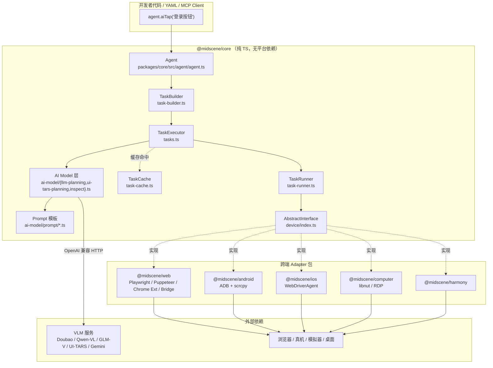

# 00 · Overview：Midscene 的视觉驱动哲学

> 分析基准：`web-infra-dev/midscene` `main` 分支 HEAD = `9df35128` （v1.8.1 之后一次 doc 清理）。后续所有文件路径、行号都钉在这个 commit 上。

---

## 0. TL;DR

1. **Midscene 是一套"用多模态大模型驱动 UI 自动化"的框架**，由字节 Web Infra 团队开源。它不是 Playwright 的替代品，而是**坐在 Playwright/Puppeteer/ADB/WebDriverAgent 上面**的一层"AI Operator"。
2. **核心赌注**：1.0 起，**UI 动作（点击、输入、滚动）的元素定位走纯视觉路线**——只把截图喂给 VLM，让模型直接给出像素级或千分位坐标，**不再读 DOM**（"DOM-extraction compatibility mode has been removed"，见 `apps/site/docs/en/model-strategy.mdx`）。
3. **唯一例外**：`aiQuery` / `aiAssert` 这类"读懂页面"的任务，**可以选择性把 DOM 树塞进 prompt**（`opt.domIncluded`），但默认是 `false`（`packages/core/src/agent/agent.ts:92`）。
4. **产品面**：一套 `Agent` API + Web/Android/iOS/Computer/Harmony 五端实现 + YAML / CLI / MCP / Chrome Extension / Playground / Studio 多形态壳。
5. **本节不涉及代码执行**，是后续 9 个 MD 的认知地基——把"它是什么、为什么这么干、放弃了什么"讲清楚。

---

## 1. 它解决了什么问题

### 1.1 传统 UI 自动化的三道伤疤

| 痛点 | 传统方案的尴尬 | 案例 |
|---|---|---|
| **选择器脆弱** | XPath / CSS / `data-testid` 一改就崩；前端重构是测试的天敌 | 改个 className 就跑挂一片 |
| **跨端语义不一致** | Web 有 DOM、Android 有 View 树、iOS 有 XCUI 树、`<canvas>` / Flutter / 游戏 / 桌面 RDP 啥树都没有 | 同一个"登录按钮"在四端要写四份选择器 |
| **AI 自动化是 LLM 不会做的事** | 纯文本 LLM 不知道按钮在屏幕的哪里；给它 DOM 它又看不懂渲染后的真实样子（CSS `background-image`、`<canvas>`、cross-origin `<iframe>`） | "点击购物车右上角的红色徽章" → DOM 里这是个 `<div>` 套 SVG，模型猜不准 |

Midscene 的论文级押注：**视觉是最普世的 UI 表征**——只要能截图，就能自动化。这把"前端 DOM 知识"从必备依赖降级为可选增强。

### 1.2 它给开发者的承诺

来自 `README.md` 与 `apps/site/docs/en/introduction.mdx`：

- **自然语言写脚本**：`agent.aiAction('点击购物车里所有未完成的订单')` 而不是 `page.locator('[data-id="cart"]').click()`。
- **三类 API**：交互（aiTap / aiInput / aiScroll / …）、提取（aiQuery / aiBoolean / aiNumber / …）、工具（aiAssert / aiLocate / aiWaitFor）。
- **两种风格**：Auto-planning（"我说目标，AI 决定怎么做"）vs Workflow（"我用 JS 控流，AI 只负责一步"）——参见 `apps/site/docs/en/blog-introducing-instant-actions-and-deep-think.md`。后者引入了 **Instant Actions**（`aiTap` / `aiInput` 等"瞬时动作"），把规划的不确定性从一步操作里剥掉，只让 AI 干"找元素"这件最擅长的事。

---

## 2. 它在整体架构中的位置



记住三件事：

1. **核心运行时是纯 TS**，不依赖任何浏览器/真机 SDK——`@midscene/core` 只认 `AbstractInterface` 这个抽象。
2. **平台差异全收在 Adapter 包里**——Web/Android/iOS/Computer/Harmony 各自实现 `AbstractInterface`（见 `packages/core/src/device/index.ts:128`）。
3. **AI 层只产出"动作意图"**（`{ name: 'Tap', param: { locate: { bbox: [...] } } }`），具体怎么发指令、怎么发到设备，是 Adapter 的事。

---

## 3. 源码导览

### 3.1 五层包结构

| 层 | 代表包 | 角色 |
|---|---|---|
| **核心运行时** | `@midscene/core` | Agent、TaskExecutor、TaskCache、Prompt 模板、AbstractInterface |
| **共享基建** | `@midscene/shared` | 图像处理、环境变量、模型配置、DOM extractor、日志 |
| **跨端 Adapter** | `@midscene/web`、`@midscene/android`、`@midscene/ios`、`@midscene/computer`、`@midscene/harmony`、`@midscene/webdriver` | 把 `AbstractInterface` 翻译成 Playwright / ADB / WebDriverAgent / libnut 调用 |
| **入口形态** | `@midscene/cli`、`@midscene/mcp`、`@midscene/*-mcp` | CLI、YAML player、MCP server |
| **生态/调试** | `@midscene/playground`、`@midscene/visualizer`、`@midscene/recorder`、`apps/studio`、`apps/chrome-extension` | 报告、回放、可视化、零代码体验 |

### 3.2 必须记住的 8 个文件

| 文件 | 关键导出 | 一句话 |
|---|---|---|
| `packages/core/src/agent/agent.ts` | `class Agent` (L147) | 用户面对的入口对象——`agent.aiTap()`、`agent.aiQuery()` 都在这里 |
| `packages/core/src/agent/tasks.ts` | `class TaskExecutor` (L66) | 把"一句自然语言"拆成一串可执行任务 |
| `packages/core/src/agent/task-cache.ts` | `class TaskCache` (L53)、`LocateCache`、`PlanningCache` | 缓存定位结果与规划，落到 `.cache.yaml` |
| `packages/core/src/device/index.ts` | `abstract class AbstractInterface` (L128) + 5 个 `*InputPrimitives` 接口 | 跨端契约的"宪法" |
| `packages/core/src/ai-model/llm-planning.ts` | `plan()` 函数 | 通用 VLM 规划入口 |
| `packages/core/src/ai-model/ui-tars-planning.ts` | `uiTarsPlanning()` (L46) | UI-TARS 模型的专用规划路径（坐标系不同） |
| `packages/core/src/ai-model/prompt/` | 8 个文件 | 所有 system / user prompt 模板（02 节会拆穿） |
| `packages/shared/src/img/transform.ts` | `resizeAndConvertImgBuffer()` (L40) | Sharp / Photon 双引擎截图缩放与 JPEG 压缩 |

### 3.3 入口与产物对照

```
开发者 → 选择一种入口形态
├── JS SDK：    new Agent(device) → agent.aiXxx(...)
├── YAML：     pnpm midscene script.yaml （走 packages/cli + packages/core/src/yaml/player.ts）
├── MCP：      packages/mcp + 各端 *-mcp 包（对接 Claude / Cursor 等 MCP 客户端）
├── Chrome 扩展：apps/chrome-extension（零代码 in-browser 体验）
├── Playground：apps/playground / android-playground / computer-playground（HTTP 服务 + Web UI）
└── Studio：   apps/studio（桌面 GUI 调试器）

→ 都最终归一到 Agent → TaskExecutor → AbstractInterface
```

---

## 4. 核心机制（哲学层，先到点为止）

### 4.1 "纯视觉路线"的边界——**不是 100% 纯视觉**

这是新手最容易踩的概念坑。官方在 `model-strategy.mdx` 里写得很克制：

> **Midscene 1.0 and later only support the pure-vision approach—the DOM-extraction compatibility mode has been removed.** This applies to UI actions and element localization; for data extraction or page understanding you can still opt in to include DOM when needed.

翻成大白话：

| 任务类型 | 是否用 DOM | 代码证据 |
|---|---|---|
| **UI 动作的元素定位**（aiTap / aiInput / aiScroll / aiLocate） | ❌ 纯视觉，无 DOM 兜底 | 旧的 DOM-locate 路径已删除 |
| **`aiQuery` / `aiAssert` / `aiBoolean` 等"读懂页面"** | 🔶 默认 `false`，可 `domIncluded: true` 显式开启 | `agent.ts:92` 默认值；`tasks.ts:619` `if (opt?.domIncluded && this.interface.getElementsNodeTree)` |
| **Android / iOS** | 🚫 设备根本就没实现 `getElementsNodeTree`，DOM opt-in 也无效 | 见 `packages/android/src/device.ts` —— 不实现该方法 |
| **Web** | ✅ Puppeteer / Playwright base-page 都实现了 `getElementsNodeTree`（`packages/web-integration/src/puppeteer/base-page.ts:320`），等待用户开关 | |

所以严谨说法是：

> Midscene = "动作纯视觉、提取可混合"的**非对称视觉优先**架构。

### 4.2 三类 API × 两种风格

| 风格 | 调用样式 | 何时用 |
|---|---|---|
| **Auto-planning** | `agent.aiAction('搜 "headphones" 并按回车')` | 一句话搞定多步，最 AI 但最不可控 |
| **Workflow + Instant Actions** | `agent.aiInput('headphones', '搜索框')` + `agent.aiKeyboardPress('Enter')` | 步骤清晰、要可调试、要稳定 |

Instant Actions 把 LLM 的工作面**削窄到只做"locate"**（找元素坐标），动作执行交给确定性代码——这是 Midscene 在 v0.14 引入、并在 1.0 重点推荐的范式。读 `apps/site/docs/en/blog-introducing-instant-actions-and-deep-think.md` 配合服用。

### 4.3 Deep Think：在像素级精度不够时的二次聚焦

`aiTap('target', { deepThink: true })`：先让 VLM 圈出一个"包含目标的大区域"，再把这个区域 crop 出来送回去让它**二次定位**——本质是"counterpart of zoom-in"。

- 源码：`packages/core/src/agent/agent.ts` 里 `deepThink?: DeepThinkOption`
- 限制：**仅对支持 visual grounding 的模型有效**（qwen2.5-vl、UI-TARS 等）；gpt-5/gpt-4o 这类没有视觉接地的多模态模型用了等于没用——这条警告会在 `agent.ts` 的 `hasWarnedNonVLModel` 里触发。

### 4.4 缓存：用"上次定位结果"绕过 LLM

每个 `agent.aiTap('登录按钮')` 调用，理论上都要烧一次 VLM 推理（秒级 + 钞票）。Midscene 用 `TaskCache`（`packages/core/src/agent/task-cache.ts:53`）解决这个问题：

- `LocateCache`：缓存"某个 prompt + UIContext 特征" → "上次的元素 bbox / 视觉特征"
- `PlanningCache`：缓存"自然语言任务" → "上次产出的 YAML workflow"
- 落盘：`./midscene_run/cache/<cacheId>.cache.yaml`（默认）
- 版本墙：`midsceneVersion < 0.16.10` 的缓存文件直接拒读

06 号 MD 会把这套展开。

---

## 5. 设计取舍与工程权衡

### 5.1 Pure-Vision vs DOM+Annotated vs SOM

| 维度 | DOM + 注释截图 | SOM (Set-of-Mark) | Midscene 纯视觉 |
|---|---|---|---|
| 普适性 | 只能 Web，且要 DOM | Web + 一定程度移动 | Web / Mobile / Desktop / Canvas 全通 |
| Token 成本 | DOM 树很大，常常超长 | 标号+候选列表，中等 | 仅图片（Midscene 还会 Sharp 压成 JPEG q=90，见 `img/transform.ts:86`），官方说省 ~80% |
| 模型依赖 | 可用普通 LLM | 可用普通 LLM | **必须 VLM with visual grounding**（强依赖模型能力） |
| 在 canvas / 跨域 iframe / CSS bg-image 上 | ❌ 经常瞎 | ⚠️ 取决于标注算法 | ✅ 截图什么样模型就看到什么 |
| 在前端重构面前 | ❌ 选择器全炸 | 部分受影响 | ✅ 视觉不变就 OK |
| 失败时可调试性 | 看 DOM 路径错在哪 | 看哪个 mark 错配 | 看截图 + Deep Think 回放 |
| 元素定位精度 | 100%（DOM 坐标确定） | 90%+（取决于标注密度） | 受模型坐标分布漂移影响（见 E3） |

Midscene 押的是"模型能力会越来越强，工程问题会越来越少"——这是个**对模型上限的赌注**，不是对工程的赌注。如果你的目标 UI 长得极其密集且模型能力跟不上，Midscene 的兜底是 Deep Think 二次聚焦 + 失败可见的报告系统，**而不是退回 DOM**。

### 5.2 放弃了什么

1. **像 Playwright 那样毫秒级、零 LLM 成本的 CI 回放**——除非走 Cache。
2. **100% 的元素定位确定性**——VLM 推理是概率的，会有 1-3% 的非典型失败，需要 retry / Deep Think / 人工兜底。
3. **离线友好**——必须有 VLM 服务（自部署 Qwen3-VL 或调云 API）。
4. **截图敏感数据脱敏的内建支持**——E1 节会讨论。

### 5.3 跟"Browser-use / Web-agent"那一波框架的区别

- Browser-use、Agent-E 等通常 **绑死 Web**，重 DOM；Midscene **不绑端**。
- LangChain Agent 那类是"通用 LLM Agent + 工具调用"，UI 是 tool 之一；Midscene **就是为 UI 自动化做的**，prompt、工具结构、报告系统都是 UI 专用。
- 与字节自家的 UI-TARS：UI-TARS 是**模型**，Midscene 是**框架**——而且 Midscene 兼容 UI-TARS 作为模型后端之一（`packages/core/src/ai-model/ui-tars-planning.ts`）。

---

## 6. 与其他模块的协作（本文是总览，仅指路）

- 后续 9 个 MD 怎么覆盖你列的核心要点：

| 你列的要点 | 落在哪个 MD |
|---|---|
| A1–A4（Prompt 模板） | `02_PromptDesign.md` |
| B1–B4（执行器 / 规划 / 重试） | `03_ActionExecutor.md` |
| B5（缓存回放） | `06_CacheAndReplay.md` |
| B3 + D5（跨端 Adapter + 系统级屏蔽） | `04_DriverAdapters.md` |
| C1–C4（图像处理 / 坐标） | `05_VisionPipeline.md` |
| D1 + D3（自愈 / 视觉断言 / 回溯） | `07_DeterminismFeedback.md` |
| D2（性能与成本） | 06 与 08 各分一半 |
| D4 + E（长序列 / 跨平台 / PII / 手势 / SOM / 漂移 / 异步） | `08_AdvancedChallenges.md` |
| 端到端综合实战 | `09_Capstone.md` |
| 跑通 Hello World | `01_Architecture.md` |

---

## 7. 常见陷阱（仅认知层面）

1. **"纯视觉" ≠ "完全不用 DOM"**——`aiQuery`/`aiAssert` 还能选择性开 DOM。看到别人代码里的 `domIncluded: 'visible-only'` 不要意外。
2. **`deepThink: true` 不万能**——只在 VL grounding 模型上生效，GPT-5/4o 类模型设了等于没设；Midscene 会在 console 发一次告警（`agent.ts` 中的 `hasWarnedNonVLModel`）。
3. **不同模型的 bbox 坐标系不同**——`qwen2.5-vl` 用绝对像素，`qwen3-vl`/`glm-v`/`auto-glm` 用千分位，`ui-tars` 又是另一套；Midscene 在 `packages/core/src/common.ts:52` 之后用 `modelFamily` 分支转换。02 / 05 节会展开。
4. **Cache 文件有 semver 墙**：`task-cache.ts` 里 `lowestSupportedMidsceneVersion = '0.16.10'`，旧文件直接被 reject——升级 midscene 后跑挂了别慌，删掉重算就行。
5. **不要试图绕过 Agent 直接调底层 device**——`Agent` 不仅是执行器，还附带 ReportGenerator、ExecutionDump、TaskCache、ModelConfigManager 一堆服务（见 `agent.ts:147` 之后的字段），绕过 = 失去回放与调试能力。
6. **`agent.page` 这种字段已 deprecated** —— 见 `agent.ts` 的 `// @deprecated use .interface instead`。新代码用 `agent.interface`。

---

## 8. 实操章节

> 本节按规范省略——`00_Overview.md` 是认知/哲学层，不涉及代码执行。Hello World 跑通放在 `01_Architecture.md`。

---

## 9. 自检问题

1. **为什么 Midscene 选择"纯视觉做动作、可选 DOM 做提取"这种非对称设计？** 列至少两个工程理由 + 一个用户体验理由。
2. **如果你的目标设备是 Android，下面哪些 API 完全不会用到 DOM？** `aiTap` / `aiQuery({ domIncluded: true })` / `aiAssert` / `aiInput` —— 解释为什么。
3. **从 `Agent.aiTap('登录按钮')` 到真机上发出一次 ADB tap 指令，请按"调用栈顺序"写出最少 5 个关键类/文件名。**（提示：Agent → TaskBuilder → TaskExecutor → ai-model/plan → AbstractInterface → AndroidDevice）
4. **Deep Think 在什么模型上**不会**生效？为什么 Midscene 不强制全部模型走 Deep Think？**
5. **Cache 命中时，本次调用还会发 VLM 请求吗？什么情况下缓存会被认定不可用？** 提示：看 `LocateCache` 和 `PlanningCache` 字段，以及 `lowestSupportedMidsceneVersion`。

---

## 10. 延伸阅读

- 官方文档（同 commit 下的 `apps/site/docs`）：
  - `en/introduction.mdx` —— 项目定位
  - `en/model-strategy.mdx` —— "为什么是纯视觉" 的官方论证（**本课程引用最多的一篇**）
  - `en/blog-introducing-instant-actions-and-deep-think.md` —— Instant Actions / Deep Think 设计动机
  - `en/api.mdx` —— 三类 API 完整签名
  - `en/caching.mdx` —— 缓存机制概览
- 推荐先扫一眼的源码（不需要看懂）：
  - `packages/core/src/agent/agent.ts:147–500` —— 你的所有调用都从这里开始
  - `packages/core/src/device/index.ts:1–250` —— 跨端契约
- 关联 PR / Commit（在本 commit 历史里可查）：
  - `5946a7e0 refactor(core): device input primitives actions (#2452)` —— 04 号 MD 的主线，新输入原语接口的来历
  - `0a7e919d fix(android-playground): stream scrcpy video as binary to avoid heap OOM (#2457)` —— 真机视频流的真实工程踩坑

---

## 置信度自评

- **高置信（直接读源码或官方文档原文得出）**
  - 纯视觉路线 + DOM 仅在 aiQuery/aiAssert opt-in（`agent.ts:92`、`tasks.ts:619`、`model-strategy.mdx` 原文）
  - 五层包结构、`AbstractInterface` 位置、`TaskCache` 落盘格式与 semver 墙
  - Instant Actions / Deep Think 由 v0.14 引入、Deep Think 仅 VL grounding 模型生效
  - 三大 API 分类与两种风格的定位（`introduction.mdx`、`README.md`、`agent.ts` 方法清单）
- **中置信（推断 + 多处源码佐证，但未逐行验证全部分支）**
  - 各模型家族（qwen2.5-vl/qwen3-vl/glm-v/auto-glm/ui-tars）坐标系分支的具体阈值——只看到了 `common.ts:52` 和 `inspect.ts:199` 的入口，具体换算公式留到 05 号 MD 精确摘录。
  - Android / iOS 上 `getElementsNodeTree` 完全不实现 —— 我读了 `android/src/device.ts` 的导出清单未见此方法，但没逐字段对比；如果有"以 UIAutomator 节点树伪造"之类的隐藏实现，会在 04 号 MD 修正。
- **低置信 / 待你帮我对齐**
  - "省 80% token" 这种性能数据来自 `model-strategy.mdx`，没有 benchmark 源码佐证；后续 08 号 MD 如果你希望可以基于 `packages/evaluation` 跑一遍实测。
  - 关于"DOM extraction mode removed"的具体 commit / PR——我没翻 git log 找到对应那次删除的 commit hash，如果你想精确引用，告诉我，我去 `git log -S "domIncluded" -- packages/core` 倒一下。

写完。等你说"下一个"，我开始 `01_Architecture.md`。
