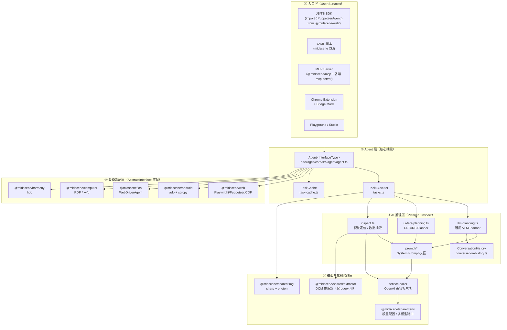
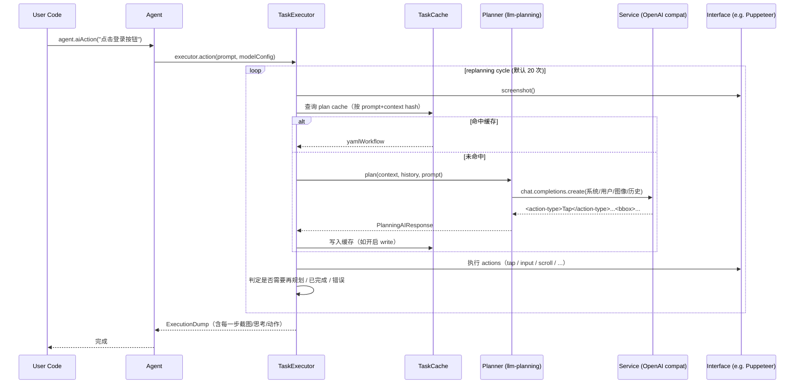

# 00 · 项目总览（Overview）

> 分析基于 `web-infra-dev/midscene`，commit `702d5375`（基于 `main`，最近发布版本 `v1.8.1`）

---

## 0. TL;DR

- **Midscene 是一套"以 VLM（视觉语言模型）替代 DOM 选择器"的 UI 自动化框架**，用一句自然语言 + 一张截图就能驱动 Web / Android / iOS / Desktop / 鸿蒙的界面操作。
- **核心抽象只有一个：`Agent`**。所有交互、断言、数据提取都是它身上的 `ai*()` 方法（如 `aiTap` / `aiInput` / `aiQuery` / `aiAssert`），而 `Agent` 本身是 **泛型**，泛型参数是不同端的 `AbstractInterface`，这就是它跨端的关键。
- **当前版本（v1.8.1）的设计立场**：**动作完全走纯视觉**（DOM extraction mode for actions 已被移除），**数据提取 / 页面理解**保留 DOM 作为可选上下文（`domIncluded` 开关）。这是一个**强信号**——他们已经赌定 VLM 的视觉定位能力可用于生产。
- **支持 LLM 双轨**：通用 VLM（Qwen3-VL / Doubao-1.6-vision / Gemini-3-pro 等）走通用 Planner；ByteDance 自家的 **UI-TARS** 走独立 Planner（`ui-tars-planning.ts`），输出 0–1000 千分位坐标，需要专门的坐标反算。
- **工程化武器库齐全**：Frozen Context 缓存、YAML 脚本、MCP 工具、Bridge Mode 远控桌面浏览器、可视化报告、Playground、Recorder、Evaluation 数据集——一个商业团队会做的周边它都做了。

---

## 1. 它解决了什么问题 / 为什么需要它

### 1.1 传统 UI 自动化的两个老敌人

| 痛点 | 经典症状 | 传统方案的应对 |
|---|---|---|
| **选择器脆弱** | CSS class 改了、xpath 偏了，整套用例红 | Page Object、稳定的 `data-testid` 约定、视觉回归 |
| **跨端碎片化** | Web 一套（Playwright）、Android 一套（Appium）、iOS 一套（XCUITest）、Desktop 一套（pywinauto） | 各端各自维护 |

这两个问题都**与"如何告诉机器'这个按钮在哪儿'"绑死**。

### 1.2 VLM 时代的新思路

VLM 可以**一次性看懂截图 + 自然语言指令**，输出：
- 目标元素的位置（bbox 或坐标）
- 下一步该执行什么动作（点击 / 输入 / 滚动）
- 推理过程（thought）

这就把"定位"从**结构化、绑定 DOM**变成了**语义化、绑定像素**。Midscene 的核心赌注是：**只要模型够强，截图就够了**——而且**截图是天然跨端的**，于是顺手解决了"跨端碎片化"。

### 1.3 Midscene 在这股潮流中的差异化定位

读 README 和源码后总结的几个独特点：

1. **纯视觉路线的"贯彻者"**：明确删除了 actions 的 DOM extraction mode（详见 `README.md` "Driven by Visual Language Model" 一节）。同代项目（如 browser-use）还在 DOM/SOM 混用。
2. **企业级周边完整**：Caching、Report、Playground、Recorder、MCP、CLI、Evaluation 全套配齐——不是 demo 项目。
3. **多端真·共用一套核心**：`packages/core` 是和端无关的，五个端包（`android` / `ios` / `computer` / `harmony` / `web-integration`）实现 `AbstractInterface` 接入。
4. **拥抱自家模型 UI-TARS**：留了独立 Planner 文件 `ui-tars-planning.ts`，说明这条路是**一等公民**而不是 hack。

---

## 2. 整体架构

### 2.1 五层架构总览



> 这张图是**整个学习文档体系的"导航图"**。后续每篇 MD 都聚焦其中一两层。

### 2.2 一次 `agent.aiAction("点击登录按钮")` 的生命周期（鸟瞰版）



---

## 3. 源码导览

### 3.1 关键包速查表

| 包 | 路径 | 角色 | 后续展开篇章 |
|---|---|---|---|
| `@midscene/core` | `packages/core` | **大脑**：Agent / Planner / Prompt / Service / Cache / Report | 02–11 |
| `@midscene/shared` | `packages/shared` | 图像 / 模型配置 / DOM 提取器 / 日志 | 08、03 |
| `@midscene/web` | `packages/web-integration` | Playwright/Puppeteer/Chrome-Ext/Bridge | 06、12 |
| `@midscene/android` | `packages/android` | adb + scrcpy 镜像 | 06 |
| `@midscene/ios` | `packages/ios` | WebDriverAgent | 06 |
| `@midscene/computer` | `packages/computer` | 桌面（RDP / xvfb） | 06 |
| `@midscene/harmony` | `packages/harmony` | 鸿蒙 hdc | 06 |
| `@midscene/cli` | `packages/cli` | YAML 跑批 CLI | 12 |
| `@midscene/mcp` | `packages/mcp` | MCP Server 统一入口 | 12 |
| `@midscene/playground` | `packages/playground` | 交互式 Playground | 02 |
| `@midscene/recorder` | `packages/recorder` | 录制 → YAML / TS | 12 |
| `@midscene/evaluation` | `packages/evaluation` | 基准测试数据集 | 13 |
| `@midscene/visualizer` | `packages/visualizer` | 报告 React 应用 | 10 |

### 3.2 入口文件清单（看到这些名字心里就要有定位）

| 文件 | 关键导出 | 作用 |
|---|---|---|
| `packages/core/src/agent/agent.ts` | `class Agent`、`createAgent` | 用户直接拿到的对象，承载 `ai*()` 全家桶 |
| `packages/core/src/agent/tasks.ts` | `class TaskExecutor` | 单次 `aiAction` 背后的执行引擎 |
| `packages/core/src/agent/task-cache.ts` | `class TaskCache`、`type PlanningCache/LocateCache` | "🧊 Frozen Context" 缓存读写 |
| `packages/core/src/ai-model/llm-planning.ts` | `plan()` | 通用 VLM Planner（XML 输出解析） |
| `packages/core/src/ai-model/ui-tars-planning.ts` | `uiTarsPlanning()` | UI-TARS 专用 Planner |
| `packages/core/src/ai-model/inspect.ts` | `AiLocateElement`、`AiExtractElementInfo`、`AiLocateSection`、`AiJudgeOrderSensitive` | 视觉定位 / 提取 / 区域裁切 |
| `packages/core/src/ai-model/prompt/` | `systemPromptToTaskPlanning`、`systemPromptToLocateElement` 等 | 所有 System Prompt 模板源文件 |
| `packages/core/src/ai-model/service-caller/index.ts` | `callAI`、`callAIWithObjectResponse` 等 | OpenAI 兼容客户端 + JSON Schema 强约束 |
| `packages/core/src/types.ts` | `Agent` / `Task` / `Dump` / `Locate` 所有类型 | 类型中枢 |
| `packages/shared/src/img/transform.ts` | 图像缩放 / padding / DPR 调整 | 喂模型前的最后一道处理 |
| `packages/shared/src/extractor/web-extractor.ts` | Web DOM 抽取（only for `aiQuery` 等） | 数据提取阶段的可选 DOM 上下文 |
| `packages/web-integration/src/playwright/ai-fixture.ts` | `PlaywrightAiFixture` | Playwright `test.extend()` 风格的集成方式 |
| `packages/web-integration/src/bridge-mode/` | Bridge Server / Bridge Client | "在我本地浏览器跑测试"的远控模式 |

---

## 4. 核心机制深度解析

### 4.1 Agent 是"前端"，TaskExecutor 是"后端"

读 `packages/core/src/agent/agent.ts:570` 起的方法列表，可以归纳出 **30 余个 `ai*()` 方法**，分三类（见 4.3）。但**所有方法的真正执行**都委托给 `taskExecutor: TaskExecutor`（`packages/core/src/agent/tasks.ts:66`）。

这种分层让：
- **用户面 API 极薄**，方便加方法（如 `aiPinch` / `aiLongPress` 这类移动端手势直接挂上去）
- **TaskExecutor 内部状态封闭**：截图、规划、执行、Dump 都在它生命周期里串起来

### 4.2 Agent 的泛型签名揭露了"跨端密码"

```ts
// packages/core/src/agent/agent.ts:140
export class Agent<
  InterfaceType extends AbstractInterface = AbstractInterface,
> {
  interface: InterfaceType;
  ...
}
```

- `AbstractInterface` 定义在 `packages/core/src/device/index.ts`（待 06 篇细看）
- 各端只需要实现 `screenshot()` / `tap()` / `input()` / `scroll()` / `keyboard()` ……
- **核心代码无需知道是 Web 还是 Android**——这就是为什么 `@midscene/web` 和 `@midscene/android` 都能复用同一个 `Agent` 类（`web-integration/src/index.ts` 里 `Agent as PageAgent` 就是直接 re-export 的 `@midscene/core/agent`）

### 4.3 三类 `ai*()` API 全景（约 30 个方法）

源码：`packages/core/src/agent/agent.ts`，行号取自当前 commit。

| 类别 | 方法 | 行号 | 备注 |
|---|---|---|---|
| **交互（Interaction）** | `aiTap` / `aiRightClick` / `aiDoubleClick` | 569 / 588 / 598 | 单击 / 右键 / 双击 |
| | `aiHover` | 608 | 悬停 |
| | `aiInput` / `aiClearInput` | 619 / 883 | 输入 / 清空 |
| | `aiKeyboardPress` | 705 | 键盘按键 |
| | `aiScroll` | 767 | 滚动 |
| | `aiPinch` / `aiLongPress` | 850 / 869 | 移动端手势 |
| | `aiAct` / `aiAction` / `ai` | 893 / 1005 / 1300 | **多步意图自动规划**（最强大） |
| **数据提取（Extraction）** | `aiQuery<T>` | 1009 | 任意结构化抽取 |
| | `aiBoolean` / `aiNumber` / `aiString` | 1023 / 1040 / 1057 | 类型化便捷封装 |
| | `aiAsk` | 1074 | 自由问答 |
| **工具（Utility）** | `aiLocate` | 1185 | 仅定位不动作 |
| | `aiAssert` | 1211 | 自然语言断言 |
| | `aiWaitFor` | 1287 | 等待断言为真 |

> **重要观察**：`aiAction`（行 1005）只是 `aiAct`（行 893）的别名，**真正的多步规划主入口是 `aiAct`**。后续 04 篇会从这里切入。

### 4.4 关键分叉：Planning 走两条路

`packages/core/src/ai-model/index.ts` 显式导出两个 Planner：

```ts
export { plan } from './llm-planning';           // 通用 VLM
export { uiTarsPlanning } from './ui-tars-planning';
export { autoGLMPlanning } from './auto-glm/planning';  // 第三条路！
```

实际上**有三条路**——`auto-glm` 是给智谱 GLM 模型的专用分支。每条路的 Prompt 模板、输出解析、坐标系都不同。这是后面 03/04 篇的重点。

### 4.5 关键状态：Frozen Page Context

`packages/core/src/agent/agent.ts:199` 的注释直白写着：

```ts
/**
 * Frozen page context for consistent AI operations
 */
```

并在 1478 行设置 `context._isFrozen = true`。

**这是 Midscene 一个非典型的工程决策**——它会**冻结一帧页面状态**（截图 + 尺寸 + DPR），让一次 `aiAction` 内部的多次模型调用共享同一份"事实"，避免模型在两次调用之间因为页面微变化而做出矛盾决策。后续 09 篇会展开。

---

## 5. 设计取舍与工程权衡

### 5.1 为什么完全走纯视觉路线？

**赌注**：VLM 在 2024–2025 年已经强到可以替代 DOM 选择器。

**收益**：
- 跨端"免费"：Android / iOS / Canvas / 远程桌面截图本质都是图像
- Token 省：不传 DOM 字符串，输入只有图像 token
- 鲁棒性：UI 微调（class 名变了）不再导致测试红

**代价 / 取舍**：
- **延迟**：单次模型调用秒级（这是 D2 性能专题要讨论的）
- **不确定性**：模型可能幻觉，需要 Cache + Replay 缓解（B5 / D1）
- **数据提取场景的回退**：他们没有"all-in"，`aiQuery` 仍保留 `domIncluded` 选项（`agent.ts:46`：`defaultServiceExtractOption.domIncluded = false`，但用户可以开启）

### 5.2 为什么 Agent 类放在 core，而不是各端各自有 Agent？

对照其他自动化框架：
- **Selenium**：每端一套 `WebDriver` 实现，没有统一 Agent
- **Appium**：客户端薄、Server 端各端独立
- **Midscene**：**Agent 统一在 core，端只暴露 `AbstractInterface`**

代价是 core 必须对端能力有抽象约定（如 `tap(x, y)` 各端怎么实现），收益是**新增端的成本极低**——只要实现 5-10 个接口方法。这个判断在 06 篇会用 `webdriver` / `harmony` 这种相对小众的端做对照。

### 5.3 为什么留 `auto-glm` / `ui-tars-planning` 两条专用路径？

如果只支持"通用 OpenAI 协议 + JSON Schema"，理论上一套 Prompt + Function Calling 就够了。但他们**没有**这么做，原因猜测（待后续验证）：

1. **UI-TARS 输出 0–1000 千分位坐标**（不是 bbox），需要专门的反算逻辑
2. **GLM 的 Function Calling 实现可能不稳定**，所以 GLM 走 XML/纯文本输出
3. **不同模型对"多步规划"的容忍度不同**，UI-TARS 是 agent 模型，单次能输出多步；通用 VLM 倾向单步规划循环

这是一个**反"过度抽象"的好例子**：他们没有强行用统一接口包住模型差异，而是**承认差异**、为每种模型写专属 Planner。

---

## 6. 与其他模块的协作

由于 Overview 是导航篇，这一节给出**模块阅读建议路径**（不是源码层面的协作）：

```
00 Overview ─┬─► 01 Repository Map ─► 02 Agent & APIs ──┐
             │                                          │
             └────────────────────────────────►─────────┴─► 03 Prompt Design
                                                            │
                                                            ▼
                              ┌──────────► 04 Planner & Action Loop
                              │                            │
                              │                            ▼
                              │     ┌───► 05 Page Readiness & Retry
                              │     │
                              │     ├───► 06 Device Abstraction
                              │     │
                              │     ├───► 07 Visual Locator & Inspect
                              │     │
                              │     ├───► 08 Image Pipeline & Coords
                              │     │
                              │     └───► 09 Cache & Frozen Context
                              │                  │
                              │                  ▼
                              └─► 10 Memory · Long-horizon · Dump
                                        │
                                        ▼
                              11 Engineering Trade-offs（总结）
                                        │
                                        ▼
                              12 YAML · CLI · MCP · Bridge
                                        │
                                        ▼
                              13 Evaluation & Benchmark
                                        │
                                        ▼
                              14 Advanced Topics（综合讨论）
```

**最短入门路径**（如果你想先跑起来）：00 → 01 → 02 → 12（YAML 例子）
**最短源码路径**（如果你想看清核心）：00 → 02 → 03 → 04 → 09

---

## 7. 常见陷阱（先打预防针）

学习过程中你会反复踩到的坑，提前列出来，对应章节会给出解决：

1. **"DOM 是不是没用了？"**——actions 走纯视觉，但 `aiQuery` / 区域裁切 (`AiLocateSection`) 仍可选用 DOM。**别一棍子打死**。
2. **"为什么 UI-TARS 的坐标看起来都是 0–1000？"**——它输出的是千分位归一化坐标，需要乘以图像尺寸 / 1000 才是像素坐标（08 篇详解）。
3. **"为什么我开了 Cache 还是每次都调用模型？"**——`CacheStrategy` 有三档：`read-only` / `read-write` / `write-only`（`agent.ts:96`），默认行为不一定是你想要的（09 篇详解）。
4. **"我的 `aiAction` 跑了 20 圈才停"**——`defaultReplanningCycleLimit = 20`（`agent.ts:130`），UI-TARS 是 40，AutoGLM 是 100。能改但要知道默认值（04 篇详解）。
5. **"为什么 Retina 屏上点击位置偏了？"**——DPR 没对齐。`packages/shared/src/img/transform.ts` 里有处理，但不同入口的实现细节不一样（08 篇详解）。
6. **"Frozen Context 是什么时候 frozen，什么时候 unfreeze？"**——这是 09 篇的核心问题。

---

## 8. 自检问题

读完这篇你应该能回答：

1. Midscene 的核心赌注是什么？为了这个赌注它**牺牲**了什么？
2. `Agent` 类为什么放在 `@midscene/core` 而不是每个端包里？端包做了什么？
3. `aiAction("点击登录")` 调用链上至少会涉及哪 5 个文件？请按调用顺序写出来。
4. 通用 VLM Planner 和 UI-TARS Planner 为什么不能用同一份代码？至少给出两条具体原因。
5. "Frozen Context" 解决的是什么问题？为什么不每次都拉最新截图？
6. README 里说 "DOM extraction mode is removed"——这句话**完全正确**吗？仔细想想 `aiQuery` 的行为。

---

## 9. 延伸阅读

- 官方文档：https://midscenejs.com
- Model Strategy 一节：https://midscenejs.com/model-strategy
- UI-TARS 论文与 HF 模型卡：https://huggingface.co/ByteDance-Seed/UI-TARS-1.5-7B
- 仓库 `README.md` "Driven by Visual Language Model" 一节（强观点声明）
- 仓库 `AGENTS.md`（贡献者守则，含"throw errors instead of returning blank values"等设计原则——这是项目工程文化的浓缩）
- 同代对照（建议自己开一个 tab）：[browser-use](https://github.com/browser-use/browser-use)、[Playwright](https://playwright.dev/)、[Appium 2.0](https://appium.io/)

---

写完了。说"下一个"我就开始写 `01_Repository_Map.md`（仓库地图 + 构建/调试工作流 + 第一次跑通的环境准备）。
