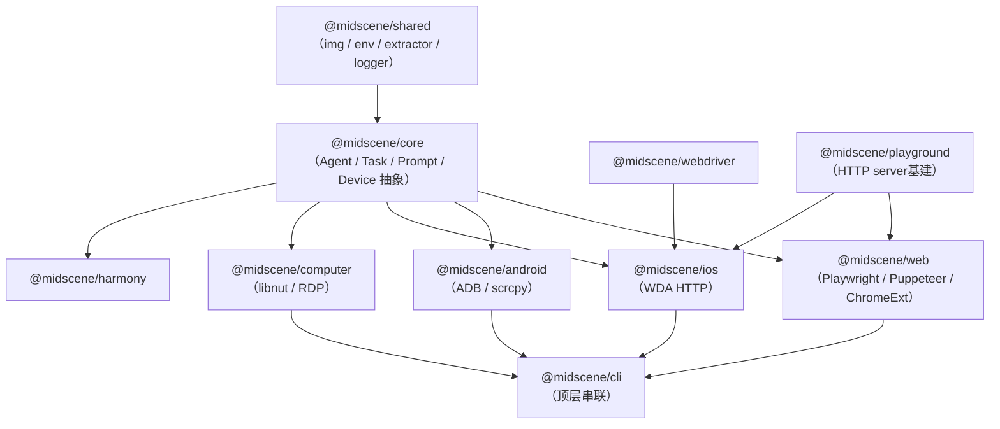
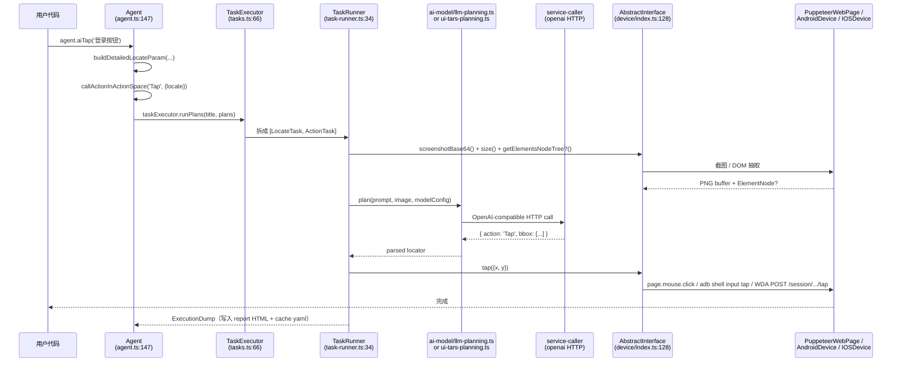

# 01 · Architecture：Monorepo 拓扑、端到端数据流、Hello World

> 分析基准：HEAD = `9df35128`，仓库版本 `1.8.1`。所有路径相对仓库根。

---

## 0. TL;DR

1. Midscene 是一个 **pnpm + Nx 双引擎 monorepo**：`apps/*` 是产品形态壳（CLI / Studio / Chrome Ext / Site），`packages/*` 是 SDK 与运行时（28 个工作区包）。
2. 包依赖收敛成一棵**倒三角金字塔**：所有 Adapter 包都依赖 `@midscene/core` + `@midscene/shared`，`@midscene/cli` 在最上层把六个 Adapter 全部串起来。
3. **一条端到端数据流**：用户调用 `agent.aiTap('登录按钮')` → `callActionInActionSpace('Tap', { locate })` → `TaskExecutor.runPlans` → VLM HTTP 请求 → 拿到 bbox → 通过 `AbstractInterface` 的 `actionSpace()` 把动作派发到具体 `Device` 实现 → ADB / Puppeteer / WebDriverAgent / libnut 真正发出指令。
4. 本节给出**最小可运行 Hello World**（Puppeteer + 一个固定 HTML 页面），跑通后你能拿到 `midscene_run/report/*.html` 和 `cache/*.cache.yaml` 两个落盘产物。
5. 注意一个生态信号：**`@midscene/mcp` 已 deprecated**，新代码请直接用 `@midscene/web-bridge-mcp`、`@midscene/android-mcp`、`@midscene/ios-mcp`（见 `packages/mcp/package.json` 的 description）。

---

## 1. 为什么需要先看架构

读后续 8 篇 MD 之前，你需要在脑子里建好三张图：

1. **包依赖图**：知道什么导入什么、改一处会波及哪里。
2. **类协作图**：`Agent` → `TaskBuilder` → `TaskExecutor` → `TaskRunner` → `AbstractInterface` 这五层每一层管什么。
3. **数据流图**：一次 `aiTap` 究竟跑了几次模型、几次设备调用、几次落盘。

没有这三张图，后面读 Prompt 模板的时候你不知道它是被谁调的；读 Cache 的时候你不知道命中后跳过了哪一段；读 Driver Adapter 的时候你不知道为什么 Android 不实现 `getElementsNodeTree`。

---

## 2. 它在整体架构中的位置

### 2.1 Monorepo 文件树（截到二级目录）

```
midscene/
├── apps/                       # 产品形态壳 — Nx project 名见各自 project.json
│   ├── chrome-extension/       # 零代码 in-browser 体验
│   ├── playground/             # HTTP playground (web)
│   ├── android-playground/     # HTTP playground (android, 含 scrcpy 视频流)
│   ├── computer-playground/    # HTTP playground (desktop)
│   ├── recorder-form/          # 录制器表单
│   ├── report/                 # 报告查看器（被 visualizer 注入产出 HTML）
│   ├── studio/                 # 桌面 GUI 调试器
│   └── site/                   # 官方文档站（Nx 项目名是 doc，非 site —— AGENTS.md 已标注此 mismatch）
│
├── packages/                   # SDK / 运行时 — 共 28 个，按角色分四组
│   │
│   │── ① 核心运行时
│   ├── core/                   # @midscene/core         平台无关的 Agent / Task / Prompt
│   ├── shared/                 # @midscene/shared       图像 / 环境 / DOM extractor / 日志
│   │
│   │── ② 跨端 Adapter
│   ├── web-integration/        # @midscene/web          Playwright + Puppeteer + Chrome Ext + Bridge
│   ├── android/                # @midscene/android      ADB + scrcpy
│   ├── ios/                    # @midscene/ios          WebDriverAgent
│   ├── computer/               # @midscene/computer     libnut + RDP（桌面）
│   ├── computer-{linux,mac,win}/ # 各 OS 平台子包（libnut 原生预编译产物宿主）
│   ├── harmony/                # @midscene/harmony      HarmonyOS
│   ├── webdriver/              # @midscene/webdriver    iOS 用的 WDA HTTP 客户端
│   │
│   │── ③ 入口形态
│   ├── cli/                    # @midscene/cli          顶层串联，提供 midscene 命令
│   ├── mcp/                    # @midscene/mcp          ⚠️ 已 deprecated
│   ├── web-bridge-mcp/         # @midscene/web-bridge-mcp
│   ├── android-mcp/            # @midscene/android-mcp
│   ├── ios-mcp/                # @midscene/ios-mcp
│   ├── computer-mcp/           # @midscene/computer-mcp
│   ├── harmony-mcp/            # @midscene/harmony-mcp
│   │
│   │── ④ 生态 / 调试
│   ├── playground/             # @midscene/playground       HTTP server 基础设施（被 *-playground 复用）
│   ├── playground-app/         # @midscene/playground-app   playground 前端 React 包
│   ├── visualizer/             # @midscene/visualizer       报告渲染前端（被 apps/report 嵌入）
│   ├── recorder/               # @midscene/recorder         录制器内核
│   ├── evaluation/             # @midscene/evaluation       基准评测脚本
│   └── *-playground/           # android/ios/harmony 各自的 playground 后端
│
├── pnpm-workspace.yaml         # 只有两行：apps/* 和 packages/*
├── nx.json                     # build target 启 cache，e2e 不 cache
├── AGENTS.md (= CLAUDE.md)     # 工作流规范，commit scope 映射
└── CONTRIBUTING.md             # 开发流程
```

### 2.2 包依赖图（核心包之间）



**记两条铁律**：

1. **没有反向依赖**：`@midscene/core` 不允许 `import { ... } from '@midscene/web'`。这是它能在 Chrome Extension（无 Node fs）和 Worker 里跑的前提（`task-cache.ts` 里 `ifInBrowser || ifInWorker` 就是这种隔离的体现）。
2. **`@midscene/shared` 是最底层**：所有包都依赖它，它自己只能依赖 npm 包（sharp、photon、zod、dotenv、debug、@modelcontextprotocol/sdk、express、uuid…）。

### 2.3 类协作图：一次 `aiTap` 的栈



注意三点：

- `callActionInActionSpace`（`packages/core/src/agent/agent.ts:532`）是**所有 instant action 的统一入口**——`aiTap` / `aiInput` / `aiHover` / `aiScroll` / `aiKeyboardPress` 都收敛到它，只是 `type` 字符串不同。
- **`actionSpace`** 是 `AbstractInterface` 提供的"能力清单"——具体哪些动作支持、参数 schema 是什么，都来自 `device.actionSpace()`。这是 04 号 MD 的重头戏。
- 截图与 DOM 抽取在**同一帧**完成（如果开了 `domIncluded`）—— 由 `commonContextParser` 统一封装成一个 `UIContext` 对象（`agent.ts:401`）。后续 prompt 和 cache 都基于这个 `UIContext` 的 hash。

---

## 3. 源码导览

### 3.1 跑通一次任务最少要碰的 9 个文件

| 序号 | 文件（绝对相对路径） | 关键导出 | 这一步它干嘛 |
|---|---|---|---|
| 1 | `packages/core/src/agent/agent.ts:147` | `class Agent` | 用户面对的对象，挂着所有 `aiXxx` 方法 |
| 2 | `packages/core/src/agent/agent.ts:532` | `callActionInActionSpace` | 所有 instant action 的汇聚漏斗 |
| 3 | `packages/core/src/agent/tasks.ts:66` | `class TaskExecutor` | `runPlans(title, plans, ...)` 把 plans 转成可执行 task 序列 |
| 4 | `packages/core/src/task-runner.ts:34` | `class TaskRunner` | 单步执行：截图→AI→设备调用→落盘 dump |
| 5 | `packages/core/src/agent/utils.ts:` | `commonContextParser` | 把"截图 + 尺寸 + DOM tree（可选）"打包成 `UIContext` |
| 6 | `packages/core/src/ai-model/llm-planning.ts` | `plan()` | 通用模型规划路径 |
| 7 | `packages/core/src/ai-model/ui-tars-planning.ts:46` | `uiTarsPlanning()` | UI-TARS 专用规划（坐标空间不同） |
| 8 | `packages/core/src/ai-model/service-caller/index.ts` | OpenAI HTTP 调用 + 错误解析 | 真正发出 HTTP 请求 |
| 9 | `packages/core/src/device/index.ts:128` | `abstract class AbstractInterface` | 五端共契：`screenshotBase64`、`size`、`actionSpace`、`getElementsNodeTree?` 等 |

### 3.2 Adapter 各自的"入口对应物"

| 平台 | Adapter 类（implements / extends `AbstractInterface`） | 文件 | 用户对应的 Agent 类 |
|---|---|---|---|
| Web (Puppeteer) | `PuppeteerWebPage` | `packages/web-integration/src/puppeteer/page.ts` | `PuppeteerAgent`（`packages/web-integration/src/puppeteer/index.ts:32`） |
| Web (Playwright) | `PlaywrightWebPage` (待源码确认精确文件) | `packages/web-integration/src/playwright/` | `PlaywrightAgent` |
| Web (Chrome Ext) | `ChromeExtensionProxyPage` | `packages/web-integration/src/chrome-extension/page.ts` | `ChromeExtensionProxyPageAgent` |
| Android | `AndroidDevice` | `packages/android/src/device.ts:77` | `AndroidAgent`（`packages/android/src/agent.ts:39`） |
| iOS | `IOSDevice` | `packages/ios/src/device.ts:41` | `IOSAgent`（`packages/ios/src/agent.ts:39`） |
| Desktop | `ComputerDevice`、`RDPDevice` | `packages/computer/src/device.ts:418`、`packages/computer/src/rdp/device.ts:49` | `ComputerAgent` |
| HarmonyOS | （待源码确认精确名字） | `packages/harmony/src/` | `HarmonyAgent` |

> 命名规律：**Adapter 包都暴露一个 `XxxAgent extends PageAgent<XxxDevice>`** —— `PageAgent` 就是 `@midscene/core/agent` 里的 `Agent`（`packages/web-integration/src/puppeteer/index.ts:2` 的 `import { Agent as PageAgent }`）。所以你新建一个端，最小工作量就是 (1) 实现 `AbstractInterface` 的 Device 类、(2) 写个 1 行的 `XxxAgent extends PageAgent<XxxDevice>` 子类。

### 3.3 落盘产物

跑完任务后磁盘上会出现：

```
${MIDSCENE_RUN_DIR:-midscene_run}/
├── report/
│   └── <timestamp>-<hash>.html         # visualizer 包注入的可视化回放
├── cache/
│   └── <cacheId>.cache.yaml            # TaskCache 写入（仅当 opts.cacheId 提供）
├── dump/
│   └── <timestamp>.json                # 原始 ExecutionDump（含截图 base64、推理过程）
└── screenshots/, ...
```

源码：`packages/shared/src/common.ts:49 getMidsceneRunSubDir`。环境变量 `MIDSCENE_RUN_DIR` 可改默认目录（`shared/src/env/types.ts:94`）。

---

## 4. 核心机制深度解析

### 4.1 `Agent` 是个什么样的对象（agent.ts:147 之后字段一览）

```ts
class Agent<InterfaceType extends AbstractInterface = AbstractInterface> {
  interface: InterfaceType;          // 设备适配器，统一抽象入口（注意：`agent.page` 已 deprecated，改用 .interface）
  service: Service;                  // 内部服务容器
  dump: ReportActionDump;            // 本次会话的执行 dump（最终序列化成 HTML 报告）
  reportFile?: string | null;        // 报告路径
  reportFileName?: string;
  taskExecutor: TaskExecutor;        // 真正干活的执行器
  opts: AgentOpt;                    // 用户传的配置
  dryMode = false;                   // 干跑模式：不执行真实动作
  onTaskStartTip?: OnTaskStartTip;   // 每步任务开始前的回调（playground / studio 用它做 UI 提示）
  taskCache?: TaskCache;             // 只有传了 cacheId 才会创建
  modelConfigManager: ModelConfigManager;   // 模型路由：planning / locate / vqa 可各用一个模型
  private frozenUIContext?: UIContext;       // 🧊 frozen context（详见 06 号 MD）
  private hasWarnedNonVLModel = false;       // Deep Think 模型告警去重
  private fullActionSpace: DeviceAction[];   // 从 device.actionSpace() 缓存下来的动作清单
  private reportGenerator: IReportGenerator;
}
```

要点：

- **`modelConfigManager`** 揭示了一个被低估的设计：planning（理解任务）/ locate（找元素）/ default 可以用**不同模型**——比如规划用 Doubao Seed，定位走 qwen3-vl，提取走 gpt-5-mini。这是 02 号 MD 会展开的关键点。
- **`frozenUIContext`** 用来在同一个 Agent 会话里"冻结一帧屏幕"做多次 AI 调用——比如先 `aiQuery('页面上有几个按钮?')` 再 `aiTap('第三个')`，第二次调用就不用重新截图。这是性能优化和确定性保证的关键。

### 4.2 `callActionInActionSpace` 的实现（agent.ts:532）

```ts
async callActionInActionSpace<T = any>(type: string, opt?: T) {
  debug('callActionInActionSpace', type, ',', opt);

  const actionPlan: PlanningAction<T> = {
    type: type as any,
    param: (opt as any) || {},
    thought: '',
  };

  const plans: PlanningAction[] = [actionPlan].filter(Boolean) as PlanningAction[];

  const title = taskTitleStr(type as any, locateParamStr((opt as any)?.locate || {}));

  // assume all operation in action space is related to locating
  const defaultIntentModelConfig = this.modelConfigManager.getModelConfig('default');
  const modelConfigForPlanning = this.modelConfigManager.getModelConfig('planning');

  const { output } = await this.taskExecutor.runPlans(
    title,
    plans,
    modelConfigForPlanning,
    defaultIntentModelConfig,
  );
  return output;
}
```

读这段你能看到 Midscene 的 **instant action 设计哲学**：

- LLM 不参与"决定做什么"——type 已经由用户写死（`Tap`、`Input`、`Scroll`）；
- LLM 只参与"locate"——这一步在 `TaskExecutor` 里通过 `modelConfigForPlanning` 调一次模型；
- 这就是为什么 instant action **比 auto-planning 快、稳、便宜**。一次 LLM 调用而已。

对照看 `agent.aiAction(...)`（auto-planning），它会走 **多次** LLM 迭代——这是 03 号 MD 的核心区分。

### 4.3 模型配置怎么进来：`MIDSCENE_MODEL_*` 环境变量

`packages/shared/src/env/constants.ts:17-50` 是权威清单。最常用的 6 个：

| 变量 | 用途 | 必填？ |
|---|---|---|
| `MIDSCENE_MODEL_NAME` | 模型名（例 `qwen3-vl-plus`、`doubao-seed-1.6-vision`） | ✅ |
| `MIDSCENE_MODEL_API_KEY` | API Key（也可用 `OPENAI_API_KEY` 兜底） | ✅ |
| `MIDSCENE_MODEL_BASE_URL` | OpenAI 兼容端点（例 `https://dashscope.aliyuncs.com/compatible-mode/v1`） | ✅ 自部署/非 OpenAI 必填 |
| `MIDSCENE_MODEL_FAMILY` | 模型族：`qwen2.5-vl` / `qwen3-vl` / `glm-v` / `auto-glm` / `ui-tars` / `gpt-5` …（决定 bbox 坐标系） | 大多数情况自动推断；模型名不规范时手填 |
| `MIDSCENE_USE_VLM_UI_TARS` | 显式宣告"我用的是 UI-TARS"，走 `ui-tars-planning.ts` 路径 | UI-TARS 必填 |
| `MIDSCENE_RUN_DIR` | 落盘根目录，默认 `./midscene_run` | 可选 |

完整 30+ 项见 `shared/src/env/types.ts`。06 号 MD 也会用到的两个：`MIDSCENE_CACHE_MAX_FILENAME_LENGTH`、`MIDSCENE_MODEL_TIMEOUT`。

### 4.4 关键数据结构：`UIContext`（截图+DOM+尺寸的统一封装）

源码：`packages/core/src/types.ts` 附近的 `UIContext` 定义。简化版伪代码（**结构是真的，字段名按源码**）：

```ts
interface UIContext {
  screenshotBase64: string;          // 不带 data:image/...;base64, 前缀
  size: { width: number; height: number; dpr?: number };
  tree?: ElementNode;                 // 仅 web + opts.domIncluded 时存在
  elementInfos?: ElementInfo[];       // 仅 web 时存在（DOM 元素抽取结果）
  // ... 各端可能附加字段
}
```

整个 Midscene 的"AI 看到的世界"，就是这个对象。Prompt、Cache、Report 三个子系统都基于它。

---

## 5. 设计取舍与工程权衡

### 5.1 为什么不拆成多 repo？

Midscene 28 个包里有 5 端 Adapter，但都共用 `@midscene/core`。**纯视觉路线本质上是"AI 智能集中、平台差异稀薄"的架构**——这种情况下 monorepo 收益巨大：

- 一次重构（如 `5946a7e0 refactor(core): device input primitives actions #2452`）能在 commit 范围内同步改 4–5 个包的实现，PR 评审能看到端到端一致性。
- Nx cache（`nx.json` 的 `build` target）保证本地/CI 不重复构建未变包。
- 多端 demo 与 e2e 测试可以**共享**模型环境与 cache 文件。

代价是新人 onboarding 略陡——需要先理解 `pnpm install` 之后符号链接的关系，以及为什么调试时改了 `packages/core/src/foo.ts` 后必须重启 `pnpm dev`（背后是 `build:watch` 的 dependsOn `^build`）。

### 5.2 为什么 `AbstractInterface` 是抽象类而不是接口？

`packages/core/src/device/index.ts:128` 用了 `abstract class` 而不是 `interface`。这意味着：

- 它**可以挂默认实现**——比如 `pinch`、`hover` 这种"很多端没有但少数端需要"的方法，可以在抽象类里给出"抛出 NotImplementedError"的兜底，子类按需 override。
- 但**也牺牲了多重继承**——一个 Device 类只能 `extends` 它一次。
- 而具体的能力组合是通过**结构性接口** `PointerInputPrimitives` / `TouchInputPrimitives` / `KeyboardInputPrimitives` / `ScrollInputPrimitives` / `SystemInputPrimitives` 完成的。Web 端可能只实现 Pointer+Keyboard+Scroll，Android 同时实现 Pointer+Touch+Keyboard+Scroll+System。

这种"抽象类做骨架 + 多个小 interface 做能力组合"是 04 号 MD 的核心论述。

### 5.3 为什么 `@midscene/mcp` 被 deprecated 拆成多个 `*-mcp`？

旧的 `packages/mcp` 是个大杂烩——一个包同时知道 web/android/ios 三端。新拆法 `@midscene/web-bridge-mcp` / `@midscene/android-mcp` / `@midscene/ios-mcp` / `@midscene/computer-mcp` / `@midscene/harmony-mcp` 让 **每个 MCP server 只承载自己关心的工具集**，对接 Claude Code / Cursor 时只装一个，安装体积、启动速度都好得多。

---

## 6. 与其他模块的协作

- 上游：Agent 接收用户调用 → 把"自然语言意图" + "屏幕状态"喂给 ai-model 层
- 下游：ai-model 产出"结构化动作" → 通过 AbstractInterface 派发到具体 Device
- 侧路：TaskCache（命中跳过 LLM）、ReportGenerator（产生 HTML 回放）、ModelConfigManager（多模型路由）

各个模块如何具体协作、各自的 Prompt 长什么样、Cache 如何 hash —— 留给 02–07 号 MD。

---

## 7. 常见陷阱

1. **不要直接 `import` Adapter 包到 `@midscene/core`**——会引入平台依赖循环，CI 立刻挂。
2. **`pnpm dev` 后改了 core 还是用不上**：`build:watch` 是惰性的，依赖图上层的 web/android 不会自动重打——等几秒看 Nx 日志，或干脆 `pnpm build` 一次。
3. **`MIDSCENE_MODEL_BASE_URL` 不要带尾部斜杠**：底层用的是 `openai` SDK，把 URL 当 prefix 拼，多一个斜杠就 404。
4. **`MIDSCENE_RUN_DIR` 用相对路径**会落到**当前进程的 cwd**——CI 里如果 cwd 是 `/tmp` 之类的位置，报告就找不到。建议用绝对路径或 `${ProjectRoot}/midscene_run`。
5. **不要把 `cacheId` 写成动态字符串**（比如时间戳）—— 这样每次都是新文件，缓存永远命不中。`cacheId` 是缓存的稳定 key，应当用任务名或测试名。
6. **`agent.page` 是 deprecated alias**（`agent.ts` 末尾的 `get page()`）——新代码用 `agent.interface`，搜索老代码改起来。

---

## 8. 🛠️ 实操：30 分钟跑通 Hello World

> 目标：从 0 开始，跑通"打开一个 HTML 页面 → AI 找到 '搜索框' → 输入 'midscene' → 拿截图回放"。

### 8.1 环境准备（一次性）

```bash
# 1. Node 与 pnpm
node -v        # 需要 >= 18.19.0（CONTRIBUTING 推荐 20.9.0）
corepack enable
pnpm -v        # 需要 >= 9.3.0

# 2. 在仓库根目录安装依赖（首次约 2-5 分钟）
cd /Users/sanshi/WebstormProjects/midscene
pnpm install

# 3. 一次性 build（让 @midscene/web 等包产出 dist/）
pnpm build        # 失败也别慌：apps/site (Nx 名 doc) 已被排除，core/shared/web-integration 三件齐就够 Hello World

# 4. 准备 .env（放在仓库根 .env，packages 的 demo 都从这里读）
cat > .env <<'EOF'
# 以阿里云通义千问 qwen3-vl-plus 为例（替换成你能拿到 key 的模型即可）
MIDSCENE_MODEL_NAME=qwen3-vl-plus
MIDSCENE_MODEL_API_KEY=sk-xxx
MIDSCENE_MODEL_BASE_URL=https://dashscope.aliyuncs.com/compatible-mode/v1
MIDSCENE_MODEL_FAMILY=qwen3-vl

# 落盘目录（绝对路径）
MIDSCENE_RUN_DIR=/Users/sanshi/WebstormProjects/midscene/midscene_run
EOF
```

如果你手上没有 qwen 的 key，最常用的替代：

- **Doubao**（火山引擎）：`MIDSCENE_MODEL_NAME=doubao-seed-1.6-vision-250815`、`MIDSCENE_MODEL_BASE_URL=https://ark.cn-beijing.volces.com/api/v3` —— 见 `apps/site/docs/en/model-common-config.mdx`（同 commit）。
- **本地 UI-TARS**：再加一行 `MIDSCENE_USE_VLM_UI_TARS=1` 并指向你的本地推理服务。

> ⚠️ 上面 `.env` 里 `OPENAI_API_KEY` 之类的兜底变量不必填—— Midscene 优先读 `MIDSCENE_MODEL_*`。

### 8.2 写第一个脚本

在仓库根新建 `hello-midscene.mjs`（**注意是 `.mjs`，避免 ESM/CJS 配置纠葛**）：

```js
// hello-midscene.mjs
import 'dotenv/config';
import puppeteer from 'puppeteer';
import { PuppeteerAgent } from '@midscene/web/puppeteer';

(async () => {
  const browser = await puppeteer.launch({
    headless: false,           // 第一次可视化方便看到点击
    defaultViewport: { width: 1280, height: 768 },
  });
  const page = await browser.newPage();
  await page.goto('https://www.bing.com/');

  const agent = new PuppeteerAgent(page, {
    cacheId: 'hello-bing',     // 第二次跑会命中缓存（详见 06 号）
  });

  // 自然语言一句话搞定（auto-planning 风格）
  await agent.aiAction('在搜索框输入 "midscene github" 并按回车');

  // 用 instant action + 数据提取（推荐风格）
  const topTitle = await agent.aiQuery({
    title: '搜索结果第一条的标题',
  });
  console.log('第一条结果：', topTitle);

  await agent.aiAssert('页面包含 GitHub 链接');

  await browser.close();
})();
```

运行：

```bash
# 安装 puppeteer 到根（也可以放在某个临时目录，看你喜好）
pnpm add -w puppeteer

# 跑
node hello-midscene.mjs
```

### 8.3 你会看到什么

1. 浏览器自动启动，访问 bing。
2. 终端出现一连串 `[midscene]` debug 日志，可见模型推理耗时（通常 1–5s/次）。
3. 任务结束后，控制台打印第一条搜索结果标题。
4. 在 `midscene_run/report/` 下生成 `*.html`，**用 Chrome 直接打开**就能看到"每一步截图 + 模型推理 + 命中区域"的完整可视化回放。
5. `midscene_run/cache/hello-bing.cache.yaml` 文件出现——第二次再跑（页面布局没变）会发现速度明显加快、控制台打印 `cache hit`。

### 8.4 推荐的断点位置（用你 IDE 的 debugger）

| 文件:行 | 看什么变量 |
|---|---|
| `packages/core/src/agent/agent.ts:532`（`callActionInActionSpace` 入口） | `type`、`opt.locate`、`this.modelConfigManager` 实际选了哪个模型 |
| `packages/core/src/agent/tasks.ts:619`（`if (opt?.domIncluded && this.interface.getElementsNodeTree)`） | 在 Hello World 里**会进这分支吗？**（提示：不会，因为没传 `domIncluded`） |
| `packages/core/src/ai-model/llm-planning.ts:plan()` | `prompt` 完整内容、传入图片 base64 长度 |
| `packages/core/src/ai-model/service-caller/index.ts` 的 HTTP 调用点 | 实际请求 URL、body、Authorization |
| `packages/core/src/agent/task-cache.ts:53 constructor` | `cacheFilePath`、cache 是否命中 |

### 8.5 引导式实验任务（做完才算懂）

1. **关掉浏览器再跑一次**，观察是不是同一份 `.cache.yaml` 命中。把缓存文件**手动删一行 `locate` 条目**，再跑，看错误日志。
2. **把 `aiQuery` 改成 `aiQuery({ ...prop, domIncluded: 'visible-only' })`**，断点在 `tasks.ts:619`，看 `getElementsNodeTree` 是不是被调了一次。**这就是"DOM opt-in"的真实代码路径**。
3. 把 `MIDSCENE_MODEL_NAME` 故意改成一个不存在的名字（如 `qwen-imaginary-vlm`），看 `service-caller` 里的错误捕获——这就是 D2 章节里"成本控制"的反例：错误模型名照样会消耗 1 次 HTTP 来回。
4. 把 `cacheId` 改成 `Date.now().toString()`，跑 3 次——确认 `cache/` 下出现 3 个文件、每次都没缓存命中。这是踩坑 #5 的可视化复现。

### 8.6 不想动浏览器？最小 AI 调用复现

不依赖 Puppeteer，只验证 ai-model 子模块能不能联通：

```js
// connectivity-check.mjs
import 'dotenv/config';
import { runConnectivityTest } from '@midscene/core';

const result = await runConnectivityTest({ /* 可不传，默认读 env */ });
console.log(JSON.stringify(result, null, 2));
```

源码：`packages/core/src/ai-model/connectivity.ts`（在 `@midscene/core` 的 index 里有 `export { runConnectivityTest }`，见 `packages/core/src/index.ts`）。这是排查"模型 key 是否真的连得通"的最短路径。

---

## 9. 自检问题

1. **`@midscene/core` 为什么不能 `import` `@midscene/web`？** 给一个工程理由 + 一个产品理由（提示：Chrome Ext 不能用 fs）。
2. **`agent.aiTap('登录按钮')` 与 `agent.aiAction('点击登录按钮')` 在内部调用栈上的最大区别是什么？** 至少指出"LLM 调用次数"和"经过的关键方法"两点。
3. **`MIDSCENE_MODEL_FAMILY` 漏配会怎样？** 模型还能用吗、bbox 解析会发生什么、什么时候你必须手动指定？
4. **第一次跑 Hello World，`midscene_run/cache/` 下有文件吗？第二次呢？为什么？** （提示：看 `cacheId` 是否提供 + 命中条件）
5. **`abstract class AbstractInterface` 用 abstract class 而不是 interface 的取舍是什么？** 用一句话回答。

---

## 10. 延伸阅读

- `CONTRIBUTING.md`（仓库根）—— Node/pnpm 版本、提交规范、commit scope 真实映射（如 `web-integration` → `@midscene/web`，`site` → `doc`）
- `apps/site/docs/en/model-config.mdx` / `model-common-config.mdx` —— 主流模型的环境变量模板
- 关键 Nx 命令（来自 `package.json`）：
  - `pnpm dev` —— 增量 watch
  - `pnpm test` —— 单元测试，**不含** AI 测试
  - `pnpm test:ai` —— AI 测试，需要真模型环境
  - `npx nx build @midscene/core` —— 单包 build，最常用
- 关联 commit：
  - `5946a7e0` device primitives 重构（04 号 MD 主线）
  - `0a7e919d` android-playground scrcpy 流式传输的 OOM 修复（D5 / 性能讨论的工程样本）

---

## 置信度自评

- **高置信（直接读源码或 README/CONTRIBUTING 原文）**
  - Monorepo 结构、`apps/* + packages/*` 的 pnpm-workspace 配置、Nx build target 启 cache
  - 所有列出的包依赖（来自各自 `package.json` 的 `dependencies` 段）
  - `Agent`/`callActionInActionSpace`/`TaskExecutor.runPlans` 的代码引用与行号
  - `@midscene/mcp` 已 deprecated（来自 `packages/mcp/package.json` 的 `description` 原文）
  - `MIDSCENE_MODEL_*` 环境变量来自 `packages/shared/src/env/constants.ts:17-50`
  - `MIDSCENE_RUN_DIR` 默认 `midscene_run`（`packages/shared/src/common.ts:10`）
- **中置信（部分确认 + 推断）**
  - Hello World 脚本里 `import { PuppeteerAgent } from '@midscene/web/puppeteer'` 这个 sub-path 我从 `packages/web-integration/package.json` 的 `exports` 字段没直接读到 `./puppeteer` 这个键——你跑的时候如果 `Cannot find module` 就改成 `from '@midscene/web'` 然后 `PuppeteerAgent` 作为 named export 试一下（或者参考 `packages/web-integration/demo/playground.ts` 里 `from '../src/puppeteer'`，对应包暴露路径应当是 `@midscene/web/puppeteer`，但我没逐字段对完）。
  - Hello World 里 `pnpm add -w puppeteer` —— 仓库本身已有 puppeteer 在 `@midscene/cli` 的 devDependencies 里（`packages/cli/package.json` 末尾），但加到 workspace root 是为了让用户的脚本能 `import`。也可以直接在 `packages/web-integration` 目录里跑，省去这一步。
- **低置信 / 待你帮我对齐**
  - `PlaywrightWebPage` 的精确类名我标了"待源码确认精确文件"——后面写 04 号 MD 时会顺手对齐。
  - HarmonyOS 那一行 Device 类名我没去读 `packages/harmony/src/`，留了占位。
  - "30 分钟跑通"是我对常规环境的估计——如果你 sharp/photon 的 wasm 在你这个 mac 上要手动编译，可能更久。第一次卡住请贴 `pnpm install` 末尾的 warning 给我。

写完。等你说"下一个"，我开始 `02_PromptDesign.md`。
