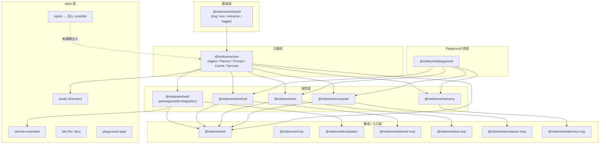

# 01 · 仓库地图与开发工作流（Repository Map & Workflow）

> 分析基于 commit `702d5375`（main，v1.8.1）

---

## 0. TL;DR

- **Midscene 是一个 pnpm + Nx 的双层 Monorepo**：`apps/*`（用户可见的产品形态：Studio、Chrome 扩展、Site、Playground）+ `packages/*`（27 个发布到 npm 的库）。
- **依赖结构是金字塔形**：`@midscene/shared` → `@midscene/core` → 五个端包（`web` / `android` / `ios` / `computer` / `harmony`）→ 集成层（`cli` / `mcp` / `evaluation`）。
- **构建工具是字节自家的 `rslib`/`rsbuild`**（不是 tsup/rollup），所有包通过 `rslib build` 出三套产物（lib/cjs + es/esm + types）。
- **Nx 的 `dependsOn: ["^build"]` 是个坑**：改一个 `shared` 文件，下游所有包都会重建——`pnpm run build:skip-cache` 是修这种状态的"消防员"。
- **从 0 跑通的最小路径**：装 Node 20 + pnpm → `pnpm install`（会自动 build 全包）→ 写一个 `.env`（只要两行：`OPENAI_API_KEY` + `MIDSCENE_MODEL_NAME`）→ 跑 `npx nx test:ai @midscene/core` 或写个 YAML 用 `midscene` CLI 跑。

---

## 1. 它解决了什么问题 / 为什么先读这篇

在跳进核心源码之前，先建立一张**"哪个文件归哪个包管"的肌肉记忆**。否则你会反复经历这种困惑：

- 我想看 `aiTap` 的实现，在 `web-integration` 里搜不到 → 因为它在 `@midscene/core/agent/agent.ts`
- 我想看截图裁剪逻辑，在 `core` 里搜不到 → 因为它在 `@midscene/shared/img/`
- 我看到一个叫 `@midscene/web` 的 npm 包，但提交 commit 时 scope 必须写 `web-integration` ——为什么？

这篇就是回答这些"为什么是这样"。同时也是**你第一次 `pnpm install` 跑通环境**的实操手册。

---

## 2. 它在整体架构中的位置

整个 Monorepo 的物理布局：

```
midscene/
├── apps/                          ← 终端产品（可视化、扩展、文档站）
│   ├── chrome-extension/          ← 浏览器扩展
│   ├── playground/                ← 通用 Playground (Web)
│   ├── android-playground/
│   ├── computer-playground/
│   ├── recorder-form/             ← 录制器 UI
│   ├── report/                    ← 报告 HTML（注入回 core/dist）
│   ├── site/                      ← 文档站（Nx 项目名 = "doc"，注意 mismatch）
│   └── studio/                    ← Electron 桌面 Studio
│
├── packages/                      ← 发布到 npm 的库（27 个）
│   ├── shared/                    ← @midscene/shared        ── 基础设施
│   ├── core/                      ← @midscene/core          ── 大脑
│   ├── web-integration/           ← @midscene/web           ── 注意名字 mismatch！
│   ├── android/  android-mcp/     ← @midscene/android       ── 安卓
│   ├── ios/      ios-mcp/         ← @midscene/ios           ── iOS
│   ├── computer/ computer-mcp/    ← @midscene/computer      ── 桌面
│   ├── computer-{linux,mac,win}/  ← 平台专用 binary 包
│   ├── computer-playground/
│   ├── harmony/  harmony-mcp/     ← @midscene/harmony       ── 鸿蒙
│   ├── webdriver/                 ← WDA 客户端
│   ├── cli/                       ← @midscene/cli           ── YAML 跑批
│   ├── mcp/                       ← @midscene/mcp           ── 统一 MCP server
│   ├── playground/                ← @midscene/playground    ── 库（不是 app）
│   ├── playground-app/            ← @midscene/playground-app
│   ├── recorder/                  ← @midscene/recorder
│   ├── evaluation/                ← @midscene/evaluation    ── 基准测试
│   └── visualizer/                ← @midscene/visualizer    ── 报告 React 组件
│
├── scripts/                       ← Monorepo 维护脚本
│   ├── dev-prepare.js             ← pnpm dev 之前的预处理
│   ├── release.js
│   ├── publish-chrome-extension.sh
│   └── rsbuild-utils.ts
│
├── pnpm-workspace.yaml            ← 工作空间声明（apps/* + packages/*）
├── nx.json                        ← Nx 任务调度
├── package.json                   ← 根脚本（dev/build/test/e2e）
├── commitlint.config.js           ← 自动从 apps/* + packages/* 推导 scope
├── biome.json                     ← lint 配置
└── AGENTS.md                      ← 贡献指南（CLAUDE.md 是它的 symlink）
```

### 2.1 包依赖图（数据流向）



> **观察**：箭头方向就是 import 依赖方向。`@midscene/playground`（不是 app）反过来被四个端包依赖——它是各端 Playground UI 的公共代码。
>
> **特殊关系**：`apps/report` 的 HTML 模板在构建期被注入到 `packages/core/dist`（见 CONTRIBUTING.md `REPLACE_ME_WITH_REPORT_HTML` 一节），这是个**"反向"依赖**——产物层注入库层。

---

## 3. 源码导览

### 3.1 包到 npm 包名的映射表（含 mismatch 警告）

| 目录 | npm 包名 | Commit scope | 备注 |
|---|---|---|---|
| `packages/web-integration/` | `@midscene/web` | ⚠️ **`web-integration`** | 三套名字不同，最容易踩坑 |
| `apps/site/` | （不发布） | ⚠️ **`site`** | Nx 项目名是 `doc` |
| `packages/shared/` | `@midscene/shared` | `shared` | ✓ 一致 |
| `packages/core/` | `@midscene/core` | `core` | ✓ 一致 |
| `packages/android/` | `@midscene/android` | `android` | ✓ |
| `packages/ios/` | `@midscene/ios` | `ios` | ✓ |
| `packages/computer/` | `@midscene/computer` | `computer` | ✓ |
| `packages/harmony/` | `@midscene/harmony` | `harmony` | ✓ |
| `packages/cli/` | `@midscene/cli` | `cli` | ✓ |
| `packages/mcp/` | `@midscene/mcp` | `mcp` | 此外还有合法 alias `mcp` 见 commitlint |

> **来源**：`AGENTS.md` "Commit And PR Rules" 一节明确点名了两个 mismatch；`commitlint.config.js` 自动把所有 `apps/*` 和 `packages/*` 子目录名加入合法 scope，**不是 npm 包名**。

### 3.2 关键配置文件清单

| 文件 | 作用 | 关键内容 |
|---|---|---|
| `nx.json` | Nx 调度策略 | `targetDefaults.build.dependsOn = ["^build"]` ← 看下面 4.1 |
| `pnpm-workspace.yaml` | 工作空间通配符 | 仅两行：`apps/*` + `packages/*` |
| `package.json` (root) | 顶层命令 | `dev`/`build`/`test`/`test:ai`/`e2e`/`lint` |
| `scripts/dev-prepare.js` | `pnpm dev` 前置 | 先 build report + playground，再做 symlink 注入静态目录 |
| `commitlint.config.js` | Commit 校验 | 自动从目录推导 scope；`scope-empty` = 2 (强制非空) |
| `biome.json` | Lint/Format | 取代了 ESLint + Prettier 的混合栈 |
| `.npmrc` | pnpm 行为 | （后面 7.x 节会讨论 hoist 风险） |
| `tsconfig.json` (各包) | TS 编译 | 各自独立，没有根 tsconfig |
| `rslib.config.ts` (各包) | rslib 打包 | 输出 `dist/lib`（cjs）+ `dist/es`（esm）+ `dist/types` |

### 3.3 入口脚本清单

> 这些命令你**会反复用**，建议背下来：

```bash
# 安装 + 全量首次构建
pnpm install                              # 自动跑 simple-git-hooks + pnpm run build

# 全局 watch（多包联调，会先跑 dev-prepare.js）
pnpm run dev

# 全包构建
pnpm run build
pnpm run build:skip-cache                 # 清缓存重来（修 REPLACE_ME_WITH_REPORT_HTML）

# 单包构建 / 测试（最常用！）
npx nx build @midscene/web
npx nx test @midscene/core
npx nx test:ai @midscene/core             # 需要 .env 配模型

# AI / E2E 套件
pnpm run test:ai
pnpm run e2e
pnpm run e2e:cache

# Lint（提交前必跑）
pnpm run lint                             # biome check --fix
```

---

## 4. 核心机制深度解析

### 4.1 Nx 任务依赖：`^build` 是什么意思？

`nx.json` 关键片段：

```jsonc
{
  "targetDefaults": {
    "build": {
      "dependsOn": ["^build"],       // ← 这个 ^ 是关键
      "cache": true,
      "inputs": ["build", "^build", "{workspaceRoot}/package.json"],
      "outputs": ["{projectRoot}/dist"]
    },
    "build:watch": {
      "dependsOn": ["^build"],
      "continuous": true              // watch 模式不会退出
    },
    "dev": { "dependsOn": ["^build"] },
    "e2e": { "dependsOn": ["^build"] },
    "test": { "cache": false }       // 测试不缓存，结果总是新鲜的
  }
}
```

- **`^build`**：Nx 约定——表示"先 build 所有**上游**依赖包，再 build 我"。比如 `nx build @midscene/web` 会先依次 build `shared` → `core` → `web`。
- **`cache: true`**：build 输入没变就用缓存（基于 `inputs` 列表 hash）。这就是为什么 `pnpm install` 第二次几乎是秒过的。
- **`!{projectRoot}/**/*.{md,mdx}` (在 namedInputs.build 里)**：改 Markdown **不会**触发 build 缓存失效，这是有意为之。
- **`!{projectRoot}/**/?(*.)+(spec|test).ts`**：改测试文件也不触发 build——很合理。

**对你的影响**：
- 改 `shared/src/img/transform.ts`，所有下游包的 build cache 全部失效——可能要等几十秒。
- 改 `core/src/agent/agent.ts`，只有 `web-integration` 这类直接依赖 `core` 的会失效。
- 改 `web-integration/tests/foo.spec.ts`，**完全不会**触发 build。

### 4.2 构建栈：为什么是 `rslib` 不是 tsup？

`packages/core/package.json` 显示构建命令是 `rslib build`，watch 模式甚至带了个 `USE_DEV_REPORT=1` 环境变量：

```jsonc
"scripts": {
  "build": "rslib build",
  "build:watch": "USE_DEV_REPORT=1 rslib build --watch --no-clean"
}
```

- **rslib**：字节自家的库打包器（基于 rspack/SWC）。用它的原因——**和 rspack 共享 loader 生态**，且 SWC 比 tsc 快几个数量级。
- **`USE_DEV_REPORT=1`**：watch 模式时启用一个开发版的 report 注入逻辑，避免生产 report 拖慢热更新。
- **三套产物**：`dist/lib`（CommonJS）+ `dist/es`（ESM）+ `dist/types`（.d.ts），通过 `exports` 字段路由。

### 4.3 环境变量体系（最关键的一类知识）

`packages/shared/src/env/constants.ts` 定义了 **120+ 个环境变量常量**，按"三个层级"分组：

| 层级 | 前缀 | 用途 |
|---|---|---|
| **默认模型**（默认用这个） | `MIDSCENE_MODEL_*` | 既用于 planning 也用于 insight |
| **Planning 模型**（覆盖默认） | `MIDSCENE_PLANNING_MODEL_*` | 只覆盖 planning 阶段 |
| **Insight 模型**（覆盖默认） | `MIDSCENE_INSIGHT_MODEL_*` | 只覆盖 inspect/locate 阶段 |

> 这是后续 03/04 篇要展开的"双模型协调"机制——**Planning 走大模型、Locate 走小模型**这种成本优化路径，靠这套环境变量分流实现。

**每个层级又各有约 15 个细分键**，举例（来自 `constants.ts:17-38`）：

```
MIDSCENE_MODEL_NAME                  # 模型名（如 "qwen3-vl-plus"）
MIDSCENE_MODEL_API_KEY               # API Key
MIDSCENE_MODEL_BASE_URL              # 兼容 OpenAI 协议的 base URL
MIDSCENE_MODEL_FAMILY                # 见下表，决定 Prompt 模板分支
MIDSCENE_MODEL_HTTP_PROXY            # http 代理
MIDSCENE_MODEL_SOCKS_PROXY           # socks 代理
MIDSCENE_MODEL_TEMPERATURE           # 采样温度
MIDSCENE_MODEL_TIMEOUT               # 请求超时
MIDSCENE_MODEL_RETRY_COUNT           # 重试次数
MIDSCENE_MODEL_RETRY_INTERVAL        # 重试间隔
MIDSCENE_MODEL_REASONING_ENABLED     # 是否开启思考链
MIDSCENE_MODEL_REASONING_EFFORT      # OpenAI o1 风格 effort（low/medium/high）
MIDSCENE_MODEL_REASONING_BUDGET      # Gemini/Claude 风格 budget tokens
MIDSCENE_MODEL_EXTRA_BODY_JSON       # 透传 JSON 到 request body
MIDSCENE_MODEL_INIT_CONFIG_JSON      # OpenAI Client 初始化配置
```

### 4.4 模型族（`TModelFamily`）：14 种合法值

源码：`packages/shared/src/env/types.ts:294`

```ts
export type TModelFamily =
  | 'qwen2.5-vl'      // 阿里 Qwen2.5-VL 系列
  | 'qwen3-vl'        // 阿里 Qwen3-VL 系列（README 推荐）
  | 'qwen3.5'
  | 'qwen3.6'
  | 'doubao-vision'   // 字节豆包视觉
  | 'doubao-seed'
  | 'gemini'          // Google Gemini
  | 'vlm-ui-tars'           // UI-TARS 原始版
  | 'vlm-ui-tars-doubao'    // UI-TARS 豆包微调版
  | 'vlm-ui-tars-doubao-1.5'
  | 'glm-v'            // 智谱 GLM-V
  | 'auto-glm'         // 智谱 AutoGLM（专用 Planner!）
  | 'auto-glm-multilingual'
  | 'gpt-5';           // OpenAI（标识符）
```

**这个枚举决定了**：
- 走哪条 Planner（通用 `plan()` / `uiTarsPlanning()` / `autoGLMPlanning()`）
- Prompt 模板里有没有特殊变体（如 UI-TARS 的千分位坐标说明）
- 输出解析逻辑（XML / JSON / Function Calling）

后续 03 篇 Prompt 设计会把这 14 个值"映射到 Prompt 模板的分叉点"列一张大表。

### 4.5 Conventional Commits：scope 是强制的

`commitlint.config.js:49`：

```js
'scope-empty': [2, 'never']   // 2 = error level, never = 必须有 scope
```

**合法 scope 来源**：
1. 硬编码白名单：`workflow`、`llm`、`playwright`、`puppeteer`、`mcp`、`blog`、`bridge`、`recorder`
2. **自动**加入所有 `apps/*` 和 `packages/*` 的目录名（运行时 `fs.readdirSync` 读取）

**这意味着**：
- 改 `packages/web-integration/` 用 `web-integration` 作 scope（**不是** `web`）
- 改 `apps/site/` 用 `site` 作 scope（**不是** `doc`，虽然 Nx 项目名是 `doc`）
- 你想用 `feat(awesome): ...` 是不行的——`awesome` 不在白名单也不是目录名

---

## 5. 设计取舍与工程权衡

### 5.1 为什么不用一个根 `tsconfig.json` 做项目引用（Project References）？

主流 monorepo（Babel、TS 自己、tRPC）会用 `tsconfig.json` 的 `references` 字段做增量编译。Midscene **没有**，每个包独立 tsconfig。

**推测原因**：
- 用 `rslib`（基于 SWC）替代 `tsc`，**类型检查和打包解耦**。`.d.ts` 是 rslib 单独生成的。
- Project References 在跨包导入复杂时容易卡死循环引用问题——他们改用 Nx 任务图来管理顺序。
- 代价：编辑器（VS Code/WebStorm）的"跨包跳转"体验需要靠 pnpm 的 symlink 而非 tsc 配置。

### 5.2 为什么 `dependsOn: ["^build"]` 而不是按需 import？

理论上 ESM + pnpm symlink 可以做到"改了源码立即看到效果"，但 Midscene 选择**每次都走打包产物**。

**好处**：
- 测试运行的是真实的发布产物，避免"开发时能跑、用户装了就崩"
- `rslib` 输出 cjs/esm 双格式，兼容下游不同模块系统

**代价**：
- 改一行 shared 代码要等 build——但 Nx 缓存基本秒过
- watch 模式是必须的（`pnpm run dev`）

### 5.3 为什么 `web-integration` 的 npm 包名叫 `@midscene/web`？

历史上 `@midscene/web` 是第一个包。后来加了 Android/iOS，命名空间撑不开了：
- 保持 npm 包名 `@midscene/web` 不变（向下兼容用户 `import { PuppeteerAgent } from '@midscene/web'`）
- 目录名重命名为 `web-integration` 以匹配"它是 Web 端的集成层"语义
- commit scope 跟目录走（自动化推导 + 简单一致性）

**结论**：你能看到的所有"web/web-integration"混用都是**有意识的折衷**，不是 bug。

---

## 6. 与其他模块的协作

仓库地图本身是"协作的元信息"，但有两个特殊耦合点需要点名：

1. **`apps/report` → `packages/core/dist`**：构建期模板注入（`REPLACE_ME_WITH_REPORT_HTML` 占位符替换）。10 篇会讲。
2. **`apps/playground` → `packages/{playground, ios}/static`**：`scripts/dev-prepare.js` 用 symlink 把 playground 的 dist 链接进各端包的 `static/` 目录，让各端 playground 共用同一份 React UI。
3. **`packages/visualizer` ←→ `apps/report`**：visualizer 是 React 组件库，report 是壳应用，运行时通过 `<script>` 注入 dump 数据。

---

## 7. 常见陷阱 & 调试经验

### 7.1 "REPLACE_ME_WITH_REPORT_HTML" 错误
**症状**：跑测试后生成的 HTML 报告打开后看到这个字符串没被替换。
**根因**：`apps/report` 的 dist 没准备好就 build 了 `core`。
**解决**：
```bash
pnpm run build:skip-cache
```
来源：CONTRIBUTING.md 明确写了这个 FAQ。

### 7.2 'Template does not contain {{dump}} placeholder'
**症状**：`@midscene/core` 单包 build 后跑测试报这个错。
**根因**：循环依赖+模板注入需要整仓 build。
**解决**：跑 `pnpm run build`（全量），不要 `npx nx build @midscene/core`。
来源：CONTRIBUTING.md FAQ 节。

### 7.3 commit 被 pre-commit hook 拒绝
**症状**：`scope-empty` 报错。
**根因**：commit message 写成 `fix: xxx` 没带 scope。
**解决**：`fix(core): xxx` 或 `fix(web-integration): xxx`。

### 7.4 单包 test 缺失环境变量
**症状**：`npx nx test:ai @midscene/web` 报 `MIDSCENE_MODEL_BASE_URL is required`。
**根因**：根目录 `.env` 还没建。
**解决**：见 8.2。

### 7.5 改了 `shared` 但下游没生效
**症状**：watch 模式下改了 `packages/shared/src/img/transform.ts`，但 web-integration 测试还是用老逻辑。
**根因**：要么 watch 没起（看 `rslib build --watch` 进程），要么 Nx 缓存抽风。
**解决**：`rm -rf .nx/cache packages/*/dist && pnpm run build`。

---

## 8. 🛠️ 实操章节

### 8.1 环境准备（从 0 开始）

**第一步：Node 版本**

```bash
node -v   # 必须 >= 18.19.0；CONTRIBUTING 推荐 20.9.0
```

如果版本不对，用 nvm/fnm：
```bash
nvm install 20.9.0 --lts
nvm use 20.9.0
```

**第二步：启用 pnpm（corepack）**

```bash
corepack enable
# 检查
pnpm -v   # 应该是 9.3.0（来自根 package.json 的 packageManager）
```

> **不要用 npm 或 yarn**——`AGENTS.md` 第一行就写了 "Use pnpm only"。

**第三步：clone + install**

```bash
git clone https://github.com/web-infra-dev/midscene.git
cd midscene
pnpm install         # 大约 3–10 分钟。第一次会跑全量 build
```

`pnpm install` 实际做的：
1. 装所有依赖 + 在包间建 symlink
2. 跑 `prepare` 脚本 = `simple-git-hooks && pnpm run build`
3. `pnpm run build` 跑 `nx run-many --target=build`（除了 `doc` 项目）

如果你只是想看代码不想 build，可以加 `--ignore-scripts`，但后续大多数命令都要 dist 存在才能跑。

### 8.2 配置模型（最少集）

在仓库根目录建 `.env`（参考 `CONTRIBUTING.md` 的 Testing 一节）：

```env
# 最小配置：用阿里通义 Qwen3-VL（README 官方推荐）
OPENAI_API_KEY="sk-xxxxxxxxxxxxxxxx"
MIDSCENE_MODEL_NAME="qwen3-vl-plus"
MIDSCENE_MODEL_BASE_URL="https://dashscope.aliyuncs.com/compatible-mode/v1"
```

或者用字节豆包（同样 OpenAI 兼容）：

```env
OPENAI_API_KEY="your_ark_api_key"
MIDSCENE_MODEL_NAME="doubao-1-5-vision-pro-32k-250115"
MIDSCENE_MODEL_BASE_URL="https://ark.cn-beijing.volces.com/api/v3"
MIDSCENE_MODEL_FAMILY="doubao-vision"
```

或者用 UI-TARS（自部署 vLLM 等）：

```env
OPENAI_API_KEY="EMPTY"
MIDSCENE_MODEL_NAME="ui-tars-7b-dpo"
MIDSCENE_MODEL_BASE_URL="http://localhost:8000/v1"
MIDSCENE_MODEL_FAMILY="vlm-ui-tars-doubao-1.5"
```

> **如何选**：
> - 想最快验证：`qwen3-vl-plus`（阿里官方 API 直接能用，最低门槛）
> - 自部署：UI-TARS（开源、可定制，但需要 GPU）
> - 03 篇会详细讲 Prompt 在不同 Family 下的差异，那时这个选择会更有 informed

### 8.3 第一次跑测试

最简单的 smoke test——跑 `@midscene/core` 的单元测试（不需要真模型）：

```bash
npx nx test @midscene/core
```

跑 AI 测试（需要 `.env` 已配好）：

```bash
npx nx test:ai @midscene/core
```

跑 Web 端到端测试（需要 Playwright 浏览器）：

```bash
pnpm exec playwright install chromium   # 第一次需要装浏览器
npx nx e2e @midscene/web
```

### 8.4 写一个最小 YAML 跑通 CLI

新建一个文件 `my-first-test.yaml`（任意位置）：

```yaml
# my-first-test.yaml
web:
  url: https://www.bing.com

tasks:
  - name: search and verify
    flow:
      - aiAction: type 'Midscene.js' into the search box and press Enter
      - sleep: 3000
      - aiAssert: the page shows search results about "Midscene"
      - aiQuery: >
          {title: string, url: string}[], top 3 search results
        name: top_results
```

跑它（前提：根 `.env` 已配置）：

```bash
# 在仓库根目录，先 build CLI
npx nx build @midscene/cli

# 然后跑
node packages/cli/bin/midscene my-first-test.yaml
```

> **参考样例**：`packages/cli/tests/multi_yaml_ios_scripts/search-headphone-on-ebay.yaml` 是仓库里最完整的 YAML 示例，覆盖了 `aiAction` / `aiQuery` / `aiAssert` / `aiNumber` / `aiBoolean` / `aiLocate` 全套。

### 8.5 推荐的断点位置（VS Code / WebStorm）

为了后面几篇深入读代码做准备，先把这几个断点存档：

| 文件 | 行 | 触发时机 |
|---|---|---|
| `packages/core/src/agent/agent.ts:893` | `aiAct()` 入口 | 任意 `aiAction` 调用 |
| `packages/core/src/agent/tasks.ts:66` 起 | `TaskExecutor` 构造 | 创建 Agent 时 |
| `packages/core/src/ai-model/llm-planning.ts` 中的 `plan()` | 单步规划入口 | 每次重新规划 |
| `packages/core/src/ai-model/service-caller/index.ts` 中的 `callAI` | 模型调用前 | 每次发送给 LLM |

**调试命令**（开 debug log）：

```bash
DEBUG=midscene:* npx nx test:ai @midscene/core
```

`@midscene/shared/logger` 用的是 `debug` 包，`midscene:*` 通配会打出 planning / cache / agent 等所有命名空间。

### 8.6 引导式实验

试试这几个小练习，建立直觉：

1. **改默认重规划次数**：`packages/core/src/agent/agent.ts:128` 把 `defaultReplanningCycleLimit = 20` 改成 `2`，跑一个复杂的 `aiAction`，观察 dump 报告里 `replanningCycleLimit` 的影响（注意要 `nx build @midscene/core` 之后再跑）。
2. **切换模型 Family**：把 `.env` 里 `MIDSCENE_MODEL_FAMILY` 改成不同值，看 Prompt 是否变化（提示：可以在 `service-caller/index.ts` 的 `callAI` 函数里加 `console.log(messages)`）。
3. **故意触发缓存**：`MIDSCENE_CACHE=1 npx nx e2e @midscene/web`，跑两次，第二次看 `.midscene_run/cache/` 目录下的 yaml 文件——这是 09 篇的预习。

---

## 9. 自检问题

1. `apps/site/` 下做了文档改动，commit 该写什么 scope？为什么不能写 `doc`？
2. 改了 `packages/shared/src/img/transform.ts`，最少需要 build 哪些包才能让 `@midscene/web` 看到变化？解释 Nx `^build` 是怎么帮你做这件事的。
3. `MIDSCENE_MODEL_*` 和 `MIDSCENE_PLANNING_MODEL_*` 同时设置时，谁生效？这种"双模型"设计的工程动机是什么？（提示：思考成本/速度）
4. UI-TARS 三个 Family 值（`vlm-ui-tars` / `vlm-ui-tars-doubao` / `vlm-ui-tars-doubao-1.5`）为什么不合并成一个？
5. `@midscene/playground`（库）和 `apps/playground`（应用）是什么关系？为什么 `scripts/dev-prepare.js` 要做 symlink？

---

## 10. 延伸阅读

- 仓库 `CONTRIBUTING.md`：开发流程的"主源"，本篇是它的"导读 + 推理"版
- 仓库 `AGENTS.md`：贡献者规范（含强制 scope、bilingual docs 等）
- Nx 官方文档：[Cache and Hashing](https://nx.dev/concepts/how-caching-works)（理解 `inputs` / `outputs` 的工作原理）
- rslib 项目：https://github.com/web-infra-dev/rslib（如果你想理解打包细节）
- 字节同生态：rsbuild / rspack / rsdoctor——和 Midscene 一脉相承

---

写完了。说"下一个"我就开始写 `02_Agent_and_Three_APIs.md`（Agent 类 + 30+ ai* 方法 + createAgent 工厂 + 第一次写代码而非 YAML）。
