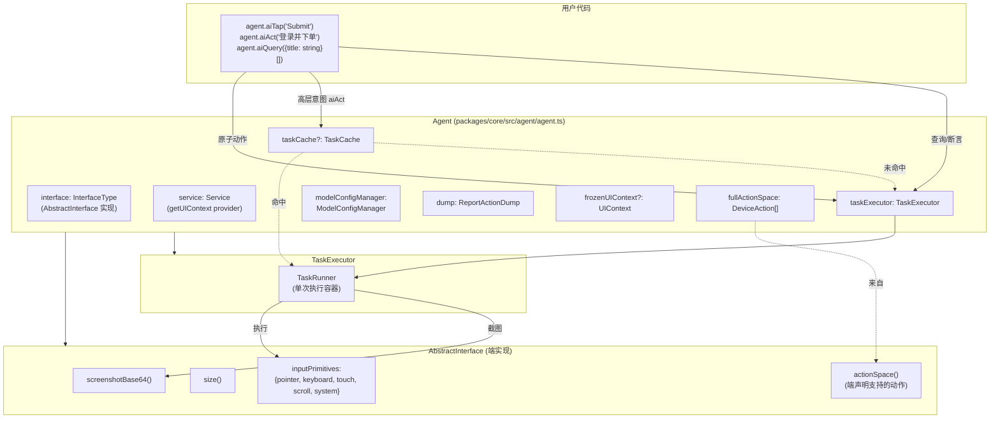
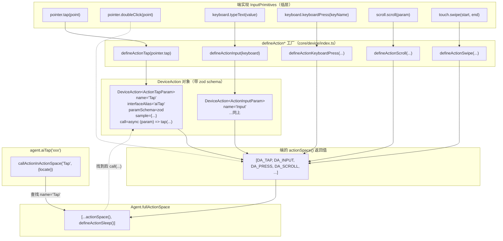
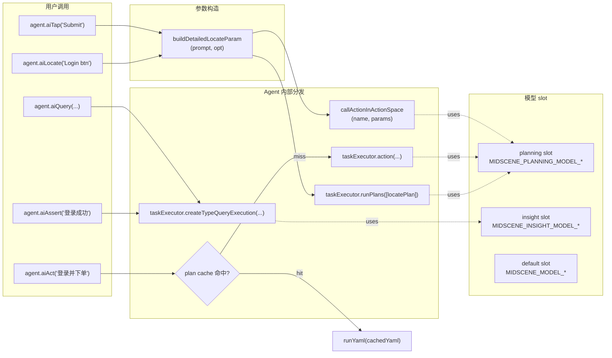

# 02 · Agent 类与三大 API（Agent & Three API Families）

> 分析基于 commit `702d5375`（main，v1.8.1）
>
> 本篇是"读源码的真正起点"——`Agent` 是 Midscene 的**唯一核心抽象**，所有端、所有 API、所有内部模块都围绕它组装。

---

## 0. TL;DR

- **`Agent<InterfaceType extends AbstractInterface>` 是泛型类**（`packages/core/src/agent/agent.ts:140`）。`InterfaceType` 是各端实现的契约——这就是"跨端"的全部秘密。
- **30+ 个 `ai*()` 方法**按用途分四类：① **基础原子动作**（`aiTap/Input/Scroll/...`）② **高层意图规划**（`aiAct` / `aiAction` / `ai`）③ **数据提取**（`aiQuery/Boolean/Number/String/Ask`）④ **工具方法**（`aiLocate/Assert/WaitFor`）。
- **三类 API 走三条不同的内部路径**：
  - **原子动作** → `callActionInActionSpace(name, params)` → 直接在 actionSpace 里查 action 并执行
  - **`aiAct`** → 先查 plan cache，命中就跑 YAML，否则走 `taskExecutor.action()` 进入完整的 plan-execute 循环
  - **Query/Assert** → `taskExecutor.createTypeQueryExecution()`，**不走 planning，只调用 insight 模型**
- **三个模型 slot**：`getModelConfig('default' | 'planning' | 'insight')`——和 01 篇的三层环境变量前缀对应。`aiAct` 用 `planning`，`aiQuery/aiAssert` 用 `insight`。
- **`AbstractInterface`** 只要求 4 个方法是必须的（`interfaceType` / `screenshotBase64` / `size` / `actionSpace`），其他全是 optional——**这就是新接入一个端的最小工作量**。
- **`createAgent` 是个一行函数**：`return new Agent(interfaceInstance, opts)`。它存在主要是为了文档化"端无关"创建路径。各端的 `PuppeteerAgent` / `AndroidAgent` 是 `extends Agent`，多加端特有便捷方法。

---

## 1. 它解决了什么问题 / 为什么必须先读这篇

打开 `agent.ts` 你会看到 **1700+ 行**的 `Agent` 类。新人最容易陷入两个误区：

1. **以为 `aiTap` 是"专门做点击"的方法**——其实它只是 `callActionInActionSpace('Tap', ...)` 的薄包装。**真正的"点击"逻辑在端的 `inputPrimitives.pointer.tap()`**，被 `defineActionTap` 包成 `DeviceAction`，由 actionSpace 注册。
2. **以为 `aiAction("点击登录")` 和 `aiTap("登录按钮")` 是"语义糖"关系**——其实**两条完全独立的路径**：前者走 Planner（VLM 决定怎么操作），后者直接执行（你已经告诉 Agent 干什么）。

读完这篇你会看清：
- **Agent 是一个"调度器 + 状态容器"**，不做执行也不做规划
- **执行靠端的 `InputPrimitives`**，规划靠 `TaskExecutor`，定位靠 `Service.getUIContext` + LLM
- **三类 API 的成本和性能差异巨大**——选错了 API 就是钱和时间双烧

---

## 2. 它在整体架构中的位置



> 这张图回答了一个常见问题："Agent 类里这些字段都在干什么？"——上面 8 个字段是它的全部状态。

---

## 3. 源码导览

### 3.1 关键文件

| 文件 | 关键导出 | 作用 |
|---|---|---|
| `packages/core/src/agent/agent.ts` | `class Agent`、`createAgent`、`type AiActOptions` | **本篇主角**，1700+ 行 |
| `packages/core/src/agent/index.ts` | re-export 入口 | `import { Agent, createAgent } from '@midscene/core/agent'` |
| `packages/core/src/agent/tasks.ts` | `class TaskExecutor`、`locatePlanForLocate`、`withFileChooser`、`TaskExecutionError` | 执行引擎（04 篇深入） |
| `packages/core/src/agent/task-cache.ts` | `class TaskCache`、`type PlanningCache/LocateCache` | 缓存（09 篇深入） |
| `packages/core/src/agent/task-builder.ts` | 任务构造工具 | 04 篇 |
| `packages/core/src/agent/execution-session.ts` | `ExecutionSession` | 单次会话状态 |
| `packages/core/src/agent/utils.ts` | `commonContextParser`、`parsePrompt`、`getReportFileName` | UI 上下文构建 |
| `packages/core/src/agent/usage-intent.ts` | `UsageIntent` 类型 | model slot 用途标签 |
| `packages/core/src/device/index.ts` | `AbstractInterface`、`InputPrimitives`、`defineAction*` 全家桶 | **设备契约 + 动作定义** |
| `packages/web-integration/src/puppeteer/index.ts` | `PuppeteerAgent extends PageAgent<PuppeteerWebPage>` | Puppeteer 端 |
| `packages/web-integration/src/playwright/index.ts` | `PlaywrightAgent extends PageAgent<PlaywrightWebPage>` | Playwright 端 |
| `packages/web-integration/src/playwright/ai-fixture.ts` | `PlaywrightAiFixture` | Playwright `test.extend()` 风格 |
| `packages/android/src/agent.ts` | `class AndroidAgent extends PageAgent<AndroidDevice>` | Android 端 |

### 3.2 30+ 个 `ai*()` 方法的完整分类表

读 `packages/core/src/agent/agent.ts` 后整理出的全集（行号取自当前 commit）：

| 类别 | 方法 | 行 | 内部走向 | 用哪个模型 slot |
|---|---|---|---|---|
| **① 原子动作（直接执行）** | `aiTap` | 569 | `callActionInActionSpace('Tap')` | planning（仅用于定位） |
| | `aiRightClick` | 588 | `callActionInActionSpace('RightClick')` | planning |
| | `aiDoubleClick` | 598 | `callActionInActionSpace('DoubleClick')` | planning |
| | `aiHover` | 608 | `callActionInActionSpace('Hover')` | planning |
| | `aiInput` | 619 | `callActionInActionSpace('Input')` | planning |
| | `aiKeyboardPress` | 705 | `callActionInActionSpace('KeyboardPress')` | planning |
| | `aiScroll` | 767 | `callActionInActionSpace('Scroll')` | planning |
| | `aiPinch` | 850 | `callActionInActionSpace('Pinch')` | planning |
| | `aiLongPress` | 869 | `callActionInActionSpace('LongPress')` | planning |
| | `aiClearInput` | 883 | `callActionInActionSpace('ClearInput')` | planning |
| **② 高层意图（先 plan 再执行）** | **`aiAct`** | **893** | **plan cache → taskExecutor.action()** | **planning** |
| | `aiAction` | 1005 | `@deprecated` → `aiAct` | planning |
| | `ai` | 1300 | 别名 → `aiAct` | planning |
| **③ 数据提取（不动作，只问）** | `aiQuery<T>` | 1009 | `taskExecutor.createTypeQueryExecution('Query')` | **insight** |
| | `aiBoolean` | 1023 | `createTypeQueryExecution('Boolean')` | insight |
| | `aiNumber` | 1040 | `createTypeQueryExecution('Number')` | insight |
| | `aiString` | 1057 | `createTypeQueryExecution('String')` | insight |
| | `aiAsk` | 1074 | 别名 → `aiString` | insight |
| **④ 工具方法** | `aiLocate` | 1185 | `taskExecutor.runPlans([locatePlan])` | planning（定位）+ default（意图） |
| | `aiAssert` | 1211 | `createTypeQueryExecution('Assert')` | **insight** |
| | `aiWaitFor` | 1287 | `taskExecutor.waitFor()` | insight |
| **⑤ 端特有（仅部分端）** | `back`、`home`、`recentApps`（Android） | — | `createActionWrapper<...>` | — |
| | `launch`、`terminate`（Android） | — | `wrapActionInActionSpace` | — |
| **⑥ 非 AI 辅助** | `setAIActContext` | 432 | 设置全局 system prompt 补充 | — |
| | `runYaml` | 1304 | 解析 YAML → ScriptPlayer | — |
| | `evaluateJavaScript` | 1328 | 透传到 interface | — |
| | `describeElementAtPoint` | 1081 | 给定坐标反查描述 | planning |
| | `flushCache` | — | 手动写缓存到磁盘 | — |

**重要观察**：
- `aiAction` 是 `@deprecated`（注释在 `agent.ts:1003`），**现在应该用 `aiAct`**
- `aiAsk` 不是新方法——它就是 `aiString`（`agent.ts:1078`）
- `ai(...)` 是 `aiAct` 的极短别名（`agent.ts:1300`）
- 文档/示例里看到 `aiAction` 不代表你要用它，**统一写 `aiAct` 是 future-proof 的选择**

---

## 4. 核心机制深度解析

### 4.1 Agent 类的"骨架"（8 个核心字段 + 1 个泛型）

```ts
// packages/core/src/agent/agent.ts:140
export class Agent<
  InterfaceType extends AbstractInterface = AbstractInterface,
> {
  interface: InterfaceType;            // 端实现，泛型决定类型
  service: Service;                    // UIContext provider
  taskExecutor: TaskExecutor;          // 执行引擎
  taskCache?: TaskCache;               // 缓存（可选）
  modelConfigManager: ModelConfigManager;  // 模型配置
  dump: ReportActionDump;              // 报告数据累积器
  private frozenUIContext?: UIContext;  // 🧊 冻结上下文（line 201）
  private fullActionSpace: DeviceAction[];  // 完整动作集
  opts: AgentOpt;                      // 选项
  // ... 加上 dumpUpdateListeners、reportGenerator 等辅助字段
}
```

**几个关键决策**：

1. **`frozenUIContext` 是 `private` 字段**，外部不能直接读写——保证"冻结一帧"语义不被破坏（09 篇展开）。
2. **`fullActionSpace` 在构造函数中一次性 build**：
   ```ts
   // agent.ts:321
   const baseActionSpace = this.interface.actionSpace();
   this.fullActionSpace = [...baseActionSpace, defineActionSleep()];
   ```
   即"端声明的动作 + 一个万能 Sleep"。**Sleep 在所有端上都可用**，因为它不依赖任何 input primitive。
3. **`taskCache` 是可选的**——只有 `opts.cache` 显式配置才会实例化，没配置时 `aiAct` 走完整 plan 流程。

### 4.2 `AbstractInterface`：端的契约（device/index.ts:128）

```ts
export abstract class AbstractInterface {
  // ===== 必须实现的（4 个）=====
  abstract interfaceType: string;          // 'puppeteer' / 'playwright' / 'android-device' / ...
  abstract screenshotBase64(): Promise<string>;
  abstract size(): Promise<Size>;
  abstract actionSpace(): DeviceAction[];  // 声明自己支持的动作

  // ===== 全是可选的 =====
  abstract cacheFeatureForPoint?(...): Promise<ElementCacheFeature>;
  abstract destroy?(): Promise<void>;
  abstract describe?(): string;
  abstract beforeInvokeAction?(actionName: string, param: any): Promise<void>;
  abstract afterInvokeAction?(actionName: string, param: any): Promise<void>;
  registerFileChooserListener?(handler): Promise<{dispose, getError}>;
  abstract getElementsNodeTree?: () => Promise<ElementNode>;   // @deprecated
  abstract url?: () => string | Promise<string>;               // @deprecated
  abstract evaluateJavaScript?<T>(script: string): Promise<T>; // @deprecated
  getDeviceLocalTimeString?(format?: string): Promise<string>;
  mjpegStreamUrl?: string;                                     // 实时预览
  startMjpegStream?(options): MjpegStreamHandle | undefined;
  flushPendingVisualUpdate?(): Promise<void>;
  navigationState?(): Promise<{ isLoading: boolean }>;
  inputPrimitives?: InputPrimitives;                           // ← 5 类输入原语
}
```

**关键观察**：
- **4 个 abstract 是真正必须的**：`interfaceType` + `screenshotBase64` + `size` + `actionSpace`
- **其他写了 `abstract` 但带 `?` 的**是 TypeScript 的"可选 abstract 声明"——表示子类**可以实现也可以不实现**，调用方需要做 `if (this.interface.evaluateJavaScript)` 防御
- `getElementsNodeTree` / `url` / `evaluateJavaScript` 三个标了 `@deprecated`——纯视觉路线下不希望端依赖 DOM 能力。但 Web 端仍然实现它们（给 `aiQuery` 的 `domIncluded: true` 用）
- **`inputPrimitives` 是 optional 的**：端可以不实现任何 input primitive，但那样它的 `actionSpace()` 也就返回空数组，Agent 上的所有 `ai*` 都会失败

### 4.3 `InputPrimitives` → `DeviceAction` → `actionSpace` 的装配流程

这是整个跨端魔法的核心机制，**值得画图理解**：



**这套机制的工程价值**：

1. **AI 看到的"动作菜单"和用户调用的"方法名"是同一份元数据**
   - `defineActionTap` 里写了 `interfaceAlias: 'aiTap'`，`name: 'Tap'`，`description: 'Tap the element'`
   - **AI 决策时** 看到的 JSON Schema 里 `action-type: "Tap"` 来自这里
   - **用户调用** `agent.aiTap(...)` 时通过 `interfaceAlias` 找回这个 action
   - **Prompt 模板生成** 时 `description` 是模型理解动作语义的依据
   - **三处共用一份定义**——03 篇会展开 Prompt 怎么序列化这套元数据

2. **新端接入只需要"声明 inputPrimitives，调用 createDefaultMobileActions"**
   - 看 `device/index.ts:1046`：`createDefaultMobileActions(context)` 一行扫出全部移动端动作
   - 端不必关心 AI 怎么思考、怎么解析参数——只管"按下这个像素点"

3. **可选动作的优雅退化**
   - 如果 `pointer.doubleClick` 不存在，`defineActionsFromInputPrimitives` (`device/index.ts:972`) 会跳过这个动作
   - `agent.aiDoubleClick` 在该端调用就会报"action not found in actionSpace"

### 4.4 三类 API 的内部分流路径



**用源码原文核对几个关键判断**：

#### 4.4.1 `aiAct` 的内部逻辑（agent.ts:893–999）摘录

```ts
async aiAct(taskPrompt: string, opt?: AiActOptions): Promise<string | undefined> {
  // ... abort signal check ...

  const modelConfigForPlanning = this.modelConfigManager.getModelConfig('planning');
  const planningModeDeepThink = opt?.deepThink === true;
  const deepLocate = opt?.deepLocate;

  // 关键判断：planning model 和 locate model 是否同一个？
  const noIndividualLocateModel = modelConfigForPlanning.slot === 'default';
  const includeBboxInPlanning = !planningModeDeepThink && noIndividualLocateModel;

  // 缓存：UI-TARS 和 AutoGLM 跳过 plan cache（它们走 agent 模型，规划+执行一体）
  const isVlmUiTars = isUITars(modelConfigForPlanning.modelFamily);
  const isAutoGlm = isAutoGLM(modelConfigForPlanning.modelFamily);
  const matchedCache = isVlmUiTars || isAutoGlm || cacheable === false
    ? undefined
    : this.taskCache?.matchPlanCache(taskPrompt);

  // 命中缓存且可用 → 走 YAML 回放路径，跳过所有 LLM 调用
  if (matchedCache?.cacheUsable && matchedCache.cacheContent?.yamlWorkflow?.trim()) {
    await this.taskExecutor.loadYamlFlowAsPlanning(taskPrompt, matchedCache.cacheContent.yamlWorkflow);
    await this.runYaml(matchedCache.cacheContent.yamlWorkflow);
    return;
  }

  // 未命中 → 完整 plan-execute 循环
  const imagesIncludeCount = planningModeDeepThink ? 2 : 1;
  const { output: actionOutput } = await this.taskExecutor.action(
    taskPrompt, modelConfigForPlanning, ..., includeBboxInPlanning, ...
  );

  // 写回缓存
  if (this.taskCache && actionOutput?.yamlFlow?.length && cacheable !== false) {
    this.taskCache.updateOrAppendCacheRecord({type: 'plan', prompt: taskPrompt, yamlWorkflow: ...}, matchedCache);
  }
  return actionOutput?.output;
}
```

**这段代码透露了三个关键真相**：

- **`UI-TARS` 和 `AutoGLM` 故意不用 plan cache**——因为它们是"端到端 agent"，每次截图都可能产生不同序列，缓存反而是错的
- **`includeBboxInPlanning` 的判定逻辑**：只有当 planning 模型 == default 模型时才让 planning 模型直接输出 bbox。否则用单独的 locate 模型。这是 03 篇要展开的"双模型协作"
- **`deepThink` 会让 `imagesIncludeCount = 2`**：把两张图（如裁切前后）都喂给模型——成本更高但准确率更高

#### 4.4.2 `aiQuery` 的极简路径（agent.ts:1009）

```ts
async aiQuery<ReturnType = any>(
  demand: ServiceExtractParam,
  opt: ServiceExtractOption = defaultServiceExtractOption,
): Promise<ReturnType> {
  const modelConfig = this.modelConfigManager.getModelConfig('insight');  // ← insight slot
  const { output } = await this.taskExecutor.createTypeQueryExecution('Query', demand, modelConfig, opt);
  return output as ReturnType;
}
```

**注意**：`defaultServiceExtractOption`（`agent.ts:46`）是 `{domIncluded: false, screenshotIncluded: true}`——**默认纯视觉**，但可以通过 `opt.domIncluded = true` 开启 DOM 上下文（这就是 README 说的"数据提取仍可选用 DOM"的入口）。

#### 4.4.3 `aiAssert` 的"包装在 try-catch"的特殊处理（agent.ts:1211）

`aiAssert` 比 `aiBoolean` 多了一层错误转换：
- 模型返回 `false` → 抛 `Assertion failed: ...`
- `TaskExecutionError`（模型调用本身失败）→ 也包成 Assertion failed，把 `thought` 当作 reason
- `opt.keepRawResponse = true` 时不抛，返回 `{pass, thought, message}`

这是为了让 Playwright/Vitest 的 expect 风格集成（assertion 失败就是测试失败）能直接接上。

### 4.5 三个 ModelConfig slot：成本与质量的旋钮

`ModelConfigManager`（`@midscene/shared/env`）提供三个 slot：

| Slot | 默认从哪个环境变量读 | 用于 | 推荐选型 |
|---|---|---|---|
| `default` | `MIDSCENE_MODEL_*` | 兜底 | 中等强度 VLM |
| `planning` | `MIDSCENE_PLANNING_MODEL_*` → 缺则回退 `default` | `aiAct` 的多步规划 | **大模型**（Qwen3-VL-Max / Doubao-1.6-vision / UI-TARS） |
| `insight` | `MIDSCENE_INSIGHT_MODEL_*` → 缺则回退 `default` | `aiQuery` / `aiBoolean` / `aiAssert` | **小模型也能 work**（甚至 Qwen3-VL-Plus 就够） |

**为什么这么分？**——这是 D2 性能/成本专题（11 篇）的核心：
- Planning 错一次就可能进入死循环或破坏页面状态，**必须用最强模型**
- Insight 是"看图回答问题"，**对推理能力要求低**，便宜的小模型即可
- 在 `aiAct` 内部还有第三层：locate 子任务可以用另一个更小的模型（如果配了 `MIDSCENE_PLANNING_MODEL_*` 和 `MIDSCENE_MODEL_*` 不同）

### 4.6 `createAgent` 工厂的真相（agent.ts:1604）

```ts
export const createAgent = (
  interfaceInstance: AbstractInterface,
  opts?: AgentOpt,
) => {
  return new Agent(interfaceInstance, opts);
};
```

**就是一行 `new Agent(...)`**。它存在的价值在于：
- **声明"端无关"创建路径**——你给我任意 `AbstractInterface` 实现，我都能构造 Agent
- 第三方端（如社区 `midscene-pc`）可以用它而不必从 `@midscene/core/agent` 拉 `Agent` 类
- 但**实际生产里几乎都用各端的 `XxxAgent` 子类**（`PuppeteerAgent` / `AndroidAgent`），因为它们多了端特有便捷方法

---

## 5. 设计取舍与工程权衡

### 5.1 为什么 Agent 是一个超大类（1700+ 行），而不是组合多个小类？

**他们没有**用"主体 Agent + InteractionMixin + ExtractionMixin"那种 OOP 多重继承拆法，理由（推测）：

1. **三类 API 共享状态**：`frozenUIContext` / `taskCache` / `modelConfigManager` / `dump` 都是跨方法用的，拆成 mixin 反而要疯狂传引用
2. **避免"Method on Agent vs Method on subsystem"的双开 API**：用户只面对一个 Agent 对象，IDE 自动补全友好
3. **代价**：单元测试时无法只 mock 一类 API。但他们用"端 mock"（StaticPage）来侧面解决

### 5.2 为什么 `aiAct` 不暴露 plan 结果让用户决定要不要执行？

理论上可以分离成：
```ts
const plans = await agent.planAct('登录并下单');
const confirmed = await askHuman(plans);  // 让人审一遍
if (confirmed) await agent.runPlans(plans);
```

但**他们没有**。`aiAct` 是"一键到位"。原因（推测）：
- VLM 的 plan 通常是**单步**——一次只决定下一个动作，没有"完整 N 步计划"可审
- "Human-in-the-loop" 不在 v1 范围（README 没提）
- 用 `aiTap`/`aiInput` 手动拼脚本就是替代方案

### 5.3 `interfaceAlias` 这个字段的取舍

```ts
defineActionTap(...) // 内部 name: 'Tap', interfaceAlias: 'aiTap'
```

为什么不直接让 `name = 'aiTap'`？

- **`name` 是给 AI 看的**（"动作类型是 Tap"）——AI 不该知道 SDK 方法名
- **`interfaceAlias` 是给用户/IDE 看的**——让 `agent.aiTap` 能被 TypeScript 类型推导（虽然实际 Agent 类上仍是手写的方法）
- 这就避免了"改一个面向 AI 的措辞就破坏用户脚本"的耦合

### 5.4 Web 端的 `PageAgent` 别名

`web-integration/src/index.ts:3`：
```ts
export { Agent as PageAgent, type AgentOpt } from '@midscene/core/agent';
```

为什么有 `PageAgent` 这个别名？——历史遗留。早期版本 Agent 是 Web-only 的，叫 `PageAgent`。统一到 core 后保留别名，让老代码 `import { PageAgent } from '@midscene/web'` 继续 work。

---

## 6. 与其他模块的协作

### 6.1 上游（谁会调用 Agent）

- **用户业务代码**：直接 import 各端 Agent
- **`@midscene/cli`**：`midscene foo.yaml` → 内部 `agent.runYaml(...)`
- **`@midscene/mcp`** 系列：MCP server 把每个 `ai*` 暴露成 MCP tool
- **Playground / Studio**：UI 操作 → 调 `agent.ai*`

### 6.2 下游（Agent 会调用谁）

- **`TaskExecutor`**（→ 04 篇）：所有动作的实际执行容器
- **`Service`**（`packages/core/src/service/`）：UIContext 构建（含截图）
- **`TaskCache`**（→ 09 篇）：plan 和 locate 的缓存读写
- **`ModelConfigManager`**（→ 03 篇）：模型 slot 路由
- **`ReportGenerator`**（→ 10 篇）：dump 实时写盘

### 6.3 横向依赖（同层）

- **`AbstractInterface` 实现**：由各端包提供，Agent 持有引用
- **`@midscene/shared/img`**（→ 08 篇）：截图处理在 `commonContextParser` 内部用
- **`@midscene/shared/extractor`**（→ 07 篇）：当 `domIncluded: true` 时才被 `aiQuery` 调用

---

## 7. 常见陷阱 & 调试经验

### 7.1 "Action 'XYZ' not found in actionSpace"

**症状**：调用 `agent.aiPinch(...)` 在 Web 端报这个错。
**根因**：Web 端的 `inputPrimitives.touch.pinch` 没实现（鼠标 + 键盘的桌面浏览器不支持双指捏合），所以 `actionSpace()` 不包含 `Pinch`。
**解决**：要么换到移动端，要么用 `agent.evaluateJavaScript` 自己模拟。

### 7.2 `agent.aiAct` 反复重新规划，永不结束

**症状**：cycle 跑满 20 次仍未完成。
**根因**：通常是模型一直输出"还需要继续"。常见原因：
- 任务太复杂，拆分太粗（用 `aiAct('注册账号')` 不如拆成多个 `aiAct` 调用）
- 页面卡死，每次截图都一样（看 dump 报告里的截图比对）

**解决**：
- `await agent.aiAct('xxx', { abortSignal: ... })` 给个超时
- 改成 `aiTap/aiInput` 显式步骤
- 调小 `replanningCycleLimit` 让早期失败暴露

### 7.3 `aiQuery` 返回空对象 `{}`

**症状**：明明截图里有数据，`aiQuery({title: string}[])` 返回空数组。
**可能原因**：
- 数据在折叠区域内（先 `aiAction('scroll to ...')` 再 query）
- DOM 文本是图片渲染的——开 `domIncluded: true` 无用，VLM 应该能看到，可能是 prompt 描述太抽象
- 数据在 modal / iframe 里
- insight 模型太小（试试切到大模型）

### 7.4 三个 model slot 没生效

**症状**：明明设了 `MIDSCENE_INSIGHT_MODEL_NAME`，但 `aiQuery` 还是用默认模型。
**根因**：环境变量回退顺序——若 `INSIGHT_MODEL_API_KEY` 没设，会回退用默认的 `MIDSCENE_MODEL_API_KEY`。**配 slot 要同时配 NAME 和 API_KEY**。

### 7.5 `aiAct` 命中 cache 但执行错误

**症状**：第二次跑命中缓存，但缓存里的 yaml flow 对应的元素已经不在页面上。
**根因**：plan cache 是"按 prompt 字符串"做 hash 的，页面 UI 已变但 prompt 没变 → 错误命中。
**解决**：
- 用 `opt.cacheable = false` 在该次调用禁用缓存
- 全局用 `cache: { strategy: 'read-only' }` 让缓存只读、不更新
- 09 篇会讲完整缓存策略

### 7.6 端特有方法（如 `agent.back()`）类型报错

**症状**：用 `createAgent(androidDevice)` 创建的 Agent 调 `back()` 报"property does not exist"。
**根因**：`createAgent` 返回的是 `Agent<AbstractInterface>`，不是 `AndroidAgent`。
**解决**：直接 `new AndroidAgent(device)`——这就是为什么有子类。

---

## 8. 🛠️ 实操章节

> 本节给三个最常见入口的"从 0 跑通"代码。环境变量请按 01 篇 8.2 节配好 `.env`。

### 8.1 实操 A：Puppeteer 端（最常见）

```ts
// scripts/demo-puppeteer.ts
import 'dotenv/config';              // 读 .env
import puppeteer from 'puppeteer';
import { PuppeteerAgent } from '@midscene/web';

async function main() {
  const browser = await puppeteer.launch({ headless: false });
  const page = await browser.newPage();
  await page.setViewport({ width: 1280, height: 800 });
  await page.goto('https://www.bing.com');

  const agent = new PuppeteerAgent(page, {
    aiActContext: 'You are a careful QA engineer testing the Bing search page.',
    cache: { id: 'bing-demo', strategy: 'read-write' },  // 09 篇详解
    generateReport: true,
  });

  // 三类 API 各用一次
  await agent.aiInput('Midscene.js github', 'the search input');
  await agent.aiKeyboardPress('Enter');
  await agent.aiWaitFor('search results are loaded', { timeoutMs: 10_000 });

  await agent.aiAssert('the first result links to github.com');

  const links = await agent.aiQuery<{ title: string; url: string }[]>(
    '{title: string, url: string}[], the top 3 search result links',
  );
  console.log('Top results:', links);

  await browser.close();
  console.log('Report:', agent.reportFile);
}

main().catch(console.error);
```

跑它：
```bash
npx tsx scripts/demo-puppeteer.ts
```

> 跑完会在 `./midscene_run/report/` 下生成 HTML 报告，浏览器打开能看到每一步的截图 + thought。

### 8.2 实操 B：Playwright Fixture 风格

更适合写测试套件。

```ts
// tests/playwright/bing.spec.ts
import { test as base, expect } from '@playwright/test';
import { PlaywrightAiFixture } from '@midscene/web/playwright';

const test = base.extend(PlaywrightAiFixture());

test('search Midscene on Bing', async ({ ai, aiInput, aiAssert, aiQuery, page }) => {
  await page.goto('https://www.bing.com');

  // ai = aiAct 的别名
  await ai('type "Midscene.js" in the search box and press Enter');
  await aiAssert('the page shows search results');

  const top = await aiQuery<{ title: string }[]>(
    '{title: string}[], the top 3 result titles',
  );
  expect(top.length).toBe(3);
});
```

`PlaywrightAiFixture()` 注入到 fixture 的字段：`ai` / `aiInput` / `aiTap` / `aiAssert` / `aiQuery` / `agentForPage` 等（在 `packages/web-integration/src/playwright/ai-fixture.ts` 有完整列表，07 篇会展开）。

跑：
```bash
npx playwright test tests/playwright/bing.spec.ts
```

### 8.3 实操 C：Android 端（需要 adb + 真机/模拟器）

```ts
// scripts/demo-android.ts
import 'dotenv/config';
import { AndroidDevice, AndroidAgent } from '@midscene/android';
import { getConnectedDevices } from '@midscene/android/utils';

async function main() {
  const [first] = await getConnectedDevices();
  if (!first) throw new Error('no adb device connected');

  const device = new AndroidDevice(first.udid);
  await device.connect();

  const agent = new AndroidAgent(device);

  await agent.launch('com.android.chrome');                 // 端特有方法
  await agent.aiAct('打开 example.com 并搜索 Midscene');
  await agent.aiAssert('搜索结果页面已展示');

  await agent.home();                                       // 端特有：返回桌面
  await device.disconnect();
}

main().catch(console.error);
```

### 8.4 推荐的断点位置（接续 01 篇）

| 文件 | 行 | 观察什么 |
|---|---|---|
| `packages/core/src/agent/agent.ts:254` | `Agent` 构造函数 | `opts` 是怎么合并 / `taskCache` 是否实例化 / `fullActionSpace` 长度 |
| `agent.ts:893` | `aiAct` 入口 | `matchedCache` 是不是 `undefined` / `isVlmUiTars` 判断结果 |
| `agent.ts:1009` | `aiQuery` 入口 | `modelConfig.modelName` 是不是 insight slot 的模型 |
| `agent.ts:570` | `aiTap` 入口 | 进入 `callActionInActionSpace` 前 `detailedLocateParam` 长什么样 |
| `packages/core/src/device/index.ts:972` | `defineActionsFromInputPrimitives` | 端的 actionSpace 是怎么拼出来的 |

### 8.5 引导式实验

1. **打印 actionSpace**：在 `agent.ts:322` 加一行 `console.log(JSON.stringify(this.fullActionSpace.map(a => a.name)))`，重新 build core 后跑 Puppeteer demo，对比 Android demo——观察哪些 action 多了哪些没了。
2. **故意触发"模型不匹配"警告**：把 `.env` 里 `MIDSCENE_MODEL_NAME` 改成纯文本模型（如 `qwen-max`，不是 VL），跑 Android demo——观察 `ensureVLModelWarning`（`agent.ts:226`）抛错的现象，理解"非 Web 端必须是 VL 模型"的强约束。
3. **绕过 cache**：先跑一次 `aiAct('do something')` 让 cache 写盘，第二次给同一个 prompt 加 `{ cacheable: false }`，观察 dump 中"matchedCache → undefined"，对比第一次"matchedCache → cacheUsable"。

---

## 9. 自检问题

1. `agent.aiTap('Submit')` 和 `agent.aiAct('点击 Submit')` 在源码上走完全不同的两条路。请说出每条路上至少 3 个关键函数名和文件位置。
2. 一个新端（比如 VR 头显）要接入 Midscene，最少要实现 `AbstractInterface` 的哪几个方法？哪些是可选的？
3. 我配了 `MIDSCENE_INSIGHT_MODEL_NAME=qwen3-vl-plus` 但 `aiQuery` 还是用 `MIDSCENE_MODEL_NAME` 的模型。最可能的原因是什么？怎么验证？
4. 为什么 UI-TARS 和 AutoGLM 会跳过 plan cache？给出代码位置（行号）和 commit 留下的注释依据。
5. `defineActionTap` 的 `interfaceAlias: 'aiTap'` 和 `name: 'Tap'` 分别给谁看？为什么不合并？
6. 如果我要在 Agent 上加一个 `aiSwipeRight()` 方法，最少要改哪几个文件？为什么不能只改 `agent.ts`？

---

## 10. 延伸阅读

- 官方 API 参考：https://midscenejs.com/api
- `packages/web-integration/tests/ai/web/playwright/` 下的所有 `.spec.ts`——10+ 个真实场景示例
- `packages/cli/tests/multi_yaml_*/`——YAML 写法的完整样例
- 同代对照：[browser-use](https://github.com/browser-use/browser-use) 的 `Controller` 是它的 Agent 等价物，对比它"动作集"是怎么定义的——你会发现 Midscene 的 `DeviceAction` 设计比它更彻底地抽象了"端无关"

---

写完了。说"下一个"我就开始写 `03_Prompt_Design.md`（这是核心要点 A1–A4 的主战场，会包含 System Prompt 原文摘录、`DeviceAction` 元数据怎么序列化进 Prompt、UI-TARS 千分位坐标的 Prompt 说明等）。
