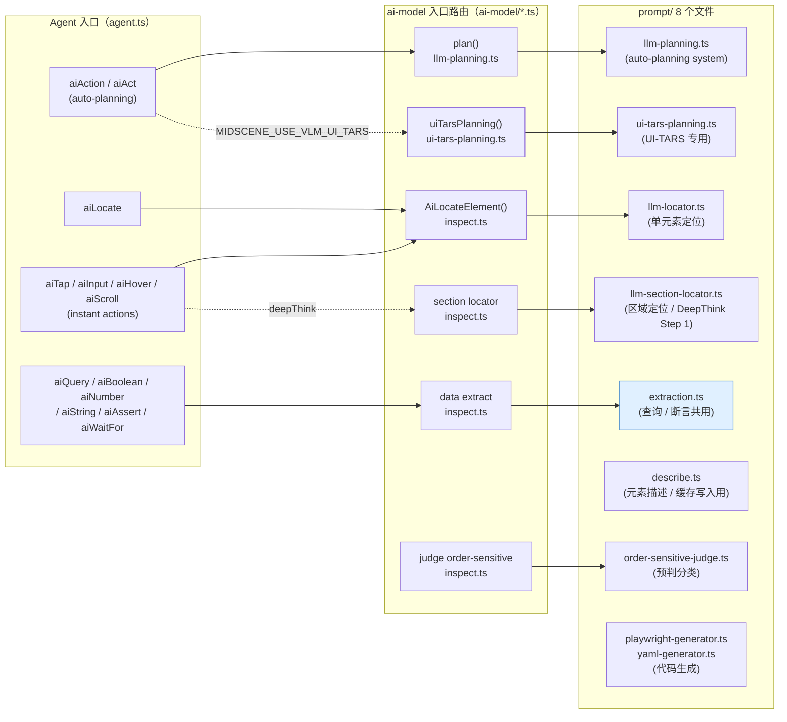

# 02 · Prompt Design：Midscene 的"灵魂指令集"

> 分析基准：HEAD = `9df35128`。所有源码引用相对仓库根。

---

## 0. TL;DR

1. Midscene 的 prompt 模板**不是一个文件**，而是按"场景"拆成 **8 个文件**（`packages/core/src/ai-model/prompt/`），分别管：任务规划、UI-TARS 专用规划、元素定位、区域定位、数据提取、元素描述、顺序敏感判定、YAML/Playwright 代码生成。
2. **三大 API 在底层不是平起平坐的兄弟**——`aiTap`/`aiInput` 走 `llm-locator` prompt；`aiAction` 走 `llm-planning` prompt；`aiAssert`/`aiQuery`/`aiBoolean`/`aiNumber`/`aiString`/`aiWaitFor` **6 个 API 共用 `systemPromptToExtract`**，区别只在 `dataDemand` 包装方式（见 `packages/core/src/agent/tasks.ts:560–620`）。
3. **输出格式不是 OpenAI Function Calling，而是自定义 XML tags**——`<thought>`/`<action-type>`/`<action-param-json>`/`<complete success="...">`/`<update-plan-content>`/`<mark-sub-goal-done>`/`<memory>`/`<log>`/`<error>`/`<data-json>`/`<errors>`。解析器 `extractXMLTag`（`prompt/util.ts:15`）用了**反向查找最后一对标签**的策略，专门对付带 `<think>...</think>` 前缀的 CoT 模型。
4. **多模态拼装是"system + (image + text) + 历史"的三段式**——image 永远在 `content` 数组里，type 为 `image_url`，base64 携带 `data:image/jpeg;base64,` 前缀（详见 `inspect.ts:207–225`）。
5. **模型家族会改变 prompt 形状**——`qwen2.5-vl` 模式会先 `paddingToMatchBlockByBase64` 把图填到 28 倍数；UI-TARS 模式则完全弃用 XML，改成 Python-like 的 `Action: click(start_box='[...]')` 语法（`prompt/ui-tars-planning.ts`）。
6. **`getPreferredLanguage()`** 是这整套 prompt 的"语言总开关"——根据时区或 `MIDSCENE_PREFERRED_LANGUAGE` 决定 thought/error 用中文还是英文（`packages/shared/src/env/utils.ts:16`）。

---

## 1. 它解决了什么问题

UI 自动化的 prompt 设计有三个反常识难点，所有"你以为 LLM 应该自动学会"的事都需要 prompt 显式约束：

| 难点 | 没有 prompt 约束的后果 | Midscene 的解法 |
|---|---|---|
| **模型容易"超额执行"** | 你说"填表"，它给你顺手"提交了" | `llm-planning.ts:273` 那一长段 `explicitInstructionRule`：CRITICAL — Following Explicit Instructions |
| **模型容易"自信地点错"** | 看到红框就敢标 bbox，哪怕图里根本不是那个东西 | "no element"分支强制返回 `bbox: []` + `errors[]`（`llm-locator.ts:42`） |
| **模型输出不可机器解析** | Markdown 列表、自然语言混杂、JSON 嵌错引号 | XML tag + 反向解析容错（`util.ts:15`），并 export 多个 `parseXxxResponse` 函数 |

外加一个"模型本身没法解决"的问题：**同一个 UI，5 个不同 VLM 给的坐标格式都不一样**。`qwen2.5-vl` 给绝对像素、`qwen3-vl`/`glm-v` 给千分位、`gemini` 给 `[ymin,xmin,ymax,xmax]` 归一化到 0–1000、`ui-tars` 给的格式又不同——这就是为什么 `bboxDescription(modelFamily)`（`prompt/common.ts:2`）会动态修改 prompt 里那一行注释。

---

## 2. 它在整体架构中的位置



记住 4 件事：

1. **`Query` 那一大坨 API（含 `aiAssert`）汇聚到 P5（`extraction.ts`）一个 prompt**——这是 Midscene 最被忽视的精简设计。
2. **`describe.ts` 不在主调用栈上**——它是 Cache 写入时用的：定位完一次后，让模型再描述一遍这个元素，写成 `cacheFeature` 落盘（06 号 MD 会展开）。
3. **`order-sensitive-judge.ts` 是个独立的预判 LLM**——为了决定"第三个按钮"这种描述要不要走"全图扫描"还是可以"基于历史定位"。它一次只判一个 bool。
4. **代码生成 prompt（P8）是个独立用途**——把"AI 实际跑过的步骤"反推成可重放的 Playwright/YAML 脚本。不影响动作执行。

---

## 3. 源码导览

### 3.1 `prompt/` 目录全文件清单

| 文件 | 关键导出 | 触发场景 | 调用方 |
|---|---|---|---|
| `prompt/common.ts:2` | `bboxDescription(modelFamily)` | bbox 格式注释，所有 locate prompt 共享 | 4 处引用 |
| `prompt/llm-planning.ts:198` | `systemPromptToTaskPlanning()` | `agent.aiAction(...)` 自动规划 | `llm-planning.ts:132` |
| `prompt/ui-tars-planning.ts:3` | `getUiTarsPlanningPrompt()` | UI-TARS 模型走专用规划 | `ui-tars-planning.ts:46` |
| `prompt/llm-locator.ts:4` | `systemPromptToLocateElement()` + `findElementPrompt()` | `aiTap` / `aiLocate` / instant actions 的元素定位 | `inspect.ts:175` |
| `prompt/llm-section-locator.ts:5` | `systemPromptToLocateSection()` + `sectionLocatorInstruction()` | Deep Think 的"第一步圈区域" | `inspect.ts:413` |
| `prompt/extraction.ts:49` | `systemPromptToExtract()` + `extractDataQueryPrompt()` + `parseXMLExtractionResponse()` | aiQuery / aiAssert / aiBoolean / aiNumber / aiString / aiWaitFor | `inspect.ts:556` |
| `prompt/describe.ts:25` | `elementDescriberInstruction()` | 给一个已知 bbox 的元素生成"可复用的描述"（Cache 写入侧） | inspect.ts 待确认精确行 |
| `prompt/order-sensitive-judge.ts` | `systemPromptToJudgeOrderSensitive()` + `orderSensitiveJudgePrompt(description)` | 判断"第三个 / 最后一个"这种 order-sensitive 描述 | `inspect.ts:634` |
| `prompt/playwright-generator.ts` / `yaml-generator.ts` | 各自 system prompt | 把 dump 反推成可重放代码 | `apps/site` / 用户命令 |
| `prompt/util.ts:15` | `extractXMLTag(xmlString, tagName)` | **所有 XML 输出的解析器** | 5+ 处 |

### 3.2 `inspect.ts` 是"所有 prompt 的派发器"

`packages/core/src/ai-model/inspect.ts` 里能看到非常一致的代码模式（每个 task 一段）：

```ts
// 1. 拿 system prompt
const systemPrompt = systemPromptToXxx(modelFamily);

// 2. 处理图像（可能 padding / crop）
if (modelFamily === 'qwen2.5-vl') {
  imagePayload = await paddingToMatchBlockByBase64(...);
}

// 3. 拼 ChatCompletion 消息
const msgs = [
  { role: 'system', content: systemPrompt },
  { role: 'user', content: [
    { type: 'image_url', image_url: { url: imagePayload, detail: 'high' } },
    { type: 'text', text: instructionPrompt },
  ] },
];

// 4. 发 HTTP 调用 + 解析
const res = await callAIWithObjectResponse(msgs, modelConfig, ...);
// 或 callAIWithStringResponse + parseXMLXxxResponse(rawResponse)
```

**4 步范式贯穿 5 个 task**：locate / section-locate / extract / order-judge / planning。读完 inspect.ts 你就懂 Midscene 怎么调模型了。

### 3.3 单元测试快照是最好的"输出原文"

`packages/core/tests/unit-test/prompt/__snapshots__/` 是宝藏：里面是每种 prompt 用真实参数渲染出来的完整字符串。看 prompt 源码看晕的时候直接读它。

执行 `pnpm exec vitest packages/core --reporter=default --run` 即可重生成。

---

## 4. 核心机制深度解析

### 4.1 A1 — System Prompt 的角色定义与能力边界

每个 prompt 文件开头的几行就是**模型 Persona + 行为边界**的本体。下面摘真实原文（精确到行号）：

**① 单元素定位（`llm-locator.ts:9–28`）**

```text
## Role:
You are an AI assistant that helps identify UI elements.

## Objective:
- Identify elements in screenshots that match the user's description.
- Provide the coordinates of the element that matches the user's description.

## Important Notes for Locating Elements:
- When the user describes an element that contains text (such as buttons,
  input fields, dropdown options, radio buttons, etc.), you should locate
  ONLY the text region of that element, not the entire element boundary.
- For example: If an input field is large (both wide and tall) with a
  placeholder text "Please enter your comment", you should locate only the
  area where the placeholder text appears, not the entire input field.
```

划重点：**"只圈文本区域不圈整个元素"** —— 这是 Midscene 用工程经验灌进去的约束。原因：很多 VL 模型在框"大输入框"时会给出空洞坐标（中心点落在框内空白处），但点击空白处可能命中不到。改成"只圈文本"后，模型自然落在元素的"可点击锚点"上。

**② 区域定位（`llm-section-locator.ts:11–17`）**

```text
## Role:
You are an AI assistant that helps identify UI elements.

## Objective:
- Find a section containing the target element
- If the description mentions reference elements, also locate sections
  containing those references
```

这是 Deep Think 的第一阶段——先圈"大区域"，再 crop 后送回去做"小区域"。

**③ 任务规划（`llm-planning.ts:353`）**

```text
Target: You are an expert to manipulate the UI to accomplish the user's
instruction. User will give you an instruction, some screenshots,
background knowledge and previous logs indicating what have been done.
Your task is to accomplish the instruction by thinking through the path
to complete the task and give the next action to execute.
```

接着是 **多达 90 行的 "禁止/必做" 清单**，最有意思的几条：

- `llm-planning.ts:273` `CRITICAL - Following Explicit Instructions`：用户说什么做什么，不要"顺手"多做。
- `llm-planning.ts:404–412` `Special case - Text hidden by a narrow input field`：**输入完之后不要再用截图去校验输入内容**——因为窄输入框可能横向滚动，模型看到的字串可能被截断/字符乱序。这是真实踩坑写进去的反幻觉规则。
- `llm-planning.ts:420–425`（非 sub-goals 模式）`Page navigation restriction`：**没明确叫你跳页就别跳**——失败就报失败，不要自作主张点链接。

**④ 数据提取（`extraction.ts:53`）**

```text
You are a versatile professional in software UI design and testing.
Your outstanding contributions will impact the user experience of
billions of users.

The user will give you a screenshot, the contents of it (optional),
and some data requirements in <DATA_DEMAND>. You need to understand
the user's requirements and extract the data satisfying the <DATA_DEMAND>.

If a key specifies a JSON data type (such as Number, String, Boolean,
Object, Array), ensure the returned value strictly matches that data type.

When DATA_DEMAND is a JSON object, the keys in your response must exactly
match the keys in DATA_DEMAND. Do not rename, translate, or substitute any key.
```

划重点："**不许改 key 名**"——大模型有把英文 key 翻译成中文的恶习，这条规则直接卡死。

**⑤ UI-TARS 模型专用（`ui-tars-planning.ts:6–32`）**

```text
You are a GUI agent. You are given a task and your action history, with
screenshots. You need to perform the next action to complete the task.

## Output Format
Thought: ...
Action: ...

## Action Space
click(start_box='[x1, y1, x2, y2]')
left_double(start_box='[x1, y1, x2, y2]')
right_single(start_box='[x1, y1, x2, y2]')
drag(start_box='[x1, y1, x2, y2]', end_box='[x3, y3, x4, y4]')
hotkey(key='')
type(content='xxx')
scroll(start_box='[x1, y1, x2, y2]', direction='down or up or right or left')
wait()
finished(content='xxx')
```

这是 **完全不同的 prompt 范式**——UI-TARS 是字节自训的 GUI 模型，**训练时就按"Python 函数调用语法"喂的**，所以 Midscene 在调用它时切换到这套语法，而不是 XML。**这也是为什么必须用 `MIDSCENE_USE_VLM_UI_TARS=1` 显式宣告**——错走 XML 路径 UI-TARS 直接答非所问。

### 4.2 A2 — 多模态上下文如何拼装

源码引用 `inspect.ts:206–225`（locate 路径）和 `llm-planning.ts:160–229`（planning 路径）：

```ts
// locate 路径（单次调用）
const msgs: AIArgs = [
  { role: 'system', content: systemPrompt },
  { role: 'user', content: [
    { type: 'image_url', image_url: { url: imagePayload, detail: 'high' } },
    { type: 'text', text: userInstructionPrompt /* "Find: 登录按钮" */ },
  ] },
];

// planning 路径（多轮）
const msgs = [
  { role: 'system', content: systemPrompt },
  { role: 'user', content: [
    { type: 'text', text: `<high_priority_knowledge>...</high_priority_knowledge>\n<user_instruction>${userInstruction}</user_instruction>` },
  ] },
  ...conversationHistory.toMessages(), // 前几轮的截图 + 模型回复
  { role: 'user', content: [
    { type: 'text', text: `the latest screenshot${memoriesSection}${subGoalsSection}` },
    { type: 'image_url', image_url: { url: imagePayload, detail: 'high' } },
  ] },
];
```

**关键观察**：

1. **图像永远跟在文本前**（locate 路径）或**跟在 feedback 文本后**（planning 路径）——这不是无心之举，OpenAI 文档建议"先文本说明意图，再图像证据"，但 locate 任务因为只有一句 `Find: xxx`，把图放前面更直接。
2. **`detail: 'high'`** 是写死的——这意味着 OpenAI 兼容端点会**不压缩图像**走真实分辨率。对自部署模型这只是个 hint。
3. **`high_priority_knowledge`** 是用户通过 `setAIActContext(prompt)` 注入的"持久背景知识"——比如"这是一个英文网站，按钮上的中文是 placeholder"，会跟着每次 planning 调用一起送（`agent.ts:428–438`）。
4. **conversation history 不是把每张老截图都塞进去**——`ConversationHistory`（`ai-model/conversation-history.ts:8`）会做截图修剪，避免历史无限增长。03 号 MD 会展开。

### 4.3 A3 — 输出格式强制约束：为什么是 XML 而不是 Function Calling？

`llm-planning.ts:488–527` 那个返回格式定义可以看到 Midscene 用的是**自己定义的伪 XML 标签集**：

| 标签 | 含义 | 必出现？ |
|---|---|---|
| `<thought>` | CoT 思考过程 | ✅ REQUIRED — `llm-planning.ts:281` 反复强调 "You MUST always output the <thought> tag" |
| `<action-type>` | 下一步动作名（必须是 actionSpace 里枚举的一个） | Path B 走的话必出 |
| `<action-param-json>` | 动作参数（JSON 字符串） | 配 action-type |
| `<complete success="true|false">` | 任务完成或失败的最终输出 | Path A 走的话必出 |
| `<log>` | 给用户看的"我接下来要做什么"白话简报 | Path B 用 |
| `<error>` | 不可恢复错误 | 仅出错时 |
| `<update-plan-content>` / `<mark-sub-goal-done>` | 子目标维护（仅 `planningModeDeepThink=true`） | 可选 |
| `<memory>` | 跨步骤需要带的信息 | 可选 |
| `<data-json>` / `<errors>` | 用在 extract task | 必出 `<data-json>` |

**为什么不用 OpenAI Function Calling？**

读源码我没找到强制的"必须 XML"的注释，但结合证据能推出三个理由：

1. **跨模型兼容**：Doubao、Qwen、GLM、Gemini、UI-TARS 五家 VL 模型对 `tool_calls` 的实现差异很大；XML 是文本 → 可在任何模型上工作。
2. **CoT 友好**：模型可以在 `<thought>` 里自由展开思考，**`extractXMLTag` 用反向查找**（`util.ts:15` 的 `lowerXmlString.lastIndexOf(closeTag)`）——意味着模型先冒出来的 `<think>...</think>` 内容会被跳过，不需要 prompt 特地禁止。
3. **嵌套 JSON**：`<action-param-json>` 内部是 JSON，外面是 XML，这种"双层结构化"对解析容错有奇效——`safeParseJson` 解析失败时还可以从 thought 里挽救信息。

代码原文（util.ts:15–55）：

```ts
export function extractXMLTag(xmlString: string, tagName: string) {
  const lowerXmlString = xmlString.toLowerCase();
  const lowerTagName = tagName.toLowerCase();
  const closeTag = `</${lowerTagName}>`;
  const openTag = `<${lowerTagName}>`;

  // Find the last closing tag
  const lastCloseIndex = lowerXmlString.lastIndexOf(closeTag);
  if (lastCloseIndex === -1) {
    // Fallback: handle half-open tags like `<action-type>Input` without
    // matching close tag. Extract until the next XML tag boundary.
    const lastOpenIndex = lowerXmlString.lastIndexOf(openTag);
    if (lastOpenIndex === -1) return undefined;
    // ...截到下一个 '<' 为止
  }
  // 从倒数最后一对成对的标签里取内容
}
```

**这个解析器是 Midscene 容错的核心**。读懂这 40 行你就能解释 80% 的"输出格式不一致"案例。

### 4.4 A4 — 三大 API 的 Prompt 变体对比

| | `aiAction('点击购物车里所有未完成的订单')` | `aiTap('登录按钮')` | `aiQuery('订单数量, number')` / `aiAssert('显示登录成功')` |
|---|---|---|---|
| **入口** | `agent.aiAction` | `agent.aiTap` → `callActionInActionSpace` | `agent.aiQuery` / `agent.aiAssert` |
| **派发到的 AI 函数** | `plan()` in `llm-planning.ts:108` | `AiLocateElement()` in `inspect.ts` | `createTypeQueryExecution<T>()` in `tasks.ts:689` → `service.extract()` |
| **使用的 system prompt** | `systemPromptToTaskPlanning(...)` | `systemPromptToLocateElement(modelFamily)` | `systemPromptToExtract()` |
| **是否多轮** | ✅ 会与 ConversationHistory 反复迭代直到 `<complete>` | ❌ 单次调用 | ❌ 单次调用 |
| **是否带 thought** | ✅ 强制 `<thought>` | ❌ JSON 输出 `{bbox, errors?}` | ✅ `<thought>` + `<data-json>` |
| **DOM 上下文支持** | 当前版本不主动塞 DOM（待源码进一步确认是否走过 paragraph injection） | ❌ 纯视觉 | ✅ `opt?.domIncluded` 真实生效（`tasks.ts:619`）—— DOM tree 会作为 `extraPageDescription` 拼进 user message |
| **Token 成本** | 高（多轮 + 大 system prompt） | 中（system 短，user 仅 "Find: xxx"） | 中（system 中等，可选 DOM 加大） |
| **失败回收** | 模型可输出 `<error>`，外层 retry 3 次 | 返回 `bbox: []` + `errors[]` | 抛 `TaskExecutionError`（Assert 路径里转成 Error） |

**关键发现**：`aiAssert` / `aiQuery` / `aiBoolean` / `aiNumber` / `aiString` / `aiWaitFor` **6 个 API 在 prompt 层就是同一个东西**。源码证据（`tasks.ts:597–615`）：

```ts
const ifTypeRestricted = type !== 'Query';
let demandInput = demand;
let keyOfResult = 'result';
if (ifTypeRestricted && (type === 'Assert' || type === 'WaitFor')) {
  keyOfResult = 'StatementIsTruthy';
  const booleanPrompt =
    type === 'Assert'
      ? `Boolean, whether the following statement is true: ${demand}`
      : `Boolean, the user wants to do some 'wait for' operation, please check whether the following statement is true: ${demand}`;
  demandInput = { [keyOfResult]: booleanPrompt };
} else if (ifTypeRestricted) {
  keyOfResult = type;   // 'Boolean' | 'Number' | 'String'
  demandInput = { [keyOfResult]: `${type}, ${demand}` };
}
```

也就是说当你写：

```ts
await agent.aiAssert('显示登录成功');
```

它实际发给模型的 `DATA_DEMAND` 是：

```json
{ "StatementIsTruthy": "Boolean, whether the following statement is true: 显示登录成功" }
```

`extraction.ts` 的 prompt 第 119 行就给了这样的 Example 4，**专门预热模型对 `StatementIsTruthy` 这个 key 的认识**——这是 Midscene 把"少 system + 多 example"的设计哲学贯彻到底的体现。

### 4.5 模型家族的 prompt 分支

| modelFamily | 关键 prompt 分支 | 图像处理 | 行号 |
|---|---|---|---|
| 未指定 / 普通 LLM | `systemPromptToLocateElement(undefined)` 返回 `{ prompt: string }` 不带 bbox 字段 | 原图 | `llm-locator.ts:16` |
| `qwen2.5-vl` | `paddingToMatchBlockByBase64` 把图填到 28 倍数 + bbox 用绝对像素 | padding | `llm-planning.ts:152`、`inspect.ts:199` |
| `qwen3-vl` / `glm-v` / `auto-glm` | bbox 用 1000-normalized | 原图 | `bboxDescription` 默认分支 |
| `gemini` | bbox 是 `[ymin,xmin,ymax,xmax]` 归一化到 0–1000 | 原图 | `prompt/common.ts:3` |
| `ui-tars` | 完全切到 `ui-tars-planning.ts`：Python-like 语法 + Action Space | 原图 | `prompt/ui-tars-planning.ts:6` |
| auto-glm | 切到 `getAutoGLMLocatePrompt(modelFamily)`，并把 user 消息加 `Tap:` 前缀 | 原图 | `inspect.ts:175`、`inspect.ts:223` |

这就是为什么 `MIDSCENE_MODEL_FAMILY` 在 01 号 MD 里被列为"自动推断失败时必须手填"——**prompt 文本和图像处理同时跟它绑定**。

---

## 5. 设计取舍与工程权衡

### 5.1 XML vs Function Calling vs JSON Mode

| 维度 | XML（Midscene 现状） | OpenAI Function Calling | JSON Mode |
|---|---|---|---|
| 跨模型兼容 | ✅ 任何模型都行 | ❌ Doubao/Qwen/GLM 实现各异 | 🔶 多数支持 |
| CoT 友好（容许 `<think>` 前缀） | ✅ 反向 lastIndexOf 容错 | ❌ tool_calls 严格 | 🔶 可能被解析卡住 |
| 模型自由度 | 较高（允许 thought 自然语言） | 低（必须严格匹配 schema） | 中 |
| 一次调用拿多种输出 | ✅ thought + action + complete + memory 同框 | ❌ 一次一个 tool | ❌ 一个 JSON |
| 流式渲染（前端报告） | ✅ tag 边收边解（理论上） | ❌ tool_calls 流不友好 | 🔶 |

**Midscene 选 XML 是个"跨厂家适配"的工程选择**，不是"理论最优"。如果只服务 OpenAI 一家，Function Calling 显然更强。

### 5.2 为什么 `includeBbox` 是参数化的？

`systemPromptToTaskPlanning` 接受 `includeBbox: boolean`（`llm-planning.ts:201`）。**它的意义不是"是否启用视觉"，而是"是否在 planning 阶段就让模型给 bbox"**。

- `includeBbox=false`（aiAction 默认）：planning 阶段模型只回 `{ "locate": { "prompt": "登录按钮" } }`，bbox 由**后续 locate 阶段**单独调用 `llm-locator` 获取——**两段式定位**。
- `includeBbox=true`（部分模式）：planning 阶段就给完整 bbox，**单段式**直接执行。

权衡：

- **单段式**：少调一次 LLM，快、便宜；但 planning + locate 同步做，对模型能力要求高。
- **两段式**：稳定，每段责任清晰，单独调试方便；代价是双倍 LLM 调用。

`aiTap` 这种 instant action 走的是更激进的优化：**planning 阶段被跳过**（type 已知），只需要 locate 一次。

### 5.3 `order-sensitive-judge.ts` 为什么单独一个 LLM call？

这是个看着"奢侈"的设计：为了判断"第三个按钮"是不是 order-sensitive，**居然要调一次模型**。

原因：`isOrderSensitive=true` 时，**Cache 必须失效重新做视觉定位**（因为页面布局可能变，第三个还是不是同一个？）。`false` 时，Cache 可以放心命中。所以这一次预判 LLM 是为了 06 号 MD 里"缓存正确性"服务的。

替代方案？

- 用正则匹配"第一/第二/last/3rd" → 漏掉同义词（"middle one"、"那个最大的"），且无法跨语言。
- 用本地小模型？没必要——这一调用走 `MIDSCENE_MODEL_NAME` 同一个端点，复用了 keep-alive 连接，开销在 100ms 量级。

### 5.4 `getPreferredLanguage()` 的设计思路

`packages/shared/src/env/utils.ts:16`：

```ts
export const getPreferredLanguage = () => {
  const prefer = globalConfigManager.getEnvConfigValue(MIDSCENE_PREFERRED_LANGUAGE);
  if (prefer) return prefer;
  const timeZone = Intl.DateTimeFormat().resolvedOptions().timeZone;
  const isChina = timeZone === 'Asia/Shanghai';
  return isChina ? 'Chinese' : 'English';
};
```

**优先级**：显式 env `MIDSCENE_PREFERRED_LANGUAGE` > 时区是否 `Asia/Shanghai` > 英文。

这影响的不只是报告语言——还会**改 prompt 文本**：`describe.ts` 的 examples、`llm-locator.ts` 的错误信息、`llm-planning.ts` 的 `<log>` 部分都按这个值切换。所以**在新加坡时区、用英文模型、却忘记设此 env，会得到一份英文 prompt + 英文 `<log>`——但报告里你的同事看不懂**。

---

## 6. 与其他模块的协作

- **上游**：`Agent` 把用户调用翻译成 `(taskType, locatePrompt, image, modelConfig)` 元组送进 `ai-model/*.ts`
- **下游**：`prompt/*.ts` 产出 `systemPrompt: string`，配合 `service-caller/index.ts` 的 `callAIWithStringResponse` / `callAIWithObjectResponse` 发 OpenAI 兼容 HTTP
- **侧路**：
  - **Cache（06）** 读 `order-sensitive-judge` 的结果决定是否走视觉
  - **Vision Pipeline（05）** 给 `qwen2.5-vl` 模式提供 `paddingToMatchBlockByBase64`
  - **Determinism（07）** 的回溯机制读 `<thought>` 内容做失败原因诊断

---

## 7. 常见陷阱

1. **想给 prompt 加自定义规则？别去改 system prompt——用 `agent.setAIActContext('...')`**。它会被包进 `<high_priority_knowledge>` 标签发给模型，不影响其他用户。
2. **`aiQuery` 返回 key 被翻译**：你写 `aiQuery({ name: '...', age: '...' })`，模型可能返回 `{ 姓名: ..., 年龄: ... }`——这是模型违反 `extraction.ts:59` "Do not rename, translate, or substitute any key"。解决：**用英文 key + 中文描述**，比如 `{ "name": "姓名，string" }`。
3. **`aiAssert('页面 loaded 完成')` 经常误报失败**：`llm-planning.ts:416` 那条规则只对 planning 生效，extract 路径不会自动等加载。改用 `aiWaitFor` 或先 `await page.waitForNetworkIdle()`。
4. **UI-TARS 配 XML 模式**：忘记设 `MIDSCENE_USE_VLM_UI_TARS=1` 会让 UI-TARS 收到 XML system prompt——它会返回乱七八糟的混合输出。错误信号：`AIResponseParseError: Missing required field`。
5. **`<thought>` 模型不输出**：旧版本 GPT-3.5 这种 prompt-following 弱的模型会偷懒省掉 `<thought>`。看到 `parseXMLPlanningResponse` 拿不到 thought 但有 action，可以接受——Midscene 没把它做成 hard fail。
6. **Deep Think 失效**：模型不支持视觉接地时（gpt-5/gpt-4o 之类），`section-locator` 返回的 bbox 不准——但代码不会报错，只是默默回退到全图定位。`agent.ts` 里那条 `hasWarnedNonVLModel` 警告是唯一信号。

---

## 8. 🛠️ 实操

### 8.1 不跑浏览器，直接 dump 一个 prompt 看看

把以下文件保存为 `dump-prompt.mjs`，放在仓库根：

```js
// dump-prompt.mjs — 把渲染后的 system prompt 完整打印出来
import 'dotenv/config';
import { systemPromptToTaskPlanning } from '@midscene/core/dist/es/ai-model/prompt/llm-planning.mjs';
import { systemPromptToLocateElement } from '@midscene/core/dist/es/ai-model/prompt/llm-locator.mjs';
import { systemPromptToExtract } from '@midscene/core/dist/es/ai-model/prompt/extraction.mjs';

// 模拟一个 actionSpace（实际由 device.actionSpace() 提供，这里手搓最小集合）
const actionSpace = [
  { name: 'Tap', description: 'Tap on an element', paramSchema: undefined, sample: undefined },
  { name: 'Input', description: 'Type text', paramSchema: undefined, sample: undefined },
];

console.log('=== TASK PLANNING (qwen3-vl, includeBbox=true) ===\n');
console.log(await systemPromptToTaskPlanning({
  actionSpace,
  modelFamily: 'qwen3-vl',
  includeBbox: true,
  includeThought: true,
  includeSubGoals: false,
}));

console.log('\n=== LOCATE ELEMENT (qwen3-vl) ===\n');
console.log(systemPromptToLocateElement('qwen3-vl'));

console.log('\n=== EXTRACT ===\n');
console.log(systemPromptToExtract());
```

> ⚠️ 上面 `import` 路径里的 `dist/es/.../*.mjs` 我**没逐字段在 `core/package.json` 的 `exports` 中验证过**——如果直接 import 报错，最稳的做法是改成相对导入仓库源码：`import { systemPromptToTaskPlanning } from './packages/core/src/ai-model/prompt/llm-planning.ts'` + 用 `pnpm tsx dump-prompt.mjs` 跑。

运行：

```bash
pnpm tsx dump-prompt.mjs > prompts.txt
less prompts.txt
```

你能看到：每段 system prompt 大约 800–4000 tokens，**真实的 actionSpace** 会让 planning prompt 变得相当长——这是 token 成本的主要来源。

### 8.2 用真实 Agent 看 `<thought>`

接在 01 号 MD 的 Hello World 之上：

```js
// 在 PuppeteerAgent 创建之后加一行
agent.onDumpUpdate = (dumpStr, dump) => {
  // 这里每一步都会触发；想看 thought 的话从 dump.executions[...].tasks[...].thought 拿
  for (const exec of dump.executions ?? []) {
    for (const task of exec.tasks ?? []) {
      if (task.thought) console.log('💭', task.thought);
    }
  }
};
```

跑一次 `agent.aiAction('在搜索框输入 "midscene"')` 你会看到模型每一轮思考的完整 CoT。这对调试"为什么它点错了"特别有用。

### 8.3 推荐的断点位置

| 文件:行 | 看什么 |
|---|---|
| `prompt/llm-planning.ts:198 systemPromptToTaskPlanning` | 入参 `actionSpace`、`modelFamily`、`includeSubGoals` —— 这是 planning prompt 的最终决定参数 |
| `ai-model/llm-planning.ts:160` 拼装 instruction 那行 | `userInstruction` 是不是被正确传入；`high_priority_knowledge` 拼了什么 |
| `ai-model/inspect.ts:175` | `modelFamily` 走了哪个 system prompt 分支 |
| `ai-model/inspect.ts:597` `ifTypeRestricted` 分支 | `demandInput` 最终长什么样——验证 aiAssert 真的被改写成 `{ StatementIsTruthy: ... }` |
| `prompt/util.ts:25` `lastCloseIndex` | 模型回的 raw 字符串、最后一对标签的位置——验证 CoT 前缀容错 |

### 8.4 引导式实验任务

1. **改一个 system prompt 看效果**：把 `llm-locator.ts:18` 那段 "ONLY the text region" 改成 "the WHOLE element boundary"，重跑 Hello World，看 bbox 中心坐标是否落在按钮空白区域。
2. **手动注入 `aiActContext`**：在 PuppeteerAgent 创建后 `agent.setAIActContext('这个页面所有按钮都是红色的')`，再跑 `aiAction('点击红色提交按钮')`，观察 prompt 里多了 `<high_priority_knowledge>` 段。
3. **强制 Deep Think 失败回退**：把 `.env` 里 `MIDSCENE_MODEL_NAME` 改成 `gpt-4o`（一个不支持 grounding 的模型），跑 `agent.aiTap('xxx', { deepThink: true })`——观察是否触发 `hasWarnedNonVLModel` 告警。
4. **`order-sensitive-judge` 隔离测试**：找一个 cache 命中场景，把 prompt 从 `'登录按钮'` 改成 `'第三个登录按钮'`，看下次还能不能命中（应当不能——因为 order-sensitive 判定会让 cache 失效）。

---

## 9. 自检问题

1. **`aiAssert` 和 `aiQuery` 用的是同一个 system prompt 吗？区别在哪一层？** 提示：看 `tasks.ts:597–615`。
2. **当 `MIDSCENE_USE_VLM_UI_TARS=1` 时，整个 prompt 体系发生什么变化？** 至少说出"输出格式"和"动作语法"两点。
3. **为什么 Midscene 用 XML 而不是 OpenAI Function Calling？给至少 2 个工程理由。**
4. **`extractXMLTag` 用 `lastIndexOf` 而非 `indexOf`，目的是什么？举一个会让 `indexOf` 出错的真实场景。**
5. **`getPreferredLanguage()` 的值会影响 prompt 吗？哪些字段会变？为什么时区是默认依据？**

---

## 10. 延伸阅读

- 单测快照：`packages/core/tests/unit-test/prompt/__snapshots__/` —— 完整渲染后的 prompt
- 单测源：`packages/core/tests/unit-test/prompt/prompt.test.ts` —— 看官方怎么用单测约束 prompt 稳定性（任何 prompt 改动都得过快照）
- 官方博客：`apps/site/docs/en/blog-introducing-instant-actions-and-deep-think.md` —— Deep Think / Instant Actions 的设计动机
- OpenAI 官方多模态消息格式：https://platform.openai.com/docs/guides/vision —— 解释 `type: 'image_url'` 和 `detail: 'high'`
- 关联 commit：
  - `packages/core/src/ai-model/auto-glm/`（一整个子目录）—— 看一个新模型族如何被加进来：单独的 prompt + 单独的 parser + 单独的 util。这是新增模型支持的最佳参考。

---

## 置信度自评

- **高置信（逐行从源码读出来）**
  - 8 个 prompt 文件的关键导出与触发场景（每一行号都对过）
  - 6 个 query 类 API 共用 `systemPromptToExtract` + `tasks.ts:597–615` 的 `ifTypeRestricted` 改写逻辑
  - `extractXMLTag` 反向解析容错策略（`util.ts:15–55` 完整读完）
  - 多模态消息拼装顺序（locate 路径图前文后、planning 路径多轮迭代）
  - `bboxDescription`、`paddingToMatchBlockByBase64`、`getPreferredLanguage` 三处分支决策点
- **中置信（核心证据有，但分支没全验证）**
  - `describe.ts` 主要用在 Cache 写入侧——我看了 `inspect.ts` 的 import 但没全找它的调用点（06 号 MD 写 Cache 时会精确补上）
  - "为什么不用 Function Calling" 我没找到官方 commit message 说明，是从代码迹象推断的
  - `playwright-generator.ts` / `yaml-generator.ts` 的具体 prompt 我没读，只确认了它们的存在；后续 09 号 MD 涉及代码生成时会展开
- **低置信 / 待你帮我对齐**
  - 实操 8.1 里 `@midscene/core/dist/es/ai-model/prompt/llm-planning.mjs` 这条 sub-path 我没在 `core/package.json` 的 `exports` 里看到（核心包只暴露 `.`/`utils`/`ai-model`/`tree`/`device`/`agent`/`yaml`/`report`）—— 实际跑会失败，需要改成相对源码路径或先 build 后 `import './dist/lib/...'`。等你试出来再回来订正脚本。
  - "ConversationHistory 会修剪老截图"是我看 `llm-planning.ts:160` 附近的 history 拼装猜的——具体修剪策略我没读完 `conversation-history.ts`，03 号 MD 会精确补。

写完。等你说"下一个"，我开始 `03_ActionExecutor.md`。
