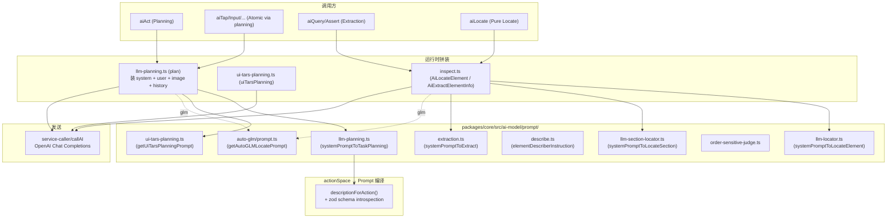
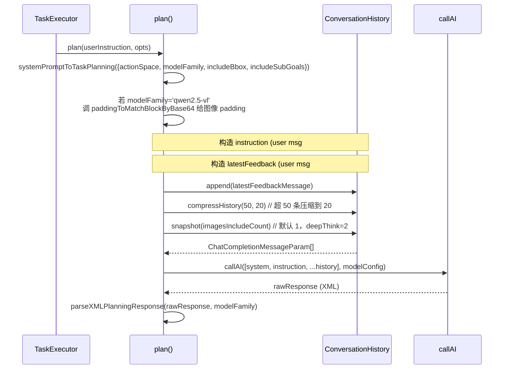

# 03 · Prompt 模板设计专题（Prompt Design）

> 分析基于 commit `702d5375`（main，v1.8.1）
>
> 这是核心要点 **A1 / A2 / A3 / A4** 的主战场。读完本篇你应该能在任何源码位置回答"这一刻模型看到的 Prompt 是什么形状"。

---

## 0. TL;DR

- **Midscene 的 Prompt 不用 OpenAI Function Calling，也不强制 JSON**——它用**XML 标签**（`<thought>` / `<action-type>` / `<action-param-json>` / `<complete>` / `<error>` / `<log>`）作为输出协议。原因见 5.1。
- **System Prompt 不是静态模板**。`systemPromptToTaskPlanning(...)`（`prompt/llm-planning.ts:198`）是一个**编译器**——根据 `actionSpace` / `modelFamily` / `includeBbox` / `includeSubGoals` 在运行时生成。同一份调用代码会因为模型不同 / 端不同 / 配置不同**生成完全不同的 Prompt**。
- **`DeviceAction` 元数据自我描述**：02 篇看到的 `defineActionTap({ name, description, paramSchema, sample, interfaceAlias })`，会被 `descriptionForAction()` 序列化成 Prompt 里的一段动作说明（含 zod schema 的字段类型 + `.describe()` 文本 + sample with `<action-type>` tags）。**改一行端的输入原语，Prompt 里 AI 看到的菜单就跟着变**。
- **三条 Planner 路径有三套完全独立的 Prompt + 输出协议**：
  - 通用 VLM → XML（`prompt/llm-planning.ts`）
  - UI-TARS → 伪 Python（`Action: click(start_box='...')`，`prompt/ui-tars-planning.ts`）
  - AutoGLM → `<think>` + `<answer>do(action="Tap", element=[x,y])</answer>`（`auto-glm/prompt.ts`）
- **`aiQuery` / `aiAssert` 走另一套 Prompt**（`prompt/extraction.ts`）：仍然 XML，但只用 `<thought>` + `<data-json>` + `<errors>` 三个标签——**和 planning Prompt 完全不共享**。
- **`aiLocate` 走第三套**（`prompt/llm-locator.ts`）：纯 JSON 输出 `{bbox, errors}`，不是 XML——因为定位的输出形状是稳定的。

---

## 1. 它解决了什么问题 / 为什么 Prompt 是工程核心

在 VLM 时代，Prompt 不再是"调味品"，而是**正式的接口契约**。Midscene 必须同时回答四个工程问题：

1. **"AI 该扮演什么角色、不能做什么"**（A1：persona + 安全边界）
2. **"截图 + 文字 + 历史动作怎么组装成一次请求"**（A2：多模态拼装）
3. **"怎么保证模型只输出可执行的动作，而不是随机文字"**（A3：输出格式强制）
4. **"做不同的事（动作 / 提取 / 断言 / 定位）用同一套 Prompt 行不行"**（A4：API 变体）

这四个问题决定了**整个系统的鲁棒性、成本、可调试性**。如果 Prompt 写错，再强的模型也产不出 Midscene 想要的结构化结果；如果 Prompt 写对，弱一档的模型也能工作。

---

## 2. 它在整体架构中的位置



> 一句话：**所有 Prompt 都从 `prompt/` 这 9 个文件出发**，被 `llm-planning.ts` / `ui-tars-planning.ts` / `inspect.ts` 三个"组装器"拼装，最终走 `service-caller/callAI` 发出。

---

## 3. 源码导览

### 3.1 Prompt 文件清单（9 个）

| 文件 | 行数 | 关键导出 | 服务于 |
|---|---|---|---|
| `prompt/llm-planning.ts` | 746 | `systemPromptToTaskPlanning`、`descriptionForAction` | `aiAct` / 所有原子动作的 planning 调用 |
| `prompt/llm-locator.ts` | 53 | `systemPromptToLocateElement`、`findElementPrompt` | `aiLocate` / `AiLocateElement` |
| `prompt/llm-section-locator.ts` | 47 | `systemPromptToLocateSection` | 区域裁切（deep think 时） |
| `prompt/extraction.ts` | 157 | `systemPromptToExtract`、`extractDataQueryPrompt`、`parseXMLExtractionResponse` | `aiQuery` / `aiAssert` / `aiBoolean` / ... |
| `prompt/describe.ts` | 67 | `elementDescriberInstruction` | `describeElementAtPoint` |
| `prompt/ui-tars-planning.ts` | 39 | `getUiTarsPlanningPrompt`、`getSummary` | UI-TARS 专用 |
| `prompt/order-sensitive-judge.ts` | 35 | `systemPromptToJudgeOrderSensitive` | 列表顺序敏感性判断 |
| `prompt/common.ts` | 7 | `bboxDescription(modelFamily)` | bbox 格式描述（Gemini 特殊） |
| `prompt/util.ts` | 111 | `extractXMLTag`、`parseSubGoalsFromXML`、`parseMarkFinishedIndexes` | **XML 解析器（核心！）** |
| `auto-glm/prompt.ts` | 278 | `getAutoGLMLocatePrompt`、Plan/Multilingual prompts | AutoGLM 专用 |

### 3.2 Prompt "组装器" 入口

| 文件 | 关键函数 | 说明 |
|---|---|---|
| `ai-model/llm-planning.ts:107` | `plan(userInstruction, opts)` | **planning 主入口**——通用 VLM |
| `ai-model/ui-tars-planning.ts:46` | `uiTarsPlanning(...)` | UI-TARS 主入口 |
| `ai-model/auto-glm/planning.ts` | `autoGLMPlanning(...)` | AutoGLM 主入口 |
| `ai-model/inspect.ts:140` 起 | `AiLocateElement`、`AiExtractElementInfo`、`AiLocateSection`、`AiJudgeOrderSensitive` | locate / extract / section / judge 四个独立入口 |

---

## 4. 核心机制深度解析

### 4.1 A1：System Prompt 的角色定义与能力边界

#### 4.1.1 通用 VLM Planning Prompt 的"开场白"

**源码原文摘录**（`prompt/llm-planning.ts:353`）：

```
Target: You are an expert to manipulate the UI to accomplish the user's instruction.
User will give you an instruction, some screenshots, background knowledge and previous
logs indicating what have been done. Your task is to accomplish the instruction by
thinking through the path to complete the task and give the next action to execute.
```

注意三点：
- **职责定位**："expert to manipulate the UI"——明确是 UI 操作者，不是聊天助手
- **输入约定**：截图 + 指令 + 背景知识（来自 `aiActContext`）+ 历史日志
- **输出范式**："next action to execute"——一次只一步

#### 4.1.2 能力边界：硬性禁令清单（这是 Prompt 工程的精华）

`prompt/llm-planning.ts:378` 起有一段标 `### CRITICAL: The User's Instruction is the Supreme Authority` 的硬约束。**这是整个项目里最值得一字不漏读的 Prompt 片段**：

> **Explicit instructions vs. High-level goals:**
> - If the user gives you **explicit operation steps** (e.g., "click X", "type Y"), treat them as exact commands. Execute ONLY those steps, nothing more.
> - If the user gives you a **high-level goal** (e.g., "log in"), you may determine the necessary steps to achieve it.
>
> **Examples:**
> - "fill out the form" → Instruction fulfilled when all fields are filled. **Do NOT submit the form.**
> - "click the login button" → Instruction fulfilled once clicked. **Do NOT wait for page load or verify login success.**
> - "type 'hello'" → Instruction fulfilled when 'hello' is typed. **Do NOT press Enter or trigger search.**

为什么要写得这么死？——因为 VLM 有**"过度帮助"**倾向（helpful overshoot）：你让它点登录按钮，它点完发现"哎登录失败了我应该 retry"，于是无限循环。**Prompt 直接钉死边界**是工程上唯一可行的解。

#### 4.1.3 特殊场景的硬规则

文件里还塞了几条"看起来不像 Prompt 像编程文档"的规则：

- **Scrollable lists/dropdowns**（line 396-402）：下拉框选项不可见时**必须用 50–120 像素小步滚动**，不能用默认距离；不能跳出下拉去操作页面其他元素
- **Narrow input field text verification**（line 404-412）：**输入后看见的文字和目标文字不一致时，必须假设是裁剪/字符宽度问题，不能去 "fix"**。这条规则带着 `CRITICAL PRIORITY OVERRIDE` 字样——明显是踩坑得来的
- **Page navigation restriction**（line 420-425，仅 `!shouldIncludeSubGoals` 时启用）：**没有显式让你跳页就不要跳页**

这些规则的存在本身就是设计取舍的产物——团队选择了"用 Prompt 约束"而不是"用代码 guardrail"。

#### 4.1.4 各 Prompt 文件的 Persona 摘要

| Prompt | Persona 原文 | 风格 |
|---|---|---|
| **llm-planning** | `You are an expert to manipulate the UI...` | 工程师风 |
| **llm-locator** | `You are an AI assistant that helps identify UI elements.` | 简洁工具风 |
| **llm-section-locator** | `You are an AI assistant that helps identify UI elements.` | 同上 |
| **extraction** | `You are a versatile professional in software UI design and testing. Your outstanding contributions will impact the user experience of billions of users.` | "膨胀式"激励语气 |
| **describe** | （无明显 persona，直接给任务）`Describe the element in the red rectangle for precise identification.` | 命令式 |
| **ui-tars** | `You are a GUI agent. You are given a task and your action history, with screenshots.` | Agent 化风格 |
| **auto-glm** | `You are a professional Android operation agent assistant...` | Agent 化 + Android 专属 |
| **order-sensitive-judge** | （独立判断任务，无 persona）|

注意**extraction 的"膨胀式"自我激励**（`Your outstanding contributions will impact the user experience of billions of users.`）——这是社区流传的"恭维 prompt 提质"trick。是否真的有效仁者见仁，但**他们这么写了**，可见在内部 A/B 中可能确实有微弱提升。

### 4.2 A2：多模态上下文的拼装

读 `ai-model/llm-planning.ts:107` 起的 `plan()` 函数（这是 `aiAct` 内部最终调到的函数），消息构造长这样：



**几个关键点的源码对应**：

| 现象 | 源码位置 | 说明 |
|---|---|---|
| `actionContext` 被包成 `<high_priority_knowledge>...</high_priority_knowledge>` | `llm-planning.ts:154-156` | 这是 `agent.aiActContext` 的最终去处 |
| `userInstruction` 包成 `<user_instruction>...</user_instruction>` | `llm-planning.ts:164` | 让模型容易区分系统约束 vs 任务 |
| 图片用 `detail: 'high'` 而非 `'auto'` | `llm-planning.ts:196` | **强制高清模式**——成本更高但精度更高 |
| 历史里包含多少张截图 | `imagesIncludeCount`（`agent.ts:955` 设置） | 默认 `1`，`deepThink: true` 时 `2` |
| 历史压缩阈值 | `llm-planning.ts:224`：`compressHistory(50, 20)` | 超 50 条压缩到保留最近 20 条 |
| `qwen2.5-vl` 模型的图像 padding | `llm-planning.ts:147-152` | 仅这个家族需要 block 对齐（08 篇详解） |

#### 4.2.1 `multimodalPrompt`：用户附加图像

`extraction.ts:589-595` 揭示了用户可以**手动塞参考图**给 `aiQuery`：

```ts
if (multimodalPrompt) {
  const addOns = await promptsToChatParam({
    images: multimodalPrompt.images,
    convertHttpImage2Base64: multimodalPrompt.convertHttpImage2Base64,
  });
  msgs.push(...addOns);
}
```

外加图会被一个引子消息预告（`inspect.ts:103`）：

```ts
{
  role: 'user',
  content: [{ type: 'text', text: 'Next, I will provide all the reference images.' }],
}
```

然后每张参考图作为独立 user message 追加。**用法**：`aiQuery('对比下面参考图中的 logo 和当前页面 logo 是否一致', { images: [{url: 'file://logo.png'}] })`。

### 4.3 A3：输出格式强制约束——XML 而非 Function Calling

#### 4.3.1 通用 VLM Planner 的 6 个 XML 标签

源码 `prompt/llm-planning.ts:488` 起的"Return Format"段落规定了完整协议：

| Tag | 何时输出 | 内容 |
|---|---|---|
| `<thought>` | **必须** | 思考过程，自由文本（用 preferredLanguage） |
| `<update-plan-content>` | 仅 deepThink + 首次 | `<sub-goal index="1" status="pending">desc</sub-goal>` 列表 |
| `<mark-sub-goal-done>` | 仅 deepThink + 完成 sub-goal 时 | 标记完成 |
| `<memory>` | 仅 deepThink，按需 | 跨步信息记忆 |
| `<log>` | **如果还有动作**：必须 | 给用户的 1-2 句预告（preamble） |
| `<action-type>` + `<action-param-json>` | **二选一 with `<complete>`** | 下一步动作 |
| `<complete success="true\|false">` | 完成时 | 终止信号 |
| `<error>` | 异常路径 | 错误消息 |

**Path A vs Path B**（line 515-527）：

```
Path A: <thought>...</thought> + <complete success="...">msg</complete>
Path B: <thought>...</thought> + <log>...</log> + <action-type>X</action-type> + <action-param-json>{...}</action-param-json>
```

#### 4.3.2 为什么用 XML 而不用 OpenAI Function Calling？

**他们没有用 `tools` 字段，没有用 `response_format: json_schema`，没有用 `functions`**。整个项目 `grep "response_format"` 在 service-caller 里只对部分 model 强制了 `json_object`（待 04 篇细看）。

可能的工程理由（**部分推测**）：
1. **VLM 模型生态不一致**：UI-TARS / GLM / Qwen-VL / Doubao-vision 的 Function Calling 支持参差不齐，**最大公约数是"自由文本"**
2. **XML 容错性极强**：parser 可以从半开标签、前缀 `<think>` 思考链等各种异常中恢复（看 4.3.3）
3. **嵌入思考链友好**：`<thought>` 是自由文本，`<action-param-json>` 是 JSON——两种形态并存，Function Calling 强制 JSON 反而要把 thought 塞进某个字段
4. **debug 友好**：日志里看一段 XML 比看一段 tool_call JSON 更容易理解

#### 4.3.3 容错 XML 解析器（这段代码值得专门看）

`prompt/util.ts:15-56` 的 `extractXMLTag` 是核心：

```ts
export function extractXMLTag(xmlString: string, tagName: string): string | undefined {
  // 1. 大小写不敏感
  const lowerXmlString = xmlString.toLowerCase();
  const lowerTagName = tagName.toLowerCase();
  const closeTag = `</${lowerTagName}>`;
  const openTag = `<${lowerTagName}>`;

  // 2. 找最后一个 </tag>（不是第一个！）
  const lastCloseIndex = lowerXmlString.lastIndexOf(closeTag);

  if (lastCloseIndex === -1) {
    // 3. fallback：半开标签 <tag>content（无关闭），抽到下一个 < 为止
    const lastOpenIndex = lowerXmlString.lastIndexOf(openTag);
    if (lastOpenIndex === -1) return undefined;
    const contentStart = lastOpenIndex + openTag.length;
    const remaining = xmlString.substring(contentStart);
    const nextTagIndex = remaining.indexOf('<');
    return (nextTagIndex === -1 ? remaining : remaining.substring(0, nextTagIndex)).trim();
  }

  // 4. 从 </tag> 往前找最近的 <tag>
  const searchArea = lowerXmlString.substring(0, lastCloseIndex);
  const lastOpenIndex = searchArea.lastIndexOf(openTag);
  if (lastOpenIndex === -1) return undefined;

  return xmlString.substring(lastOpenIndex + openTag.length, lastCloseIndex).trim();
}
```

**"从末尾向前找"的关键作用**（注释 line 8-13 解释）：
> Strategy: Find the LAST closing tag, then search backwards for the nearest opening tag.
> This ensures we get the last complete tag pair, even if there are incomplete tags before it.

**这解决了什么问题**：
- DeepSeek-R1 / o1 等模型会在正式输出前先写 `<think>...</think>` 推理链——如果用从头匹配，`<thought>` 标签会和模型的 `<think>` 混淆
- 模型输出半截又自己重写（如先写一个 plan 再改主意写另一个），从末尾找能拿到**最终决定**
- 模型偶尔重复输出标签时也能取到最后一份

### 4.4 `actionSpace` → Prompt 动作菜单的编译过程

#### 4.4.1 `descriptionForAction()`：把 `DeviceAction` 转 Prompt

源码 `prompt/llm-planning.ts:92-196`。简化逻辑：

```ts
function descriptionForAction(action, locatorSchemaTypeDescription, includeBbox) {
  // 1. 动作类型
  fields.push(`- type: "${action.name}"`);

  // 2. 遍历 zod schema 的每个字段
  if (action.paramSchema 是 ZodObject) {
    for (const [key, field] of Object.entries(schema.shape)) {
      const isOptional = field.isOptional();
      const typeName = getZodTypeName(field, locatorSchemaTypeDescription);
      const description = getZodDescription(field);  // 来自 .describe(...)
      const defaultValue = findDefaultValue(field);
      // 输出: `key?: TypeName // description, default: X`
    }
  }

  // 3. 把 sample 序列化成 <action-type>...</action-type><action-param-json>{...}</action-param-json>
  //    格式和模型实际要输出的一致
}
```

#### 4.4.2 一个真实例子：`Tap` 在 Prompt 里长什么样

回顾 02 篇看过的 `defineActionTap`：

```ts
{
  name: 'Tap',
  description: 'Tap the element',
  interfaceAlias: 'aiTap',
  paramSchema: z.object({
    locate: getMidsceneLocationSchema().describe('The element to be tapped'),
  }),
  sample: { locate: { prompt: 'the "Submit" button' } },
}
```

被 `descriptionForAction` 渲染后**插入 System Prompt 的"Supporting actions list"**段落（`llm-planning.ts:447`）大致是：

```
- Tap, Tap the element
  - type: "Tap"
  - param:
    - locate: {bbox: [number, number, number, number], prompt: string } // 2d bounding box as [xmin, ymin, xmax, ymax], The element to be tapped
  - sample:
    <action-type>Tap</action-type>
    <action-param-json>
    {
      "locate": {
        "prompt": "the \"Submit\" button",
        "bbox": [50, 100, 200, 200]
      }
    }
    </action-param-json>
```

**关键观察**：
- **`bbox` 字段是否出现取决于 `includeBbox`**——而 `includeBbox` 又取决于 `noIndividualLocateModel`（02 篇看到的 `agent.ts:916-919`）。如果用户配了独立 locate 模型，planning 就不要 bbox，让 locate 模型单独再问一次
- **`bbox` 的描述格式取决于 `modelFamily`**：Gemini 是 `[ymin, xmin, ymax, xmax]` normalized to 0–1000，其他是 `[xmin, ymin, xmax, ymax]` 像素（见 `prompt/common.ts:3`）
- **sample 里的 bbox 是假数据**（`SAMPLE_BBOXES`，`llm-planning.ts:61`）——只是让模型理解输入形状

#### 4.4.3 sample 模式：few-shot 的廉价实现

注意 sample 是**和真实输出协议一字一致**的 XML 片段（`llm-planning.ts:189`）：

```ts
const sampleStr = `- sample:\n${tab}${tab}<action-type>${action.name}</action-type>\n${tab}${tab}<action-param-json>\n${tab}${tab}${JSON.stringify(sampleWithBbox, null, 2)...}\n${tab}${tab}</action-param-json>`;
```

**为什么这样设计**：让 Prompt 里的"示例"和模型要输出的"真实结构"100% 对齐。模型只需"模仿"而不需要"翻译"。这是 prompt engineering 里的经典 trick——**"format the example exactly like the desired output"**。

### 4.5 A4：三大 API 的 Prompt 变体完整对比

| API | System Prompt | 用户消息 | 输出协议 | 解析器 | 模型 slot |
|---|---|---|---|---|---|
| **`aiAct` (planning)** | `systemPromptToTaskPlanning(...)` | `<high_priority_knowledge>` + `<user_instruction>` + 图像 + 历史 | XML 6 tags（见 4.3.1） | `parseXMLPlanningResponse` | planning |
| **`aiTap/Input/...` (原子)** | 同上 | 同上（但 instruction 被改造为"force action"风格——04 篇展开） | 同上 | 同上 | planning |
| **`aiQuery / aiBoolean / aiNumber / aiString`** | `systemPromptToExtract()` | 图像 + `<PageDescription>` + `<DATA_DEMAND>` | XML 3 tags：`<thought>` `<data-json>` `<errors>` | `parseXMLExtractionResponse` | **insight** |
| **`aiAssert`** | `systemPromptToExtract()` | 同上，但 DATA_DEMAND 要求 Boolean | 同上（output 是 boolean） | 同上 | **insight** |
| **`aiLocate` / 内部定位** | `systemPromptToLocateElement(modelFamily)` | 图像 + `Find: {target}` 文本 | **纯 JSON**：`{bbox: [n,n,n,n], errors?: [str]}` | `callAIWithObjectResponse`（强制 JSON） | planning |
| **AiLocateSection（deepLocate）** | `systemPromptToLocateSection(modelFamily)` | 图像 + `Find section containing: {desc}` | 纯 JSON：`{bbox, references_bbox?, error?}` | 同上 | planning |
| **describeElementAtPoint** | `elementDescriberInstruction()` | 红框标注图 | JSON：`{description, error?}` | 同上 | — |
| **UI-TARS planning（任意 aiAct）** | `getUiTarsPlanningPrompt() + <user_instruction>` | 图像 + 历史 | **伪 Python**：`Thought: ...\nAction: click(start_box='[x1,y1,x2,y2]')` | `@ui-tars/action-parser` | planning |
| **AutoGLM planning** | `getAutoGLMMultilingualPlanPrompt()` | 图像 + 历史 | XML：`<think>...</think><answer>do(action="Tap", element=[x,y])</answer>` | `parseAutoGLMLocateResponse` | planning |

**关键对照**：

1. **Extraction Prompt 完全自包含**——不读 `actionSpace`，不带 `<complete>` 等控制标签。它只问"看图答题"
2. **Locator Prompt 强制 JSON**（不是 XML）——因为输出形状固定（`{bbox, errors}`），用 `callAIWithObjectResponse` 走 OpenAI 的 `response_format: json_object`
3. **UI-TARS Prompt 短到 39 行**——因为 UI-TARS 是预训练成 GUI agent 的，**Prompt 只是个引子**，不需要把规则写满
4. **AutoGLM 用 `do(action="Tap", element=[x,y])` 伪代码**——这是 ZAI 开源协议的延续，Midscene 适配它而不是改它

### 4.6 UI-TARS 的"完全独立路径"——千分位坐标

`prompt/ui-tars-planning.ts` 短得像一份说明书：

```
You are a GUI agent. You are given a task and your action history, with screenshots.
You need to perform the next action to complete the task.

## Output Format
Thought: ...
Action: ...

## Action Space
click(start_box='[x1, y1, x2, y2]')
left_double(start_box='[x1, y1, x2, y2]')
right_single(start_box='[x1, y1, x2, y2]')
drag(start_box='[x1, y1, x2, y2]', end_box='[x3, y3, x4, y4]')
hotkey(key='')
type(content='xxx') # Use escape characters \', \", and \n in content part...
scroll(start_box='[x1, y1, x2, y2]', direction='down or up or right or left')
wait() #Sleep for 5s and take a screenshot to check for any changes.
finished(content='xxx')
```

**坐标系统**：模型输出的 `x1,y1,x2,y2` 是 **0–1000 千分位归一化坐标**。换算回像素由 `@ui-tars/action-parser` 完成，传入 `factor: [1000, 1000]`（`ui-tars-planning.ts:103`）：

```ts
const parseResult = actionParser({
  prediction: convertedText,
  factor: [1000, 1000],
  screenContext: { width: shotSize.width, height: shotSize.height },
  modelVer: uiTarsModelVersion,
});
```

**为什么 UI-TARS 用千分位**：
- 模型训练时输入图像被 resize 到固定大小，但**输出坐标对最终尺寸归一化**
- 这样训练数据可以混合不同分辨率截图——只要语义对齐千分位坐标
- 推理时 Midscene 拿到 `[0–1000]` 坐标 × `(width / 1000)` 得到像素坐标
- 完整的坐标变换会在 08 篇展开

### 4.7 Model Family 分支：同一 Prompt 函数生成不同变体

`systemPromptToTaskPlanning` 通过 `modelFamily` 影响几处：

| modelFamily | 影响 |
|---|---|
| `gemini` | `bboxDescription` 改为 `box_2d [ymin,xmin,ymax,xmax] normalized to 0–1000`（`common.ts:3`）|
| `qwen2.5-vl` | `plan()` 内部对图像跑 `paddingToMatchBlockByBase64`（block 对齐）|
| `vlm-ui-tars*` | 走完全独立的 `uiTarsPlanning`，不进 `systemPromptToTaskPlanning` |
| `auto-glm*` | 走完全独立的 `autoGLMPlanning`；`AiLocateElement` 内也分叉到 `getAutoGLMLocatePrompt` |
| 其他（doubao / qwen3 / gpt-5） | 共用通用 Prompt + bbox `[xmin,ymin,xmax,ymax]` 像素 |

**这是一个"反过度抽象"的优秀设计**：不试图用统一接口隐藏所有模型差异，而是**承认差异**，让每个 modelFamily 在最关键的点上分叉。

### 4.8 多语言支持

`prompt/llm-planning.ts:211`、`extraction.ts:50`、`describe.ts:26` 等都调用 `getPreferredLanguage()`（来自 `@midscene/shared/env`），并把"用 {language} 写 thought / log / description"嵌入 Prompt。

设置方式：环境变量 `MIDSCENE_PREFERRED_LANGUAGE`（待 06 篇确认精确名称），默认根据系统 locale 推断。这影响：
- `<thought>` 内容语言
- `<log>` 内容语言（给用户看的预告）
- `aiQuery` 提取数据时若 schema 描述含语言意图，会遵循

---

## 5. 设计取舍与工程权衡

### 5.1 XML vs JSON Function Calling

| 维度 | XML (Midscene 选择) | OpenAI Function Calling | JSON Schema (`response_format`) |
|---|---|---|---|
| **模型支持广度** | 任何 Chat 模型都能输出 | OpenAI / Claude / 部分 Qwen | OpenAI / Gemini / 部分 |
| **容错** | 极强（半开标签、前缀思考链都能恢复）| 一旦 schema 校验失败就整体 reject | 同上 |
| **思考链支持** | `<thought>` 是自由文本，天然兼容 | 需要塞进某个字段或额外调用 | 同 FC |
| **多步规划** | 一次输出 `<action-type>` + `<complete>` 两条路径 | 复杂（需要并行 tool calls）| 复杂 |
| **调试友好度** | 高（人眼可读）| 低（嵌套 JSON）| 中 |
| **代价** | 解析器要自己写 | 框架已包好 | 框架已包好 |

**他们选 XML 是合理的**——尤其考虑到需要兼容 UI-TARS / GLM / Qwen-VL 这些非 OpenAI 协议的模型。

### 5.2 自由 `<thought>` vs 受限 schema

Midscene 始终保留**自由文本的 `<thought>`**，原因：
- **可调试**：失败时 dump 里能看到模型怎么想的
- **多步规划的容器**：模型可以"我看到 X，思考 Y，决定下一步 Z"——这种逻辑放进 JSON 字段反而僵硬
- **代价**：thought 占 token，且不能被结构化使用——但他们认为值得

### 5.3 同一个 Prompt 函数生成 N 种变体 vs N 份 Prompt 文件

可选方案是给每个 modelFamily 写一份独立 Prompt 文件。**他们选了"参数化生成"**，原因：
- 大部分规则在所有模型间一致（约束、规则、动作菜单），只有局部差异（bbox 格式、padding）
- 一份代码维护比 N 份易
- 代价：`systemPromptToTaskPlanning` 函数 700+ 行——但他们用大段 `${shouldIncludeSubGoals ? '...' : ''}` 三元运算符保持可读

**但 UI-TARS / AutoGLM 是例外**——这两个模型的 Prompt 范式完全不同（伪 Python / Python pseudo-code），强行参数化会让函数膨胀到不可读，**所以分文件**。

### 5.4 `includeBbox` 的双模式：planning 直接出 bbox vs locate 分两步

```ts
// agent.ts:916-919
const noIndividualLocateModel = modelConfigForPlanning.slot === 'default';
const includeBboxInPlanning = !planningModeDeepThink && noIndividualLocateModel;
```

**两种模式**：

| 模式 | 触发条件 | Prompt 形态 | 调用次数 |
|---|---|---|---|
| **Planning 直出 bbox** | 没单独配 locate 模型 + 没开 deepThink | 动作 sample 含 bbox，模型一次性返回 `{prompt, bbox}` | 1 次 LLM |
| **Plan + Locate 分两步** | 配了独立 locate 模型 或 开了 deepThink | 动作 sample 只含 prompt，bbox 由 locate 模型单独问 | 2 次 LLM |

**权衡**：
- **直出 bbox**：省一次调用，快。但要求 planning 模型同时擅长规划和定位
- **分两步**：planning 用大模型，locate 用小模型——总成本可能更低（因为 locate 调用便宜）

---

## 6. 与其他模块的协作

- **上游**：02 篇的 `aiAct` / `aiQuery` 等通过 `taskExecutor` 调用 `plan()` / `AiLocateElement` 等。`aiActContext` 通过 `<high_priority_knowledge>` 注入。
- **下游**：
  - `service-caller/callAI`（→ 04 篇）：实际 OpenAI 协议调用
  - `service-caller/callAIWithObjectResponse`：locator 用，强制 JSON response_format
  - `ConversationHistory`（`ai-model/conversation-history.ts`）：历史压缩与回放
  - `@midscene/shared/img.paddingToMatchBlockByBase64`：Qwen2.5-VL 特殊预处理（→ 08 篇）
- **横向**：
  - `@midscene/shared/zod-schema-utils`：`getZodTypeName` / `getZodDescription` 把 zod 元数据抽出来给 Prompt 用
  - `@midscene/shared/env.getPreferredLanguage`：多语言来源
  - `@ui-tars/action-parser`（NPM 包）：UI-TARS 输出解析

---

## 7. 常见陷阱 & 调试经验

### 7.1 模型输出 `<think>` 而不是 `<thought>`

**症状**：某些 reasoning 模型（DeepSeek-R1 等）会先输出 `<think>...</think>` 推理链。`extractXMLTag` 是大小写不敏感的，但 **`<think>` 不等于 `<thought>`**——所以推理链被忽略，但 `<thought>` 标签还是会被正确提取（如果模型按 prompt 输出）。
**结论**：这通常 work，因为 parser 从末尾找。

### 7.2 `<action-param-json>` 里 JSON 解析失败

**症状**：`AIResponseParseError: XML parse error: ...`
**根因**：模型在 JSON 里加了未转义引号或注释。
**解决**：`safeParseJson`（`service-caller/index.ts`）使用 `jsonrepair`（见 `core/package.json:dependencies` 含 `jsonrepair`）做容错修复——但仍可能失败。看 dump 里的 `rawResponse` 找问题。

### 7.3 输出包含多个 `<action-type>`

**症状**：模型同时输出 `<complete>` 和 `<action-type>`（违反 Path A/B 互斥规则）。
**处理**：`llm-planning.ts:257-263` 直接 warn 并忽略 `<complete>`，优先执行 action：
```ts
if (planFromAI.action && planFromAI.finalizeSuccess !== undefined) {
  warnLog('Planning response included both an action and <complete>; ignoring <complete> output.');
  planFromAI.finalizeMessage = undefined;
  planFromAI.finalizeSuccess = undefined;
}
```

### 7.4 同一个 Prompt 不同模型表现差异巨大

**症状**：换个模型 family 后准确率断崖。
**根因**：你可能漏掉了 `MIDSCENE_MODEL_FAMILY` 环境变量——它决定 prompt 走通用/UI-TARS/AutoGLM 哪条分支。
**验证**：开 `DEBUG=midscene:planning` 看实际生成的 system prompt 末尾，对照 4.5 节那张表确认走对了路径。

### 7.5 `aiQuery` 返回的 JSON 字段名被翻译

**症状**：你写 `aiQuery({title: 'string'})`，返回 `{ 标题: '...' }`。
**根因**：模型擅自把 key 翻译成了 preferred language。
**防御**：`extraction.ts:59` 明确写了：
> When DATA_DEMAND is a JSON object, the keys in your response must exactly match the keys in DATA_DEMAND. Do not rename, translate, or substitute any key.

如果还是翻译了，说明你的模型不够强——换大一档或者把 `data demand` 表述得更明确。

### 7.6 Sub-goals 输出忘了 `<update-plan-content>`

**症状**：开了 `deepThink: true` 但 dump 报告里看不到 sub-goal 列表。
**根因**：模型在第一次回复时忘了输出 `<update-plan-content>`。
**Prompt 防御**（`llm-planning.ts:498`）："required when no update-plan-content is provided in the previous response"——但**这只是 prompt 规则**，模型有时会忽略。

---

## 8. 🛠️ 实操章节

### 8.1 把模型实际看到的 Prompt 打出来

最直观的调试方式——在 `service-caller` 注入日志（生产里别这么做）。或者用更优雅的方式：

```bash
# 开 planning 命名空间的 debug
DEBUG=midscene:planning,midscene:ai:* node scripts/demo-puppeteer.ts
```

dump 报告（HTML）里**每一步都有 `messages` 字段**，可以直接看完整 system + user 消息。打开 `./midscene_run/report/<your-report>.html`，找某个 task 节点展开。

### 8.2 用 Playground 互动看 Prompt

```bash
# 第一次：build playground 依赖
pnpm run build

# 启动 web playground
cd apps/playground && pnpm run dev
```

访问 `http://localhost:5173`（或 dev server 提示的端口），上传一张截图，输入指令，**Playground 会显示完整请求**——这是最快"窥探"Prompt 真容的方法。

### 8.3 改一个 action description 观察效果

试试：

1. 找到 `packages/core/src/device/index.ts:280-291` 的 `defineActionTap`
2. 把 `description: 'Tap the element'` 改成 `description: 'Tap (single click) on the target element. DO NOT use this for double-click or right-click.'`
3. `npx nx build @midscene/core`
4. 跑一个会出现误用的场景，对比模型选择的 action 是否更准确

这就是**"Prompt 工程的真实操作"**——改一个 description 字符串，全栈用户使用体验都会变。

### 8.4 推荐断点

| 文件 | 行 | 观察 |
|---|---|---|
| `prompt/llm-planning.ts:198` | `systemPromptToTaskPlanning` 入口 | 实际入参 `actionSpace.length` / `modelFamily` / `includeBbox` |
| `prompt/llm-planning.ts:447` | `${actionList}` 注入位置 | 完整 system prompt（拼装后） |
| `ai-model/llm-planning.ts:228` | `msgs` 数组装好 | 完整发送给 LLM 的消息列表 |
| `service-caller/index.ts:callAI` | 函数入口 | 最终发往 LLM 的请求体 |
| `prompt/util.ts:15` | `extractXMLTag` 入口 | 模型返回的 rawResponse 全文 |

### 8.5 引导式实验

1. **观察 `includeBbox` 的开关效果**：
   - 仅设 `MIDSCENE_MODEL_*`（不设 PLANNING_MODEL）→ `noIndividualLocateModel === true` → `includeBbox` 通常 true → 看 prompt 里 action sample 里**有** bbox
   - 加设 `MIDSCENE_PLANNING_MODEL_NAME` 为不同模型 → `noIndividualLocateModel === false` → `includeBbox: false` → action sample 里**没有** bbox

2. **切到 Gemini 看 bbox 格式变化**：
   - `MIDSCENE_MODEL_FAMILY=gemini` → action sample 里的 bbox 注释变成 `[ymin,xmin,ymax,xmax] normalized to 0-1000`

3. **观察 deepThink 启用 sub-goals**：
   ```ts
   await agent.aiAct('注册账号并发一条帖子', { deepThink: true });
   ```
   dump 报告里应该能看到 `<update-plan-content>` 多个 sub-goals。

4. **故意触发"过度帮助"看 prompt 防御是否生效**：
   - `aiAct('Type "hello" in the search box')`：观察模型是否会自动按 Enter（不应该，因为 Prompt 明确禁止）

---

## 9. 自检问题

1. `aiAct("点击 Submit 按钮")` 和 `aiTap("Submit 按钮")` 在底层调用的 Prompt 函数是同一个吗？为什么？
2. 同一份 `systemPromptToTaskPlanning` 函数，调用 100 次可能产生**多少种不同的 system prompt 字符串**？至少列举 3 个影响参数。
3. Midscene 不用 Function Calling 的最有说服力的工程理由是什么？至少说出两条。
4. `extractXMLTag` 为什么从字符串末尾向前找标签，而不是从头？这解决了什么具体问题？
5. 我用 UI-TARS-7B 跑 `aiAct`，模型输出 `Action: click(start_box='[345, 567, 432, 678]')` 后，Midscene 怎么把这个坐标变成屏幕上真实的像素位置？
6. 我想给 `aiQuery` 加一个"只接受英文字段名"的强约束，应该改哪个 Prompt 文件的哪一段？

---

## 10. 延伸阅读

- `packages/core/src/ai-model/prompt/llm-planning.ts:353-746`——把整段 system prompt 读一遍（中文学习者建议对照翻译手抄一次）
- `packages/core/src/ai-model/prompt/util.ts:extractXMLTag`——容错 XML 解析的 50 行精华
- [Anthropic Prompt Engineering 指南](https://docs.anthropic.com/en/docs/build-with-claude/prompt-engineering)——XML 标签 + few-shot 是 Claude 团队推崇的范式，Midscene 的做法和它高度同源
- [UI-TARS 论文](https://arxiv.org/abs/2501.12326)——理解为什么 UI-TARS 用千分位坐标 + 短 Prompt
- [Open-AutoGLM](https://github.com/zai-org/Open-AutoGLM)——AutoGLM 上游开源仓库，Midscene 的 `auto-glm/prompt.ts` 注释里有 attribution

---

写完了。说"下一个"我就开始写 `04_Planner_and_Action_Loop.md`（执行器 / Plan-Execute 主循环 / replanning cycle / XML 解析后的动作分发 / `TaskExecutor.action` 内部）。
