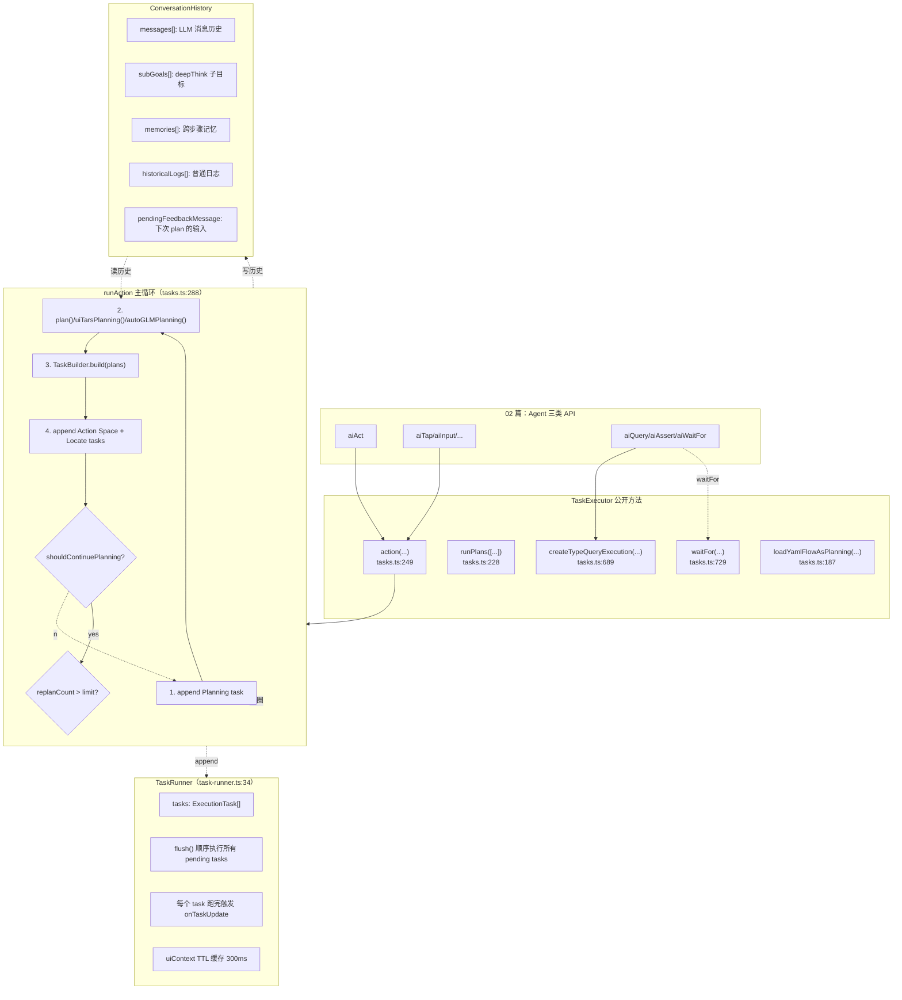
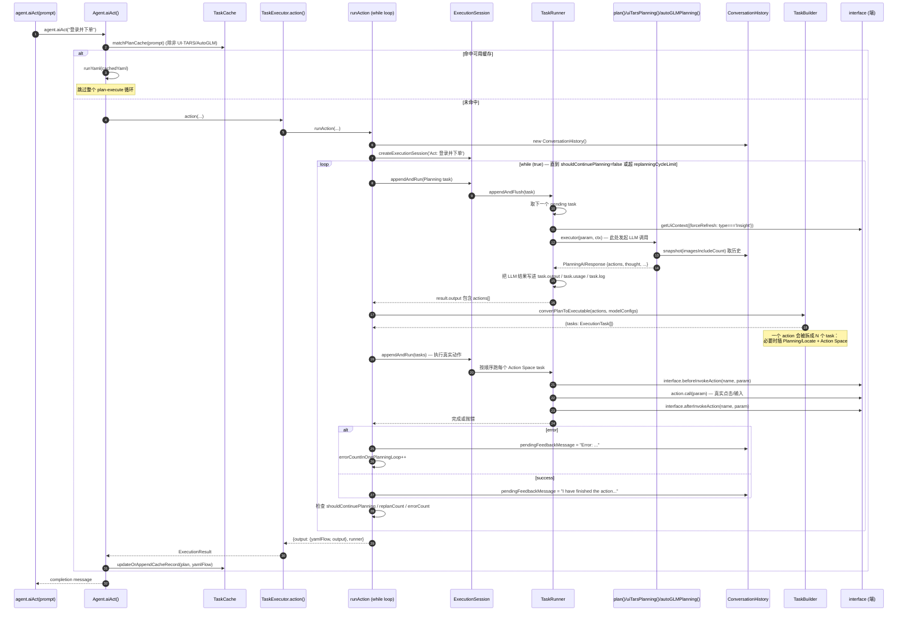

# 04 · Planner 与 Action 循环（Planner & Action Loop）

> 分析基于 commit `702d5375`（main，v1.8.1）
>
> 本篇核心目标：**把"`agent.aiAct('登录并下单')`"这一次调用，分解成它在执行器内部经历的几百行代码**，让你在 dump 报告里看到每一个 task 时都能立刻指认它来自哪一行源码。

---

## 0. TL;DR

- **`aiAct` 不是直接调模型**。它进入 `TaskExecutor.runAction()` 里一个 `while (true)` 循环（`tasks.ts:329`），每一圈做一次"Plan → 执行动作 → 检查是否完成"。最多跑 `replanningCycleLimit` 圈（默认 20 / UI-TARS 40 / AutoGLM 100）。
- **Plan ≠ Execute**。每一圈先 append 一个 `Planning` task 让 LLM 决定下一步，**然后**根据返回的 `actions[]` 由 `TaskBuilder.build()` 转成 N 个真正的 `Action Space` task（含必要的 `Planning/Locate` 前置任务），再 append 进 runner 跑。
- **执行单元是 `ExecutionTask`，三种 type**：`Planning`（让 LLM 决策）、`Action Space`（端的真实动作）、`Insight`（query/assert/waitFor 三种调模型解读）。每个 task 跑完都写一份带截图的 dump 项进报告。
- **`ConversationHistory` 是 Plan 循环的"短期记忆"**：每 plan 一次就 append 一条消息，超 50 条压缩到 20 条（`conversation-history.ts:343`），并维护三个独立维度——`subGoals` / `historicalLogs` / `memories`，分别对应 deepThink 子目标 / 普通步骤日志 / 跨步骤记忆。
- **`Locate` 是 Planning 子任务**：如果一个 action 的 paramSchema 含 `locate` 字段，`TaskBuilder` 会**在 action task 前先插一个 `Planning/Locate` task**，专门跑视觉定位。这就解释了 dump 里为什么一次点击有"两步"。
- **失败容忍上限是 5**（`maxErrorCountAllowedInOnePlanningLoop = 5`，`tasks.ts:62`）。同一轮里失败 5 次以上就放弃当前 plan loop。

---

## 1. 它解决了什么问题 / 为什么必须有这一层

读过 02 和 03 篇后，你脑子里现在有这两件东西：
- 一份 Agent API（`aiTap` / `aiAct` / `aiQuery`）
- 一份 Prompt + 模型响应解析器

但**这两者之间还隔着工程上最难的部分**：

1. **怎么把一个"高层意图"分解成可执行步骤？**——Prompt 让模型每次只输出一步，那"凑齐所有步骤"的循环就是这一层
2. **怎么在一步失败时不让整个任务崩？**——重规划 / 重定位 / 容错次数预算都在这里
3. **怎么把"决策"和"执行"在 dump 报告里分清楚？**——Planning task 和 Action Space task 的二元结构
4. **怎么记住"我刚做了什么"，让模型下一步不重复？**—— `ConversationHistory` + `pendingFeedbackMessage`

读完本篇你会理解：**Midscene 的执行器不是个 for 循环，而是一个事件驱动 + 状态机 + 重规划三者的混合体**。

---

## 2. 它在整体架构中的位置



---

## 3. 源码导览

### 3.1 关键文件清单

| 文件 | 行数 | 关键导出 | 角色 |
|---|---|---|---|
| `packages/core/src/agent/tasks.ts` | 848 | `class TaskExecutor`、`withFileChooser`、`locatePlanForLocate`（re-export） | **执行器主入口**，本篇主角 |
| `packages/core/src/task-runner.ts` | 434 | `class TaskRunner`、`class TaskExecutionError` | 任务队列引擎 |
| `packages/core/src/agent/execution-session.ts` | 63 | `class ExecutionSession` | TaskRunner 的薄包装（一次执行 = 一个 session） |
| `packages/core/src/agent/task-builder.ts` | 664 | `class TaskBuilder`、`locatePlanForLocate` | **Plan → ExecutionTask[] 的编译器** |
| `packages/core/src/ai-model/conversation-history.ts` | 366 | `class ConversationHistory` | Plan 循环的对话记忆 |
| `packages/core/src/agent/task-cache.ts` | — | `class TaskCache` | locate / plan 缓存（09 篇展开） |
| `packages/core/src/ai-model/llm-planning.ts` | 364 | `plan()`、`parseXMLPlanningResponse` | 通用 VLM planner（03 篇已览） |
| `packages/core/src/ai-model/ui-tars-planning.ts` | 451 | `uiTarsPlanning()`、`convertBboxToCoordinates` | UI-TARS planner |
| `packages/core/src/ai-model/auto-glm/planning.ts` | 103 | `autoGLMPlanning()` | AutoGLM planner |

### 3.2 关键类型清单（dump 里看到的 task 结构）

| 类型 | 来源 | 字段 |
|---|---|---|
| `ExecutionTask` | `types.ts` | `taskId`、`type`、`subType`、`status: 'pending'\|'running'\|'finished'\|'failed'\|'cancelled'`、`param`、`output`、`error`、`thought`、`usage`、`timing`、`recorder`、`uiContext` |
| `ExecutionTask.type` | 枚举 | `'Planning'` / `'Action Space'` / `'Insight'` |
| `ExecutionTask.subType`（type=Planning） | 字符串 | `'Plan'`（主规划）/ `'Locate'`（定位）/ `'LoadYaml'`（缓存回放） |
| `ExecutionTask.subType`（type=Action Space） | 字符串 | `'Tap'`、`'Input'`、`'Scroll'`、...、`'Sleep'`、`'Finished'`、`'Error'` |
| `ExecutionTask.subType`（type=Insight） | 字符串 | `'Query'` / `'Boolean'` / `'Number'` / `'String'` / `'Assert'` / `'WaitFor'` |

---

## 4. 核心机制深度解析

### 4.1 `aiAct` 内部完整生命周期

把 02 篇的 `aiAct` 入口 + 本篇 `runAction` 主循环 + Plan/Build/Run 三个子阶段串起来：



### 4.2 `runAction` 主循环关键代码片段

源码 `tasks.ts:329-548`。摘出最核心的 50 行：

```ts
// tasks.ts:329
while (true) {
  // 1) abort 检查
  if (abortSignal?.aborted) { return session.appendErrorPlan(`Task aborted: ...`); }

  // 2) 让 LLM 输出下一步 plan
  const result = await session.appendAndRun({
    type: 'Planning',
    subType: 'Plan',
    param: { userInstruction, aiActContext, imagesIncludeCount, planningModeDeepThink, subGoalStatus, memoriesStatus },
    executor: async (param, executorContext) => {
      const { modelFamily } = modelConfigForPlanning;
      // 3) 选 planner 实现（三个 modelFamily 分叉）
      const planImpl = isUITars(modelFamily) ? uiTarsPlanning
                     : isAutoGLM(modelFamily) ? autoGLMPlanning
                     : plan;
      const planResult = await planImpl(param.userInstruction, {...});
      // 4) 把 planning 结果挂到 task 上，供 dump 报告显示
      executorContext.task.output = { actions, log, thought, memory, yamlFlow, output, shouldContinuePlanning, ... };
      // 5) 若模型说失败，直接 throw
      if (finalizeSuccess === false) { assert(false, `Task failed: ...`); }
      return { cache: { hit: false } };
    },
  }, { allowWhenError: true });  // ← 即使前面有 task error，也允许继续

  const planResult = result?.output as PlanningAIResponse | undefined;
  const plans = planResult?.actions || [];

  // 6) 把 plan 编译成可执行 task[]
  const executables = await this.convertPlanToExecutable(plans, modelConfigs..., { cacheable, deepLocate, abortSignal });

  // 7) 给下一次 plan 的输入注入时间戳
  conversationHistory.pendingFeedbackMessage += `Current time: ${initialTimeString}`;

  // 8) 执行编译后的 tasks
  try {
    await session.appendAndRun(executables.tasks);
  } catch (error: any) {
    errorCountInOnePlanningLoop++;
    conversationHistory.pendingFeedbackMessage = `Time: ${timeString}, Error executing running tasks: ${error?.message}`;
  }

  if (errorCountInOnePlanningLoop > 5) {
    return session.appendErrorPlan('Too many errors in one planning loop');
  }

  // 9) 终止条件：模型说完了
  if (!planResult?.shouldContinuePlanning) break;

  // 10) 重规划次数预算
  if (++replanCount > replanningCycleLimit) {
    return session.appendErrorPlan(`Replanned ${replanningCycleLimit} times, exceeding the limit...`);
  }

  // 11) 给下一次 plan 一个默认"刚做完一步"的提示
  if (!conversationHistory.pendingFeedbackMessage) {
    conversationHistory.pendingFeedbackMessage = `Time: ${timeString}, I have finished the action previously planned.`;
  }
}
```

**这段代码透露的工程细节**：

1. **`allowWhenError: true` 的妙用**——即使上一圈 Action Space task 失败了，也允许 append 下一个 Planning task 继续重试。否则一次失败就死了。
2. **`shouldContinuePlanning`**——来自 03 篇的 XML `<complete>` 标签解析：模型输出 `<complete success="true">` 就把它设成 false，循环终止。
3. **时间戳注入**——每次 `pendingFeedbackMessage` 都带 `Time: xxx`。**模型有时会"忘了页面在变"**，每次给个时间戳能让它意识到"已经过了多久"。
4. **错误预算 ≠ 重规划预算**——`errorCountInOnePlanningLoop=5` 是局部失败上限；`replanCount=20` 是规划次数上限。两个独立计数器。

### 4.3 三种 `ExecutionTask` 在 `TaskRunner.flush` 里的分支处理

源码 `task-runner.ts:228-325` 的 `while` 循环。简化后的伪代码：

```ts
while (taskIndex < this.tasks.length) {
  const task = this.tasks[taskIndex];
  task.status = 'running';
  task.timing.start = Date.now();

  // Insight 类总是强制刷新 UI 上下文，因为它要看最新页面
  const forceRefresh = task.type === 'Insight';
  const uiContext = await this.getUiContext({ forceRefresh });

  const executorContext = { task, element: previousFindOutput?.element, uiContext };

  if (task.type === 'Insight') {
    returnValue = await task.executor(param, executorContext);
  } else if (task.type === 'Planning') {
    returnValue = await task.executor(param, executorContext);
    if (task.subType === 'Locate') {
      previousFindOutput = returnValue.output;  // 把定位结果传给下一个 task
    }
  } else if (task.type === 'Action Space') {
    returnValue = await task.executor(param, executorContext);
  }

  // 最后一个 task 跑完拍一张"after-calling"截图给 dump 看
  if (isLastTask) {
    const screenshot = await this.captureScreenshot();
    this.attachRecorderItem(task, screenshot, 'after-calling');
  }

  task.status = 'finished';
  task.timing.end = Date.now();
  await this.emitOnTaskUpdate();
  taskIndex++;
}
```

**关键观察**：

- **`uiContext` 有一个 300ms TTL 缓存**（`task-runner.ts:20`：`UI_CONTEXT_CACHE_TTL_MS = 300`）。同一组 task 跑得快时复用同一帧截图——避免每个 task 都触发一次"截屏"。
- **`forceRefresh: task.type === 'Insight'`**——Insight 类（query/assert/waitFor）每次都强制拿最新截图。这条规则避免了"我刚做了动作，断言却用旧截图判断"的 bug。
- **`previousFindOutput` 的传递**——`Planning/Locate` task 跑完会把元素坐标存进 `previousFindOutput`，供下一个 `Action Space` task 通过 `executorContext.element` 拿到。这是"先定位，再点击"两步式协议的实现。
- **`onTaskUpdate` 在每次状态变化时触发**——这是 dump 实时写盘的钩子，10 篇会展开。

### 4.4 `TaskBuilder.build()`：从 plan 数组到 ExecutionTask 数组

源码 `task-builder.ts:109-152`：

```ts
public async build(plans, modelConfigForPlanning, modelConfigForDefaultIntent, options) {
  const tasks: ExecutionTaskApply[] = [];

  const planHandlers = new Map([
    ['Locate', plan => this.handleLocatePlan(plan, context)],
    ['Finished', plan => this.handleFinishedPlan(plan, context)],
  ]);
  const defaultHandler = plan => this.handleActionPlan(plan, context);

  for (const plan of plans) {
    const handler = planHandlers.get(plan.type) ?? defaultHandler;
    await handler(plan);
  }
  return { tasks };
}
```

**三种 plan handler**：

| plan.type | handler | 产生的 task |
|---|---|---|
| `'Locate'` | `handleLocatePlan` | 1 个 `Planning/Locate` task |
| `'Finished'` | `handleFinishedPlan` | 1 个 `Action Space/Finished` task（空 executor，仅作标记） |
| 其他（`'Tap'`, `'Input'`, ...） | `handleActionPlan` | **多个 task**：N 个 `Planning/Locate`（前置定位）+ 1 个 `Action Space/<actionName>` |

#### 4.4.1 `handleActionPlan` 的"先定位后动作"两步式（task-builder.ts:176）

读这段代码是理解 dump 报告的关键：

```ts
private async handleActionPlan(plan, context) {
  const action = this.actionSpace.find(item => item.name === plan.type);
  const locateFields = findAllMidsceneLocatorField(action.paramSchema);  // 例如 Tap 的 ['locate']

  // 对每个 locate 字段插一个前置 Locate task
  locateFields.forEach((field) => {
    if (param[field]) {
      const locatePlan = locatePlanForLocate(param[field]);
      const locateTask = this.createLocateTask(locatePlan, param[field], context, (result) => {
        param[field] = result;  // ← 关键：定位结果回写到原 action 的参数里
      });
      context.tasks.push(locateTask);
    }
  });

  // 再插真正的动作 task
  context.tasks.push({
    type: 'Action Space',
    subType: planType,  // 'Tap' / 'Input' / ...
    executor: async (param, taskContext) => {
      await this.interface.beforeInvokeAction(action.name, param);
      await sleep(action.delayBeforeRunner ?? 200);

      // 用 zod schema 做参数校验 + 坐标缩放
      param = parseActionParam(param, action.paramSchema, { shrunkShotToLogicalRatio });

      // 真正调端的实现
      const actionResult = await action.call.bind(this.interface)(param, taskContext);

      await sleep(action.delayAfterRunner ?? this.waitAfterAction ?? 300);
      await this.interface.afterInvokeAction(action.name, param);

      return { output: actionResult };
    },
  });
}
```

**几个工程小尺度但关键的点**：

| 细节 | 源码位置 | 含义 |
|---|---|---|
| `delayBeforeRunner = action.delayBeforeRunner ?? 200` | line 258 | 每个 action 默认前置 200ms 停顿 |
| `delayAfterRunner = action.delayAfterRunner ?? this.waitAfterAction ?? 300` | line 317 | 默认后置 300ms 停顿（可被 `agent.opts.waitAfterAction` 覆盖） |
| `parseActionParam(param, paramSchema, {shrunkShotToLogicalRatio})` | line 295 | **既校验 zod schema 又做坐标系换算**（08 篇展开） |
| `interface.beforeInvokeAction` / `afterInvokeAction` 钩子 | line 262 / 327 | 端可以在这里做"系统弹窗关闭"等准备/清理工作 |

#### 4.4.2 为什么要"先定位后动作"分两步？

可选方案是让 planning 模型直接给坐标，一步搞定。但 Midscene 选择**默认两步**，原因（推测 + 部分源码佐证）：

- **planning 模型擅长决策，locate 模型擅长定位**——两类能力可以走不同模型（02 篇说的"双模型协调"）。一步式合并会让某一类模型背负它不擅长的活
- **Locate 结果可缓存**——`createLocateTask` 内部走 `taskCache`，一个元素定位过一次后下次直接命中（09 篇）
- **Locate 失败的语义清晰**——"点击 Submit"失败时，到底是"找不到 Submit"还是"找到了但点击失败"？分两步后 dump 里直接能看到失败发生在哪一步
- **`includeBboxInPlanning=true` 时是"一步式优化"**：planning 模型直接给 bbox，`handleActionPlan` 仍走两步但 Locate task 会"命中 plan hit"直接走（`task-builder.ts:444`：`isPlanHit = !!elementFromBbox`），无需再调 LLM

### 4.5 `ConversationHistory` 的四个独立维度

`conversation-history.ts` 类持有四块独立状态：

```ts
class ConversationHistory {
  private messages: ChatCompletionMessageParam[];  // ← 正经的 LLM 对话历史
  private subGoals: SubGoal[];                     // ← deepThink 模式下的子目标列表
  private memories: string[];                      // ← <memory> 标签累积的跨步骤记忆
  private historicalLogs: string[];                // ← 非 deepThink 模式下的 <log> 累积
  public pendingFeedbackMessage: string;           // ← 下一次 plan() 的 user 消息前缀
}
```

每一块的"渲染成 Prompt 片段"逻辑：

| 字段 | 渲染函数 | 注入位置 | 用于 |
|---|---|---|---|
| `messages` | `snapshot(maxImages?)` | system 之后的 history 消息 | 完整对话历史 |
| `subGoals` | `subGoalsToText()` | user msg 文本附加段 | 仅 deepThink |
| `memories` | `memoriesToText()` | user msg 文本附加段（`memoriesSection`） | 通用，提取的跨步骤事实 |
| `historicalLogs` | `historicalLogsToText()` | user msg 文本附加段（`subGoalsSection` 的 fallback） | 仅非 deepThink |
| `pendingFeedbackMessage` | 拼进下一条 user msg 开头 | "previous action has been executed, here is the latest screenshot..." | 步骤间隔反馈 |

**完整渲染示例**（基于 03 篇看过的 `llm-planning.ts:184-220`）：

```
[user 消息（每次 plan 都新加）]
{
  role: 'user',
  content: [
    {
      type: 'text',
      text: `Time: 2026-05-14 10:23:45, I have finished the action previously planned. The previous action has been executed, here is the latest screenshot. Please continue according to the instruction.

Memories from previous steps:
---
Name field has been filled with 'John'
---


Sub-goals:
1. Fill in the Name field with 'John' (finished)
2. Fill in the Email field (running)
3. Submit (pending)
Current sub-goal is: Fill in the Email field
Actions performed for current sub-goal:
- Click on the Email field`
    },
    { type: 'image_url', image_url: { url: '<base64>', detail: 'high' } }
  ]
}
```

#### 4.5.1 历史压缩：50/20 阈值

`conversation-history.ts:343`：

```ts
compressHistory(threshold: number, keepCount: number): boolean {
  if (this.messages.length <= threshold) return false;
  const omittedCount = this.messages.length - keepCount;
  // 把前面的全部替换成一条占位消息
  this.messages = [
    { role: 'user', content: `(${omittedCount} previous conversation messages have been omitted)` },
    ...this.messages.slice(-keepCount)
  ];
  return true;
}
```

`plan()` 里固定调用：`conversationHistory.compressHistory(50, 20)`（`llm-planning.ts:224`）——超过 50 条就只保留最后 20 条 + 1 条 "X messages omitted" 占位符。

**为什么 50/20？**——
- 50：单步 plan 大约用 1-3 条消息，**50 大约对应 20–30 轮规划**，覆盖大多数任务
- 20：保留近期 20 条让模型"记得刚刚做了什么"，**不会因为压缩丢上下文**
- 占位符防止模型以为对话从头开始

#### 4.5.2 图像数限制：`snapshot(maxImages)`

`conversation-history.ts:53`：

```ts
snapshot(maxImages?: number): ChatCompletionMessageParam[] {
  if (maxImages === undefined) return [...this.messages];

  const clonedMessages = structuredClone(this.messages);
  let imageCount = 0;
  // 从末尾向前遍历，保留最近 maxImages 张
  for (let i = clonedMessages.length - 1; i >= 0; i--) {
    if (Array.isArray(clonedMessages[i].content)) {
      for (let j = 0; j < content.length; j++) {
        if (content[j].type === 'image_url') {
          imageCount++;
          if (imageCount > maxImages) {
            content[j] = { type: 'text', text: '(image ignored due to size optimization)' };
          }
        }
      }
    }
  }
  return clonedMessages;
}
```

`aiAct` 调用时 `imagesIncludeCount` 默认 `1`，开了 `deepThink` 变 `2`（02 篇 `agent.ts:955`）。**结果是**：模型只看到最近 1 (或 2) 张截图，更早的截图全部被替换成 `(image ignored)` 文本占位。

**为什么这么省**：
- 每张高清截图大约消耗 1500–3500 tokens
- 跑 20 轮规划如果每轮都带 1 张图就是 30k–70k tokens 仅图像
- "更早的画面"对决策"下一步"没什么用，模型靠 `<thought>` / `<memory>` / `<log>` 文字记忆就够

### 4.6 三种 planner 的"路由"逻辑

`tasks.ts:373`：

```ts
const planImpl = isUITars(modelFamily) ? uiTarsPlanning
              : isAutoGLM(modelFamily) ? autoGLMPlanning
              : plan;
```

| `modelFamily` 命中条件 | 走 | 输入参数差异 |
|---|---|---|
| `vlm-ui-tars` / `vlm-ui-tars-doubao` / `vlm-ui-tars-doubao-1.5` | `uiTarsPlanning` | 不需要 `actionSpace`（UI-TARS 自带固定动作集） |
| `auto-glm` / `auto-glm-multilingual` | `autoGLMPlanning` | 不需要 `includeBbox` |
| 其他 | `plan` | 完整参数 |

**这就是 03 篇看到的"三套独立 Prompt"在执行层的落点**——`runAction` 只决定调哪个 planner，每个 planner 内部用自己的 Prompt 和输出解析逻辑。

#### 4.6.1 三种 planner 的输出统一为 `PlanningAIResponse`

虽然 prompt 形态不同，但**返回结构是一致的**：

```ts
interface PlanningAIResponse {
  actions: PlanningAction[];      // 标准化动作列表
  thought?: string;
  log?: string;                   // <log> 标签内容
  memory?: string;                // <memory> 标签内容
  error?: string;
  finalizeSuccess?: boolean;      // <complete success="...">
  finalizeMessage?: string;
  yamlFlow?: MidsceneYamlFlowItem[];  // 给缓存写的 yaml 形式
  shouldContinuePlanning: boolean;
  updateSubGoals?: SubGoal[];
  markFinishedIndexes?: number[];
  usage?: AIUsageInfo;
  rawResponse: string;
  reasoning_content?: string;
}
```

每个 planner 负责把自己的输出（XML / 伪 Python / `<answer>` Python）解析成这个统一结构，让 `runAction` 后面的逻辑对模型无感知。**这是"内部统一接口"和"外部 Prompt 多样"的清晰边界**。

### 4.7 错误处理 / 重试 / 终止条件全景

| 情形 | 检测位置 | 处理 |
|---|---|---|
| **用户 abort** | `runAction:331` / `525` | `appendErrorPlan(Task aborted: ...)` |
| **LLM 调用本身抛 AIResponseParseError** | `runAction:394` | 把 `rawResponse` 和 `usage` 写进 task.log，然后 rethrow |
| **plan 里 `<error>` 标签** | `runAction:447`：`assert(!error, ...)` | 当前 task 失败 |
| **plan 里 `<complete success="false">`** | `runAction:450`：`assert(false, ...)` | 当前 task 失败 |
| **convertPlanToExecutable 抛错**（比如 action name 不存在） | `runAction:487` | `appendErrorPlan` 直接终止 |
| **action 执行抛错** | `runAction:507`：catch | `errorCountInOnePlanningLoop++`，把错误消息写进 `pendingFeedbackMessage` 喂回模型 |
| **错误次数超 5** | `runAction:520` | `appendErrorPlan('Too many errors in one planning loop')` |
| **重规划次数超 limit** | `runAction:539` | `appendErrorPlan(Replanned ${limit} times...)` |
| **模型说做完了** | `runAction:532`：`!shouldContinuePlanning` | `break` 退出 while |

**重要的"软容忍"机制**：

- **`allowWhenError: true`**（`runAction:464`）：让 Planning task 即使前面有失败的 task 也能继续 append。否则一次 action 失败就让整个 session 卡死。
- **错误反馈给模型**：失败时 `pendingFeedbackMessage` 不是"扔掉错误然后重试"，而是**把错误消息原样喂给模型**：
  ```ts
  conversationHistory.pendingFeedbackMessage = `Time: ${timeString}, Error executing running tasks: ${error?.message}`;
  ```
  让模型自己决定"重试 / 换策略 / 放弃"。这是"软自愈"——把决策权交给 LLM 而不是写死规则。

### 4.8 `aiWaitFor` 的循环：基于 Insight 的等待

`tasks.ts:729-813` 的 `waitFor()` 有独立的循环逻辑（不复用 `runAction`）：

```ts
while (lastCheckStart - overallStartTime <= timeoutMs) {
  const queryTask = await this.createTypeQueryTask('WaitFor', textPrompt, ...);
  const result = await session.appendAndRun(queryTask);
  if (result?.output) return { output: undefined, runner };  // 断言为真，结束

  // 间隔够长就直接进入下一轮；不够就插一个 Sleep task 补齐
  if (now - currentCheckStart < checkIntervalMs) {
    const timeRemaining = checkIntervalMs - (now - currentCheckStart);
    const { tasks: sleepTasks } = await this.convertPlanToExecutable(
      [{ type: 'Sleep', param: { timeMs: timeRemaining }, thought }], ...);
    if (sleepTasks[0]) await session.appendAndRun(sleepTasks[0]);
  }
}
return session.appendErrorPlan(`waitFor timeout: ${errorThought}`);
```

特点：
- **每次轮询都是一个 `Insight/WaitFor` task**——dump 报告里会看到 N 个 WaitFor 节点
- **间隔补齐**——如果模型调用本身花了 1.5s 而 `checkIntervalMs=3000`，会补一个 1.5s 的 `Sleep` task
- **超时是从首次 check 开始算的**（不是从首次成功），所以 `timeoutMs` 是总预算

### 4.9 `loadYamlFlowAsPlanning`：缓存命中的"假规划"

`tasks.ts:187-226` 提供了一个特殊的 plan-as-cache 路径。当 `aiAct` 命中 plan cache 时（02 篇 `agent.ts:937`），不走 `runAction`，而是：

1. `loadYamlFlowAsPlanning` 创建一个**带"Cache hit"标记的 Planning task**（不调 LLM）
2. 然后 `agent.runYaml(cachedYaml)` 跑缓存里的 YAML flow

dump 报告里这种 task 会有 `hitBy: { from: 'Cache', context: { yamlString } }` 字段——这就是"为什么这次执行没看到 LLM 调用"的可视化证据。09 篇会展开。

---

## 5. 设计取舍与工程权衡

### 5.1 为什么不用 LangGraph / state machine 库？

LangGraph 等 Python 框架把 agent 循环建成"图节点 + 边"。Midscene **用一个 while + 一个 task queue** 取代它。

**好处**：
- 调试简单：单步 debug 就能看清流程
- 类型友好：`PlanningAIResponse` 是直接的 TS interface
- 文件少：核心循环 200 行能读完

**代价**：
- 状态复杂时（如 deepThink 子目标 + memory + 重试）逻辑分散在 `runAction` 各处
- 不像状态机那样能"可视化整个 agent 形态"

### 5.2 为什么 Locate 是一个独立 task type？

可选方案是把"定位 + 动作"合并成一个 task：

```ts
executor: async (param) => {
  const loc = await locate(param.locate);   // 内部调 LLM
  await tap(loc);                            // 端的动作
}
```

但 Midscene 拆成两个，这有三个具体好处：

| 拆分价值 | 体现 |
|---|---|
| **dump 报告粒度** | 每个 Locate 都是独立节点，能看到"模型识别出的 bbox + 截图"，对调试视觉错误极有用 |
| **缓存独立** | `taskCache` 按 prompt + xpath 缓存定位结果，下次直接命中跳过 LLM |
| **可单独退化** | `aiLocate` API 就是只跑 Locate 不跑 action |

### 5.3 为什么 errorCount 上限是 5（而不是 3 或 10）？

`maxErrorCountAllowedInOnePlanningLoop = 5`（`tasks.ts:62`）。这是个"魔数"。**推测理由**：

- **小于 3** → 一次网络抖动就放弃，太脆弱
- **大于 10** → 真出 bug 时浪费 token 成本太高
- **5** 大约是"重试两三次 + 极端情况下尝试不同 action 几次"的预算

### 5.4 为什么 `uiContext` 有 300ms TTL 缓存？

`task-runner.ts:20`：`UI_CONTEXT_CACHE_TTL_MS = 300`。

**场景**：一个 `aiTap` 内部触发 1 个 Planning(Plan) + 1 个 Planning(Locate) + 1 个 Action Space(Tap)。前两步基本是连续的 LLM 调用，相隔 < 300ms。**截图复用**省一次截屏调用（截屏在某些端如 Android adb 上可能要 100ms+）。

**但 Insight 类强制 forceRefresh**——因为 `aiAssert` 是用来"验证刚刚的动作有没有改变页面"，复用旧截图会让断言基于错误的事实。

### 5.5 为什么 plan 输出叫 `yamlFlow` 而不直接是 actions？

模型返回 `actions: PlanningAction[]` 是 JS 对象数组。但写缓存时要序列化成 YAML 文本（09 篇）。

`buildYamlFlowFromPlans(actions, actionSpace)`（`llm-planning.ts:284`）把 actions 转成 `MidsceneYamlFlowItem[]`——一种**对人类可读 + 对机器可重现**的中间形态。这种格式既可以作为 cache 内容，也可以让用户**直接把缓存的 yaml 抄出来作为离线脚本**——这是"缓存即源代码"的设计哲学。

---

## 6. 与其他模块的协作

- **上游**：02 篇的 Agent 方法（`aiAct` / `aiQuery` / `aiAssert` / `aiWaitFor`）
- **直接下游**：
  - `plan() / uiTarsPlanning() / autoGLMPlanning()`（03 篇）：每圈调一次
  - `TaskBuilder.createLocateTask()`（→ 07 篇）：插前置定位
  - `Service.extract()`（10 篇）：Insight 类的实际实现
  - `interface.beforeInvokeAction` / `afterInvokeAction`（→ 05 篇）：动作前后钩子
- **间接下游**：
  - `TaskCache`（09 篇）：plan cache + locate cache 写入点都在这一层
  - `ReportGenerator`（10 篇）：通过 `onTaskUpdate` 钩子实时累积 dump

---

## 7. 常见陷阱 & 调试经验

### 7.1 dump 报告里看到一堆 "Planning/Locate" 节点

**症状**：一次 `aiAct('点击登录')` 居然产生了 4 个 task：Plan → Locate → Tap → 还有个 Locate。
**根因**：每个 action 的 `locate` 字段都会前置一个 Locate task；如果定位失败重试，还会插第二个。
**不是 bug**——这就是"先定位后动作"的两步式设计。

### 7.2 `Replanned 20 times, exceeding the limit`

**症状**：复杂任务跑满重规划次数还没结束。
**解决**：
- 把任务拆细：`aiAct('注册并发帖')` → `aiAct('注册')` + `aiAct('发帖')`
- 调高上限：`agent.opts.replanningCycleLimit = 50` 或 `MIDSCENE_REPLANNING_CYCLE_LIMIT=50`
- 检查是不是页面卡住——dump 里看每轮截图是否一直一样

### 7.3 `Too many errors in one planning loop`

**症状**：5 个 action 失败后整个 task 放弃。
**根因**：通常是页面状态异常导致每个 action 都点不到。
**调试**：dump 里看连续失败的 task，找到第一个失败的截图——往往就是问题源头。

### 7.4 `aiWaitFor` 触发但每次 check 都失败

**症状**：明明等的条件已经满足，但 `aiWaitFor` 还是超时。
**根因 1**：`Insight/WaitFor` 用 insight 模型，可能小模型理解不了复杂断言。
**根因 2**：断言写得太具体（"页面顶部有红色 logo"——模型对颜色不敏感）。
**调试**：在 dump 里看每次 WaitFor 节点的 `thought` 字段，能看到模型每次怎么想。

### 7.5 改了端的 input primitives，actions 没出现

**症状**：在 `inputPrimitives.touch.pinch` 里新加了一个 `swipe` 方法，但 Agent 上还是没有对应 action。
**根因**：actionSpace 是构造时一次性 build 的（`agent.ts:321`），改运行时不生效。需要：
1. 重启进程
2. 端实际把方法塞进 `inputPrimitives`（02 篇看过的 `defineActionsFromInputPrimitives` 在端的 `actionSpace()` 里调用）

### 7.6 `withFileChooser` 包装下 action 失败不被捕获

**症状**：用了 `agent.aiTap('upload', { fileChooserAccept: 'foo.pdf' })`，文件选择器抛错但 task 看起来"成功"。
**根因**：`withFileChooser`（`tasks.ts:816`）在 finally 里 dispose 监听器，但**额外检查 `getError()`**——任何在文件选择器回调里抛的错都会被 rethrow 出来。如果你没看到错误，可能它被某层 catch 吃了。看 dump 看 task.error。

### 7.7 多张图片注入位置不对

**症状**：用 `aiQuery(demand, { images: [...] })`，模型却回答"我没看到参考图"。
**根因**：`promptsToChatParam` 会先 push 一条 `"Next, I will provide all the reference images."` 引子，**再 push 每张图作为独立 user 消息**。这要求模型支持多条 user 消息——少数模型不支持。
**验证**：dump 里看实际发送的 messages 数组。

---

## 8. 🛠️ 实操章节

### 8.1 用 dump 报告看完整执行链

```bash
# 跑 02 篇 8.1 节的 demo
npx tsx scripts/demo-puppeteer.ts

# 打开生成的报告
open midscene_run/report/<latest>.html
```

报告页面里**点开任意一次 `aiAct` 调用**，你会看到：

```
└─ Act: 登录并下单                       (ExecutionSession.name)
   ├─ Planning/Plan                       ← 第 1 圈
   │  └─ usage: 1234 tokens
   ├─ Planning/Locate "Username field"    ← TaskBuilder 插的前置 locate
   ├─ Action Space/Input                  ← 真实输入
   ├─ Planning/Plan                       ← 第 2 圈
   ├─ Planning/Locate "Password field"
   ├─ Action Space/Input
   ├─ Planning/Plan
   ├─ Planning/Locate "Login button"
   ├─ Action Space/Tap
   └─ Planning/Plan                       ← 最后一圈，输出 <complete>
      └─ output: {shouldContinuePlanning: false, finalizeMessage: "..."}
```

**每个节点都能展开看**：
- 该 task 的 input/output JSON
- `rawResponse`（模型原始输出）
- 截图（before / after）
- token usage
- 耗时分解（`timing.getUiContextStart` / `callAiStart` / ...）

### 8.2 用 DEBUG 日志看主循环每一圈

```bash
DEBUG=device-task-executor,task-runner,planning,agent:task-builder npx tsx scripts/demo-puppeteer.ts
```

会看到类似：

```
device-task-executor actionSpace for this interface is: Tap, RightClick, DoubleClick, Hover, Input, KeyboardPress, Scroll, ClearInput, DragAndDrop, LongPress, Sleep
device-task-executor planResult {"actions":[...],"shouldContinuePlanning":true,...}
agent:task-builder will prepend locate param for field action.type=Tap param={"prompt":"the login button"} ...
agent:task-builder executing action Tap {"locate":{"prompt":"the login button","center":[345,442]}} taskContext.element.center: 345,442
task-runner reuse cached uiContext captured 156ms ago
```

### 8.3 推荐断点（debug 主循环时强烈建议）

| 文件 | 行 | 观察 |
|---|---|---|
| `tasks.ts:329` | while (true) 主循环 | 每圈断一次，看 `replanCount` / `errorCountInOnePlanningLoop` |
| `tasks.ts:373` | `planImpl = isUITars ? ... : plan` | 确认走的哪条 planner |
| `tasks.ts:469` | `planResult = result?.output` | 看 plan 返回的完整结构 |
| `task-builder.ts:144` | `for (const plan of plans)` | 看 plan 数组怎么被分发到 handler |
| `task-builder.ts:309` | `actionFn(param, taskContext)` | 即将调用端的真实动作 |
| `task-runner.ts:228` | `while (taskIndex < tasks.length)` | 每个 task 跑前断一次 |
| `task-runner.ts:260` | `getUiContext({ forceRefresh })` | 看是否命中 TTL 缓存 |
| `conversation-history.ts:343` | `compressHistory` | 看历史压缩何时触发 |

### 8.4 引导式实验

1. **打印每圈的 ConversationHistory 长度**：
   在 `tasks.ts:529`（`if (!planResult?.shouldContinuePlanning) break;`）之前加 `console.log('round', replanCount, 'history len', conversationHistory.length);`，重 build core 后跑一个 5+ 步的 `aiAct`，看历史增长曲线。

2. **降低压缩阈值看效果**：
   把 `llm-planning.ts:224` 的 `compressHistory(50, 20)` 改成 `compressHistory(10, 5)`，跑长任务，看 dump 里"omitted"占位符在第几轮出现。

3. **拆掉 Locate 看会怎样**：
   把 `task-builder.ts:217` 的 `context.tasks.push(locateTask)` 注释掉，跑 `aiTap('登录按钮')`——你会看到 Action Space/Tap task 在 `parseActionParam` 阶段就抛错（因为 `param.locate.center` 没填）。**这就是"两步式"为什么是默认的**。

4. **让 errorCount 上限暴露问题**：
   故意写 `aiAct('点击页面里 100% 不存在的按钮"foobar"')`——观察 dump 里 5 个失败后 `appendErrorPlan('Too many errors in one planning loop')`。

5. **看 deepThink 子目标拆分**：
   ```ts
   await agent.aiAct('注册账号、登录、发一条帖子', { deepThink: true });
   ```
   dump 里能看到 `<update-plan-content>` 标签解析出的 sub-goals 列表，每完成一步会 mark finished。

---

## 9. 自检问题

1. 一次 `agent.aiTap('Submit')` 调用会产生几个 `ExecutionTask`？分别是什么 type 和 subType？为什么不是只有一个 Tap？
2. `runAction` 主循环的两个独立计数器是什么？分别在什么时候触发终止？
3. `ConversationHistory` 维护四块独立状态。其中哪一块只在 `deepThink: true` 时被填充？哪一块决定了"下一次 plan 收到的 user 消息里包含什么文本"？
4. `Insight` 类的 task 在 `TaskRunner.flush` 里有什么和其他 task 不同的特殊处理？为什么？
5. 模型调用失败时（`AIResponseParseError`），错误是怎么被传递给下一次 plan 的？
6. `loadYamlFlowAsPlanning` 创建的 task 不调 LLM，但仍然是 `type: 'Planning'`。为什么这么设计？
7. UI-TARS 路径走 `uiTarsPlanning`，但 `runAction` 主循环里的 `replanCount` / `shouldContinuePlanning` / dump 等机制是怎么和它对接的？

---

## 10. 延伸阅读

- `packages/core/src/types.ts` 里 `ExecutionTask` / `ExecutionDump` 完整定义
- `packages/core/src/task-timing.ts`：`setTimingFieldOnce` 的 timing 字段全集（dump 报告里每个节点的耗时分解就来自这里）
- LangGraph 的 ReAct 实现（https://langchain-ai.github.io/langgraph/）——同代框架的对照
- 同代经验：`browser-use` 的 `Controller` + `Agent` 二分结构（https://github.com/browser-use/browser-use）——对照后你会更欣赏 Midscene 这种"flat task queue"的简洁

---

写完了。说"下一个"我就开始写 `05_Page_Readiness_and_Retry.md`（页面就绪 / waitForNetworkIdle / 视觉稳定性 / 失败重试与错误恢复的工程化细节 / `beforeInvokeAction` / `afterInvokeAction` 钩子的使用模式）。
