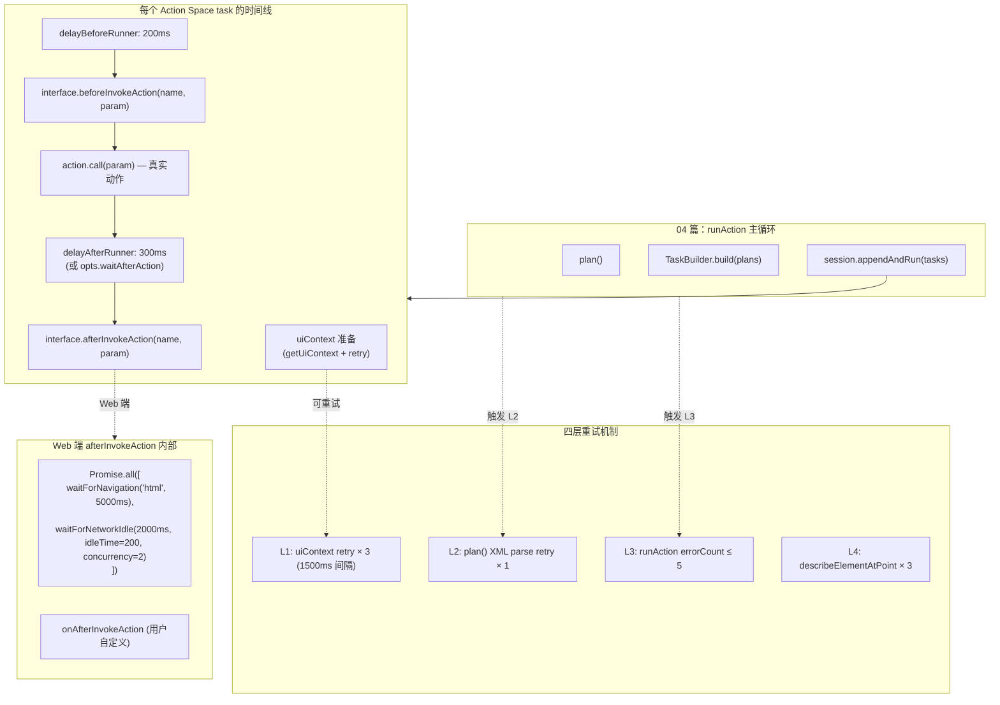

# 05 · 页面就绪与失败重试（Page Readiness & Retry）

> 分析基于 commit `702d5375`（main，v1.8.1）
>
> 本篇核心目标：揭开"动作执行前后到底等了什么"和"出错后怎么活下去"两个工程问题。覆盖核心要点 **B2（页面就绪）** 和 **B4（失败重试 & 错误恢复）**。

---

## 0. TL;DR

- **Midscene 没有"等页面变稳"的视觉判定**——它依赖 `waitForNavigation` + `waitForNetworkIdle` + 固定 `sleep` 三件套。视觉稳定性判定（如截图前后对比）**未实现**。
- **页面就绪有三层"墙"**，每层各管一段时间：
  1. **`delayBeforeRunner = 200ms`**（每个 action 前的固定停顿，`task-builder.ts:258`）
  2. **`action.call()`**（端的真实动作）
  3. **`delayAfterRunner = 300ms`**（动作后的固定停顿）+ **`afterInvokeAction()`**（端的清理钩子——Web 端这里跑 `waitForNavigation` + `waitForNetworkIdle`）
- **Web 端的默认超时**：`waitForNavigation` 5000ms，`waitForNetworkIdle` 2000ms（idleTime 200ms，并发阈值 2），全部 **timeout 后只是 console.warn 然后继续**（不抛错）。
- **失败重试分四个独立层级**，互相不串通：
  - **L1（uiContext 重试）**：`getUiContext` 在浏览器导航类错误上重试 3 次，每次间隔 1500ms（`agent.ts:374-419`）
  - **L2（plan parsing 重试）**：`plan()` 内部 XML 解析失败时重试一次 LLM 调用（`llm-planning.ts:248`）
  - **L3（action 执行重试）**：`runAction` 的 `errorCountInOnePlanningLoop ≤ 5`——失败被喂回 LLM 让它换策略（04 篇）
  - **L4（describe element 验证重试）**：`describeElementAtPoint` 默认 retry 3 次，**第 3 次起强制开 deepLocate**（`agent.ts:1089-1136`）
- **"软自愈"是 Midscene 的核心哲学**：上面这些重试都不抛错给用户——错误被打包成自然语言喂回 LLM，让模型自己决定怎么办。**异常驱动 + 模型决策** 替代了传统框架的"重试装饰器"。
- **`beforeInvokeAction` / `afterInvokeAction` 是端给业务层的逃生口**：用户可以注入自定义清理逻辑（关弹窗、加水印、等动画）。Web 端默认已经把 `waitForNavigation` + `waitForNetworkIdle` 塞进 `afterInvokeAction`。

---

## 1. 它解决了什么问题

UI 自动化最棘手的不是"做什么"，而是"什么时候做"。三类问题构成主要矛盾：

1. **太早**：点 Submit 按钮，但表单还没加载完——找不到元素或点错位置
2. **太晚**：每次都 sleep 5 秒——慢得无法忍受，CI 时间爆炸
3. **失败**：网络抽风、模型理解错、页面跳到新 tab——不能让一次故障拉垮整个测试

传统框架（Selenium / Playwright）的方案：**`waitForSelector`** + **显式等待**。但 Midscene 是纯视觉的，**没有 selector 概念**——它必须找到一套"selector-free 的页面就绪"机制。这一篇就是这套机制的源码巡礼。

---

## 2. 它在整体架构中的位置



---

## 3. 源码导览

| 文件 | 关键位置 | 角色 |
|---|---|---|
| `packages/core/src/agent/task-builder.ts` | 258 / 317 | `delayBeforeRunner` / `delayAfterRunner` 固定停顿 |
| `packages/core/src/agent/agent.ts` | 374-419 | `CONTEXT_RETRY_MAX = 3`、`CONTEXT_RETRY_DELAY_MS = 1500`、`getUiContext` 重试 |
| `packages/core/src/agent/agent.ts` | 382 | `isRetryableContextError(_error)` —— 子类可重写 |
| `packages/core/src/agent/agent.ts` | 1081-1144 | `describeElementAtPoint` 验证重试（含 deepLocate 升级） |
| `packages/core/src/ai-model/llm-planning.ts` | 246-254 | XML 解析失败时重试一次 LLM 调用 |
| `packages/core/src/ai-model/llm-planning.ts` | 257-263 | `<action-type>` 和 `<complete>` 并存时优先 action |
| `packages/web-integration/src/puppeteer/base-page.ts` | 48-49 | `BROWSER_NAVIGATION_ERROR_PATTERN` 正则 |
| `packages/web-integration/src/puppeteer/base-page.ts` | 168-237 | `waitForNavigation` + `waitForNetworkIdle` 实现 |
| `packages/web-integration/src/puppeteer/base-page.ts` | 881-896 | Web 端 `beforeInvokeAction` / `afterInvokeAction` |
| `packages/web-integration/src/puppeteer/base-page.ts` | 1148-1178 | `forceClosePopup`——把新 tab 强行关掉 + 在当前 tab 跳转 |
| `packages/web-integration/src/web-element.ts` | 14-30 | `WebPageOpt`：用户配置入口 |
| `packages/web-integration/src/web-element.ts` | 86-108 | `limitOpenNewTabScript`：拦截 `window.open` / `target=_blank` |
| `packages/web-integration/src/puppeteer/index.ts` | 33-37 | `PuppeteerAgent.isRetryableContextError` 重写 |
| `packages/shared/src/constants/index.ts` | 35-37 | `DEFAULT_WAIT_FOR_NAVIGATION_TIMEOUT = 5000`、`NETWORK_IDLE = 2000`、`CONCURRENCY = 2` |

---

## 4. 核心机制深度解析

### 4.1 B2：动作前后的"三明治结构"

每个 `Action Space` task 在 `TaskBuilder.handleActionPlan` 里被包成下面这个时间线（源码 `task-builder.ts:257-341`）：

```
┌──────────────────────────────────────────────────────────────────────┐
│  时间线（单位 ms）       │  正在做的事                                   │
├──────────────────────────────────────────────────────────────────────┤
│  T = 0                  │  task.timing.start = Date.now()              │
│  T = ~10                │  getUiContext()（可能命中 300ms TTL 缓存）    │
│  T = ~20                │  setTiming('beforeInvokeActionHookStart')    │
│                         │  Promise.all([                              │
│  T = ~20–200            │    interface.beforeInvokeAction(name, param)│
│                         │    sleep(delayBeforeRunner ?? 200)           │
│                         │  ])                                          │
│  T = ~220               │  setTiming('beforeInvokeActionHookEnd')      │
│                         │  parseActionParam(param, schema, {ratio})    │
│  T = ~225               │  setTiming('callActionStart')                │
│                         │  action.call.bind(interface)(param)          │
│  T = ~225 + execTime    │  setTiming('callActionEnd')                  │
│                         │  sleep(delayAfterRunner ?? waitAfterAction   │
│  T = ~525 + execTime    │                ?? 300)                       │
│                         │  setTiming('afterInvokeActionHookStart')     │
│                         │  interface.afterInvokeAction(name, param)    │
│  T = ~525 + execTime    │  ← Web 端在这里跑 waitForNavigation +        │
│       + ~0–7000         │      waitForNetworkIdle（最多再花 ~7 秒）     │
│  T = end                │  setTiming('afterInvokeActionHookEnd')       │
└──────────────────────────────────────────────────────────────────────┘
```

**几个关键的"魔数"和它们的工程理由**：

| 数值 | 来源 | 工程理由 |
|---|---|---|
| `delayBeforeRunner = 200ms` | `task-builder.ts:258` | 让 UI 有时间收到 focus / 关闭 IME 输入法 |
| `delayAfterRunner = 300ms` | `task-builder.ts:317` | 给动画 / 焦点变化留时间，但不长到拖慢测试 |
| `delayBeforeRunner` 可被 action 自带值覆盖 | `device/index.ts` 各 `defineAction*` | 例如 Android 的 `homeButton` 可以设更长的前置等待 |
| `waitAfterAction` 是 agent 级覆盖 | `agent.ts:328` → `task-builder.ts:317` | 一次性把所有动作的后置时间调宽（适合慢页面） |

#### 4.1.1 为什么用 `Promise.all([before, sleep])` 而不是顺序？

`task-builder.ts:260-275` 原文：

```ts
await Promise.all([
  (async () => {
    if (this.interface.beforeInvokeAction) {
      await this.interface.beforeInvokeAction(action.name, param);
    }
  })(),
  delayBeforeRunner > 0 ? sleep(delayBeforeRunner) : Promise.resolve(),
]);
```

**这是个优化**：钩子本身可能要花点时间（例如做点 evaluate），200ms sleep 可以**和钩子并发跑**，避免叠加。如果钩子已经超过 200ms，就直接走完不再等 sleep。

#### 4.1.2 为什么 `afterInvokeAction` 不和 `delayAfterRunner` 并发？

读 `task-builder.ts:317-329`：

```ts
const delayAfterRunner = action.delayAfterRunner ?? this.waitAfterAction ?? 300;
if (delayAfterRunner > 0) {
  await sleep(delayAfterRunner);  // ← 先 sleep
}
try {
  if (this.interface.afterInvokeAction) {
    await this.interface.afterInvokeAction(action.name, param);  // ← 再钩子
  }
}
```

**顺序的工程理由**：
- `delayAfterRunner` 是给"动作的视觉效果"留时间——例如点击触发的动画
- `afterInvokeAction` 在 Web 端会跑 `waitForNetworkIdle`——**必须先有 sleep 让请求发出来**，否则 networkIdle 检测会"看到一切都很闲"立即返回
- 这两者不能并发，因为"等动画完"和"等请求发起"是有先后逻辑的

### 4.2 Web 端 `afterInvokeAction` 内部：双等待并发

`base-page.ts:887-896`：

```ts
async afterInvokeAction(name: string, param: any): Promise<void> {
  await Promise.all([
    this.waitForNavigation('afterInvokeAction', name),
    this.waitForNetworkIdle('afterInvokeAction', name),
  ]);
  if (this.onAfterInvokeAction) {
    await this.onAfterInvokeAction(name, param);
  }
}
```

两个等待**并发跑**，因为它们针对不同信号：

#### 4.2.1 `waitForNavigation`：等 `<html>` 元素出现

`base-page.ts:168-201`：

```ts
async waitForNavigation(moment, actionName?) {
  if (this.waitForNavigationTimeout === 0) return;  // 0 = 跳过
  try {
    await (this.underlyingPage as PuppeteerPage).waitForSelector('html', {
      timeout: this.waitForNavigationTimeout,  // 默认 5000ms
    });
  } catch (error) {
    console.warn('[midscene:warning] Waiting for "navigation" timed out, but Midscene will continue...');
  }
}
```

**关键观察**：
- 等的不是"导航完成"，**等的是 `<html>` 元素存在**——一个非常弱的条件
- 这个等待的本质是"检测页面有没有刚跳走"——如果跳了，`<html>` 短暂不存在，等到新页面的 `<html>` 出现
- **timeout = 5000ms 后 console.warn 然后继续**——失败软处理

> 注释里引用了 Puppeteer issue #3323，说明这个曲线救国是 Puppeteer 历史 bug 的应对。

#### 4.2.2 `waitForNetworkIdle`：等 200ms 内并发请求 ≤ 2

`base-page.ts:203-237`：

```ts
async waitForNetworkIdle(moment, actionName?) {
  if (this.interfaceType === 'puppeteer') {
    if (this.waitForNetworkIdleTimeout === 0) return;
    try {
      await (this.underlyingPage as PuppeteerPage).waitForNetworkIdle({
        idleTime: 200,                                              // 200ms 内
        concurrency: DEFAULT_WAIT_FOR_NETWORK_IDLE_CONCURRENCY,     // 同时只有 ≤ 2 个请求
        timeout: this.waitForNetworkIdleTimeout,                    // 默认 2000ms
      });
    } catch (error) {
      console.warn('[midscene:warning] Waiting for "network idle" timed out, but Midscene will continue...');
    }
  } else {
    // Playwright 走另一条路（不调用 networkidle，因为有副作用）
    if (!this.playwrightNetworkIdleWarningShown) {
      this.playwrightNetworkIdleWarningShown = true;
      warnPage('[midscene:warning] waitForNetworkIdle is skipped for Playwright...');
    }
  }
}
```

**几个工程细节**：

| 配置 | 值 | 含义 |
|---|---|---|
| `idleTime` | 200ms | 200ms 内没新请求才算 idle |
| `concurrency` | 2 | 允许 2 个并发请求存在（轮询心跳 / SSE 等不算"忙"） |
| `timeout` | 2000ms | 超过 2 秒还没空闲就放弃 |

**为什么 Playwright 跳过**：Playwright 的 `networkidle` 实现机制和 Puppeteer 不同，在 Midscene 的使用场景下副作用太大（具体细节他们没在代码里详述，但 warning 一次后不再重复）。如果你用 Playwright agent，**`waitForNetworkIdle` 是空操作**——只能靠 `waitForNavigation` 的 5 秒 + 自定义 `afterInvokeAction`。

#### 4.2.3 同时也有"页面加载阶段"的 networkIdle

不只是动作后，**初次 `page.goto` 也等 networkIdle**。看 `agent-launcher.ts:300-319`：

```ts
launcherDebug('goto', target.url);
await page.goto(target.url);
if (waitForNetworkIdleTimeout > 0) {
  await page.waitForNetworkIdle({ timeout: waitForNetworkIdleTimeout });
}
```

`continueOnNetworkIdleError` 配置可以决定首次 goto 的 networkIdle 失败是否要让整个 agent 启动失败——默认是"console.warn 后继续"（line 308-318）。

### 4.3 端的 `beforeInvokeAction` / `afterInvokeAction`：跨端对照

| 端 | `beforeInvokeAction` 实现 | `afterInvokeAction` 实现 |
|---|---|---|
| **Web (Puppeteer/Playwright)** | 调用用户传入的 `opts.beforeInvokeAction`（仅自定义钩子） | `waitForNavigation` + `waitForNetworkIdle` 并发 + 用户钩子 |
| **Android** | （搜索源码未见显式实现） | 同上（搜索源码未见显式实现） |
| **iOS** | 同上 | 同上 |
| **Computer / Harmony** | 同上 | 同上 |

> `device/index.ts:149-150` 把 `beforeInvokeAction` / `afterInvokeAction` 声明为 `abstract ... ?` 可选实现。在搜过的端代码里，**只有 Web 端默认填充**了这两个方法（用于 navigation / networkIdle）。其他端走的是 `task-builder` 的 `delayBeforeRunner / delayAfterRunner` 通用 sleep——它们的"页面就绪"完全依赖这两个固定停顿。

**这是一个非常诚实的设计**：Web 有 networkIdle 概念，移动/桌面没有等价物，所以**只在 Web 端做了对应的等待**，其他端用更通用的 sleep 兜底。

### 4.4 B4：失败重试的四个独立层级

这一节是本篇最关键的部分。**Midscene 没有一个"全局重试器"**——它有四套独立的容错机制，每套针对不同失败模式。

#### 4.4.1 L1：`getUiContext` 重试（针对"截图都没拿到"）

源码 `agent.ts:374-419`：

```ts
private static readonly CONTEXT_RETRY_MAX = 3;
private static readonly CONTEXT_RETRY_DELAY_MS = 1500;

protected isRetryableContextError(_error: unknown): boolean {
  return false;  // 基类不做重试，子类决定
}

async getUIContext(action?: ServiceAction): Promise<UIContext> {
  // ... frozen / VL warning ...
  for (let attempt = 0; ; attempt++) {
    try {
      return await commonContextParser(this.interface, {...});
    } catch (error) {
      if (attempt < CONTEXT_RETRY_MAX && this.isRetryableContextError(error)) {
        await sleep(CONTEXT_RETRY_DELAY_MS);  // 1500ms
        continue;
      }
      throw error;
    }
  }
}
```

**关键设计**：
- **基类不重试**——`isRetryableContextError` 默认返回 `false`，意味着 `Agent` 自己不知道什么错该重试
- **子类决定可重试条件**——`PuppeteerAgent` / `PlaywrightAgent` / `ChromeExtensionAgent` 各自重写
- 重试 3 次，每次间隔 1500ms ⇒ **最坏情况下截图重试占 ~4.5s**

**Puppeteer/Playwright 的具体定义**（`puppeteer/index.ts:33-37`）：

```ts
protected isRetryableContextError(error: unknown): boolean {
  return (
    error instanceof Error &&
    BROWSER_NAVIGATION_ERROR_PATTERN.test(error.message)
  );
}
```

`BROWSER_NAVIGATION_ERROR_PATTERN`（`base-page.ts:48-49`）：

```ts
export const BROWSER_NAVIGATION_ERROR_PATTERN =
  /execution context was destroyed|frame was detached|target closed|page has been closed|context was destroyed|net::ERR_ABORTED/i;
```

**这条正则覆盖了什么**：
- `execution context was destroyed`——CDP 的 JS 上下文在你 evaluate 时被销毁（页面正在跳转）
- `frame was detached`——iframe 还没准备好
- `target closed` / `page has been closed`——tab 被关了（罕见）
- `net::ERR_ABORTED`——请求被取消（通常是中途跳转）

**这就是"用户点了登录按钮，页面正在跳转，恰好这一刻 Midscene 试图截图"的容错路径**。等 1.5 秒重试，往往就 OK 了。

#### 4.4.2 L2：plan() 的 XML 解析失败重试

源码 `ai-model/llm-planning.ts:243-256`：

```ts
let planFromAI: RawResponsePlanningAIResponse;
try {
  try {
    planFromAI = parseXMLPlanningResponse(rawResponse, modelFamily);
  } catch {
    const retry = await callAI(msgs, modelConfig, { abortSignal: opts.abortSignal });
    rawResponse = retry.content;
    usage = retry.usage;
    reasoning_content = retry.reasoning_content;
    planFromAI = parseXMLPlanningResponse(rawResponse, modelFamily);
  }
  // ...
}
```

**只重试一次**。如果模型输出连续两次都解析不了 XML，就让 `AIResponseParseError` 抛上来——交给 L3 处理。

**为什么只重试一次**：
- 解析失败要么是模型 bug（重试也没用），要么是临时抽风（重试一次就够）
- 多次重试浪费 token 成本
- L3 已经能把这个错误转成自然语言喂回模型，让它"换种思路"

#### 4.4.3 L3：`runAction` 的 `errorCountInOnePlanningLoop`

04 篇详细讲过。要点：
- 上限 5 次（`tasks.ts:62`）
- 失败被打包成 `pendingFeedbackMessage` 喂回 LLM，让它自己换策略
- 这是 Midscene 的"软自愈"主战场——**异常被翻译成 prompt 给模型看**

#### 4.4.4 L4：`describeElementAtPoint` 的验证重试

源码 `agent.ts:1081-1144`。这是个**只在 deepLocate 调试中用得到**的 API（02 篇 6 个工具方法之一），但它的重试设计值得专门看：

```ts
async describeElementAtPoint(center, opt?) {
  const { verifyPrompt = true, retryLimit = 3 } = opt || {};

  let success = false;
  let retryCount = 0;
  let resultPrompt = '';
  let deepLocate = opt?.deepLocate || false;

  while (!success && retryCount < retryLimit) {
    if (retryCount >= 2) {
      deepLocate = true;   // ← 第 3 次起强制升级
    }
    const text = await this.service.describe(center, modelConfig, { deepLocate });
    resultPrompt = text.description;
    const verifyResult = await this.verifyLocator(resultPrompt, undefined, center, opt);
    if (verifyResult.pass) {
      success = true;
    } else {
      retryCount++;
    }
  }
  return { prompt: resultPrompt, deepLocate, verifyResult };
}
```

**精彩的"升级式重试"**：
- 前两次用普通 locate（快、便宜）
- **从第 3 次开始强制开 `deepLocate: true`**——会触发 `AiLocateSection` 先裁剪区域再细化，慢但精度高
- `verifyLocator`（`agent.ts:1146-1171`）：用描述去重定位，看返回的中心点和期望中心点距离 ≤ 20 像素或落在矩形内

**这是一种"先尝试便宜方案，失败后升级到昂贵方案"的设计模式**——比"每次都用最贵方案"省成本，比"只用便宜方案"鲁棒。

#### 4.4.5 重试层级总览表

| 层 | 上限 | 间隔 | 触发条件 | 失败后 | 源码位置 |
|---|---|---|---|---|---|
| L1 | 3 | 1500ms | `isRetryableContextError(error) === true` | 抛 error 给上层 | `agent.ts:398` |
| L2 | 1 | 立即 | `parseXMLPlanningResponse` 抛错 | `AIResponseParseError` 上抛 | `llm-planning.ts:248` |
| L3 | 5 | 立即 | action 执行抛任何错 | `appendErrorPlan('Too many errors...')` | `tasks.ts:520` |
| L4 | 3 | 立即 | `verifyResult.pass === false` | 返回最后一次结果（不抛错） | `agent.ts:1097` |

**四层不互通**——比如 L1 重试 3 次失败抛错，会被 L3 计入 errorCount，不会让 L2 又重试一次。这种"独立计数器"的设计避免了重试级联，但也意味着**最坏情况下一次动作可能经历 3 + 1 + 5 = 9 次"准重试"**。

### 4.5 `forceClosePopup` + `forceSameTabNavigation`：跨端最难处理的弹窗

UI 自动化里有个经典问题：**用户点击"打开"按钮，新建了一个 tab。Midscene 的 page 引用还在原 tab，整个测试卡死**。

Midscene 的解法分两步：

#### 4.5.1 注入页内 JavaScript 拦截 `window.open` + `target=_blank`

`web-element.ts:86-108`：

```js
window.__MIDSCENE_NEW_TAB_INTERCEPTOR_INITIALIZED__ = true;

// 拦截 window.open
window.open = function(url) {
  console.log('Blocked window.open:', url);
  window.location.href = url;   // ← 转成当前 tab 跳转
  return null;
};

// 拦截所有 a target="_blank"
document.addEventListener('click', function(e) {
  const target = e.target.closest('a');
  if (target && target.target === '_blank') {
    e.preventDefault();
    window.location.href = target.href;
    target.removeAttribute('target');
  }
}, true);
```

**触发条件**：`opts.forceSameTabNavigation = true`（YAML 入口的默认值，`agent-launcher.ts:367`）。

**注入位置**：在 `PuppeteerAgent` / `PlaywrightAgent` 构造函数里通过 `addInitScript` / `evaluateOnNewDocument` 跑这段 JS（`puppeteer/index.ts:49-53` 等）。

#### 4.5.2 Listener 兜底：拦不住的就关了

`base-page.ts:1148-1178` 的 `forceClosePopup`：

```ts
page.on('popup', async (popup) => {
  const url = await popup.url();
  console.log(`Popup opened: ${url}`);
  if (!popup.isClosed()) {
    await popup.close();          // ← 直接关掉新 tab
  }
  if (!page.isClosed()) {
    await page.goto(url);          // ← 在原 tab 跳过去
  }
});
```

**两道防线**：
1. **页内拦截**——大多数场景 `window.open` 不会真的开新 tab
2. **进程内监听**——少数情况（如 `_blank` 通过 `dispatchEvent` 触发）页内拦截失效，监听器关掉新 tab 再跳

**这是个非常工程化的妥协**——理论上不该 hack 用户页面，但实践中这是让"纯视觉单 tab 自动化"在多 tab 网页里跑得通的唯一办法。

### 4.6 视觉稳定性判定：**未实现**

我搜遍了源码，**没有找到任何"截图前后对比 → 等到画面稳定"的逻辑**。具体来说：

- 没有 `imageDiff` / `visualStable` / `pixelmatch` 之类的工具调用
- 没有"连续两张截图相似度 > X 才认为稳定"的循环
- `waitForNetworkIdle` 是最接近的"页面稳了"判定，但它看的是网络不是像素

**这是个有意识的取舍**——视觉稳定性判定的代价（截图、压缩、比较）每次至少 100-500ms，叠加在 `delayAfterRunner: 300ms` + `waitForNetworkIdle: ≤2000ms` 上就太慢了。**他们赌网络空闲 ≈ 视觉空闲**——大多数 web 场景成立。

但这意味着：
- 纯 CSS 动画结束的等待**没有专门机制**（依赖 300ms 兜底）
- 视频播放、轮播图等持续动画**会被截到任意一帧**
- 大量本地计算（如 canvas 渲染、客户端 SPA 路由）**没有信号可等**

**用户的应对**：通过 `waitAfterAction` 全局拉长后置等待，或 `aiWaitFor` 显式等到某个状态。

### 4.7 `aiWaitFor`：把"等"作为一等公民

04 篇讲过 `aiWaitFor` 的循环结构。这里强调它和"页面就绪"的关系：

- `waitForNavigation` / `waitForNetworkIdle` 是**框架级被动等**——每个 action 后必跑
- `aiWaitFor` 是**用户级主动等**——只在需要时调用，明确告诉模型要等什么

**推荐用法**：

```ts
await agent.aiAct('点击搜索按钮');
await agent.aiWaitFor('搜索结果列表已加载', {
  timeoutMs: 15000,
  checkIntervalMs: 3000,
});
```

第二条比把"等结果加载"逻辑塞进第一条的 prompt 里更可靠——因为 `aiWaitFor` 用 `Insight/WaitFor` 任务（强制刷新 uiContext）+ 独立循环（不占 replanning cycle 预算）。

---

## 5. 设计取舍与工程权衡

### 5.1 为什么不做视觉稳定性判定？

**没做的原因**（推测）：
1. 成本：每次都比图像 = 至少多一张截图 + 比较算法
2. 模糊性：视频 / 时钟 / 动画背景 → 永远"不稳定"
3. networkIdle 是更便宜的近似——大多数场景够用

**该补的场景**：
- 强动画的应用（如游戏内嵌广告页）
- 视频播放器（YouTube / 抖音）
- canvas 富交互应用

**当下解决方案**：用户用 `waitAfterAction` 把后置等待拉到 1000-2000ms，或 `aiWaitFor` 显式判定。

### 5.2 为什么固定 sleep 而不是 polling？

`delayAfterRunner = 300ms` 是死的。换成 polling 可以做到"如果 100ms 就稳了就提前继续"。**为什么不做**：

- polling 需要轮询信号——但没有视觉信号可轮（见 5.1）
- 网络已经在 `waitForNetworkIdle` 里 poll 了
- 300ms 大多数场景里反而是 too short——很多用户都把它调大

**所以固定 sleep 是合理的下限保护，不是低效的死等**。

### 5.3 为什么四层重试不串通？

最自然的设计是"一个全局重试器，所有失败都进它"。**Midscene 没做**，原因：

- **每层的合理上限不同**：截图失败 3 次 vs 动作失败 5 次 vs XML 解析失败 1 次，**合并就要取最严格**——浪费容错预算
- **每层的失败语义不同**：截图失败是基础设施问题（重试有意义），XML 解析失败是模型问题（重试一次就够），action 失败是逻辑问题（要喂回模型）
- **观测性**：dump 报告里每层失败有不同的标记，调试时一眼看出问题在哪层

### 5.4 为什么 `waitForNavigation` 只等 `<html>` 而不等 `load` 事件？

直觉上 `page.waitForNavigation()` 才是"完整等到页面加载完"。**但他们等的是 `waitForSelector('html')`**——一个超弱的条件。

源码注释（`base-page.ts:181`）：
```ts
// issue: https://github.com/puppeteer/puppeteer/issues/3323
```

**根因**：Puppeteer 的 `waitForNavigation` API 在没有真正发生导航时会 hang 5 秒（issue 是这个意思）。等 `<html>` 是 workaround——**任何活页面都有 `<html>`，所以 `waitForSelector` 立刻返回；只有在页面正在被销毁/重建时，才会等到新文档的 `<html>`**。

**这是一个真实踩坑后的工程妥协**，注释里直接挂了 issue 链接说明来由。

### 5.5 Playwright 为什么主动放弃 networkIdle？

`base-page.ts:230-235`：

```ts
if (!this.playwrightNetworkIdleWarningShown) {
  this.playwrightNetworkIdleWarningShown = true;
  warnPage('waitForNetworkIdle is skipped for Playwright. Playwright does not provide an equivalent underlying capability for the intended post-action network idle behavior here.');
}
```

代码注释没详细解释。**推测**：Playwright 的 `page.waitForLoadState('networkidle')` 默认条件比 Puppeteer 严苛，且行为不稳定（在某些场景下永不返回）。用户只警告一次（用 flag 记），避免刷屏。

**实际影响**：用 Playwright 的话，每个动作后只有 `waitForNavigation`（5s）+ `delayAfterRunner`（300ms）做"页面就绪"——网络相关的等待要靠 Playwright fixture 自己加。

### 5.6 软容错 vs 抛错的选择哲学

每个 `console.warn` 然后继续的地方，都是有意"软失败"。这背后的哲学是：**用户的最终验证是 `aiAssert`，不是中间错误**。

- 截图慢了 → 反正下一步会再截，warn 一下继续
- networkIdle 没等到 → 反正后续 action 失败的话会被 errorCount 兜底
- popup 关不掉 → 视觉上看不到就当作没发生

**但**：模型解析错误（L2 / L3）会被翻译成自然语言喂回 LLM——**让模型自己理解失败、重新决策**。这是把"重试逻辑外包给 LLM"，比传统框架的"自动重试 N 次"更智能。

---

## 6. 与其他模块的协作

- **上游**：
  - 04 篇的 `TaskBuilder.handleActionPlan`（调用 `before-/afterInvokeAction`）
  - `Agent.getUIContext`（每次截图）
- **下游**：
  - 端的 `interface.beforeInvokeAction` / `afterInvokeAction` 实现
  - `service-caller/callAI` 的 retry 由 OpenAI SDK 自己处理（不归 Midscene 管）
- **横向**：
  - 02 篇的 `aiWaitFor`：是这一层的"显式用户接口"
  - 09 篇的 `TaskCache`：缓存命中时跳过整个 plan-execute 链，但仍然走 action 执行的 `before-/after` 钩子

---

## 7. 常见陷阱 & 调试经验

### 7.1 每次动作后都卡 5-7 秒

**症状**：跑测试感觉很慢，每个 action 之间停顿明显。
**根因**：默认 `waitForNavigation 5000ms + waitForNetworkIdle 2000ms`，叠加 `delayAfterRunner 300ms`——一个简单页面也要等 ~7 秒。
**解决**：
```ts
new PuppeteerAgent(page, {
  waitForNavigationTimeout: 1000,
  waitForNetworkIdleTimeout: 500,
});
```
对快速测试 web 场景非常有效。

### 7.2 跑长任务时一直在等 networkIdle

**症状**：debug 日志里反复看到 `waitForNetworkIdle begin` / `waitForNetworkIdle timed out`。
**根因**：页面有长轮询 / WebSocket / SSE，并发请求始终 > 2，永远进不去 idle。
**解决**：
- 把 `waitForNetworkIdleTimeout` 调小（如 500ms）
- 或者把 `waitForNetworkIdleTimeout = 0` 完全禁用
- 在 `opts.afterInvokeAction` 里自己实现合适的等待

### 7.3 `execution context was destroyed` 大量出现

**症状**：debug 日志里频繁看到 L1 重试。
**根因**：页面在快速跳转 / 单页应用 client routing 频繁 / 你的动作触发了 navigation。
**解决**：通常自动处理。如果还是失败，看 dump——可能是 `forceSameTabNavigation` 没开。

### 7.4 弹窗自动关掉但没跳转

**症状**：用了 `forceSameTabNavigation: true`，但点击后新 tab 被关了之后**当前 tab 没跳到目标 URL**。
**根因**：`forceClosePopup` 的 listener 在 `page.goto(url)` 失败时只 debug log，**不抛错**（`base-page.ts:1172-1174`）。
**解决**：
- 看 debug log：`failed to goto ${url}, error: ${error}`
- 通常是 CSP / 跨域问题——尝试不要拦截，让真新 tab 开起来，然后用 multi-page 模式

### 7.5 视频 / 动画导致 `aiAssert` 看错状态

**症状**：断言"视频已暂停"明明视觉上对，模型说"还在播"。
**根因**：没有视觉稳定性等待，模型截到了动画中间帧。
**解决**：
- `agent.aiWaitFor('the video is paused', { timeoutMs: 5000 })`
- 或者在 assert 前 `await new Promise(r => setTimeout(r, 1000))` 给画面稳一下

### 7.6 自定义 `afterInvokeAction` 想加但又不想丢掉默认行为

**症状**：用户传了 `opts.afterInvokeAction`，结果发现 `waitForNetworkIdle` 没跑。
**根因**：检查 `base-page.ts:887-895`——其实**默认 + 用户钩子都跑**：
```ts
async afterInvokeAction(name, param) {
  await Promise.all([
    this.waitForNavigation(...),
    this.waitForNetworkIdle(...),
  ]);
  if (this.onAfterInvokeAction) {
    await this.onAfterInvokeAction(name, param);  // ← 用户钩子在默认之后跑
  }
}
```
**用户钩子在默认 wait 完成之后才跑**。如果你想"完全替换默认"，需要直接继承 `PuppeteerWebPage` 重写 `afterInvokeAction`。

### 7.7 `getUiContext` 重试 3 次还失败

**症状**：抛 `frame was detached` 错误，task 失败。
**根因**：页面在 4.5 秒内（3 × 1500ms）一直没稳定。
**解决**：
- 把这个动作前面加 `aiWaitFor('页面已加载')`
- 或者把动作改成 yaml 脚本带 `sleep: 2000` 兜底

### 7.8 `MIDSCENE_REPLANNING_CYCLE_LIMIT` 设了但没生效

**症状**：环境变量设了 50，但还是 20 圈就停。
**根因**：必须在 Agent 构造时读，不能运行时改。看 `agent.ts:257-275`——`opts.replanningCycleLimit` 优先于环境变量；如果你显式传了 20，环境变量被忽略。
**解决**：要么删掉 `opts.replanningCycleLimit`，要么环境变量 + 显式 opt 都设。

---

## 8. 🛠️ 实操章节

### 8.1 模拟"页面没就绪"看重试

```ts
// scripts/demo-retry.ts
import 'dotenv/config';
import puppeteer from 'puppeteer';
import { PuppeteerAgent } from '@midscene/web';

async function main() {
  const browser = await puppeteer.launch({ headless: false });
  const page = await browser.newPage();
  await page.goto('https://example.com');

  const agent = new PuppeteerAgent(page, {
    waitForNavigationTimeout: 1000,  // 调短便于触发
    waitForNetworkIdleTimeout: 500,
  });

  // 注入一个会主动让"上下文销毁"的导航
  await agent.aiAct('点击 More information... 链接');

  // 立即截图——大概率触发 L1 重试
  const links = await agent.aiQuery<{title: string}[]>(
    '{title: string}[], visible links on this page',
  );
  console.log(links);

  await browser.close();
}

main();
```

跑：
```bash
DEBUG=midscene:agent,web:page,task-runner npx tsx scripts/demo-retry.ts
```

观察日志里的：
- `retryable context error (attempt 1/3), retrying in 1500ms`
- `waitForNetworkIdle begin / timed out`

### 8.2 写自定义 `afterInvokeAction` 钩子

```ts
const agent = new PuppeteerAgent(page, {
  afterInvokeAction: async (name, param) => {
    // 关闭所有 modal/popup
    await page.evaluate(() => {
      document.querySelectorAll('[role="dialog"]').forEach(el => {
        const close = el.querySelector('button[aria-label="Close"]');
        if (close instanceof HTMLElement) close.click();
      });
    });
    console.log(`after ${name}: dialogs cleaned`);
  },
});
```

注意这个钩子**在默认的 `waitForNetworkIdle` 之后才跑**——所以模态框已经渲染好了你才尝试关，时序是对的。

### 8.3 用 dump 报告分析每个动作的耗时

跑任意 demo 后，打开报告 HTML，点开某个 Action Space task，找 `timing` 字段。你会看到类似：

```json
{
  "start": 1715234567890,
  "getUiContextStart": 1715234567892,
  "getUiContextEnd": 1715234568050,        // 截图花了 158ms
  "beforeInvokeActionHookStart": 1715234568051,
  "beforeInvokeActionHookEnd": 1715234568253,   // delayBeforeRunner 200ms
  "callActionStart": 1715234568254,
  "callActionEnd": 1715234568287,          // 真实动作 33ms
  "afterInvokeActionHookStart": 1715234568587,  // 中间是 delayAfterRunner 300ms
  "afterInvokeActionHookEnd": 1715234570651,    // afterInvokeAction 跑了 2 秒
  "end": 1715234570652,
  "cost": 2762                              // 总耗时
}
```

**这是定位"哪段慢"的最直接证据**。`afterInvokeActionHook` 占了 2 秒说明 networkIdle 在等。

### 8.4 推荐断点

| 文件 | 行 | 观察 |
|---|---|---|
| `task-builder.ts:258` | `delayBeforeRunner` 计算 | 看实际的 200 是不是被 action 覆盖了 |
| `task-builder.ts:317` | `delayAfterRunner` 计算 | 看 `waitAfterAction` 有没有生效 |
| `base-page.ts:887` | `afterInvokeAction` 入口 | 看默认 + 用户钩子的执行顺序 |
| `base-page.ts:217` | `page.waitForNetworkIdle` 调用 | 看具体配置（idleTime/concurrency/timeout） |
| `agent.ts:399` | `getUIContext` 重试循环 | 看 attempt 计数和 isRetryableContextError 判定 |
| `agent.ts:1097` | `describeElementAtPoint` 验证循环 | 看 retry / deepLocate 升级 |

### 8.5 引导式实验

1. **观察 `delayBeforeRunner` 的并发优化**：
   把 `device/index.ts` 里某个 action 的 `delayBeforeRunner` 设成 100ms，同时给 interface 加一个慢钩子（`beforeInvokeAction` 跑 500ms）。重 build core，跑动作，看 `beforeInvokeActionHookEnd - beforeInvokeActionHookStart` 是 ~500ms 还是 ~600ms。**应该是 500ms**（并发跑）。

2. **L2 vs L3 重试边界**：
   把 `llm-planning.ts:248` 的 retry 块整个删掉，重 build core，跑会触发 XML 解析失败的场景（例如让模型输出格式怪的 prompt）。观察：原本会重试一次的解析失败，现在直接进 L3 计数器。

3. **完全关闭 `waitForNetworkIdle`**：
   ```ts
   new PuppeteerAgent(page, { waitForNetworkIdleTimeout: 0 });
   ```
   跑一个动态加载的页面，观察 `aiAssert` 失败率上升。然后改成 `waitForNetworkIdleTimeout: 5000`，再跑——理解这个等待的实际价值。

4. **手动触发 `forceSameTabNavigation` 失效**：
   设置 `forceSameTabNavigation: false`，跑一个会开新 tab 的链接——观察 Midscene 卡死（因为它的 page 引用还在原 tab）。

---

## 9. 自检问题

1. 一次 `aiTap` 调用从开始到结束最多可能花多久（不考虑 LLM 调用）？写出每段的预算 + 来源。
2. `waitForNavigation` 等的是 `waitForSelector('html')`，这看起来很弱。这个选择背后的具体工程理由是什么？（提示：注释里挂的 issue）
3. 四层重试机制中，哪一层最有可能让"一次失败的动作"变成"5 次失败的动作"？为什么这个数字是 5 而不是 3 或 10？
4. 我用 Playwright，发现 `waitForNetworkIdle` 完全没等。这是 bug 还是 feature？源码里怎么处理的？
5. 用户传了 `opts.afterInvokeAction` 自定义钩子，但发现 `waitForNetworkIdle` 还是跑了。这是预期行为吗？怎么完全替换默认行为？
6. `forceClosePopup` 是一个 page-level event listener，不是页内 JS。它在什么时候被注册？被什么触发？
7. `describeElementAtPoint` 的"升级式重试"为什么从第 3 次（`retryCount >= 2`）开始升级 deepLocate？想想它的成本结构。

---

## 10. 延伸阅读

- Puppeteer issue #3323（`waitForNavigation` 死锁问题）：https://github.com/puppeteer/puppeteer/issues/3323
- Playwright `waitForLoadState` 行为差异：https://playwright.dev/docs/api/class-page#page-wait-for-load-state
- `packages/shared/src/constants/index.ts:35-37`——三个默认值的精确源头
- 同代对照：Selenium 4 的 `ExpectedConditions`、Cypress 的隐式重试机制——对照后你会理解 Midscene 这种"明示软容错 + LLM 兜底"的独特路线

---

写完了。说"下一个"我就开始写 `06_Device_Abstraction.md`（跨端 Device 抽象 / 各端 `AbstractInterface` 实现细节 / `inputPrimitives` 跨端对照 / 系统级 UI 屏蔽 / Bridge Mode）。
