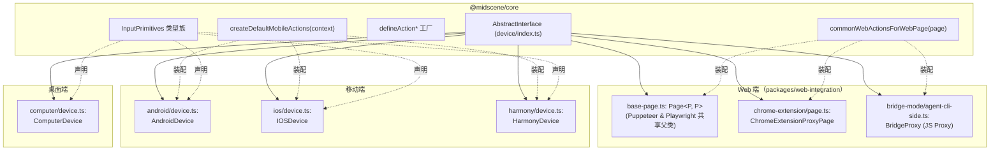
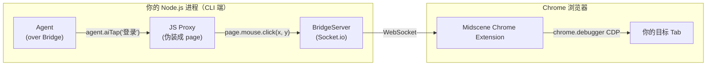

# 06 · 跨端 Device 抽象（Device Abstraction）

> 分析基于 commit `702d5375`（main，v1.8.1）
>
> 本篇核心目标：把 02 篇看到的 `AbstractInterface` 接口"落到 5 个端的具体代码上"，覆盖核心要点 **B3（跨端统一抽象）+ D5（系统级 UI 标准化屏蔽）**。

---

## 0. TL;DR

- **`AbstractInterface` 是 Midscene 跨端统一的契约**（02 篇看过其骨架）。本篇是它的"实现巡礼"——五个端各自怎么实现 `inputPrimitives` + `actionSpace()`。
- **物理层差异巨大，但被压缩进同一组 5 类原语**：`pointer` / `keyboard` / `touch` / `scroll` / `system`。Web 端通过 CDP（Chrome DevTools Protocol），Android 走 adb shell + yadb + scrcpy，iOS 走 WebDriverAgent HTTP，Computer 走 libnut + screenshot-desktop + AppleScript，Harmony 走 hdc 二进制协议。
- **`InterfaceType` 是字符串枚举**（`types.ts:966`），定义了 6 种内置值：`'puppeteer'` / `'playwright'` / `'static'` / `'chrome-extension-proxy'` / `'android'` / 加 fallback `string`。`'ios'` / `'computer'` / `'harmony'` / `'page-over-chrome-extension-bridge'` 等都走 string fallback——**类型层不强制枚举**。
- **每端 `actionSpace()` 都按统一公式拼装**：`createDefaultMobileActions(context)` 或 `commonWebActionsForWebPage(page)` 提供共享动作（Tap/Input/Scroll/...），然后端追加自己的 platform-specific actions（如 Android 的 `AndroidBackButton` / `PullGesture`，Web 的 `Navigate`/`Reload`），最后并入 `customActions`。
- **`Bridge Mode` 是 Web 端的特殊路径**：让你在自己的 Chrome 浏览器（不是 puppeteer 临时浏览器）里跑测试。它通过 Socket.io 在 CLI 端起一个 server，Chrome 扩展作为 client 连过来。Midscene 这边写的是一个 **JavaScript Proxy** 对象，伪装成 `AbstractInterface`，每次方法调用都通过 socket 转发到浏览器执行。
- **系统级 UI 屏蔽（D5）的实际实现非常薄**：Web 端有 `forceSameTabNavigation` 拦弹窗 + `forceChromeSelectRendering` 拦截原生 select。Android/iOS 没有"屏蔽状态栏"之类的统一机制——纯靠模型识别 + Prompt 规则。

---

## 1. 它解决了什么问题

跨端 UI 自动化最难的不是"动作不一样"——是**动作语义不一样**：

| 概念 | Web | Android | iOS | Desktop |
|---|---|---|---|---|
| "点击" | 鼠标 down/up 或 touch | adb input tap | WDA tap 端点 | libnut mouseClick |
| "输入文字" | 键盘 type 字符串 | adb input text + yadb（中文） | WDA Type Element | AppleScript or libnut keyTap |
| "滚动" | wheel event 或 touch swipe | adb input swipe（持续触摸） | WDA dragFromTo | libnut scrollMouse |
| "回到主页" | （没有概念） | adb input keyevent KEYCODE_HOME | WDA `/wda/homescreen` | （没有概念） |
| "屏幕尺寸" | viewport (CSS px) | wm size + scale factor | WDA `/wda/screen` | screenshot-desktop bound |

直接让模型理解这些差异是灾难。Midscene 的做法是：**用 `inputPrimitives` 5 类抽象把它们都翻译成同一组 method**。`pointer.tap({x, y})` 在任意端都是"在坐标(x,y)上戳一下"，**模型只需要知道一组动作语义，端负责把它翻译成 adb / CDP / libnut**。

这一篇就是看 5 个端是怎么"做翻译"的。

---

## 2. 它在整体架构中的位置



---

## 3. 源码导览

### 3.1 5 端 + 3 个 Web 变体 完整文件清单

| 端 | 类名 | 文件 | 行数 | `interfaceType` |
|---|---|---|---|---|
| **Puppeteer** | `PuppeteerWebPage extends Page<'puppeteer', PuppeteerPage>` | `web-integration/src/puppeteer/page.ts` + `base-page.ts` | 1233（共享） | `'puppeteer'` |
| **Playwright** | `PlaywrightWebPage extends Page<'playwright', PlaywrightPage>` | `web-integration/src/playwright/page.ts` + `base-page.ts` | 同上 | `'playwright'` |
| **Chrome Extension** | `ChromeExtensionProxyPage` | `web-integration/src/chrome-extension/page.ts` | 994 | `'chrome-extension-proxy'` |
| **Bridge Mode** | 动态 JS Proxy | `web-integration/src/bridge-mode/agent-cli-side.ts` | 229 | `'page-over-chrome-extension-bridge'` |
| **Static** | `StaticPage` | `web-integration/src/static.ts` | — | `'static'`（纯截图，无动作） |
| **Android** | `AndroidDevice` | `android/src/device.ts` | 2086 | `'android'` |
| **iOS** | `IOSDevice` | `ios/src/device.ts` | 1086 | `'ios'` |
| **Computer** | `ComputerDevice` | `computer/src/device.ts` | 1047 | `'computer'` |
| **Harmony** | `HarmonyDevice` | `harmony/src/device.ts` | 837 | `'harmony'` |

> **观察**：Android 文件最大（2086 行），不是因为它复杂，而是因为它要兼容 adb 截图 + scrcpy 截图 + yadb 中文输入 + 5 种屏幕方向 + 多 display + 应用名映射。**安卓生态的碎片化在这里体现得淋漓尽致**。

### 3.2 Web 端的"父类 + 子类"复用结构

Web 端的 `Puppeteer` 和 `Playwright` 共享同一个 `base-page.ts` 里的泛型类：

```ts
// packages/web-integration/src/puppeteer/base-page.ts:91
export class Page<
  AgentType extends 'puppeteer' | 'playwright',
  InterfaceType extends PuppeteerPage | PlaywrightPage,
> implements AbstractInterface {
  underlyingPage: InterfaceType;
  interfaceType: AgentType;  // ← 子类传入字面量类型
  // ... 实现所有 AbstractInterface 方法
}
```

然后 Puppeteer 和 Playwright 各自的 page.ts 只是一行 `extends`：

```ts
// puppeteer/page.ts (简化)
export class WebPage extends Page<'puppeteer', PuppeteerPage> { ... }

// playwright/page.ts (简化)
export class WebPage extends Page<'playwright', PlaywrightPage> { ... }
```

**两端代码差异**：通过运行时 `if (this.interfaceType === 'puppeteer')` 分流（08 节会展开几个具体差异点）。

---

## 4. 核心机制深度解析

### 4.1 `inputPrimitives` 5 类原语 跨端对照

把 02 篇看过的 5 类抽象在 4 个端上落到具体调用：

| 原语 | Android | iOS | Computer | Web (Puppeteer) |
|---|---|---|---|---|
| **`pointer.tap`** | `adb shell input tap {x} {y}` | WDA POST `/wda/tap/0` 端点 | `libnut.moveMouse + mouseToggle('down'/'up','left')` | `page.mouse.click(x, y)` |
| **`pointer.doubleClick`** | 同 tap 两次 + 间隔 | WDA POST `/wda/doubleTap` | `libnut.mouseClick('left', true)` | `page.mouse.click({clickCount:2})` |
| **`pointer.rightClick`** | (不支持) | (不支持) | `libnut.mouseClick('right')` | `page.mouse.click({button:'right'})` |
| **`pointer.hover`** | (不支持) | (不支持) | `smoothMoveMouse(...)` + wait | `page.mouse.move(x, y)` |
| **`pointer.longPress`** | `adb shell input swipe x y x y duration` | WDA POST `/wda/touchAndHold` | (走 swipe with same point) | `mouse.down + sleep + mouse.up` |
| **`pointer.dragAndDrop`** | adb input swipe | WDA swipe | libnut down + move + up | mouse.down + move + up |
| **`keyboard.typeText`** | `adb input text` 或 yadb（中文） | WDA POST `/element/.../value` | `libnut.typeString` 或 AppleScript | `page.keyboard.type(value)` |
| **`keyboard.keyboardPress`** | `adb input keyevent KEYCODE_*` | WDA POST `/wda/keys` | `libnut.keyTap(...)` + 组合键解析 | `page.keyboard.press(...)` |
| **`keyboard.clearInput`** | tap target + select all + delete | WDA clear element | libnut select all + delete | page select all + delete |
| **`touch.swipe`** | adb input swipe（含 duration） | WDA dragfromtoforduration | (Web 端 mouse 模拟，分 30 步) | page.mouse 分步 |
| **`touch.pinch`** | **yadb 二进制工具**注入 + `app_process` 调用 | WDA POST `/wda/pinch` | (不支持) | (不支持) |
| **`scroll.scroll`** | adb input swipe 模拟 | WDA scroll | libnut scrollMouse | page.mouse.wheel |
| **`system.backButton`** | `adb keyevent KEYCODE_BACK` | (无概念) | (无概念) | (无概念) |
| **`system.homeButton`** | `adb keyevent KEYCODE_HOME` | (无概念) | (无概念) | (无概念) |

**几个观察**：
- **Web/Desktop 不实现 `system.*`**——它们没有"系统返回键"的概念。
- **iOS 不实现 `system.*`**——iOS 的"返回"是 UI 元素级别（每个 App 都不一样），不是系统级硬键。
- **Android 是 5 类原语全实现的唯一端**。
- **`touch.pinch` 在 Android 实现得最辛苦**——需要先把 [yadb](https://github.com/ysbing/YADB) 推到 `/data/local/tmp/yadb`，然后用 `app_process` 调用 Java 类，原因是 adb 没有捏合手势 API。

### 4.2 `actionSpace()` 的统一拼装公式

读完五个端的 `actionSpace()` 实现，可以总结出**所有端都遵循同一个公式**：

```
actionSpace() = 共享通用动作（来自 inputPrimitives）
              + 平台特有动作（platform-specific）
              + 用户 customActions
```

#### 4.2.1 移动端三件套：Android / iOS / Harmony

`android/src/device.ts:171-254`：

```ts
actionSpace(): DeviceAction<any>[] {
  const mobileActionContext = {
    input: this.inputPrimitives,
    size: () => this.size(),
    sleep: async (timeMs) => await sleep(timeMs),
    getDefaultAutoDismissKeyboard: () => this.options?.autoDismissKeyboard,
    systemActions: {
      backButton: { name: 'AndroidBackButton', description: '...' },
      homeButton: { name: 'AndroidHomeButton', description: '...' },
      recentAppsButton: { name: 'AndroidRecentAppsButton', description: '...' },
    },
  };
  const defaultActions = [
    ...createDefaultMobileActions(mobileActionContext),  // 通用：Tap/Input/Scroll/Swipe/...
    defineAction({ name: 'PullGesture', ... }),  // ← Android 独有
  ];
  const platformSpecificActions = Object.values(createPlatformActions(this));  // Launch/Terminate 等
  const customActions = this.customActions || [];
  return [...defaultActions, ...platformSpecificActions, ...customActions];
}
```

iOS（`ios/device.ts:163`）和 Harmony（`harmony/device.ts:140`）走完全相同的公式，只是 `systemActions` 不同（iOS 没有 system 三件套；Harmony 也没有）。

#### 4.2.2 Web 端：`commonWebActionsForWebPage`

`web-integration/src/web-page.ts:557-624`：

```ts
export const commonWebActionsForWebPage = <T extends AbstractWebPage>(
  page: T,
  includeTouchEvents = false,
): DeviceAction<any>[] => {
  const input = createWebInputPrimitives(page);  // ← 把 Page 包成 InputPrimitives
  return [
    ...defineActionsFromInputPrimitives(input, {
      size: () => page.size(),
      includeSwipe: includeTouchEvents,
    }),
    defineAction({ name: 'Navigate', ... }),
    defineAction({ name: 'Reload', ... }),
    defineAction({ name: 'GoBack', ... }),
    defineAction({ name: 'GoForward', ... }),
  ];
};
```

Puppeteer / Playwright / ChromeExtension / Bridge 都走这个函数（**只差一个 page 参数**）。**这就是为什么改一行 `commonWebActionsForWebPage`，所有 Web 端的行为同步变**。

#### 4.2.3 Computer 端：自己拼

`computer/src/device.ts:998-1045`（简化）：

```ts
actionSpace(): DeviceAction<any>[] {
  return [
    ...defineActionsFromInputPrimitives(this.inputPrimitives),  // 通用动作
    // 桌面特有
    ComputerSpecificActions.ListDisplays,
    ComputerSpecificActions.SwitchDisplay,
    ComputerSpecificActions.LaunchApp,
    ComputerSpecificActions.TerminateApp,
    // ...
  ];
}
```

桌面端没有 `system` 类（没有 home/back），所以**只用 `pointer / keyboard / scroll` 三类**。

### 4.3 端的"系统平台动作"：超出基本动作集的扩展

每端都有自己专属的 platform actions。整理一份完整表：

| 端 | platform-specific actions | 来源 |
|---|---|---|
| **Android** | `AndroidBackButton`、`AndroidHomeButton`、`AndroidRecentAppsButton`、`Launch`、`Terminate`、`RunAdbShell`、`PullGesture` | `android/src/device.ts` + `appNameMapping.ts` |
| **iOS** | `IOSHome`、`Launch`、`Terminate`、`RunWdaRequest`、（iOS 没有 back/recent，靠应用内 UI） | `ios/src/device.ts` |
| **Harmony** | `HarmonyHome`、`Launch`、`Terminate` | `harmony/src/device.ts` |
| **Computer** | `ListDisplays`、`SwitchDisplay`、`LaunchApp`、`TerminateApp`、`SetScreenSize` 等 | `computer/src/device.ts:998+` |
| **Web (Puppeteer/Playwright/Extension/Bridge)** | `Navigate`、`Reload`、`GoBack`、`GoForward` | `web-page.ts:557` |

**这张表的工程价值**：你想在 dump 报告里看到 `<action-type>Launch</action-type>` 这种节点，就是这里定义的。**模型在看到 actionSpace 描述时就知道这些端特有动作存在，会主动用**。

### 4.4 屏幕尺寸 / DPR / 坐标系：跨端的核心难点

每端对"屏幕尺寸"的理解都不同，但 Midscene 必须统一成一组 `Size = {width, height}` + `devicePixelRatio` 数值。

| 端 | `size()` 实现 | DPR 来源 |
|---|---|---|
| **Web** | `page.viewport()` (Puppeteer) / `page.viewportSize()` (Playwright) | `window.devicePixelRatio` 通过 `evaluate` |
| **Android** | `adb shell wm size` 解析 `Physical size: 1080x2400`；可能有 `Override size` | scale factor，初次连接时探测 |
| **iOS** | WDA GET `/wda/screen` 返回 `{statusBarSize, scale, screenSize}` | WDA `scale` 字段 |
| **Computer** | `screenshot-desktop` 截一张图，取 `width/height` 像素值 | `dpr = 物理像素 / 逻辑像素` |
| **Harmony** | `hdc shell hidumper -s 10 -a screen` 解析 | scale factor |
| **Chrome Extension** | `chrome.tabs` API + `chrome.debugger`（CDP） attached 后查 `Page.getLayoutMetrics` | DPR via CDP |

**关键观察**：`devicePixelRatio` 在 5 个端有不同的获取路径——但**最终在 Agent 层只看到一个数值 `shrunkShotToLogicalRatio`**（08 篇会详细展开），用于把模型输出的坐标换算成端实际能用的坐标。

### 4.5 截图 (`screenshotBase64`) 实现对照

这是各端**最不同**的方法：

| 端 | 实现 | 性能（典型） |
|---|---|---|
| **Web** | CDP `Page.captureScreenshot` 或 Playwright `page.screenshot()` | 100-300ms |
| **Android** | 优先用 **scrcpy** 流（持久 H.264 解码）；fallback 到 `adb exec-out screencap -p`（每次 50-500ms） | ~50ms (scrcpy) / 200-800ms (adb) |
| **iOS** | WDA `/screenshot` 端点（base64 PNG），可选 **WDA MJPEG stream** | 200-500ms / 50ms (MJPEG) |
| **Computer** | `screenshot-desktop` 库（Mac: `screencapture`，Linux: `xrandr+ImageMagick`，Win: native API） | 200-1000ms |
| **Harmony** | `hdc shell uitest screenCap` + 拉文件回来 | 500-1500ms |
| **Chrome Extension** | CDP via `chrome.debugger.sendCommand('Page.captureScreenshot')` | 200-500ms |

**Android 的 scrcpy 优化是一大亮点**（`android/src/scrcpy-device-adapter.ts`，2086 行里几百行专门干这个）：
- 持久 H.264 视频流，每帧解码就能拿到截图
- 比 adb screencap 快 4–10 倍
- 失败时**自动降级**到 adb（`scrcpyAdapter is null` 时走 fallback 分支）

### 4.6 Bridge Mode：让用户的真浏览器变成 `AbstractInterface`

Bridge Mode 是 Web 端最有意思的设计——**它没有"真实的 page 对象"**。看 `bridge-mode/agent-cli-side.ts:55-150`：

```ts
const proxyPage = new Proxy(page, {
  get(target, prop, receiver) {
    if (prop === 'interfaceType') return BridgePageType;  // 'page-over-chrome-extension-bridge'

    if (prop === 'actionSpace') {
      return () => commonWebActionsForWebPage(proxyPage);  // 复用 Web 公共动作！
    }

    if (prop === 'mouse') {
      return {
        click: bridgeCaller(MouseEvent.Click),    // 'mouse.click' 字符串
        wheel: bridgeCaller(MouseEvent.Wheel),
        move: bridgeCaller(MouseEvent.Move),
        drag: bridgeCaller(MouseEvent.Drag),
      };
    }

    if (prop === 'keyboard') { /* similar */ }

    // 其他方法 → 自动通过 socket 转发
    return bridgeCaller(prop);
  },
});
```

`bridgeCaller(method)` 返回一个 async 函数，调用时把 `(method, args)` 通过 Socket.io 发给 BridgeServer，让浏览器扩展端真正执行。

#### 4.6.1 拓扑：谁在哪里



#### 4.6.2 关键端点

- **默认端口**：`3766`（`common.ts:2`：`DefaultBridgeServerPort = 3766`）
- **默认 host**：`127.0.0.1`（仅本机，除非 `allowRemoteAccess: true` 改 `0.0.0.0`）
- **超时**：`BridgeCallTimeout = 30000ms`（每个方法调用 30 秒）
- **协议**：Socket.io，事件名 `bridge-call` / `bridge-call-response`
- **kill 信号**：通过 query param `MIDSCENE_BRIDGE_SIGNAL_KILL=1` 让正在运行的 server 退出

#### 4.6.3 这种设计为什么好

- **复用 `commonWebActionsForWebPage`**——Bridge 不需要重写一份 actionSpace，每个 Web 动作只是个 socket 转发
- **dump 报告统一**——Agent 看到的是 `AbstractInterface`，dump 里看不出来"这次是 Bridge 还是 Puppeteer"
- **远程调试**——把 CLI 跑在服务器，浏览器跑在本地，连过来——天然适合 CI 触发本地真浏览器测试

### 4.7 Chrome Extension Page：直接在扩展进程里跑的 `AbstractInterface`

和 Bridge Mode 不同——`ChromeExtensionProxyPage`（`chrome-extension/page.ts:48`）**就在扩展进程内**直接是个 AbstractInterface。它通过 `chrome.tabs` + `chrome.debugger` API 直接操控 tab：

```ts
export default class ChromeExtensionProxyPage implements AbstractInterface {
  interfaceType = 'chrome-extension-proxy';
  // ...
  actionSpace(): DeviceAction[] {
    return commonWebActionsForWebPage(this);
  }
  // 鼠标 / 键盘 / 滚动 → 全部 attach debugger + CDP 调用
}
```

**和 Bridge Mode 的对比**：
- **Bridge Mode**：CLI 进程发起，扩展执行
- **Extension Page**：Agent 直接在扩展进程里跑（**整个 Midscene** 跑在扩展沙箱里）
- Extension Page 不需要 socket，但需要把 Midscene 打包进扩展（`apps/chrome-extension/`）

### 4.8 D5：系统级 UI 标准化屏蔽——实际实现非常薄

读完五个端后发现：**Midscene 没有"屏蔽状态栏 / 导航栏 / 虚拟键"的统一机制**。

具体来看：

| 系统 UI 元素 | 处理方式 | 源码位置 |
|---|---|---|
| **iOS 状态栏** | 不屏蔽，模型自己识别"页面顶部那行小字不是 App 内容" | — |
| **Android 状态栏 / 导航栏** | 同上 | — |
| **桌面任务栏 / Dock** | 不屏蔽（截全屏） | — |
| **Web 新 tab popup** | `forceClosePopup` + `limitOpenNewTabScript`（05 篇 4.5 节） | `base-page.ts:1148`、`web-element.ts:86` |
| **Web 原生 select 下拉** | `forceChromeSelectRendering`：注入 CSS 强制 `appearance: base-select`（让 select 用 HTML 渲染而不是 OS 原生层） | `base-page.ts:1189` |
| **iOS 系统弹窗（如位置权限）** | 通过 WDA 的 alert API 自动 dismiss（**搜索源码未见统一处理**，疑似留给用户写 `aiAct` 处理） | — |

**为什么屏蔽这么薄？**——
- VLM 已经能识别"这是状态栏，不是 App 内容"
- 强制屏蔽（如裁掉状态栏）会让坐标系混乱
- Prompt 里告诉模型"如果遇到系统弹窗，先 dismiss"——便宜且通用

**唯一例外**：`forceChromeSelectRendering`。这个是因为 Chrome 121+ 之后原生 `<select>` 弹出层用 OS 层渲染，**根本不在截图里**——模型看不到选项。所以这里强制用 HTML 渲染（CSS `appearance: base-select`），让 select 选项真的出现在截图里。

---

## 5. 设计取舍与工程权衡

### 5.1 为什么 `inputPrimitives` 不是 abstract class 而是 interface + 字段？

可选方案是让每端 `extends AbstractInputPrimitives` 然后 override 方法。**他们没这么做**。

```ts
// 实际做法：interface + 字段赋值
readonly inputPrimitives: MobileInputPrimitives = {
  pointer: { tap: (point) => this.tapPoint(point), ... },
  // ...
};
```

**好处**：
- 不需要 OOP 多重继承（`MobileInputPrimitives` 和 `BrowserInputPrimitives` 是不同形状）
- TS 结构化类型直接兼容——任何对象只要"长得像"就 OK
- 字段方式允许端**部分实现**——比如 Web 端可以让 `touch` undefined

**代价**：`this` 绑定要小心（用箭头函数避坑）。

### 5.2 为什么 `InterfaceType` 是 `string` fallback 而不是封闭枚举？

`types.ts:966`：

```ts
export type InterfaceType =
  | 'puppeteer' | 'playwright' | 'static' | 'chrome-extension-proxy' | 'android'
  | string;  // ← fallback
```

**为什么有 fallback**：
- 第三方端（如社区的 `midscene-pc`）可以自定义 `interfaceType: 'pc-client'`
- 升级时新增端不会破坏类型（如果是封闭枚举，老用户 `interfaceType === 'foo'` 编译失败）

**代价**：类型层失去自动补全和穷举检查（`switch (interfaceType)` 不会警告漏 case）。

### 5.3 为什么 Web 端 Puppeteer/Playwright 共享父类，但移动端不？

理论上 Android 和 iOS 都是"移动设备 + touch 操作"，可以有 `MobileBaseDevice` 父类。**他们没这么做**。

**原因**（推测）：
- 底层协议差异太大：adb 是 shell + 二进制管道，WDA 是 HTTP + 端点
- 截图机制差异大：scrcpy vs WDA MJPEG
- 错误恢复模式不同：adb 断连重试 vs WDA HTTP 重连
- **强行抽取共同点会让父类变成 if-else 大杂烩**

**Web 两端能共享**：因为 Puppeteer 和 Playwright API 本身高度相似，**就一个 `interfaceType` 字段决定走哪条小分支**。

### 5.4 为什么不用 Appium 统一调度？

Appium 也是"统一 API 跨端自动化"——为什么 Midscene 不直接接 Appium？

- **太重**：Appium server 启动慢、HTTP 协议层叠 wrapping
- **WDA 部分能力 Midscene 自己用更直接**：iOS 端 `ios-webdriver-client.ts` 直接和 WDA 通信，跳过 Appium
- **Android 完全自研**：scrcpy + yadb 比 Appium-uiautomator 更高效
- Midscene **保留了 Appium 的某些工具**——`appium-adb` 是 dependency（`packages/android/package.json`）

### 5.5 Bridge Mode 用 Socket.io 而不是 native WebSocket / postMessage

- **跨平台一致性**：Socket.io 处理重连、心跳、二进制
- **Chrome Extension 易用**：在扩展 background script 里用 `socket.io-client` 即可
- **代价**：依赖更重（多 30KB），但 Bridge Mode 非常少调用 → 不是热路径

### 5.6 系统级 UI 屏蔽的"懒"哲学

**只屏蔽 web 新 tab 和原生 select**，其他都不处理。原因 4.8 节已分析。**一般化总结**：

> Midscene 的取舍哲学：**能让模型自己解决的，不写代码**。代码只解决模型解决不了的（如新 tab 是进程级事件，模型在另一个 page 上根本看不见）。

---

## 6. 与其他模块的协作

- **上游**：02 篇的 `Agent` 类持有 `interface: AbstractInterface`
- **直接下游**：
  - 04 篇的 `TaskBuilder.handleActionPlan` 调用 `interface.beforeInvokeAction` / `actionSpace` / `inputPrimitives.*`
  - 05 篇的 `getUiContext` 调用 `interface.screenshotBase64()` / `size()`
- **横向**：
  - 各端的 `cli.ts` / `mcp-server.ts`：将自己的 Device 包装成 CLI / MCP server 入口（12 篇展开）
  - `@midscene/playground`（库）：各端 Playground 共用一套 UI（01 篇 5.3）
  - `apps/chrome-extension`：Chrome Extension 作为 app 打包，里面用 `ChromeExtensionProxyPage`

---

## 7. 常见陷阱 & 调试经验

### 7.1 "interface.beforeInvokeAction is not a function"

**症状**：在自定义端实现里报这个错。
**根因**：`AbstractInterface` 把 `beforeInvokeAction` / `afterInvokeAction` 标为 `abstract ... ?`（可选），04 篇 `task-builder.ts:262` 是 `if (this.interface.beforeInvokeAction)` 防御调用。**通常不会触发**，除非你自定义端漏写了字段声明。

### 7.2 Android 中文输入乱码

**症状**：`agent.aiInput('你好', 'search box')` 输入了 `??`。
**根因**：默认走 `adb input text` 不支持非 ASCII。
**解决**：Midscene 已经处理——自动用 yadb（`android/src/device.ts:154`：`await this.ensureYadb()`）。如果还乱码，可能是 yadb push 失败——看 debug log。

### 7.3 iOS 启动 App 没反应

**症状**：`agent.launch('com.example.app')` 没反应。
**根因**：iOS 的 launch 走 WDA POST `/wda/apps/launch`——需要 WDA 已运行且 session 已建立。
**调试**：手动 curl `http://localhost:8100/status` 看 WDA 是否健康。

### 7.4 Computer 端 Linux 上 screenshot 卡死

**症状**：截图 hang 不返回。
**根因**：`screenshot-desktop` 在 Linux 上需要 `xrandr`，没装就 hang（注释 `computer/device.ts:629`：`screenshot-desktop hanging when xrandr is missing on Linux — its promise never settles`）。
**解决**：`apt install x11-xserver-utils`；或者跑 headless 用 `xvfb`（Computer 端代码自动支持，见 4.6 节）。

### 7.5 Bridge Mode 连不上

**症状**：CLI 端 `no extension connected after 30000ms (no-client-connected)`。
**根因**：
- Chrome 扩展没安装 / 没启动 → 装 `apps/chrome-extension/dist`
- 端口冲突 → 设 `closeConflictServer: true` 自动 kill 旧 server
- 防火墙拦 3766 → 临时禁用

### 7.6 Chrome Extension 重连时 debugger banner 不消失

**症状**：在用扩展跑测试时，Chrome 顶部一直显示 "X is being debugged"。
**根因**：`chrome.debugger.attach` 后只有显式 `detach` 才会消失。
**解决**：测试结束调 `agent.destroy()` 或在 dump.html 里手动 detach。

### 7.7 多 display 桌面端打错屏幕

**症状**：在双屏 Mac 上 ComputerAgent 截到了错屏。
**解决**：`new ComputerDevice({ displayId: '1' })` 显式指定，或调 `ListDisplays` action 看可选项。

### 7.8 自定义端的 `interfaceType` 影响什么？

**症状**：写了一个 `MyVRDevice implements AbstractInterface` 后，dump 报告里某些字段缺失。
**根因**：搜源码：
- `commonContextParser` 里有 `interfaceType` 分支（`agent/utils.ts`）
- `Prompt 拼接` 里某些 family 检测会用 `interfaceType`
- `dump.deviceType = this.interface.interfaceType`（`agent.ts:449`）

**结论**：自定义 `interfaceType` 字符串没问题，但**不要和内置 6 个冲突**。建议用前缀如 `'my-vr-headset'`。

---

## 8. 🛠️ 实操章节

### 8.1 实操 A：跑 Puppeteer demo（02 篇已给）

略——参考 02 篇 8.1。

### 8.2 实操 B：跑 Android demo

前提：装 adb、连真机或模拟器（`adb devices` 能看到）。

```ts
// scripts/demo-android.ts
import 'dotenv/config';
import { AndroidDevice, AndroidAgent } from '@midscene/android';
import { getConnectedDevices } from '@midscene/android/utils';

async function main() {
  const [first] = await getConnectedDevices();
  if (!first) throw new Error('connect a device first via `adb devices`');

  const device = new AndroidDevice(first.udid);
  await device.connect();

  const agent = new AndroidAgent(device);

  await agent.launch('com.android.chrome');
  await agent.aiAct('search "midscene github" on the page');
  await agent.aiAssert('search results are visible');

  await agent.home();   // 端特有
  await device.disconnect();
}

main().catch(console.error);
```

跑：
```bash
npx tsx scripts/demo-android.ts
```

### 8.3 实操 C：跑 Bridge Mode（不用 puppeteer，用你本地真浏览器）

**第一步**：装扩展
```bash
pnpm run build  # 第一次确保 dist 都有
# 然后在 Chrome 里访问 chrome://extensions/
# 打开 "Developer mode"，点 "Load unpacked"，选 apps/chrome-extension/dist
```

**第二步**：写脚本
```ts
// scripts/demo-bridge.ts
import 'dotenv/config';
import { AgentOverChromeBridge } from '@midscene/web/bridge-mode';

async function main() {
  const agent = new AgentOverChromeBridge({
    closeConflictServer: true,  // 自动 kill 老 server
  });

  // 等扩展点击 "Connect"，或者：
  await agent.connectCurrentTab();   // 接管当前 active tab

  await agent.aiAct('点击页面上的 Login 按钮');
  console.log(await agent.aiQuery('页面上有哪些表单输入框？'));

  await agent.destroy();
}

main().catch(console.error);
```

**第三步**：跑脚本
```bash
npx tsx scripts/demo-bridge.ts
```
**第四步**：在 Chrome 扩展面板点 "Connect"——脚本会拿到当前 tab 的控制权。

### 8.4 实操 D：实现一个最小的"自定义端"

假设你想接入一个奇怪的端（比如树莓派 LED 矩阵）：

```ts
// custom-led-device.ts
import { AbstractInterface, type DeviceAction, defineAction } from '@midscene/core/device';

export class LedDevice implements AbstractInterface {
  interfaceType = 'led-matrix';

  async screenshotBase64(): Promise<string> {
    // 你的设备截图逻辑
    return 'data:image/png;base64,...';
  }

  async size() {
    return { width: 64, height: 32 };
  }

  actionSpace(): DeviceAction[] {
    return [
      defineAction({
        name: 'LightPixel',
        description: 'Turn on a pixel at given coordinates',
        paramSchema: /* zod schema */,
        call: async (param) => {
          // ... 你的端操作
        },
      }),
    ];
  }

  // 其他方法都是可选的，可以不实现
}

// 使用
import { createAgent } from '@midscene/core/agent';
const agent = createAgent(new LedDevice());
await agent.aiAct('点亮中心 4 个像素');
```

**这就是 4 个必须方法的最小集**（02 篇 4.2 节看过）。从 Midscene 角度，VR 头显 / 智能音箱屏幕 / 视频会议软件 都可以这样接入。

### 8.5 推荐断点

| 文件 | 行 | 观察 |
|---|---|---|
| `android/src/device.ts:171` | `AndroidDevice.actionSpace()` | 看完整 action 列表 |
| `android/src/device.ts:154` | yadb pinch 命令 | 看具体 shell 命令 |
| `ios/src/device.ts:163` | `IOSDevice.actionSpace()` | 对比 Android 缺哪些 system action |
| `computer/src/device.ts:998` | `ComputerDevice.actionSpace()` | 看桌面专有动作 |
| `web-integration/src/web-page.ts:557` | `commonWebActionsForWebPage` | 看 Web 共享 4 个 Navigate/Reload/.. |
| `bridge-mode/agent-cli-side.ts:55` | Proxy `get` 处理器 | 看每个属性访问怎么被转发 |
| `bridge-mode/io-server.ts:55` | `BridgeServer.listen` | 看 socket 协议初始化 |

### 8.6 引导式实验

1. **打印 actionSpace 跨端差异**：02 篇 8.5 实验 1 升级版——分别在 Puppeteer / Android / Bridge 上打印 `agent.fullActionSpace.map(a => a.name)`，对比哪些 action 是 Android 独有的。

2. **故意触发 `interfaceType` fallback**：
   ```ts
   class FakeDevice implements AbstractInterface {
     interfaceType = 'my-custom-type';
     // ... 必要方法
   }
   ```
   跑一个 `aiQuery`——看 dump 里 `deviceType` 字段是不是 `'my-custom-type'`。

3. **比较 Android scrcpy vs adb 截图速度**：在 `android/device.ts:1020` 的 `screenshotBase64` 入口加 `console.time/timeEnd`，对比 scrcpy 可用 vs 不可用时的耗时。

4. **用 Bridge Mode 跑非 google.com 的页面**：试一下需要登录的 SaaS（如你的 GitHub），Bridge Mode 因为用了你真浏览器，**自带 cookies 登录态**——这是它相对 Puppeteer 的杀手锏。

---

## 9. 自检问题

1. 五个端的 `actionSpace()` 输出都遵循同一个公式。请用一句话写出这个公式，并说出三处用到这个公式的源码位置。
2. `AbstractInterface` 4 个必须方法是哪些？为什么 `interfaceType` 不是 `'web' | 'android' | ...` 这种封闭枚举，而是带 `| string` fallback？
3. Bridge Mode 的 `proxyPage` 是个 JavaScript Proxy。当 `agent` 调用 `proxyPage.actionSpace()` 时，是真的有这个方法，还是 Proxy 拦截后返回的？源码位置？
4. 同一份 `commonWebActionsForWebPage` 函数被 4 个 Web 变体复用（Puppeteer/Playwright/Extension/Bridge）。改一行这个函数会发生什么？为什么这种"共享"是合理的？
5. Android 的 `touch.pinch` 为什么要先 push 一个叫 yadb 的工具？背后涉及什么 Android 平台限制？
6. 系统状态栏的内容（如顶部时钟）显然会出现在每张截图里。Midscene 怎么不让模型误以为这是 App 内容？
7. 我想实现一个"VR 头显"端接入 Midscene。最少要写多少代码？哪些方法是 nice-to-have 但可以不写？

---

## 10. 延伸阅读

- `packages/web-integration/src/puppeteer/base-page.ts:91-1233`——完整读一遍能理解 Web 端所有细节
- `packages/android/src/scrcpy-device-adapter.ts`——scrcpy 集成的核心（含 H.264 解码、帧缓冲）
- WebDriverAgent 文档：https://github.com/appium/WebDriverAgent
- yadb 项目：https://github.com/ysbing/YADB
- scrcpy 项目：https://github.com/Genymobile/scrcpy
- 同代对照：Appium 的 `BasePlatform` 设计 vs Midscene 的 "每端独立 + actionSpace 公式" 设计——理解后者的简洁

---

写完了。说"下一个"我就开始写 `07_Visual_Locator_and_Inspect.md`（视觉定位 / `AiLocateElement` 内部 / `deepThink` 区域裁切 / `aiQuery` 是否混入 DOM / `inspect.ts` 全景）。
