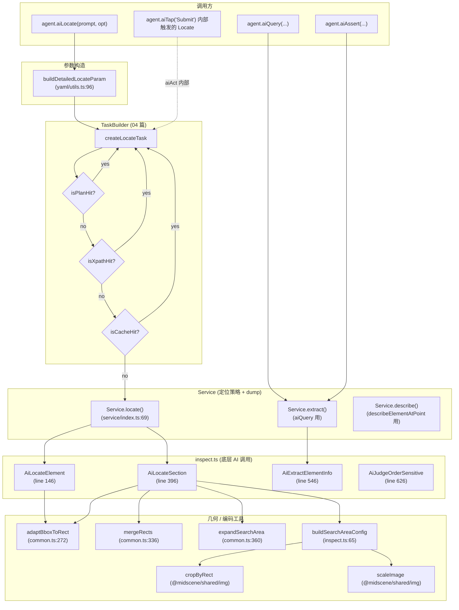
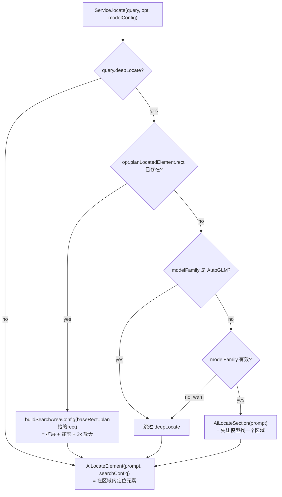
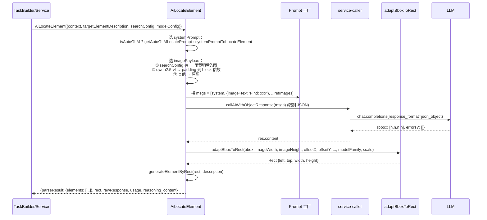

# 07 · 视觉定位与 Inspect（Visual Locator & Inspect）

> 分析基于 commit `702d5375`(main, v1.8.1)
>
> 本篇聚焦"模型怎么把'描述'变成'像素坐标'"——这是 Midscene 纯视觉路线的核心能力。覆盖核心要点 **A4 一部分（locator）+ E4 的混合模态预热（aiQuery 的 domIncluded）**。

---

## 0. TL;DR

- **`Service.locate()` 是定位的真正主入口**（`service/index.ts:69`），不在 `inspect.ts`。`inspect.ts` 提供四个底层 AI 调用函数（`AiLocateElement` / `AiLocateSection` / `AiExtractElementInfo` / `AiJudgeOrderSensitive`），`Service` 把它们组装成"命中策略 + dump + 错误处理"。
- **`AiLocateElement` 一次调用做三件事**：① 拼装 system + user + image messages（带可选搜索区域）② 强制 JSON 输出 `{bbox: [...], errors?: [...]}` ③ 用 `adaptBboxToRect()` 把模型坐标变成实际像素 rect。
- **`deepLocate: true` 触发两步式定位**：① 先 `AiLocateSection` 给一个 400×400 以上的"搜索区域"② 把这个区域**裁剪 + 放大 2x** 喂给 `AiLocateElement` 做精细定位。这是 Midscene 应对"小元素 / 密集 UI"的成本-精度旋钮。
- **定位结果有 4 个可能来源（优先级从高到低）**：① **Plan hit**（planning 模型直出 bbox）② **Xpath hit**（cache 里 xpath 重定位）③ **Cache hit**（cache 里 visual feature 匹配）④ **AI locate**（实时 LLM）。dump 里的 `hitBy` 字段记录命中来源。
- **`aiQuery` 默认 `domIncluded: false`**（02 篇 4.4.2 节看过），但**可以开启**——开了之后 `tasks.ts:619` 会调 `interface.getElementsNodeTree()` 把 DOM 转成文本 description 附在 prompt 后。**这就是"纯视觉路线下 DOM 仍然能用"的入口**。
- **`AiLocateSection` 也包含 DOM？不**——section locator 是纯视觉的（看 `inspect.ts:413-443` 没调任何 extractor）。DOM 只在 `AiExtractElementInfo`（`inspect.ts:546`）走 `opt.domIncluded` 时介入。
- **AutoGLM 走完全独立路径**：模型输出 `(x, y)` 单点（不是 bbox），坐标系是 `[0, 1000)` 千分位，`inspect.ts:263` 做 `pixelX = round(x * imageWidth / 1000)` 换算。和 UI-TARS 千分位类似但**只给点不给框**——所以 AutoGLM 走 `generateElementByPoint` 生成一个 8×8 框作为 rect 回填。

---

## 1. 它解决了什么问题 / 为什么必须单独一篇

03 篇看到了 Prompt 怎么写，04 篇看到了 Plan-Execute 主循环。**但中间还有一层没看到**：**模型说"点 bbox=[345, 442, 458, 483] 的按钮"——这个 bbox 是怎么变成端能用的 `(x, y)` 坐标的？**

这一层是 Midscene 工程上**踩坑最多**的地方：
- 模型可能给错坐标（位置偏 / 整个 rect 套错元素）
- 不同模型坐标系不同（pixel / 千分位 / 归一化）
- 不同模型族对小元素的识别能力差异巨大
- 截图被压缩/padding 过，坐标还要反算回原图

读完本篇你会理解：
- 一次 `aiLocate` 调用的完整链路（涉及 8 个文件）
- `deepLocate` / `deepThink` / `searchArea` 三个相关概念的关系
- "纯视觉" 和 "可选 DOM" 的边界——`aiQuery` 是唯一的 DOM 入口

---

## 2. 它在整体架构中的位置



---

## 3. 源码导览

### 3.1 关键文件清单

| 文件 | 关键导出 | 角色 |
|---|---|---|
| `packages/core/src/ai-model/inspect.ts` | `AiLocateElement` / `AiLocateSection` / `AiExtractElementInfo` / `AiJudgeOrderSensitive` / `buildSearchAreaConfig` | **底层 AI 调用，本篇主战场** |
| `packages/core/src/service/index.ts` | `class Service`、`Service.locate()` / `extract()` / `describe()` | **策略层**：组装 hit chain + dump + 错误处理 |
| `packages/core/src/agent/task-builder.ts` (475-660) | `createLocateTask`内部 | **命中分流**：plan hit / xpath hit / cache hit / AI locate 优先级 |
| `packages/core/src/yaml/utils.ts` (96-167) | `buildDetailedLocateParam` | 把 `(prompt, opt)` 标准化成 `DetailedLocateParam` |
| `packages/core/src/common.ts` (272-380) | `adaptBboxToRect`、`mergeRects`、`expandSearchArea` | 几何工具 |
| `packages/core/src/ai-model/prompt/llm-locator.ts` | `systemPromptToLocateElement` | locator system prompt（03 篇看过） |
| `packages/core/src/ai-model/prompt/llm-section-locator.ts` | `systemPromptToLocateSection` | section system prompt |
| `packages/shared/src/img/transform.ts` | `cropByRect` / `scaleImage` / `padding...` | 08 篇详解，本篇只看用法 |
| `packages/shared/src/extractor/web-extractor.ts` | DOM 提取器（仅 web） | `aiQuery` 开 `domIncluded` 时调用 |

### 3.2 关键数据结构

```ts
// 用户层入口（02 篇看过）
interface LocateOption {
  prompt?: TUserPrompt;
  deepLocate?: boolean;       // 是否两步式精细定位
  deepThink?: boolean;        // @deprecated alias for deepLocate
  cacheable?: boolean;
  xpath?: string;             // 用户给定的 hint
}

// 内部标准化（buildDetailedLocateParam 输出）
interface DetailedLocateParam {
  prompt: TUserPrompt;
  deepLocate: boolean;
  cacheable: boolean;
  xpath?: string;
}

// Planner 给的（含 bbox 时直接命中）
interface PlanningLocateParam extends DetailedLocateParam {
  bbox?: [number, number, number, number];   // ← planning 模型直出
}

// Locator 输出
interface LocateResultElement {
  center: [number, number];        // 像素坐标
  rect: Rect;                       // {left, top, width, height}
  description?: string;
  dpr?: number;                     // 历史兼容
}

// dump 里的命中来源标记
interface ExecutionTaskHitBy {
  from: 'Plan' | 'User expected path' | 'Cache' | undefined;
  context: any;
}
```

---

## 4. 核心机制深度解析

### 4.1 `buildDetailedLocateParam`：用户参数标准化

`yaml/utils.ts:96-167`。用户调用 `agent.aiLocate('登录按钮', {deepLocate: true})` 后，所有"形状各异"的输入都要先经过这一关。

**它做了三件事**：

1. **拆嵌套**（line 105-113）：避免 `{prompt: {prompt: '登录按钮'}}` 这种重复嵌套
   ```ts
   if (typeof locatePrompt === 'object' && 'prompt' in locatePrompt) {
     const { prompt: innerPrompt, ...rest } = locatePrompt;
     const hasMultimodalFields = Object.keys(rest).length > 0;
     normalizedLocatePrompt = hasMultimodalFields ? locatePrompt : innerPrompt;
   }
   ```

2. **`deepThink` → `deepLocate` 兼容**（line 121-125）：
   ```ts
   // Backward-compatible: accept `deepThink` as a deprecated alias for `deepLocate`.
   deepLocate = opt.deepLocate ?? opt.deepThink ?? false;
   ```
   `deepThink` 是 02 篇看到 `aiAct` 的选项；`deepLocate` 是 locate 专属。**它们在 locator 这层语义相同**。

3. **冲突警告**（line 128-134）：如果 `locatePrompt` 和 `opt.prompt` 都给了，warn 然后用 opt.prompt。

输出永远是这个形状：`{prompt, deepLocate, cacheable, xpath}` 或 `undefined`（没 prompt 时）。

### 4.2 `Service.locate()`：命中策略层

源码 `service/index.ts:69-220`。这是**调用 `AiLocateElement` 之前的策略层**。逻辑分支：



**几个关键观察**：

1. **`deepLocate + hasPlanLocatedElement` → 跳过 Section 调用**（`service/index.ts:109-126`）：
   - 既然 planning 模型已经粗略定了元素位置，**就用那个 rect 作为搜索区域基准**
   - 不再额外调用 `AiLocateSection`——省一次 LLM
   - 把那个 rect 扩展 + 裁剪 + 2x 放大后喂给 `AiLocateElement` 精细化

2. **AutoGLM 不支持 deepLocate**（`service/index.ts:96-99`）：
   ```ts
   if (searchAreaPrompt && isAutoGLM(modelFamily)) {
     console.warn('The "deepLocate" feature is not supported with AutoGLM.');
     searchAreaPrompt = undefined;
   }
   ```
   **理由**：AutoGLM 输出 (x,y) 单点，没法"区域内搜索"——区域裁切后坐标语义会混乱。

3. **缺 modelFamily 时 deepLocate 失效**（line 89-94）：
   ```ts
   if (searchAreaPrompt && !modelFamily) {
     console.warn('The "deepLocate" feature is not supported with multimodal LLM...');
     searchAreaPrompt = undefined;
   }
   ```
   纯通用多模态 LLM（不在 14 个 `TModelFamily` 中）没有 bbox 输出规范——deepLocate 没法工作。

### 4.3 `AiLocateElement`：核心 AI 调用（`inspect.ts:146`）

这是定位的"真正的 LLM 调用"。**简化版的调用流程**：



**关键代码片段**（`inspect.ts:301-393`）：

```ts
// 1. 调 LLM
const res = await callAIWithObjectResponse<AIElementResponse | [number, number]>(
  msgs, modelConfig, { abortSignal },
);

// 2. 用 adaptBboxToRect 换算
if ('bbox' in res.content && Array.isArray(res.content.bbox)) {
  resRect = adaptBboxToRect(
    res.content.bbox,
    imageWidth, imageHeight,                              // 当前图尺寸
    options.searchConfig?.rect?.left,                     // 偏移 X（如果搜索区域有 offset）
    options.searchConfig?.rect?.top,                      // 偏移 Y
    originalImageWidth, originalImageHeight,              // 原图尺寸
    modelFamily,                                          // Gemini 等的特殊坐标系
    options.searchConfig?.scale,                          // 2x 反缩放
  );
  const element = generateElementByRect(resRect, targetElementDescriptionText);
  matchedElements = [element];
}
```

### 4.4 `adaptBboxToRect`：模型 bbox → 实际像素 rect

源码 `common.ts:272-334`。这是 Midscene 应对"多模型坐标系"的核心函数。

输入：
- `bbox`：模型给的原始数组（如 `[100, 200, 300, 400]`）
- `width, height`：模型当前看到的图像尺寸
- `offsetX, offsetY`：如果是搜索区域内的坐标，要加上区域左上角偏移
- `rightLimit, bottomLimit`：边界约束
- `modelFamily`：决定 bbox 解释方式（Gemini 是 `[ymin,xmin,ymax,xmax] normalized to 0-1000`，其他是 `[xmin,ymin,xmax,ymax]` pixel）
- `scale`：如果输入图被放大过（deepLocate 2x），结果要除以 scale

输出：`Rect {left, top, width, height}`——在**原始截图坐标系**里。

**关键逻辑**：

```ts
const [left, top, right, bottom] = adaptBbox(bbox, width, height, modelFamily);
// adaptBbox 内部：Gemini 走归一化反算，其他走直接像素

// 边界保护
const rectLeft = Math.max(0, left);
const rectTop = Math.max(0, top);
const boundedRight = Math.min(right, rightLimit);
const boundedBottom = Math.min(bottom, bottomLimit);

const rectWidth = boundedRight - rectLeft + 1;
const rectHeight = boundedBottom - rectTop + 1;

// scale 反算（deepLocate 用 2x 放大输入，结果要除 2）
const finalLeft = scale !== 1 ? Math.round(rectLeft / scale) : rectLeft;
// ... finalTop / finalWidth / finalHeight

return {
  left: finalLeft + offsetX,   // ← 区域偏移补回去
  top: finalTop + offsetY,
  width: finalWidth,
  height: finalHeight,
};
```

**这个函数被调用了 4 处**：
- `AiLocateElement` 内的元素 bbox（line 348）
- `AiLocateSection` 内的 section bbox（line 480）
- `AiLocateSection` 内的 reference bbox 列表（line 498）
- `AiLocateElement` 内 deepLocate 的 search area 配置（间接通过 `buildSearchAreaConfig`）

### 4.5 `AiLocateSection` + `buildSearchAreaConfig`：deepLocate 的引擎

源码 `inspect.ts:396-544`。section locator 的工作分三步：

```
Step 1: AiLocateSection 让模型找"区域"——返回 sectionBbox + 可选 referencesBbox 列表
Step 2: mergeRects 把 section + 所有 reference 合并成一个外接矩形
Step 3: expandSearchArea + buildSearchAreaConfig 把这个矩形扩到 ≥ 400×400 并放大 2x
```

#### 4.5.1 Step 3 关键：`expandSearchArea`（`common.ts:360`）

```ts
export function expandSearchArea(rect: Rect, screenSize: Size): Rect {
  const minArea = 400 * 400;    // ← 最小面积 160000 px²
  const expandSize = 100;        // ← 每边先扩 100px

  // Step 1: 各边扩 100px，但不出屏
  const expandedLeft = Math.max(rect.left - expandSize, 0);
  // ... 同样处理 top/right/bottom

  // Step 2: 如果还不到 400×400，按比例放大（中心扩张）
  // ... 实现略
}
```

**为什么扩到 400×400**：模型对 < 400×400 的图像识别精度急剧下降。所以即使只想定位一个 30×30 的小按钮，**喂给模型的截图也至少 400×400**。

#### 4.5.2 Step 3 关键：`buildSearchAreaConfig`（`inspect.ts:65-88`）

```ts
export async function buildSearchAreaConfig(options: {
  context: UIContext;
  baseRect: Rect;
  modelFamily: IModelConfig['modelFamily'];
}): Promise<{ rect: Rect; imageBase64: string; scale: number }> {
  const scaleRatio = 2;                          // ← 固定 2x 放大
  const sectionRect = expandSearchArea(baseRect, context.shotSize);

  const croppedResult = await cropByRect(
    context.screenshot.base64,
    sectionRect,
    modelFamily === 'qwen2.5-vl',              // ← Qwen2.5-VL 需要 block padding
  );

  const scaledResult = await scaleImage(croppedResult.imageBase64, scaleRatio);
  sectionRect.width = scaledResult.width;
  sectionRect.height = scaledResult.height;
  return {
    rect: sectionRect,
    imageBase64: scaledResult.imageBase64,
    scale: scaleRatio,
  };
}
```

**关键参数**：
- `scaleRatio = 2`——**固定 2x 放大**。
- `qwen2.5-vl` 需要 block padding 才能正常推理——这是模型训练的硬约束（08 篇详解）。

**最终喂给 `AiLocateElement` 的输入**：原图的一个矩形区域 → 裁剪 → 放大 2x。模型在这个"放大版小图"里精细识别小元素，然后输出 bbox。`adaptBboxToRect` 的 `scale=2` 参数把坐标除回 1x，再加上 `offsetX/Y` 补回原图坐标系。

### 4.6 `aiLocate` 的完整链路示例

把 02-07 篇的内容串起来——一次 `agent.aiLocate('右下角的发送按钮', {deepLocate: true})` 会经过：

```
1. agent.aiLocate (agent.ts:1185)
   ↓
2. buildDetailedLocateParam (yaml/utils.ts:96)
   → {prompt: '右下角的发送按钮', deepLocate: true, cacheable: true, xpath: undefined}
   ↓
3. locatePlanForLocate (task-builder.ts:51)
   → PlanningAction {type: 'Locate', param: {...}}
   ↓
4. taskExecutor.runPlans([locatePlan])
   ↓
5. TaskBuilder.createLocateTask
   ↓ (没 bbox / xpath / cache 命中)
6. Service.locate(query, opt, modelConfig)
   ↓ (deepLocate=true && 没 planLocatedElement)
7. AiLocateSection(sectionDescription='右下角的发送按钮')
   ↓
   → 模型返回 sectionBbox = [800, 1200, 1080, 1400]
   ↓
8. mergeRects([sectionBbox, ...references])
9. expandSearchArea → {left:700, top:1100, width:400, height:400}
10. cropByRect → 裁出 400×400 的 base64
11. scaleImage(2x) → 800×800 的 base64
   ↓
12. AiLocateElement(targetDesc, searchConfig={rect, imageBase64, scale: 2})
   ↓
   → 模型在 800×800 图里看到按钮，返回 bbox = [600, 400, 750, 500]
   ↓
13. adaptBboxToRect(
      bbox=[600,400,750,500],
      width=800, height=800,
      offsetX=700, offsetY=1100,   ← 区域左上角
      originalImageWidth=800, ...,
      scale=2
    )
    → finalLeft = 600 / 2 = 300
    → finalTop = 400 / 2 = 200
    → finalWidth = (750-600) / 2 = 75
    → finalHeight = (500-400) / 2 = 50
    → result = {left: 300 + 700, top: 200 + 1100, width: 75, height: 50}
            = {left: 1000, top: 1300, width: 75, height: 50}
   ↓
14. generateElementByRect → {center: [1037, 1325], rect: {...}}
   ↓
15. service.locate 包成 LocateResultWithDump 返回
   ↓
16. agent.aiLocate 拿到 {center, rect, dpr}
```

**注意这个例子里**：原图坐标系下按钮在 (1000, 1300) - (1075, 1350) 一带；但模型实际只看到 800×800 的裁切+放大图。**所有坐标变换被 `adaptBboxToRect` 一次性算清**。

### 4.7 命中优先级：四种来源的瀑布

`task-builder.ts:434-534` 的逻辑：

```ts
// 优先级最高：Plan hit
const planLocatedElement = ifPlanLocateParamIsBbox(param) ? matchElementFromPlan(param) : undefined;
const elementFromBbox = param.deepLocate ? undefined : planLocatedElement;
const isPlanHit = !!elementFromBbox;

// 次：Xpath hit
let rectFromXpath: Rect | undefined;
if (!isPlanHit && param.xpath && this.interface.rectMatchesCacheFeature) {
  try { rectFromXpath = await this.interface.rectMatchesCacheFeature({ xpaths: [param.xpath] }); }
  catch { /* fallback */ }
}
const elementFromXpath = rectFromXpath ? generateElementByRect(...) : undefined;
const isXpathHit = !!elementFromXpath;

// 再次：Cache hit
const elementFromCacheResult = (isPlanHit || isXpathHit) ? null
  : await matchElementFromCache(...);
const elementFromCache = elementFromCacheResult ? transformLogicalElementToScreenshot(...) : undefined;
const isCacheHit = !!elementFromCache;

// 最后：AI locate（实时 LLM）
let elementFromAiLocate: LocateResultElement | null | undefined;
if (!isXpathHit && !isCacheHit && !isPlanHit) {
  locateResult = await this.service.locate(param, {context, planLocatedElement}, modelConfigForDefaultIntent, abortSignal);
  elementFromAiLocate = locateResult.element;
}

// 第一个非 null 的胜出
const element = elementFromBbox || elementFromXpath || elementFromCache || elementFromAiLocate;
```

**对应 dump 里的 `hitBy.from` 字段**：

| 命中来源 | 速度 | 准确度 | 代价 |
|---|---|---|---|
| **Plan hit** | 极快（0 LLM 调用） | 取决于 planning 模型 | 已在 plan 阶段付过 |
| **Xpath hit** | 快（仅一次 `evaluate`） | 高（前提：xpath 还有效） | 仅 Web 端 |
| **Cache hit** | 中等（一次 xpath 重定位） | 中等（取决于 cache 有效性） | 几乎免费 |
| **AI locate** | 慢（1-2 次 LLM） | 高（实时识别） | 最贵 |

**`isPlanHit` 在 deepLocate 时被禁用**（line 441-443）：
```ts
const elementFromBbox = param.deepLocate ? undefined : planLocatedElement;
```
理由：deepLocate 是"我不信任 plan 的粗略坐标，要重新精细定位"——所以**直接用 plan bbox 是矛盾的**。这时 plan bbox 反而作为 `planLocatedElement` 传给 `Service.locate`，**作为搜索区域的 hint**。

### 4.8 `aiQuery` 的 DOM 入口：唯一的"混合模态"

02 篇 4.4.2 提过 `defaultServiceExtractOption = {domIncluded: false, screenshotIncluded: true}`。**实际开启 DOM 的代码在 `tasks.ts:619-628`**：

```ts
let extraPageDescription = '';
if (opt?.domIncluded && this.interface.getElementsNodeTree) {
  debug('appending tree info for page');
  const tree = await this.interface.getElementsNodeTree();
  extraPageDescription = await descriptionOfTree(
    tree,
    200,            // ← maxDescribeLength (200 chars)
    false,
    opt?.domIncluded === 'visible-only',   // ← 仅取可见元素
  );
}

extractResult = await this.service.extract(demandInput, modelConfig, opt, extraPageDescription, ...);
```

DOM 信息怎么进 Prompt：`Service.extract` 把 `extraPageDescription` 拼到 `<PageDescription>...</PageDescription>` 段（03 篇 `extraction.ts` 看过）。

**`domIncluded` 三种取值**：
- `false`（默认）：纯视觉
- `true`：所有 DOM 元素
- `'visible-only'`：仅当前视口可见的 DOM 元素

**端的支持**：`interface.getElementsNodeTree` 只在以下端可用：
- Puppeteer / Playwright（`base-page.ts:324`）
- Chrome Extension
- Bridge Mode
- **Android / iOS / Computer / Harmony 都没实现**——他们的 `getElementsNodeTree` 是 `undefined`

所以**`domIncluded: true` 只对 Web 端有用**。这是 Midscene "纯视觉" 路线唯一的"DOM 后门"——只在 Web 端的数据提取场景下打开。

### 4.9 `aiAssert` 走的也是 `extract` 路径

注意 02 篇 4.4.3 提过 `aiAssert` 内部走 `taskExecutor.createTypeQueryExecution('Assert', ...)`，**也支持 `domIncluded`**：

```ts
// agent.ts:1218-1223
const serviceOpt: ServiceExtractOption = {
  domIncluded: opt?.domIncluded ?? defaultServiceExtractOption.domIncluded,
  screenshotIncluded: opt?.screenshotIncluded ?? defaultServiceExtractOption.screenshotIncluded,
};
```

**所以 `aiAssert('页面包含 element XX', { domIncluded: true })` 也能用 DOM 辅助**——这在断言"页面里有多少个 button"这种结构化判断时特别有用。

---

## 5. 设计取舍与工程权衡

### 5.1 为什么 deepLocate 固定 2x 放大而不是 4x / 自适应？

- **4x 放大** 之后图像 = 原图 4 倍 token 消耗
- **自适应** 需要预测"目标元素多大"，反过来又要先 locate——鸡生蛋
- **2x** 是经验最优：小元素从 ~30×30 变成 ~60×60，模型识别率显著提升，且 token 涨幅可控

### 5.2 为什么"先找 Section 再找 Element"两步而不一步搞定？

可选方案：让 prompt 里写"先找下方右侧的 send 按钮，再返回它的精确 bbox"。一步走完。**他们没这么做**，原因：

- **VLM 对一张大图的全局精确度低**——给整张 1920×1080 的图让它精确找一个 30×30 按钮，错位概率高
- **拆两步用不同截图喂给模型**：Section 看大图找区域，Element 看裁切+放大图精细定位
- **两次调用成本 < 一次大失败**——Section 调用快（小输出），失败也只浪费一次小调用

### 5.3 为什么 Plan hit、Xpath hit、Cache hit 三种来源不能互相替代？

三者各自的"信任来源"不同：

| 来源 | 信任谁 | 失效条件 |
|---|---|---|
| **Plan hit** | planning 模型刚刚说的 bbox | 模型本来就错 |
| **Xpath hit** | 用户硬编码的 xpath | DOM 结构变了 |
| **Cache hit** | 之前正确执行时留下的视觉特征 + xpath | 元素被改 / 文案变了 |

**优先级 Plan > Xpath > Cache 的工程理由**：
- Plan 是"刚刚模型看着当前截图说的"——时效最新
- Xpath 是"用户明示"——意图最强
- Cache 是"历史成功记录"——可能过时

### 5.4 为什么 AutoGLM 不支持 deepLocate？

AutoGLM 输出 `(x, y)` 单点，不输出框：
- 没法用"先找区域"的两步策略——区域只能围绕已知点扩展
- 千分位坐标在裁切+放大后语义混乱（要重新归一化到新图）
- ZAI 团队还没专门训练 AutoGLM 处理 deepLocate 场景

`service/index.ts:96-99` 直接 warn 并跳过——**老实承认"这个组合不 work"**。

### 5.5 为什么 `aiQuery` 默认不带 DOM？

- **纯视觉是 Midscene 的核心赌注**（00 篇 5.1 节）
- DOM 信息会让 prompt 变长几倍（一个复杂页面的 tree 可能 5000+ tokens）
- VLM 已经能从截图理解大多数页面
- **用户选择权**：需要时 `{domIncluded: true}` 一开关搞定

### 5.6 `xpath` 字段是个"逃生口"

用户可以在 `aiTap('登录按钮', { xpath: '//button[@id="login"]' })` 里手动给 xpath。**这违反"纯视觉"原则**，但保留是合理的：

- 极度稳定 UI（如内部 admin 系统）：xpath 比 prompt 更稳
- 反爬场景：元素故意视觉伪装但 DOM 稳定
- 调试 / 性能：xpath 直接秒命中，无 LLM 调用

**它是 cache 之外的另一个"省 LLM"方案**。

---

## 6. 与其他模块的协作

- **上游**：02 篇所有 `ai*` 都最终走到 `Service` 三个方法
- **下游**：
  - `service-caller/callAIWithObjectResponse`：强制 JSON 输出
  - `@midscene/shared/img.cropByRect` / `scaleImage` / `paddingToMatchBlock...`：图像处理（08 篇）
  - `@midscene/shared/extractor.getElementsNodeTree` / `descriptionOfTree`：DOM 提取（仅 Web 端）
- **横向**：
  - 04 篇 TaskBuilder：组装 hit chain + 调 Service
  - 09 篇 TaskCache：cache hit 路径
  - 11 篇工程取舍：从 D1（确定性 vs 幻觉）角度讨论 hit 优先级设计

---

## 7. 常见陷阱 & 调试经验

### 7.1 "Element not found: ..."

**症状**：`aiTap` 报这个错。
**根因**：4 种来源都失败：
- Plan 没给 bbox（或 planning 模型说不出来）
- 没传 xpath
- cache 没命中
- AI locate 返回 `parseResult.elements = []`

**调试**：dump 里看这个 task 的 `hitBy` 字段（应该没有 → AI locate 出 fail）+ 看 `rawResponse`，模型可能说"can see... but not found"。

### 7.2 定位偏移 ~20-50 像素

**症状**：模型识别对了元素，但 click 落到旁边空白处。
**可能原因**：
- DPR 反算错（08 篇详解）
- 模型 bbox 边界紧贴元素但 `center` 计算偏向某一侧
- 截图压缩前后坐标系混乱

**调试**：dump 里看 `matchedRect` vs 实际页面元素的位置——如果差一致的 offset，是 DPR 问题。

### 7.3 deepLocate 反而更慢更不准

**症状**：开了 `deepLocate: true` 后 token 翻倍，结果也不对。
**根因**：
- 元素本身已经 >100×100，根本不需要精细定位
- Section 调用失败 → fallback 到普通 locate 但走了多一次 LLM
- modelFamily 不支持（如 AutoGLM）但你没看 warning

**解决**：先试 `deepLocate: false` 看是否够用。**只在小元素 / 复杂密集 UI / 多个相似元素并存时开**。

### 7.4 `aiQuery` 开了 `domIncluded` 但 Android 上没效果

**症状**：`agent.aiQuery({...}, {domIncluded: true})` 在 Android 上跟没开一样。
**根因**：`tasks.ts:619` 的判定 `opt?.domIncluded && this.interface.getElementsNodeTree`——Android `interface.getElementsNodeTree` 是 `undefined`，所以条件为假。
**解决**：Android 上 DOM 入口不存在——只能靠提高模型档次或改 prompt。

### 7.5 Plan hit + deepLocate 同时开启时奇怪行为

**症状**：明明 planning 模型给了 bbox，但 dump 里还是看到了 AI locate 调用。
**根因**：`task-builder.ts:441`：
```ts
const elementFromBbox = param.deepLocate ? undefined : planLocatedElement;
```
deepLocate 故意忽略 plan bbox，把它降级成"搜索区域 hint"传给 Service。**这是预期行为**——deepLocate 隐含"我不信任 plan 的精度"。

### 7.6 Gemini 模型定位完全乱

**症状**：换到 Gemini 后 bbox 完全离谱。
**根因**：Gemini 的 bbox 是 `[ymin, xmin, ymax, xmax] normalized to 0-1000`——和其他家完全不同。
**解决**：必须正确设 `MIDSCENE_MODEL_FAMILY=gemini`，`adaptBboxToRect` 才会走 Gemini 分支。

### 7.7 Qwen2.5-VL 模型坐标偏移

**症状**：用 Qwen2.5-VL 时所有 bbox 偏移一致量。
**根因**：Qwen2.5-VL 需要 block padding（图像尺寸要是 28 / 56 倍数），输入图被 padding 过——但有的地方反算没考虑 padding。
**解决**：升级到最新 Midscene；如果还有问题看 dump 里 `originalImageWidth/Height` 和 `imageWidth/Height` 是否一致。

### 7.8 多个相似元素都被选中

**症状**：模型说"multiple elements found, length = 3"。
**根因**：`service/index.ts:197-202`——locate 返回多个元素时直接 throw。
**解决**：
- prompt 写更精确（"右上角的关闭按钮" 而不是 "关闭按钮"）
- 用 `deepLocate: true` 加一次区域过滤
- 用 xpath 强制指定

---

## 8. 🛠️ 实操章节

### 8.1 实操 A：可视化 Section + Element 两步

跑一个开启 `deepLocate` 的例子，然后看 dump 里的两个截图：

```ts
import 'dotenv/config';
import puppeteer from 'puppeteer';
import { PuppeteerAgent } from '@midscene/web';

async function main() {
  const browser = await puppeteer.launch({ headless: false });
  const page = await browser.newPage();
  await page.setViewport({ width: 1280, height: 800 });
  await page.goto('https://www.bing.com');

  const agent = new PuppeteerAgent(page);

  // 故意找一个小元素
  const result = await agent.aiLocate('右上角的"登录"或"账户"图标', {
    deepLocate: true,
  });
  console.log(result);

  await browser.close();
}
main().catch(console.error);
```

**打开 dump 报告**，找这个 Locate task。**展开它**，你会看到：
- 一张原图（带 Section bbox 高亮）
- 一张裁切+放大后的图（用于 Element 调用）
- 两次 LLM 的 rawResponse

### 8.2 实操 B：观察 4 种 hitBy 来源

```ts
// 跑两次同一个 aiTap，开启 cache
const agent = new PuppeteerAgent(page, {
  cache: { id: 'demo-hit-by', strategy: 'read-write' },
});

// 第一次：dump 里 hitBy = undefined（走 AI locate）
await agent.aiTap('Login 按钮');

// 第二次：dump 里 hitBy.from = 'Cache'（命中视觉特征 cache）
await agent.aiTap('Login 按钮');
```

如果你手动传 xpath：
```ts
await agent.aiTap('Login 按钮', { xpath: '//button[@id="login"]' });
// dump hitBy.from = 'User expected path'
```

### 8.3 实操 C：对比 `aiQuery` 开/关 DOM 的差异

```ts
// 关：纯视觉
const r1 = await agent.aiQuery<{title: string, href: string}[]>(
  '{title: string, href: string}[], all visible navigation links',
);

// 开：视觉 + DOM
const r2 = await agent.aiQuery<{title: string, href: string}[]>(
  '{title: string, href: string}[], all visible navigation links',
  { domIncluded: true },
);
```

**对比**：
- `r2` 通常 `href` 字段更准确（视觉看不到 URL，DOM 才有）
- `r2` 的 token 用量更高（dump 里看 `usage`）
- 复杂 SPA 上 `r2` 可能反而错——DOM 太大被截断

### 8.4 推荐断点

| 文件 | 行 | 观察 |
|---|---|---|
| `yaml/utils.ts:96` | `buildDetailedLocateParam` 入口 | 看用户参数怎么标准化 |
| `task-builder.ts:441` | `elementFromBbox = deepLocate ? undefined : ...` | 看 plan hit 何时被废除 |
| `task-builder.ts:506` | `if (!isXpathHit && !isCacheHit && !isPlanHit)` | 看是否走到 AI locate |
| `service/index.ts:109` | `if (query.deepLocate && hasPlanLocatedElement)` | 看 deepLocate + plan 的合流逻辑 |
| `inspect.ts:184` | `if (options.searchConfig)` | 看搜索区域怎么被使用 |
| `inspect.ts:348` | `adaptBboxToRect(...)` | 看坐标变换 |
| `common.ts:272` | `adaptBboxToRect` 内部 | 单步看每个变量计算 |
| `common.ts:360` | `expandSearchArea` | 看区域扩张算法 |

### 8.5 引导式实验

1. **观察 deepLocate 触发 Section 调用**：
   在 `inspect.ts:413` 加 `console.log('AiLocateSection called')`，重 build core。跑一个 `aiLocate(..., {deepLocate: true})`，看日志确实多出一行。

2. **打印 adaptBboxToRect 的参数**：
   debug `midscene:ai:inspect`：
   ```bash
   DEBUG=ai:inspect node script.js
   ```
   会看到完整的 bbox 输入 + 各种 width/height/offset/scale 参数。

3. **故意切换 `MIDSCENE_MODEL_FAMILY` 观察坐标系**：
   ```bash
   MIDSCENE_MODEL_FAMILY=gemini node script.js
   # 然后
   MIDSCENE_MODEL_FAMILY=qwen3-vl node script.js
   ```
   对比 dump 里 `rawResponse` 里 bbox 数组的"量级"——Gemini 是 0-1000 之间，Qwen 是 px。

4. **关闭所有 cache 强制走 AI locate**：
   `agent.opts.cache = false`（其实就是默认值），跑 5 次同一个 aiTap——每次都看到 `hitBy = undefined`，即每次都是 1-2 次 LLM 调用。然后开 cache 跑，对比每次 token 消耗。

---

## 9. 自检问题

1. `agent.aiLocate('登录', {deepLocate: true})` 内部最多会触发几次 LLM 调用？为什么不是 1 次？
2. `adaptBboxToRect` 的 `scale` 参数什么时候不是 1？这个参数的功能是什么？给出一个 deepLocate 场景下的具体例子。
3. 命中优先级 Plan > Xpath > Cache > AI locate。如果同时存在 plan bbox 和 cache 记录，最终走哪条？为什么 Plan 优于 Cache？
4. 我开了 `aiQuery({...}, { domIncluded: true })` 但在 Android 上没效果。源码里哪一行决定了这个行为？
5. AutoGLM 在 `service/index.ts:96` 被显式排除 deepLocate。如果不排除，会发生什么具体的坐标错误？
6. 我想在 `aiTap` 里跳过 LLM 直接用 cache 但忽略 plan bbox。怎么配置？

---

## 10. 延伸阅读

- `packages/core/src/ai-model/inspect.ts` 全文 653 行——读完会理解定位的所有细节
- `packages/core/src/common.ts:272-380`——adaptBboxToRect / mergeRects / expandSearchArea 的源码
- `packages/shared/src/extractor/web-extractor.ts`——DOM 抽取实现（理解 `domIncluded: true` 时发生什么）
- 同代对照：Selenium 的 By.xpath + WebElement 模式 vs Midscene 的"4 种 hit 来源" + bbox

---

写完了。说"下一个"我就开始写 `08_Image_Pipeline_and_Coordinates.md`（图像预处理 / shrink / padding / DPR / 千分位换算 / 滚动偏移补偿——核心要点 C1-C4 全集）。
