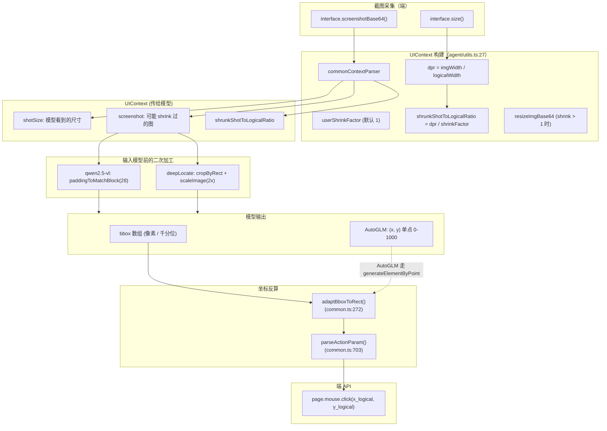
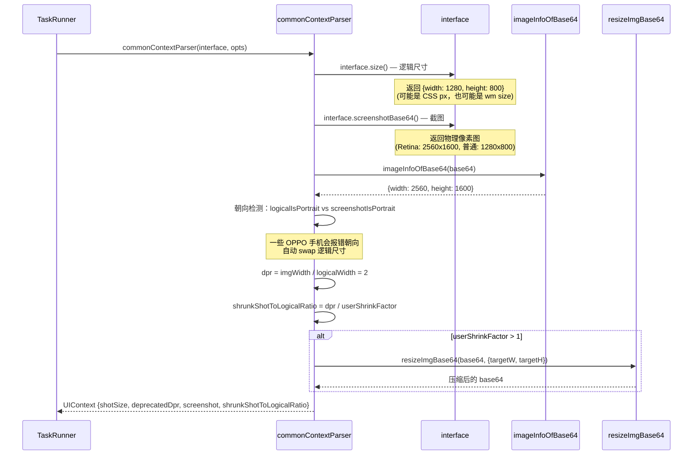

# 08 · 图像预处理与坐标变换（Image Pipeline & Coordinates）

> 分析基于 commit `702d5375`（main，v1.8.1）
>
> 本篇覆盖核心要点 **C1（图像 Resize/压缩）+ C2（千分位→像素）+ C3（DPR 对齐）+ C4（滚动偏移补偿）全集**。

---

## 0. TL;DR

- **图像处理库是双引擎**：Node.js 走 **Sharp**（C++ 原生 libvips，快），失败时 fallback 到 **Photon**（Rust + WASM，能跑在浏览器）。`get-sharp.ts` + `get-photon.ts` 是入口；`transform.ts` 是核心实现。
- **`commonContextParser`（`agent/utils.ts:27-159`）是"截图进入 LLM 前的最后一道处理"**——它做三件事：① 获取屏幕逻辑尺寸 `size()` ② 拍物理像素截图 `screenshotBase64()` ③ 计算 `dpr = imgWidth / logicalWidth`，可选 shrink 后输出 `UIContext { shotSize, deprecatedDpr, screenshot, shrunkShotToLogicalRatio }`。
- **坐标系有三层**，互相用 `shrunkShotToLogicalRatio` 换算：
  - **逻辑坐标**（端 API 用的）：CSS px / Android wm size / 等
  - **截图坐标**（模型看到的）：物理像素 ÷ shrink factor
  - **模型输出坐标**（bbox / 千分位 / 单点）：取决于 modelFamily，由 `adaptBboxToRect` 反算回截图坐标系
- **模型输出 → 真实点击的完整变换**：模型 bbox → `adaptBboxToRect` → 截图坐标 rect → `parseActionParam` 用 `shrunkShotToLogicalRatio` 反算 → 逻辑坐标 → 端 API（如 `page.mouse.click`）。
- **Qwen2.5-VL 的 block padding 是个硬约束**：图像宽高都要是 28 的倍数（`paddingToMatchBlock` 默认 `blockSize=28`），右下用白色填充。**只有这个 family 需要这么做**。
- **滚动偏移补偿"未单独实现"**——元素在视口外时由 planning 模型决策"先 scroll 再 tap"。截图永远是当前视口的，没有"长图拼接"模式。
- **GPT-4o 有专用 zoom**（`zoomForGPT4o`）：把图限制在 2048×768 内，针对其 "high" detail 模式优化。但 v1.8.1 没看到这个函数被引用——可能是早期残留。

---

## 1. 它解决了什么问题

跨端视觉自动化里最隐蔽的坑：**"模型说在 (345, 442)"** 和 **"点击 (345, 442)"** 在不同设备上意味着完全不同的位置：

| 场景 | 困境 |
|---|---|
| **Retina 屏 Mac** | DPR=2，模型看到的 2880×1800 截图坐标 ≠ Puppeteer `page.mouse.click(x, y)` 的 1440×900 CSS 坐标 |
| **Android 高分辨率手机** | 物理 3200×1440，但 `wm size` 给的 1080×2400——截图坐标和 adb input tap 坐标比例完全不同 |
| **Qwen2.5-VL** | 模型训练时图像被 padding 到 28 的倍数；推理时不 padding 直接喂 → 坐标全错 |
| **UI-TARS** | 输出 [0, 1000) 千分位，要乘屏幕尺寸 |
| **Gemini** | 输出 `[ymin, xmin, ymax, xmax]` normalized to 0–1000 (顺序+量级都不同) |
| **deepLocate 区域定位** | 模型在 2x 放大的小图里给坐标 → 要除 2 再加上区域左上角偏移 |

Midscene 用**一组工具函数**把这些差异压扁到 Agent 上层看不到。这一篇就是把这些函数全都展开看清楚。

---

## 2. 它在整体架构中的位置



---

## 3. 源码导览

### 3.1 关键文件清单

| 文件 | 行数 | 关键导出 | 角色 |
|---|---|---|---|
| `packages/shared/src/img/index.ts` | 27 | re-export 入口 | `import { cropByRect, scaleImage, ... } from '@midscene/shared/img'` |
| `packages/shared/src/img/transform.ts` | 553 | `resizeImgBase64`、`paddingToMatchBlockByBase64`、`cropByRect`、`scaleImage`、`zoomForGPT4o` | **核心图像操作** |
| `packages/shared/src/img/info.ts` | 102 | `imageInfoOfBase64`、`isValidPNGImageBuffer`、`validateScreenshotBuffer` | 元信息 + 格式校验 |
| `packages/shared/src/img/get-sharp.ts` | 18 | `getSharp` | 懒加载 Sharp 模块 |
| `packages/shared/src/img/get-photon.ts` | 108 | `getPhoton` | 懒加载 Photon（含浏览器 Canvas fallback） |
| `packages/shared/src/img/canvas-fallback.ts` | 393 | 浏览器 fallback | 没装 Photon WASM 时用 Canvas API |
| `packages/shared/src/img/box-select.ts` | 588 | `compositeElementInfoImg`、`annotateRects` | dump 报告里高亮 bbox 用 |
| `packages/core/src/agent/utils.ts` | 27-159 | `commonContextParser` | **截图 → UIContext** |
| `packages/core/src/agent/utils.ts` | 305-345 | `transformLogicalElementToScreenshot` / `transformLogicalRectToScreenshotRect` | 逻辑↔截图坐标 |
| `packages/core/src/common.ts` | 272-380 | `adaptBboxToRect`、`mergeRects`、`expandSearchArea` | bbox → rect（07 篇看过） |
| `packages/core/src/common.ts` | 703-778 | `parseActionParam` | 动作参数校验 + 坐标反算 |

### 3.2 关键数据流的 5 个尺寸/比率变量

| 变量名 | 出现位置 | 含义 |
|---|---|---|
| `logicalWidth/Height` | `utils.ts:52` | 端的 `size()` 返回的"逻辑尺寸"（CSS px / dp / pt） |
| `imgWidth/Height` | `utils.ts:81` | 截图的物理像素尺寸 |
| `dpr` | `utils.ts:119` | `dpr = imgWidth / logicalWidth`——**注意是从截图反算的，不是从 window 拿的** |
| `userShrinkFactor` | `utils.ts:111` | 用户指定的"额外压缩比"（默认 1=不压缩；常用 2 表示压成一半省 token） |
| `shrunkShotToLogicalRatio` | `utils.ts:123` | `dpr / userShrinkFactor`——**截图坐标 → 逻辑坐标的反算因子** |

---

## 4. 核心机制深度解析

### 4.1 双引擎：Sharp + Photon

`get-sharp.ts` 和 `get-photon.ts` 是两条引擎的懒加载入口。**几乎所有图像操作都先试 Sharp，失败 fallback 到 Photon**：

```ts
// transform.ts:63-101 (resizeAndConvertImgBuffer 摘录)
if (ifInNode) {
  try {
    const Sharp = await getSharp();
    // ... Sharp 实现，速度快
    return { buffer: resizedBuffer, format: 'jpeg' };
  } catch (error) {
    imgDebug('Sharp failed, falling back to Photon:', error);
  }
}
// browser 环境或 Sharp 出错：走 Photon (Rust WASM) 或 Canvas
const { PhotonImage, SamplingFilter, resize } = await getPhoton();
// ...
```

**双引擎对比**：

| 维度 | Sharp | Photon |
|---|---|---|
| **平台** | Node.js（依赖 libvips C++ 二进制） | Node.js + 浏览器（Rust → WASM） |
| **速度** | 快（C++ 原生） | 中等（WASM） |
| **安装** | `npm i sharp`（需要预编译二进制 / 编译时间） | `@silvia-odwyer/photon-node` 或浏览器版 |
| **何时用** | Node.js 默认 + 第一选择 | Sharp 装不上 / 浏览器 / Sharp 抛错 |
| **再 fallback** | — | Canvas API（`canvas-fallback.ts`，纯 JS） |

**所以同一段 resize 代码在三种环境跑**：
- 服务器：Sharp（最快）
- 浏览器：Photon WASM（中等）
- 没装 Photon 的浏览器：Canvas（最慢）

**为什么需要 fallback**：Chrome Extension 跑在浏览器，必须走 Photon/Canvas；Sharp 在某些 macOS arm64 / Windows 上装不上——fallback 让用户不必为环境头疼。

### 4.2 `commonContextParser`：每张截图都要走这条路

源码 `packages/core/src/agent/utils.ts:27-159`。**这是 04 篇 `TaskRunner.getUiContext` 的真正实现**——每个 task 跑前都会调用。

完整流程：



#### 4.2.1 朝向检测（`utils.ts:99-109`）

```ts
const logicalIsPortrait = logicalWidth < logicalHeight;
const screenshotIsPortrait = imgWidth < imgHeight;
let finalLogicalWidth = logicalWidth;
let finalLogicalHeight = logicalHeight;
if (logicalIsPortrait !== screenshotIsPortrait) {
  debug(`Orientation mismatch detected: logical size ${logicalWidth}x${logicalHeight} ... vs screenshot ${imgWidth}x${imgHeight}... Swapping logical dimensions.`);
  finalLogicalWidth = logicalHeight;
  finalLogicalHeight = logicalWidth;
}
```

**触发场景**：某些 OPPO Android 设备的 `wm size` 在横屏模式下仍然返回竖屏尺寸（已知 bug）——Midscene 通过对比截图和逻辑尺寸的朝向自动纠正。

**这是 6 个端里只有 Android 真用得到的代码**，但放在通用层——优雅地处理了一个具体设备 bug。

#### 4.2.2 `userShrinkFactor`：用户的省 token 旋钮

`utils.ts:111` 读 `opts.screenshotShrinkFactor`（来自 `agent.opts.screenshotShrinkFactor`）。

| 值 | 效果 |
|---|---|
| `undefined` / `1`（默认） | 不压缩 |
| `2` | 截图尺寸减半（面积变 1/4） |
| `1.5` | 等比压缩 |

**省钱算账**：
- 一张 1080p 高清图（detail='high'）约 1500-3500 tokens
- shrink 2x → 540p 等效，token 约 400-800
- 跑 20 圈规划 → 单次任务省 30-50k tokens

**代价**：模型识别小元素能力下降。**只在 UI 元素都比较大时建议开**（电商首页 OK；密集 admin 表单不行）。

### 4.3 `shrunkShotToLogicalRatio`：跨坐标系的核心因子

这个变量是 Midscene 工程里最容易让人困惑的命名。把它讲清楚：

**定义**：`shrunkShotToLogicalRatio = dpr / userShrinkFactor`

**几何含义**：**从"模型看到的截图坐标"** 到 **"端 API 要的逻辑坐标"** 的转换因子。

**举例**：
- Retina Mac (DPR=2)，不 shrink：`ratio = 2 / 1 = 2`
- Retina Mac，shrink=2：`ratio = 2 / 2 = 1`（截图被压回逻辑尺寸）
- Android (DPR=2.5)，shrink=2：`ratio = 2.5 / 2 = 1.25`
- 普通屏 (DPR=1)：`ratio = 1`

**怎么用**：
- 模型说"点 (1200, 800)"（截图坐标）
- 实际要调 `page.mouse.click(1200 / ratio, 800 / ratio)`（逻辑坐标）
- 在 Retina + 不 shrink 时 = `(600, 400)`

源码实现在 `parseActionParam`（`common.ts:748-775`）：

```ts
const ratio = options?.shrunkShotToLogicalRatio;
for (const fieldName in locateFieldValues) {
  let value = locateFieldValues[fieldName];
  if (ratio !== undefined && ratio !== 1 && value?.center && value?.rect) {
    value = {
      ...value,
      center: [
        Math.round(value.center[0] / ratio),
        Math.round(value.center[1] / ratio),
      ],
      rect: {
        ...value.rect,
        left: Math.round(value.rect.left / ratio),
        top: Math.round(value.rect.top / ratio),
        width: Math.round(value.rect.width / ratio),
        height: Math.round(value.rect.height / ratio),
      },
    };
  }
  validated[fieldName] = value;
}
```

### 4.4 完整坐标变换示例（Retina Mac, shrink=1, 通用 VLM）

假设场景：1280×800 Mac 浏览器，Retina 屏（DPR=2），模型看到 2560×1600 截图，决定点击 "Submit" 按钮位于 bbox=[1200, 800, 1400, 900]。

```
Step 1: 截图采集
  interface.size() → {width: 1280, height: 800}   ← 逻辑尺寸
  interface.screenshotBase64() → 2560×1600 base64  ← 物理像素

Step 2: commonContextParser
  imageInfoOfBase64 → imgWidth=2560, imgHeight=1600
  dpr = 2560 / 1280 = 2
  userShrinkFactor = 1
  shrunkShotToLogicalRatio = 2 / 1 = 2
  shotSize = {width: 2560, height: 1600}            ← 模型看到这个
  screenshot = 原图（无压缩）

Step 3: 喂给模型
  系统 prompt 含 "bbox is [xmin, ymin, xmax, ymax] in pixel"
  user msg: 图（2560×1600）+ "Find: Submit button"

Step 4: 模型返回
  {"bbox": [1200, 800, 1400, 900]}

Step 5: adaptBboxToRect (common.ts:272)
  rect = {left: 1200, top: 800, width: 201, height: 101}  ← 截图坐标系

Step 6: TaskBuilder 把 rect 存进 element.rect 和 element.center
  element.center = [1300, 850]   ← 截图坐标系

Step 7: parseActionParam (common.ts:703) 用 shrunkShotToLogicalRatio=2 反算
  element.center → [650, 425]    ← 逻辑坐标系
  element.rect → {left: 600, top: 400, width: 100, height: 50}

Step 8: action.call({locate: element}, ...) 调端 API
  page.mouse.click(650, 425)     ← 终于在浏览器里点对了位置
```

### 4.5 模型族特殊处理：Qwen2.5-VL 的 block padding

源码 `transform.ts:230-269`：

```ts
export async function paddingToMatchBlock(
  image: PhotonImageType,
  blockSize = 28,
) {
  const width = image.get_width();
  const height = image.get_height();
  const targetWidth = Math.ceil(width / blockSize) * blockSize;
  const targetHeight = Math.ceil(height / blockSize) * blockSize;

  if (targetWidth === width && targetHeight === height) return { width, height, image };

  const { padding_right, padding_bottom, Rgba } = await getPhoton();
  const rightPadding = targetWidth - width;
  const bottomPadding = targetHeight - height;

  let result = image;
  if (rightPadding > 0) {
    const white = new Rgba(255, 255, 255, 255);
    result = padding_right(result, rightPadding, white);  // ← 右边用白色填充
  }
  if (bottomPadding > 0) {
    const white = new Rgba(255, 255, 255, 255);
    result = padding_bottom(result, bottomPadding, white); // ← 底部用白色填充
  }
  return { width: targetWidth, height: targetHeight, image: result };
}
```

**触发点**（3 处）：
1. `plan()` 给 planning 模型的截图（`llm-planning.ts:147-152`）
2. `AiLocateElement` 给 locate 模型的截图（`inspect.ts:199-204`）
3. `cropByRect` 在 deepLocate 时（`inspect.ts:74-78` 的 `buildSearchAreaConfig`）

**为什么 Qwen2.5-VL 需要这个**：模型架构在训练时把图像切成 28×28 的 patches，**输入必须是 28 的整数倍才不会丢边缘信息**。注释里直接引了阿里官方文档：
```ts
// https://help.aliyun.com/zh/model-studio/user-guide/vision/
```

**padding 的方向选择**：
- **右边 + 底部**填充白色
- **不在左 / 上填充**——因为这样会**改变坐标原点**，让所有 bbox 都偏移

**为什么 28**：Qwen-VL 系列模型的标准 patch size。其他模型（Doubao、Gemini）不需要。

### 4.6 deepLocate 的"裁切 + 放大" 流程

07 篇 4.5 节看过 `buildSearchAreaConfig`。源码 `inspect.ts:65-88`：

```ts
export async function buildSearchAreaConfig(options: {
  context: UIContext;
  baseRect: Rect;
  modelFamily: IModelConfig['modelFamily'];
}) {
  const scaleRatio = 2;
  const sectionRect = expandSearchArea(baseRect, context.shotSize);

  const croppedResult = await cropByRect(
    context.screenshot.base64,
    sectionRect,
    modelFamily === 'qwen2.5-vl',  // ← 裁切后立即 padding（Qwen 专属）
  );

  const scaledResult = await scaleImage(croppedResult.imageBase64, scaleRatio);
  // 关键：把 sectionRect 的尺寸更新到放大后
  sectionRect.width = scaledResult.width;
  sectionRect.height = scaledResult.height;
  return {
    rect: sectionRect,
    imageBase64: scaledResult.imageBase64,
    scale: scaleRatio,
  };
}
```

**实际尺寸演变**：
```
原图: 2560×1600 (截图坐标系)
↓ baseRect: {left: 1000, top: 500, width: 100, height: 50}
↓ expandSearchArea: {left: 900, top: 400, width: 400, height: 400}  ← 强制 ≥ 400×400
↓ cropByRect: 400×400 base64 (+ Qwen padding 到 28 倍数 = 420×420)
↓ scaleImage(2x): 800×800 (Qwen 时 840×840)
→ 喂给 AiLocateElement
```

**模型在 800×800 图里看到目标**，输出 bbox（假设 `[400, 300, 600, 450]`）。然后 `adaptBboxToRect` 反算：

```ts
adaptBboxToRect(
  bbox=[400, 300, 600, 450],
  width=800, height=800,        // 当前图尺寸
  offsetX=900, offsetY=400,     // 区域左上角（注意原 sectionRect 是 400×400 的，但 .width 已被改成 800）
  rightLimit=800, bottomLimit=800,
  modelFamily='qwen3-vl',
  scale=2,                       // ← 反 2x 放大
)
// 内部计算：
// finalLeft = 400 / 2 = 200
// finalTop = 300 / 2 = 150
// finalWidth = (600 - 400 + 1) / 2 = 100
// finalHeight = (450 - 300 + 1) / 2 = 75
// result.left = 200 + 900 = 1100
// result.top = 150 + 400 = 550
// → 截图坐标系下的 rect: {left: 1100, top: 550, width: 100, height: 75}
```

**注意有个微妙处**：`sectionRect.width = scaledResult.width`（line 81-82）——`sectionRect` 在 `buildSearchAreaConfig` 内部被改成放大后的尺寸，**但作为返回值传给 `Service.locate` 时，offsetX/offsetY 仍然是原图坐标系的**——所以 `adaptBboxToRect` 的 scale=2 + offsetX/Y 同时工作刚好把坐标反算到原图坐标系。

### 4.7 C2：UI-TARS 千分位坐标换算

03 篇 4.6 节看过 prompt，这里看坐标换算的具体代码。

`ui-tars-planning.ts:101-109`：

```ts
const parseResult = actionParser({
  prediction: convertedText,
  factor: [1000, 1000],
  screenContext: {
    width: shotSize.width,
    height: shotSize.height,
  },
  modelVer: uiTarsModelVersion,
});
```

实际换算由 NPM 包 `@ui-tars/action-parser` 完成（依赖在 `core/package.json:79`）。**Midscene 不自己写**——把 `factor: [1000, 1000]` + 屏幕尺寸传过去，库内部做：
```
pixel_x = (model_x / 1000) * screenWidth
pixel_y = (model_y / 1000) * screenHeight
```

**为什么 UI-TARS 用千分位**：模型训练时把不同分辨率的截图统一归一化到 [0, 1000)，这样训练数据可以混合任何分辨率。推理时 Midscene 拿到归一化坐标，乘屏幕尺寸即可。

### 4.8 C2：AutoGLM 单点 0-1000 换算

源码 `inspect.ts:261-273`：

```ts
const { x, y } = parsed.coordinates;

debugInspect('auto-glm coordinates [0-999]:', { x, y });

// Convert auto-glm coordinates [0,999] to pixel bbox
// Map from [0,999] to pixel coordinates
const pixelX = Math.round((x * imageWidth) / 1000);
const pixelY = Math.round((y * imageHeight) / 1000);

debugInspect('auto-glm pixel coordinates:', { pixelX, pixelY });

// Apply offset if searching in a cropped area
let finalX = pixelX;
let finalY = pixelY;
if (options.searchConfig?.rect) {
  finalX += options.searchConfig.rect.left;
  finalY += options.searchConfig.rect.top;
}

const element: LocateResultElement = generateElementByPoint(
  [finalX, finalY],
  targetElementDescriptionText as string,
);
```

**与 UI-TARS 的差异**：
- AutoGLM 是**单点**（不是 bbox）
- 用 `generateElementByPoint` 把点变成 8×8 的小框（rect 兼容）
- 这就是为什么 AutoGLM 的"元素 rect"看起来都很小（07 篇 4.4 节讨论过）

### 4.9 C3：DPR 对齐——以 Web/Android 为例

`commonContextParser` 直接 `dpr = imgWidth / logicalWidth`。**这个计算对所有端通用**——不管端实际怎么获取 DPR，Midscene 通过截图反算出"真实可用"的 DPR。

**意义**：
- 即使端报错的 DPR（Android wm size 偶尔不准），只要截图正常，DPR 就是对的
- 跨端代码统一，不需要每个端实现 `getDevicePixelRatio()`

**反算公式**：
```
dpr = 物理像素图宽 / 逻辑尺寸宽
shrunkShotToLogicalRatio = dpr / userShrinkFactor
```

**parseActionParam 反算**（`common.ts:760-772`）：
```
逻辑坐标 = round(截图坐标 / shrunkShotToLogicalRatio)
```

**为什么除而不是乘**：截图坐标系 → 逻辑坐标系是"缩小"。Retina 屏物理像素 2560 对应逻辑 1280——所以除 2。

### 4.10 C4：滚动偏移补偿——**未单独实现**

读完源码我没找到任何"长图拼接"或"自动 scroll 后补偿坐标"的逻辑。具体来说：

- `screenshotBase64()` 永远是**当前视口**——不会拼接整页
- 没有"虚拟视口"概念
- 模型每次 plan 只看到当前视口
- **元素在视口外时**：模型在 Prompt 规则下应该输出"先 Scroll 再 Tap"两步动作（03 篇 4.1.3 提到过滚动相关规则）

**实际处理路径**：
1. 模型看到"按钮在屏幕之外"
2. 输出 `<action-type>Scroll</action-type>` 滚动一段距离
3. 下一轮 plan 看到新视口
4. 输出 `<action-type>Tap</action-type>` 在新视口里点击

**这一切都被 04 篇的 replanning cycle 自然处理**——不需要"滚动偏移补偿"。

**例外**：Web 端 Puppeteer 的 `page.screenshot({fullPage: true})` 能拼接全页，但 Midscene 默认**不用**这个模式（visible 视口截图就足够）。

### 4.11 `box-select.ts`：dump 报告里的 bbox 高亮

`packages/shared/src/img/box-select.ts` 588 行的核心函数：

- `annotateRects(imageBase64, rects)`：在截图上画 bbox 框 + 数字标签
- `compositeElementInfoImg`：在截图上画元素信息（dump 报告 viewer 用）

**不影响模型推理**——这些函数只在生成 dump 报告时调用。它们让 dump HTML 里你能直接看到"模型识别的 bbox 落在哪里"，**是调试视觉错误的核心可视化工具**。

---

## 5. 设计取舍与工程权衡

### 5.1 为什么 DPR 不从端 API 拿，而是反算？

`window.devicePixelRatio` 是浏览器 API，能拿到准确 DPR。Midscene **没用**，原因：

- **跨端统一**：Android 的 `getResources().getDisplayMetrics().density` 和 `wm size` 不一定对得上；iOS 的 `[UIScreen scale]` 和 WDA 报的不一致——反算更稳
- **避免"DPR=2 但截图是 1x"的隐藏 bug**：有些场景截图工具会自动 downscale，端报的 DPR 失效
- **简化抽象**：所有端只要老老实实给截图和逻辑尺寸，DPR 自动算

**代价**：每次都要一次 base64 解析（`imageInfoOfBase64`）——但只要 50ms，可接受。

### 5.2 为什么 Sharp + Photon 双引擎？不直接全用 Photon？

- Sharp 比 Photon **快 3-5 倍**（C++ 原生 vs WASM）
- Sharp 体积巨大（含原生二进制），不能进浏览器
- 双引擎让"服务器跑得快，浏览器跑得动"

**第三层 fallback Canvas API**：用户环境里连 Photon WASM 都装不上时兜底——纯 JS 实现，最慢但能跑。

### 5.3 为什么 `userShrinkFactor` 默认 1（不压缩）？

理论上压缩省钱，应该默认开。**他们没开**，原因：

- **不知道用户场景**：UI 密集程度差异大，错误压缩反而让小元素丢
- **明确的 opt-in**：让用户在评估完任务后主动开（"我的页面元素都很大，开 shrink=2 省 30% token"）

**如果默认开 shrink=2**：很多用户会跑出"为什么 Midscene 找不到小图标"——支持成本高。

### 5.4 为什么 `parseActionParam` 把"参数校验"和"坐标变换"放一起？

可选方案：分开成 `validateActionParam` + `transformCoordinates` 两个函数。**他们没分**，看代码：

```ts
// common.ts:734-744
const paramsForValidation: Record<string, any> = {};
for (const key in param) {
  if (locateFields.includes(key)) {
    paramsForValidation[key] = { prompt: '_dummy_' };  // ← 用假 prompt 通过 zod 校验
  } else {
    paramsForValidation[key] = param[key];
  }
}
const validated = zodSchema.parse(paramsForValidation);

// 然后再把真正的 locate 字段（含 center/rect）填回去 + 坐标变换
```

**为什么这么写**：locate 字段的 zod schema 只要求 `{prompt: string}`，但实际运行时这个字段已经被前置 Locate task 替换成了 `{prompt, center, rect, description, ...}`——**不能用 zod 校验完整结构**（否则 Locate 结果会被拒）。这是个**"借用 zod 但绕过 zod"**的小技巧。

### 5.5 为什么不做长图拼接 / fullPage 截图模式？

主流自动化（Puppeteer 自身）支持。**Midscene 不用**，原因：

- **长图大**：一张完整网页可能 10000+ 像素高，token 爆炸
- **模型识别远视野元素能力弱**：在 1080×8000 图里找小按钮 ≪ 1080×1080 图里找
- **scroll-then-act 自然解决问题**：plan 循环会自动决策滚动 + 点击

**唯一例外是数据提取场景**：`aiQuery('页面所有商品列表')` 时长图会丢失下方商品。**解决方案**：用户手动 `aiAct('scroll to bottom')` 多次 + 多次 `aiQuery` 累积。

### 5.6 padding 选右下而不是中心 padding

`paddingToMatchBlock` 选择"右边 + 底部"填充，**不在左、上、四周扩展**。原因：
- **保持坐标原点 (0,0) 不变**——模型输出的 bbox 直接和原图坐标系对齐
- 中心 padding 会让所有 bbox 加一个偏移量，反算时要额外算 padding 量

**代价**：截图右下角有白色条带。**但模型不在乎**，且实际 UI 内容仍在左上区域完整保留。

---

## 6. 与其他模块的协作

- **上游**：
  - 04 篇 `TaskRunner.getUiContext` → `Agent.getUIContext` → `commonContextParser`（每个 task 跑前）
  - 06 篇端的 `screenshotBase64()` / `size()` 是输入
- **下游**：
  - 03/07 篇 Prompt 拼装时用 `imagePayload`
  - 07 篇 `adaptBboxToRect` 用 `imageWidth/Height/scale`
  - 04 篇 `parseActionParam` 用 `shrunkShotToLogicalRatio` 反算
- **横向**：
  - 10 篇 dump 报告里 `box-select.ts` 渲染 bbox 高亮
  - 09 篇 cache 命中时 `transformLogicalRectToScreenshotRect` 反向变换

---

## 7. 常见陷阱 & 调试经验

### 7.1 模型识别对元素但点击偏移 ~半个屏

**症状**：Retina Mac 上点击落到屏幕中央，但模型描述的是右下按钮。
**根因**：用户写了自定义 `parseActionParam` 跳过了 `shrunkShotToLogicalRatio` 反算。或者端 `size()` 报的不是 CSS px。
**调试**：dump 里看 task 的 `param.locate.center` 和 `output.element.center` 应该一致——如果一个是 1300 一个是 650，就是反算缺失。

### 7.2 Qwen2.5-VL 整体坐标偏移

**症状**：换到 Qwen2.5-VL 后所有 bbox 偏移一致量（约 28 像素）。
**根因**：截图被 padding 到 28 倍数，但用户的某段定制代码用了"原图尺寸"反算。
**解决**：用 `paddedResult.width/height` 而不是原图尺寸；不要 hack `imageWidth/Height` 参数。

### 7.3 `dpr = NaN` 或 `dpr = 0`

**症状**：报错 "Invalid screenshot dimensions"。
**根因**：端 `size()` 返回 0 或非数字。
**调试**：在 `utils.ts:60-68` 加 console，看实际拿到什么。Android 偶尔会因为 adb 异常返回空 size。

### 7.4 朝向自动 swap 后还是错

**症状**：横屏 Android 拍照后，朝向 swap 触发但 bbox 仍然偏离。
**根因**：截图本身朝向错了（adb 截屏未按方向旋转）。
**解决**：在 `screenshotBase64` 内部加旋转逻辑——某些 OPPO 设备需要 device-side rotation 校正。

### 7.5 shrink=2 后小图标都找不到

**症状**：开了 `screenshotShrinkFactor: 2` 后，模型说"找不到关闭按钮"。
**根因**：原本 24×24 的图标被压成 12×12 → 模型识别精度断崖。
**解决**：要么关掉 shrink，要么对这类小元素用 `deepLocate: true`（cancel 掉 shrink 后用 2x 放大的局部图）。

### 7.6 浏览器扩展环境 Photon 抛 OOM

**症状**：Chrome Extension 跑大图时 Photon WASM 报内存错。
**根因**：WASM 默认 256MB 内存上限，4K 截图（2160×3840 RGBA）= 32MB，多张并发就爆。
**解决**：Midscene 已经在 Photon 操作后 `image.free()`——但用户代码里 hold 住引用就会泄漏。看 dump 里是否累积了过多 `screenshot` 项。

### 7.7 `cropByRect` 出 "Out of bounds"

**症状**：deepLocate 触发时 `cropByRect` 抛错。
**根因**：`expandSearchArea` 边界保护应该限到屏幕内，但用户改过 baseRect 没限。
**调试**：检查传给 `buildSearchAreaConfig` 的 `baseRect`——它必须 `.left + .width ≤ shotSize.width`。

### 7.8 多 display 桌面端坐标系混乱

**症状**：双屏 Mac 上 `aiTap` 点在错屏。
**根因**：`screenshot-desktop` 截单屏，但 Computer 端 mouse API 用全局桌面坐标系。
**解决**：`new ComputerDevice({ displayId: '1' })` 显式锁屏；或者用 `aiAct('switch to display 0')`。

---

## 8. 🛠️ 实操章节

### 8.1 用 dump 看模型实际看到的图

每个 Planning/Locate task 在 dump 报告里有展开的截图。**关键点**：deepLocate 触发时，**dump 里会有两张图**——一张原图（带 Section bbox）+ 一张裁切放大后的图。打开任意一个 deepLocate 测试报告确认。

### 8.2 计算实际 token 节省

跑同一脚本两次，对比 dump 里 `usage.prompt_tokens` 总和：

```ts
// Run 1: 默认
const agent1 = new PuppeteerAgent(page);
await runScenario(agent1);
console.log('default tokens:', totalTokens(agent1.dump));

// Run 2: shrink 2x
const agent2 = new PuppeteerAgent(page, { screenshotShrinkFactor: 2 });
await runScenario(agent2);
console.log('shrink=2 tokens:', totalTokens(agent2.dump));
```

典型省 30-50%。但**断言准确率可能下降**——做小流量 A/B 决定是否开。

### 8.3 验证 DPR 反算

打开 debug：
```bash
DEBUG=commonContextParser node script.js
```

会看到：
```
size: 1280x800
screenshot dimensions 2560 x 1600
calculated dpr: 2
shrunkShotToLogicalRatio 2
```

如果 `calculated dpr` 不是预期值，可能是端的 `size()` 报错——去 06 篇查端实现。

### 8.4 强制不同 modelFamily 看坐标系变化

```bash
MIDSCENE_MODEL_FAMILY=gemini npx tsx script.js  # bbox 0-1000 归一化
MIDSCENE_MODEL_FAMILY=qwen3-vl npx tsx script.js  # bbox 像素
MIDSCENE_MODEL_FAMILY=qwen2.5-vl npx tsx script.js  # 触发 28-block padding
```

dump 里看 `rawResponse` 中 bbox 数值的量级。

### 8.5 推荐断点

| 文件 | 行 | 观察 |
|---|---|---|
| `agent/utils.ts:74` | 截图后 | `screenshotBase64.length` / `imgWidth` / `imgHeight` |
| `agent/utils.ts:103` | 朝向检测 | 是否触发 swap |
| `agent/utils.ts:119` | dpr 计算 | 验证你期望的数值 |
| `agent/utils.ts:135` | resize 触发 | 仅当 `userShrinkFactor !== 1` 时进入 |
| `common.ts:760` | `parseActionParam` ratio 反算 | 验证 `ratio` 值 + 反算前后 center 对比 |
| `transform.ts:244` | `paddingToMatchBlock` 内部 | 验证 padding 量 |
| `transform.ts:447` | `scaleImage` 入口 | 验证 scale=2 时输出尺寸 |
| `inspect.ts:80` | `buildSearchAreaConfig` 内部 | 看 sectionRect 在裁切+放大前后的变化 |

### 8.6 引导式实验

1. **手动算一遍 DPR**：开 debug，记下 `imgWidth/logicalWidth`，自己心算确认 = `dpr`。然后 Retina Mac 上跑 `aiTap`，dump 里点击点坐标应该是模型 bbox 中心的一半。

2. **Qwen 28-block padding 可视化**：
   ```bash
   MIDSCENE_MODEL_FAMILY=qwen2.5-vl DEBUG=img node script.js
   ```
   看 `paddingToMatchBlock` 打印的 `padding amount`。然后在 dump 里看 user msg 的图——右下应该有白色条带。

3. **观察 deepLocate 的尺寸变化链**：
   ```bash
   DEBUG=ai:section,ai:inspect,img node script.js
   ```
   会看到完整链路：`original targetRect → expanded sectionRect → scaled sectionRect`。

4. **故意 break 一处坐标变换**：在 `common.ts:761` 改成 `Math.round(value.center[0] * ratio)`（错的方向，应该除）。重 build，跑——观察点击落到 4x 位置（不是逻辑坐标）。

---

## 9. 自检问题

1. `shrunkShotToLogicalRatio` 的几何含义是什么？为什么它是 `dpr / userShrinkFactor` 而不是 `dpr * userShrinkFactor`？
2. 一张 2560×1600 的 Retina 截图 + `userShrinkFactor: 2`，最终模型看到的 `shotSize` 是什么？反算因子是多少？
3. Qwen2.5-VL 为什么必须 padding 到 28 的倍数？为什么 padding 选右下而不是中心 / 四周？
4. `adaptBboxToRect` 接受 `scale` 参数（deepLocate 时是 2）。如果不传 scale（默认 1），deepLocate 流程会发生什么坐标错位？
5. UI-TARS 千分位换算由 `@ui-tars/action-parser` 包做。AutoGLM 也是千分位为什么不用同一个包？两者的本质区别是什么？
6. Midscene 不做长图拼接。"在视口外的元素"怎么被找到？这种设计的取舍是什么？
7. `parseActionParam` 用 `_dummy_` prompt 通过 zod 校验后再把真实 locate 字段填回去——这个绕过的原因是什么？

---

## 10. 延伸阅读

- Sharp 文档（理解为什么快）：https://sharp.pixelplumbing.com/performance
- Photon 项目：https://silvia-odwyer.github.io/photon/
- Qwen-VL 视觉文档：https://help.aliyun.com/zh/model-studio/user-guide/vision/
- UI-TARS 论文（千分位坐标章节）：https://arxiv.org/abs/2501.12326
- 同代对照：browser-use 的 SOM 截图标注（Set-of-Mark）→ 对比 Midscene 的纯坐标方式

---

写完了。说"下一个"我就开始写 `09_Cache_and_Frozen_Context.md`（缓存与 🧊 Frozen Context——plan cache + locate cache 的 hash 策略 / 三种 strategy / Frozen Context 生命周期——核心要点 B5 全集）。
