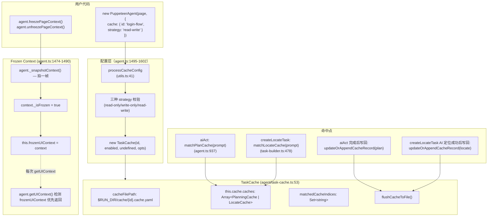
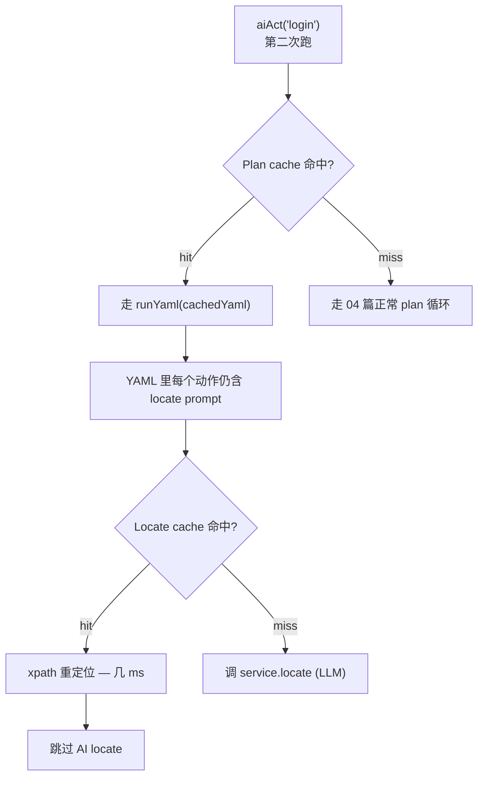

# 09 · 缓存与 🧊 Frozen Context（Cache & Frozen Context）

> 分析基于 commit `702d5375`(main, v1.8.1)
>
> 覆盖核心要点 **B5（UI 状态 + Prompt 的 Hash 策略 + 回归测试如何跳过 LLM 推理）全集**。

---

## 0. TL;DR

- **两类缓存共存于同一文件**：`PlanningCache` (`type: 'plan'`) 记录"任务 prompt → YAML workflow"；`LocateCache` (`type: 'locate'`) 记录"定位 prompt → 元素视觉特征 (xpaths)"。两类共享一个 `.cache.yaml` 文件，靠 `type` 字段区分。
- **不是基于 Hash 匹配——是基于 `prompt` 字符串的精确相等匹配**（`task-cache.ts:136`：`isDeepStrictEqual(item.prompt, prompt)`）。第二次跑同一个 `aiAct('登录')` → 同字符串命中。**这意味着任何措辞变化都会让缓存失效**。
- **每个匹配只用一次**（`task-cache.ts:67`：`matchedCacheIndices: Set<string>` 标记已用）。同一个脚本里两次 `aiAct('登录')` 不会撞同一条缓存——分别用两条 plan 记录。这是给"幂等回归测试"准备的。
- **三种 strategy** = 三种行为组合：
  - `'read-write'`（默认）：读旧 + 写新
  - `'read-only'`：读旧 + 内存中更新但**不刷盘**（CI 验证场景）
  - `'write-only'`：忽略旧 + 写新（重建场景）
- **`UI-TARS` / `AutoGLM` 完全跳过 plan cache**（02 篇 4.4.1 看过 `agent.ts:931-934`）——它们是端到端 agent 模型，每次都重新规划。但**locate cache 仍然能用**（缓存的是"元素 xpath"，不依赖 Planner）。
- **Frozen Context 是"冻结一帧"语义**：调 `agent.freezePageContext()` 后，所有 `ai*` 调用复用同一份 `UIContext`（截图 + 尺寸 + DPR）。**不是 cache 的延伸**——它的目的是让一连串依赖关系的 AI 调用基于同一份"事实"，避免页面微变化导致矛盾决策。
- **缓存文件位置**：`$MIDSCENE_RUN_DIR/cache/<cacheId>.cache.yaml`（默认 `./midscene_run/cache/`）。**`cacheId` 必须显式提供**——`cache: true` 直接抛错（`agent.ts:1503`）。
- **`cacheable: false` 是最细粒度的"局部禁用"**：在单个 `aiAct` / `aiTap` 上加这个 opt，不影响其他调用的缓存读写。

---

## 1. 它解决了什么问题

CI/CD 是 LLM 驱动的 UI 自动化的最大敌人：
- **慢**：跑一次 plan 循环 = N 次 LLM 调用 × 5-15 秒 = 单测试用例几分钟
- **贵**：每次 PR 提交都跑测试，token 成本爆炸
- **不稳**：模型偶尔抽风，CI 红色不一定是你代码的问题

传统自动化框架（Playwright/Selenium）通过 `selectorN := page.locator('selector')` **复用选择器**来抗变。Midscene 是纯视觉的——**没有 selector 概念**。怎么"复用"？

Midscene 的答案是 **TaskCache + Frozen Context**：
- TaskCache：**第二次跑同一脚本，跳过 LLM 直接复用上次的 plan 序列 + 元素位置**
- Frozen Context：在单次复杂调用内**冻结同一份截图**，让多次 AI 调用看到一致页面

这一篇就是看这两套机制怎么工作 + 用户怎么选择策略。

---

## 2. 它在整体架构中的位置



---

## 3. 源码导览

### 3.1 关键文件清单

| 文件 | 关键导出 | 角色 |
|---|---|---|
| `packages/core/src/agent/task-cache.ts` | `class TaskCache`、`PlanningCache`/`LocateCache` 类型、`CacheFileContent` | **缓存主体**（407 行） |
| `packages/core/src/agent/agent.ts` | 1474-1490 | `freezePageContext()` / `unfreezePageContext()` |
| `packages/core/src/agent/agent.ts` | 1495-1602 | `processCacheConfig` 入口校验 + strategy 解析 |
| `packages/core/src/agent/agent.ts` | 386-419 | `getUIContext`：frozen 检测 |
| `packages/core/src/utils.ts` | 41-77 | `processCacheConfig`：用户配置 → 标准化 |
| `packages/core/src/agent/utils.ts` | 216-266 | `matchElementFromCache`：从 cache feature 重定位 |
| `packages/core/src/agent/task-builder.ts` | 478-609 | 命中点 + 写回点（07 篇 4.7 节看过） |
| `packages/web-integration/src/puppeteer/base-page.ts` | 267-318 | `cacheFeatureForPoint` / `rectMatchesCacheFeature`（Web 端的 xpath 提取 + 重定位） |

### 3.2 关键数据结构

```ts
// task-cache.ts:24-36
export interface PlanningCache {
  type: 'plan';
  prompt: string;             // 任务的自然语言指令
  yamlWorkflow: string;       // 完整的 YAML 工作流（含所有动作 + 定位 prompt）
}

export interface LocateCache {
  type: 'locate';
  prompt: TUserPrompt;        // 定位指令（可能是 string 或带图的 multimodal）
  cache?: ElementCacheFeature;   // 端返回的视觉特征（Web 端是 {xpaths: string[]}）
  /** @deprecated kept for backward compatibility */
  xpaths?: string[];           // 老格式
}

export type CacheFileContent = {
  midsceneVersion: string;    // 版本检查用
  cacheId: string;
  caches: Array<PlanningCache | LocateCache>;
};

// agent.ts:96
type CacheStrategy = 'read-only' | 'read-write' | 'write-only';
```

---

## 4. 核心机制深度解析

### 4.1 缓存的两层架构：Plan + Locate

Midscene 的缓存是**两层独立**的，互不依赖：

**第一层：Planning Cache**
- 记录："这个 `aiAct('登录')` 任务执行后产生的完整 YAML 动作序列"
- 命中后：**跳过 plan 循环**——直接 `agent.runYaml(cachedYaml)`（02 篇 4.4.1）
- 失效条件：任务 prompt 字符串变化
- **存在原因**：避免 N 次 planning 模型调用（每次 1-3 秒 + token）

**第二层：Locate Cache**
- 记录："定位 prompt → 元素的视觉特征 (xpath 列表)"
- 命中后：**跳过 locate 模型调用**——用 xpath 在 DOM 里直接 `evaluate` 拿坐标（`base-page.ts:287` 的 `rectMatchesCacheFeature`）
- 失效条件：xpath 在新 DOM 里查不到元素
- **存在原因**：避免每个动作都跑一次 locate LLM

**两层关系**：



**关键观察**：**plan 命中后仍然要执行 YAML——而 YAML 里的每个动作（如 `aiTap`）仍然会查 locate cache**。所以理想情况下：
- 第一次：N 次 planning LLM + M 次 locate LLM
- 第二次：0 次 planning LLM + 0 次 locate LLM（全部命中）
- 第二次的实际工作：截图 + xpath evaluate + 鼠标点击——**几乎没 LLM 调用**

**这就是 B5 中"回归测试如何跳过 LLM 推理"的完整答案**。

### 4.2 命中策略：精确字符串匹配 + 一次性消费

源码 `task-cache.ts:121-187` 的 `matchCache`：

```ts
matchCache(prompt: TUserPrompt, type: 'plan' | 'locate') {
  if (!this.isCacheResultUsed) return undefined;   // ← write-only 模式直接跳过
  const promptStr = typeof prompt === 'string' ? prompt : JSON.stringify(prompt);
  for (let i = 0; i < this.cacheOriginalLength; i++) {
    const item = this.cache.caches[i];
    const key = `${type}:${promptStr}:${i}`;
    if (
      item.type === type &&
      isDeepStrictEqual(item.prompt, prompt) &&         // ← 精确相等（不是 hash）
      !this.matchedCacheIndices.has(key)                 // ← 一次性
    ) {
      this.matchedCacheIndices.add(key);
      return { cacheContent: item, cacheUsable: true, updateFn };
    }
  }
  return undefined;
}
```

**两个关键点**：

#### 4.2.1 `isDeepStrictEqual(item.prompt, prompt)` 而非 hash

可选方案是 `hash(prompt) === hash(stored)`。**他们用深度相等**，理由：
- **可读性**：cache yaml 文件里能直接看到 prompt 字符串，不是 hash
- **调试友好**：用户能搜 yaml 文件找特定记录
- **多模态对照**：`TUserPrompt` 可能是 `{prompt, images}` 这种对象，深度相等能正确处理图片 URL 引用

**代价**：prompt 措辞稍变就 miss——后面 5.1 节会讨论。

#### 4.2.2 `cacheOriginalLength` + `matchedCacheIndices`：保证一次只用一次

`task-cache.ts:115-118`：
```ts
this.cacheOriginalLength = this.isCacheResultUsed ? this.cache.caches.length : 0;
```

构造时记下"启动时的缓存长度"，后面只在 `[0, cacheOriginalLength)` 区间里找。**新写入的记录不参与读匹配**。

`matchedCacheIndices: Set<string>` 记录"已经被消费过的 index"——同一条记录第二次匹配会 miss。

**为什么这么设计**：

考虑这个脚本：
```ts
await agent.aiAct('登录');           // ← cache 里 plan_A
await agent.aiAct('登录');           // ← 同 prompt，要复用 plan_A 还是不用？
```

**他们选择"不复用"**——同一个脚本里第二次 `aiAct('登录')` **走完整 plan 循环重新生成 plan_B**。

理由：
- 同一脚本里同一 prompt 大概率是不同步骤（如"登录"和"重新登录"）
- 复用会导致行为奇怪（第二次"登录"按钮已不在登录页）
- 一次性消费 = **缓存条目和源代码里的 `aiAct` 调用一一对应**

这是个非常有意思的设计——**它假设你的测试脚本里同一 prompt 出现 N 次就需要 N 条缓存**。所以缓存文件可能比想象中长。

### 4.3 三种 strategy 的行为矩阵

源码 `agent.ts:1534-1602` 解析 strategy。**实际效果**：

| Strategy | 构造 `TaskCache` 时 | 读旧 cache | 写新 cache 到内存 | 写盘 |
|---|---|---|---|---|
| `'read-write'`（默认） | `isCacheResultUsed=true, readOnly=false, writeOnly=false` | ✅ | ✅ | ✅ |
| `'read-only'` | `isCacheResultUsed=true, readOnly=true, writeOnly=false` | ✅ | ✅（在内存里更新） | ❌（不刷盘） |
| `'write-only'` | `isCacheResultUsed=false, readOnly=false, writeOnly=true` | ❌ | ✅ | ✅ |

源码：`agent.ts:1568-1585`

```ts
const isReadOnly = strategyValue === 'read-only';
const isWriteOnly = strategyValue === 'write-only';

return {
  id,
  enabled: !isWriteOnly,        // ← write-only 时 enabled=false ↔ isCacheResultUsed=false
  readOnly: isReadOnly,
  writeOnly: isWriteOnly,
};
```

**三个 strategy 各自对应的工程场景**：

| 场景 | 推荐 strategy | 理由 |
|---|---|---|
| **本地开发 + 反复跑同一测试** | `read-write` | 第一次跑生成 cache，之后秒级回归 |
| **CI 回归测试（cache 提交到 git）** | `read-only` | 防止 CI 跑的过程意外更新 cache 污染 PR diff |
| **重置 cache（UI 改了，要重建）** | `write-only` | 强制全程走 LLM，覆盖旧 cache 内容 |
| **完全禁用 cache** | `cache: false` 或不传 | 每次都走 LLM |

### 4.4 `cacheable: false`：单点禁用

`tasks.ts` 和 `task-builder.ts` 在多处接收 `cacheable` 参数（02 篇 4.4.1 看过 `aiAct` 的 `opt.cacheable`）。**这是更细粒度的控制**：

```ts
// agent.ts:932-936
const matchedCache =
  isVlmUiTars || isAutoGlm || cacheable === false
    ? undefined           // ← 强制 miss
    : this.taskCache?.matchPlanCache(taskPrompt);

// ...
if (this.taskCache && actionOutput?.yamlFlow?.length && cacheable !== false) {
  this.taskCache.updateOrAppendCacheRecord(...);   // ← cacheable=false 时也不写
}
```

**用法**：
```ts
const agent = new PuppeteerAgent(page, { cache: { id: 'demo', strategy: 'read-write' } });

await agent.aiTap('Login');                                  // 正常读写 cache
await agent.aiTap('Logout', { cacheable: false });           // 不读 cache 也不写
await agent.aiTap('Login again');                            // 又恢复读写
```

**场景**：
- 测试"动态生成的元素"（每次都不同 xpath）—— 不想污染 cache
- 调试某次定位失败——这次走纯 LLM，下次再开 cache
- 全局开 `read-only` 但某次想绕过（这个用法不可能——但反过来：全局 `read-write` 局部 `cacheable: false` 可以）

### 4.5 plan cache 的 "guard against stale" 校验

`task-cache.ts:189-227` 的 `matchPlanCache`：

```ts
matchPlanCache(prompt: string): MatchCacheResult<PlanningCache> | undefined {
  const result = this.matchCache(prompt, 'plan') as ...;
  if (!result) return undefined;

  // 第一道防御：yamlWorkflow 非空
  const yamlWorkflow = result.cacheContent.yamlWorkflow;
  if (!yamlWorkflow?.trim()) {
    return { ...result, cacheUsable: false };
  }

  // 第二道防御：YAML 解析 + 至少一个 task 有非空 flow
  try {
    const parsed = yaml.load(yamlWorkflow) as any;
    const hasNonEmptyFlow = parsed?.tasks?.some(
      (task: any) => Array.isArray(task.flow) && task.flow.length > 0,
    );
    if (!hasNonEmptyFlow) {
      return { ...result, cacheUsable: false };
    }
  } catch {
    return { ...result, cacheUsable: false };
  }
  return result;
}
```

**两道防御**的意义：
- **空 yaml 防御**：早期版本可能写空 yamlWorkflow（注释 `'guard against stale cache files written before the write-side fix'`）——读到时不用
- **空 flow 防御**：yaml 解析得到，但 tasks 全是空 flow（如模型生成了 plan 但没 action）——也不用

**注意**：`cacheUsable: false` 不是删除记录——只是这次不用。`updateFn` 仍可被调用更新它。

### 4.6 locate cache 的"端集成"机制

08 篇看过 `commonContextParser`。但 locate cache 的写入/读取需要端配合：

**端的两个接口**（06 篇 4.2 节看过，但当时没展开）：

```ts
// AbstractInterface（device/index.ts:135-144）
abstract cacheFeatureForPoint?(
  center: [number, number],
  options?: { targetDescription?: string; modelConfig?: IModelConfig }
): Promise<ElementCacheFeature>;

abstract rectMatchesCacheFeature?(
  feature: ElementCacheFeature
): Promise<Rect>;
```

**写入路径**（`task-builder.ts:548-608`）：
1. AI locate 成功 → 拿到 element 中心点 `(x, y)`
2. 调 `interface.cacheFeatureForPoint([x, y], {targetDescription, modelConfig})`
3. 端的实现（Web 端 `base-page.ts:267-285`）：
   - 跑 page 内 JS：`midscene_element_inspector.getXpathsByPoint({left, top}, isOrderSensitive)`
   - 返回 `{xpaths: ['/html/body/main/button[1]', '//button[@id="login"]', ...]}` 多条 xpath
4. 写入 `LocateCache.cache = {xpaths: [...]}`

**读取路径**（`agent/utils.ts:216-266` 的 `matchElementFromCache`）：
1. cache 命中 → 拿到 `cacheEntry = {xpaths}`
2. 调 `interface.rectMatchesCacheFeature({xpaths})`
3. 端的实现（`base-page.ts:287-317`）：**依次试每个 xpath**，第一个能 evaluate 到的就用
4. 返回 `Rect` → 包装成 `LocateResultElement`

**关键观察**：
- **只有 Web 端实现了** `cacheFeatureForPoint` / `rectMatchesCacheFeature`——因为它们需要 DOM 才能算 xpath
- **Android / iOS / Computer / Harmony 没实现**——这些端的 `interface.cacheFeatureForPoint` 是 `undefined`
- 结果：**locate cache 只在 Web 端有效**（`task-builder.ts:607`：`debug('cacheFeatureForPoint is not supported, skip cache update')`）

**这是一个清晰的设计取舍**：iOS / Android / 桌面端没有"DOM xpath"等价物，无法做到"用 hash key 在新页面里直接定位"——他们只能依赖 plan cache（步骤序列复用）。

### 4.7 缓存文件格式：YAML（不是 JSON）

源码 `task-cache.ts:51`：`cacheFileExt = '.cache.yaml'`。`flushCacheToFile` 用 `yaml.dump`（line 372）。

**为什么 YAML 而不是 JSON**：
- **可读性极强**：多行 prompt / yaml workflow 在 YAML 里是嵌套结构，比 JSON 转义后的 `\n\n\n` 友好太多
- **可以提交到 git**：YAML 跨平台 diff 友好
- **历史兼容**：早期版本是 `.json`，line 258-265 检测旧文件并提示用户删除

**示例 `.cache.yaml` 文件结构**：
```yaml
midsceneVersion: 1.8.1
cacheId: login-flow
caches:
  - type: plan
    prompt: "登录"
    yamlWorkflow: |
      tasks:
        - name: 登录
          flow:
            - aiInput:
                value: "user@example.com"
                locate: { prompt: "邮箱输入框" }
            - aiInput:
                value: "secret"
                locate: { prompt: "密码输入框" }
            - aiTap:
                locate: { prompt: "登录按钮" }
  - type: locate
    prompt: "邮箱输入框"
    cache:
      xpaths:
        - "/html/body/form/input[1]"
        - "//input[@type='email']"
  - type: locate
    prompt: "密码输入框"
    cache:
      xpaths:
        - "/html/body/form/input[2]"
        - "//input[@type='password']"
  - type: locate
    prompt: "登录按钮"
    cache:
      xpaths:
        - "//button[@type='submit']"
```

**写盘排序**（`task-cache.ts:361-365`）：plan 在前，locate 在后——可读性优化。

### 4.8 版本检查：旧 cache 自动失效

`task-cache.ts:271-285`：
```ts
const lowestSupportedMidsceneVersion = '0.16.10';
// ...
if (
  semver.lt(jsonData.midsceneVersion, lowestSupportedMidsceneVersion) &&
  !jsonData.midsceneVersion.includes('beta')
) {
  console.warn(`You are using an old version of Midscene cache file... Please delete the existing cache and rebuild it.`);
  return undefined;
}
```

**作用**：v0.17 改了缓存策略（"to use xpath for cache info"，注释 line 282），旧文件不兼容——读到旧版本就 warn 并 return undefined（等于 cache miss）。

**版本号字段**：`cache.midsceneVersion` 是写入时的版本。比这低的就废弃。

### 4.9 `cleanUnused` 机制：垃圾回收

`task-cache.ts:305-350` 的 `flushCacheToFile({cleanUnused: true})`：

```ts
if (options?.cleanUnused) {
  if (this.isCacheResultUsed) {
    const usedIndices = new Set<number>();
    for (const key of this.matchedCacheIndices) {
      const parts = key.split(':');
      const index = Number.parseInt(parts[parts.length - 1], 10);
      if (!Number.isNaN(index)) usedIndices.add(index);
    }
    // 保留：已用 + 新加的
    this.cache.caches = this.cache.caches.filter((_, index) => {
      const isUsed = usedIndices.has(index);
      const isNew = index >= this.cacheOriginalLength;
      return isUsed || isNew;
    });
  }
}
```

**用法**：测试跑完后调 `agent.flushCache({ cleanUnused: true })`——删除"这次跑没用到"的旧记录。

**场景**：
- 重构后某些 `aiAct` 调用被删了，但 cache 里还有旧记录——`cleanUnused` 一键清理
- 防止 cache 文件无限增长

### 4.10 Frozen Context：冻结一帧"事实"

源码 `agent.ts:1474-1490`：
```ts
async freezePageContext(): Promise<void> {
  const context = await this._snapshotContext();
  context._isFrozen = true;
  this.frozenUIContext = context;
}

async unfreezePageContext(): Promise<void> {
  this.frozenUIContext = undefined;
}
```

**`getUIContext` 检测 frozen**（`agent.ts:386-394`）：
```ts
async getUIContext(action?: ServiceAction): Promise<UIContext> {
  this.ensureVLModelWarning();
  if (this.frozenUIContext) {
    debug('Using frozen page context for action:', action);
    return this.frozenUIContext;
  }
  // 没冻结 → 正常 commonContextParser
  // ...
}
```

**`_isFrozen` 字段干什么？** 搜源码：除了 `agent.ts:1478` 设置，**几乎没被读**——它是一个标记，方便 dump 报告 viewer 识别"这一帧是 frozen 的"。

**它解决的问题**：

```ts
// 不 freeze 的场景
const screenshot1 = await agent.aiLocate('登录按钮');  // 拍图 A，模型定位
// 此时用户在另一个标签里点了一下页面，URL 跳了一小段
const screenshot2 = await agent.aiInput('user', '邮箱框');  // 拍图 B，但邮箱框已经在新页面
// → 用 screenshot1 找到的"登录按钮"坐标在 screenshot2 已经无效了
```

```ts
// freeze 的场景
await agent.freezePageContext();
const screenshot1 = await agent.aiLocate('登录按钮');  // 拍图 A
const screenshot2 = await agent.aiInput('user', '邮箱框');  // 复用图 A
// → 两个调用都基于同一帧，互相对得上
await agent.unfreezePageContext();
```

**注意**：
- 04 篇 `TaskRunner` 内部已经有 **300ms TTL 缓存**（同一 task 序列内的多个 sub-task 复用截图）
- Frozen Context 是**用户级的、跨 task 序列的冻结**——更长时间、更广范围
- **取舍**：冻结期间页面真的变了 → AI 看不到新状态。**用户负责正确 unfreeze**

### 4.11 `cacheId` 必须显式：阻止 cache: true

`agent.ts:1502-1521`：
```ts
if (opts.cache === true) {
  throw new Error(
    'cache: true requires an explicit cache ID. Please provide:\n' +
      'Example: cache: { id: "my-cache-id" }',
  );
}
if (opts.cache && typeof opts.cache === 'object' && !opts.cache.id) {
  throw new Error('cache configuration requires an explicit id...');
}
```

**为什么强制显式**：
- cacheId 决定文件名 `{id}.cache.yaml`——多个测试用例不能撞名
- 自动生成（如 UUID）每次跑不一样 → cache 永远 miss
- 用文件路径 hash 也不行——不同机器路径不同

**例外：CLI / YAML 场景**——`utils.ts:51-54` 里 `processCacheConfig` 在 cache=true 时**自动用 cacheId 填**：
```ts
if (cache === true) {
  return { id: cacheId };   // cacheId 来自 CLI 参数 / yaml 脚本名
}
```

CLI 入口的 cacheId 通常是 yaml 文件名（如 `--cache ./tests/login.yaml` 用文件名作 id）。

### 4.12 旧 `MIDSCENE_CACHE` 环境变量的向下兼容

`utils.ts:67-73`：
```ts
// 2. Backward compatibility: support old cacheId (requires environment variable)
const envEnabled = globalConfigManager.getEnvConfigInBoolean(MIDSCENE_CACHE);
if (envEnabled && cacheId) {
  return { id: cacheId };
}
```

**老用法**：`MIDSCENE_CACHE=1 npx tsx script.js`——不需要传 `cache: {...}` 选项，环境变量启用。

**新用法**（推荐）：显式 `cache: { id: 'xxx' }`。

**为什么环境变量还在**：很多老脚本依赖。**新代码应该用显式 cache 对象**。

---

## 5. 设计取舍与工程权衡

### 5.1 为什么是字符串相等而不是 hash？

**优势**：
- yaml 文件可读、可手改、可 grep
- 用户可以看到完整 prompt 对应的工作流
- 多模态 prompt（含图片 URL）通过深度相等正确处理

**代价**：
- **prompt 措辞改变 → cache miss**：把 `'登录'` 改成 `'点击登录'` 就重新跑 LLM
- 看起来"脆弱"——但他们认为这是 **feature**：prompt 是测试用例的稳定标识

如果用 hash 会带来"我改了 prompt 但缓存还命中"的不可见错误——而精确相等让失效条件显式。

### 5.2 一次性消费 vs 永远复用

考虑：
```ts
await agent.aiTap('确定');  // 第 1 次
await agent.aiTap('确定');  // 第 2 次：要不要复用 cache？
```

**他们选"不复用"**。如果复用：
- 第 1 次的"确定按钮"是登录对话框里的
- 第 2 次的"确定按钮"是结算对话框里的
- xpath 是登录页的 → 在结算页 evaluate 失败

**实际工程意义**：cache 文件的记录数 = 你的脚本里 `ai*` 调用次数。不是"unique prompt 数"。一个跑 100 次 `aiTap('确定')` 的循环会**写 100 条 cache**。

这听起来浪费，但实践中——同样的循环跑第二次时，**这 100 条全部命中**（按 index 顺序逐一消费），不会乱。

### 5.3 Plan cache vs 单纯重放 yaml

为什么不让用户直接 `agent.runYaml('login.yaml')` 而要走 plan cache？

- **cache 是自动生成的**——用户不需要先手写 yaml
- **cache 是动态匹配的**——根据 prompt 命中
- **cache 可以 fallback 到 LLM**——miss 时无缝走 plan 循环

`runYaml` 是"用户主导的脚本"，plan cache 是"自动化的脚本回放"。**两者互补**。

### 5.4 为什么 UI-TARS / AutoGLM 不用 plan cache？

02 篇 4.4.1 看过判断：`isVlmUiTars || isAutoGlm`。这两个 family 的特性：

- **端到端 agent 模型**：一次调用决定多步动作
- **强依赖当前截图**：每帧都重新决策（包括重试 / 滚动 / 等待）
- **不输出"完整 yaml workflow"**——它输出"下一步动作"，多次调用拼成完整序列

如果用 plan cache：
- 第一次跑 → 模型生成了 5 个动作的序列
- 缓存这 5 个动作的 yaml
- 第二次跑 → 直接执行这 5 个动作——**绕过了模型的实时决策**

**这相当于把端到端 agent 退化成传统脚本**——失去 agent 模型的核心价值。所以他们直接禁掉。

**locate cache 仍然可用**：这两个模型也用 visual locate，xpath 重定位仍能省 LLM。

### 5.5 Frozen Context 与 cache 是正交的两套机制

虽然名字都"省 LLM"，但目的完全不同：

| 维度 | Cache | Frozen Context |
|---|---|---|
| **目的** | 跨脚本运行的复用 | 单次复杂调用内的一致性 |
| **生命周期** | 跨进程持久化（写盘） | 仅当前 Agent 实例内存 |
| **粒度** | 单个 ai 调用（plan / locate） | 整个 UIContext（截图 + 尺寸 + DPR） |
| **触发** | 自动（命中 prompt） | 手动（`freezePageContext`） |
| **何时用** | CI 回归测试 | 复杂多步 query / 防止状态漂移 |

`frozenUIContext` 在 cache 命中时**仍然生效**——它们是**两层独立的优化**。

### 5.6 写盘时机：每次更新都写

`task-cache.ts:180`：每次 `updateFn` 调用就 `flushCacheToFile()`。**没有 batch 写**。

**代价**：写盘频繁（每个 ai 调用至少 1 次 write）。
**好处**：
- 跑到一半中断 → cache 已写入，下次接着用
- 不需要"shutdown hook"在 Node 退出前刷
- yaml 文件结构线性增长，单次写 cost 低（几 KB 量级）

**read-only 模式跳过这个**（line 167-172）：内存更新但不刷盘。

---

## 6. 与其他模块的协作

- **上游**：
  - 02 篇 Agent.aiAct → `matchPlanCache`
  - 04 篇 `runAction` 完成后 → `updateOrAppendCacheRecord('plan')`
  - 04 篇 `TaskBuilder.createLocateTask` → `matchLocateCache` + 写回
- **直接下游**：
  - 06 篇端的 `cacheFeatureForPoint` / `rectMatchesCacheFeature`
  - 10 篇 dump 报告显示 `hitBy: { from: 'Cache' }`
- **横向**：
  - 08 篇 `transformLogicalElementToScreenshot`：cache 里 xpath 拿到的 rect 是逻辑坐标，要转回截图坐标喂给 Agent

---

## 7. 常见陷阱 & 调试经验

### 7.1 "cache: true requires an explicit cache ID"

**症状**：构造 Agent 抛错。
**根因**：`agent.ts:1503` 强制显式 id。
**解决**：`cache: { id: 'my-id' }`。CLI/YAML 场景下用 `processCacheConfig` 兼容路径。

### 7.2 改了 prompt 措辞后所有 cache 失效

**症状**：把 `aiTap('登录')` 改成 `aiTap('登录按钮')`，全部 cache miss。
**原因**：精确字符串匹配（5.1 节）。
**应对**：要么忍受重新生成，要么手动 grep + replace yaml 文件里的 prompt 字段。

### 7.3 同一脚本里同 prompt 多次但 cache 不命中

**症状**：循环 5 次 `aiTap('next')`，每次都跑 LLM 第一次。
**根因**：cache 是空的——一次性消费机制需要 cache 里**已有多条**才能逐一匹配。
**解决**：跑第二遍——这时 cache 里已有 5 条，全部命中。

### 7.4 CI 跑完 cache 文件变了

**症状**：CI 跑完 git status 显示 `.cache.yaml` 改了。
**根因**：默认 strategy 是 `read-write`，CI 跑时更新了 cache（如新 xpath 写入）。
**解决**：CI 时设 `strategy: 'read-only'`——cache 在内存更新但不写盘。

### 7.5 Android 上 cache 不工作

**症状**：第二次跑没省 LLM 调用。
**根因**：4.6 节——Android 端没实现 `cacheFeatureForPoint` / `rectMatchesCacheFeature`，locate cache 跳过。Plan cache 应该还在，但因为 locate 没省，时间感知不到。
**解决**：只能依赖 plan cache（前提：用通用 VLM，不是 UI-TARS）。

### 7.6 `freezePageContext` 后页面变了 AI 看不见

**症状**：冻结后页面跳转，AI 还在老页面操作。
**根因**：4.10 节——冻结期间 `getUIContext` 永远返回 frozen 那一帧。
**解决**：动作后**显式 unfreeze 再 freeze**：
```ts
await agent.freezePageContext();
const r = await agent.aiQuery(...);
await agent.unfreezePageContext();
await agent.aiAct('go to next page');
await agent.freezePageContext();  // 重新冻结新页面
```

### 7.7 cache 文件无限增长

**症状**：跑了几个月，cache 文件几 MB。
**根因**：4.2 节——每个 ai 调用占一条记录，重构后老记录留着没被消费。
**解决**：`await agent.flushCache({ cleanUnused: true })` 删除"这次跑没用到的旧记录"。

### 7.8 升级 Midscene 后 cache 不读了

**症状**：升级到新版本后所有 cache miss。
**根因**：4.8 节——旧 cache version 低于 `0.16.10` 直接 return undefined。
**解决**：删 `midscene_run/cache/` 重建。

---

## 8. 🛠️ 实操章节

### 8.1 实操 A：跑同一脚本两次看 cache 效果

```ts
// scripts/demo-cache.ts
import 'dotenv/config';
import puppeteer from 'puppeteer';
import { PuppeteerAgent } from '@midscene/web';

async function run() {
  const browser = await puppeteer.launch({ headless: false });
  const page = await browser.newPage();
  await page.goto('https://www.saucedemo.com');

  const agent = new PuppeteerAgent(page, {
    cache: { id: 'sauce-login', strategy: 'read-write' },
  });

  console.time('total');
  await agent.aiInput('standard_user', 'username input');
  await agent.aiInput('secret_sauce', 'password input');
  await agent.aiTap('Login button');
  await agent.aiAssert('the inventory page is shown');
  console.timeEnd('total');

  await browser.close();
}

run();
```

**第一次跑**：
```bash
npx tsx scripts/demo-cache.ts
# total: ~30000ms (4 次 LLM × ~7s)
```

**第二次跑**：
```bash
npx tsx scripts/demo-cache.ts
# total: ~5000ms (无 LLM，xpath 直接 evaluate)
```

打开 `midscene_run/cache/sauce-login.cache.yaml` 看里面的内容。

### 8.2 实操 B：观察一次 plan cache 命中

```ts
const agent = new PuppeteerAgent(page, {
  cache: { id: 'demo-plan', strategy: 'read-write' },
});

// 第一次：跑完整 plan 循环
await agent.aiAct('登录并打开商品详情');
console.log('--- first run done ---');

// 关掉浏览器重开（清空内存状态）
await browser.close();
const browser2 = await puppeteer.launch({ headless: false });
const page2 = await browser2.newPage();
await page2.goto('https://www.saucedemo.com');

const agent2 = new PuppeteerAgent(page2, {
  cache: { id: 'demo-plan', strategy: 'read-write' },
});

// 第二次：plan cache 命中，直接 runYaml
await agent2.aiAct('登录并打开商品详情');
```

**dump 报告里**：第二次跑会看到 task 节点 `subType: 'LoadYaml'` 而不是 `subType: 'Plan'`（04 篇 4.9 节看过）。

### 8.3 实操 C：用 Frozen Context 做多次 query

```ts
const agent = new PuppeteerAgent(page);

await agent.freezePageContext();

// 三次查询基于同一帧——保证数据一致性
const products = await agent.aiQuery<{name: string, price: number}[]>(
  '{name: string, price: number}[], all products visible'
);
const cart = await agent.aiQuery<{count: number}>('{count: number}, items in cart');
const isLoggedIn = await agent.aiBoolean('user is logged in');

await agent.unfreezePageContext();

console.log({ products, cart, isLoggedIn });
```

**dump 里**：三个 query 节点的 screenshot 应该是**完全一致的**（同一 base64）。

### 8.4 实操 D：read-only 模式跑 CI

```ts
// CI 中用：
const agent = new PuppeteerAgent(page, {
  cache: { id: 'login-flow', strategy: 'read-only' },
});

await runFullTest(agent);

// 不刷盘——git status 看 .cache.yaml 不变
```

### 8.5 推荐断点

| 文件 | 行 | 观察 |
|---|---|---|
| `agent.ts:937` | `matchPlanCache(taskPrompt)` 入口 | `matchedCache?.cacheUsable` |
| `task-cache.ts:121` | `matchCache` for-loop | 看 `cacheOriginalLength` / `matchedCacheIndices` |
| `task-cache.ts:189` | `matchPlanCache` 守卫 | 看 yamlWorkflow 是否非空 / parse 成功 |
| `task-builder.ts:478` | `matchLocateCache(cachePrompt)` | locate 层命中 |
| `task-builder.ts:548` | 写 locate cache 条件 | 看为什么有时不写 |
| `agent.ts:1474` | `freezePageContext` | 看 frozenUIContext 被设 |
| `agent.ts:391` | `getUIContext` 内部 | 看 frozen 路径触发 |
| `task-cache.ts:305` | `flushCacheToFile` | 看每次刷盘的内容 |

### 8.6 引导式实验

1. **观察 cache 文件如何随脚本增长**：跑 8.1 脚本一次，记下 `.cache.yaml` 行数。改 prompt 加一行 `await agent.aiTap('Logout');` 再跑——文件应该多 1 条 plan + N 条 locate。

2. **故意搞坏 cache 看 fallback**：
   ```bash
   # 跑一次生成 cache
   npx tsx scripts/demo-cache.ts
   # 编辑 .cache.yaml，把某个 locate 的 xpath 改成无效值
   # 再跑
   npx tsx scripts/demo-cache.ts
   ```
   观察 dump：xpath miss → fallback 到 AI locate → 写新 cache 覆盖。

3. **read-only 模式验证**：
   ```ts
   // 用 read-only，跑两次，对比 cache 文件 mtime
   ```
   第一次跑 mtime 是构造时间，第二次跑 mtime 不变——证明没刷盘。

4. **手写一份"完美" cache yaml 直接跑**：用 8.1 跑出的 yaml 作为 baseline，删掉 `midscene_run/cache/`，把 yaml 复制回来。再跑——验证 cache 直接命中第一次就秒过。

5. **`flushCache({cleanUnused: true})` 实验**：手动加一条假 plan 到 yaml（不会被任何 prompt 匹配），跑测试，最后 `agent.flushCache({cleanUnused: true})`——观察那条假记录被删。

---

## 9. 自检问题

1. Plan cache 和 Locate cache 是同一文件还是分开的？怎么区分？为什么这么设计？
2. 同一脚本里两次 `aiTap('确定')` 第二次会不会复用 cache？为什么？这种设计的工程价值是什么？
3. 三种 strategy 对应的 `TaskCache` 内部三个 flag (`isCacheResultUsed` / `readOnly` / `writeOnly`) 怎么映射？哪种 strategy 下你改了 cache 文件但提交 git 时看不到变化？
4. Android 端跑 cache 第二次比第一次快很多。请说出节省的具体来源（是 plan cache 还是 locate cache，或者都是）。
5. `freezePageContext` 期间 `agent.aiAct` 会工作吗？plan 循环里多次 `getUIContext` 会怎么样？这和 04 篇说的 300ms TTL 缓存有什么区别？
6. 我把 yaml 文件里某个 plan 的 `yamlWorkflow` 改成 `""`（空字符串）。第二次跑这个 prompt 时会发生什么？源码哪一行决定的？
7. UI-TARS 完全跳过 plan cache（02 篇 4.4.1）。**locate cache 跳不跳？** 为什么？

---

## 10. 延伸阅读

- `packages/web-integration/src/common/cache-helper.ts`——`getXpathsByPoint` 等 xpath 提取逻辑
- `packages/shared/src/extractor/web-extractor.ts`——`midscene_element_inspector` 注入到页面的 JS
- 同代对照：Playwright 的 `playwright-test` snapshot 机制——对比"输入相同 + 视觉对比"vs Midscene 的"prompt 相同 + xpath 重定位"
- 文档：https://midscenejs.com/caching （官方）

---

写完了。说"下一个"我就开始写 `10_Memory_LongHorizon_Dump_Report.md`（长序列规划 / ConversationHistory / Dump 报告 / Report 生成器——核心要点 D4 + 报告产物全集）。
