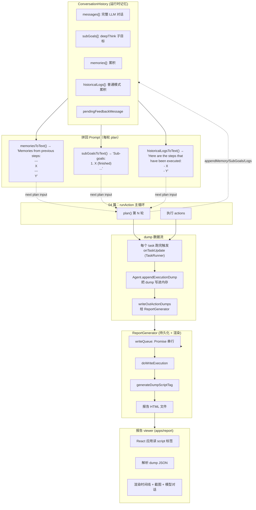
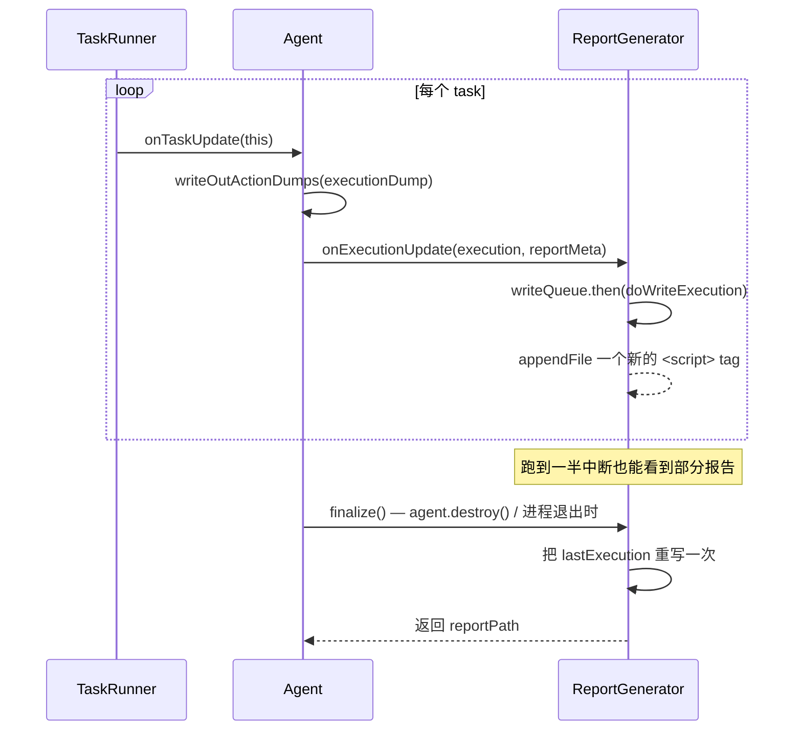
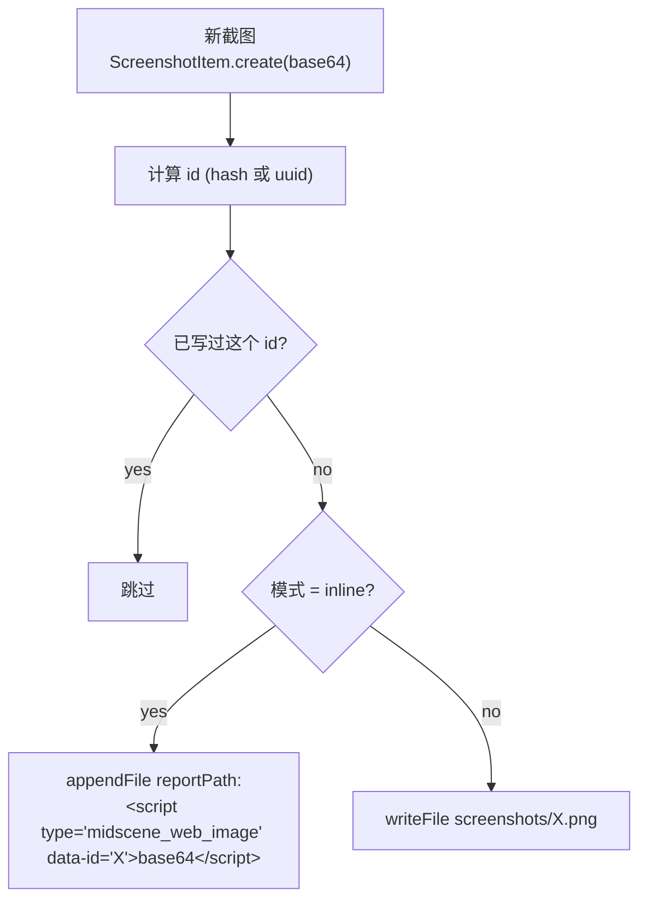

# 10 · 长序列规划、Memory 与 Dump/Report（Memory · Long-horizon · Dump · Report）

> 分析基于 commit `702d5375`（main，v1.8.1）
>
> 本篇覆盖核心要点 **D4（长序列规划：跨页面跳转的操作记忆 / Memory / History）+ 报告产物结构**。

---

## 0. TL;DR

- **长序列规划的工程基础是 04 篇的 `ConversationHistory`**——它持有四块独立状态：`messages` / `subGoals` / `memories` / `historicalLogs`。每次 plan 调用都会向这四块累积。
- **`<memory>` 标签是 Midscene 解决"跨步骤事实记忆"的方式**：模型在某一轮看到关键信息（如"订单号 = ABC123"），用 `<memory>` 把这条事实记下来；后续每一轮 plan 都把所有 memories 拼进 user msg，让模型即使看不到老截图也知道这个事实。`llm-planning.ts:338-341`：每次 plan 完成后 `conversationHistory.appendMemory(planFromAI.memory)`。
- **`subGoals` 是 deepThink 模式独有的目标拆分机制**——模型把"注册并发帖"拆成 3 个子目标，按状态 (pending/running/finished) 推进。**普通模式（默认）走 `historicalLogs`**——只记录"做了什么"的纯文本日志。
- **dump 是"运行时数据 + 截图 + 元数据"的完整结构**：`ReportActionDump` 顶层 = `{sdkVersion, groupName, modelBriefs, deviceType, executions[]}`；每个 `ExecutionDump = {id, name, tasks[]}`；每个 `ExecutionTask = {taskId, type, subType, status, param, output, error, thought, usage, timing, recorder, uiContext}`。
- **Report 是 HTML 单文件**：`apps/report` 构建出的 React 应用 HTML 模板 + 占位符 `REPLACE_ME_WITH_REPORT_HTML`；运行时把 dump JSON 作为 `<script type="midscene_web_dump">{escaped JSON}</script>` 注入到 `</html>` 前——前端读这些 script 标签解析 dump 渲染时间线。
- **`ReportGenerator` 用串行写队列保证不阻塞 Node 主线程**：`writeQueue: Promise<void>` 把每次 `onExecutionUpdate` 排队，全用 `fs/promises`。源码注释里直白写了"sync I/O blocked the loop for 20+ seconds per run"——这是踩过坑的工程决定。
- **截图有两种存储模式**：`inline` 把 base64 嵌进 HTML 单文件（适合分享）；`directory` 拆出 PNG 到子目录（适合大型 dump，HTML 主文件小）。`ScreenshotStore` 负责去重（同一张图同一 id 不写两次）。
- **没有"长图拼接"** —— 03 篇 4.2 节、08 篇 4.10 节看过的"每次只看视口"原则也适用于 dump：报告里每个 task 各自有自己的截图，相邻 task 截图可能差异巨大（这就是 plan 循环的状态推进）。

---

## 1. 它解决了什么问题

VLM 驱动的自动化里"长序列"的两个独立问题：

1. **运行时**：跑 20 轮 plan，模型怎么记住"刚刚提取的订单号"？怎么知道哪些子目标已完成？
2. **观测**：跑完 20 轮后，**怎么让开发者看清每一轮发生了什么**？为什么第 7 轮决定 scroll、第 12 轮抛错？

这一篇就是回答这两个问题——**运行时靠 ConversationHistory + Memory，观测靠 Dump + Report**。

---

## 2. 它在整体架构中的位置



---

## 3. 源码导览

### 3.1 关键文件清单

| 文件 | 行数 | 关键导出 | 角色 |
|---|---|---|---|
| `packages/core/src/ai-model/conversation-history.ts` | 366 | `class ConversationHistory` | **运行时记忆**（04 篇 4.5 概览，本篇展开） |
| `packages/core/src/types.ts` | 370-460 | `ExecutionTaskType`、`ExecutionTask` 类型族 | dump 数据模型 |
| `packages/core/src/types.ts` | 502-590 | `class ExecutionDump`、`fromJSON`/`serialize` | 单次执行 dump |
| `packages/core/src/types.ts` | 713-885 | `interface ReportMeta`、`class ReportActionDump` | 顶层报告结构 |
| `packages/core/src/report-generator.ts` | 436 | `class ReportGenerator`、`IReportGenerator`、`nullReportGenerator` | 写盘引擎 |
| `packages/core/src/report.ts` | 503 | 报告辅助工具 | 合并/dedup/查询 |
| `packages/core/src/report-markdown.ts` | 416 | Markdown 格式报告 | 替代 HTML 的轻量产出 |
| `packages/core/src/dump/html-utils.ts` | 481 | `generateDumpScriptTag`、`generateImageScriptTag`、`escapeContent` | HTML 注入工具 |
| `packages/core/src/dump/screenshot-store.ts` | 247 | `class ScreenshotStore` | 截图去重 + inline/directory 模式 |
| `packages/core/src/dump/screenshot-restoration.ts` | 49 | `restoreImageReferences` | 读 dump 时把 `{$screenshot: id}` 替换成实际数据 |
| `packages/core/src/screenshot-item.ts` | 218 | `class ScreenshotItem` | 截图对象（含元信息） |
| `packages/core/src/utils.ts` | 84-91 | `getReportTpl`、`REPLACE_ME_WITH_REPORT_HTML` 占位符 | 模板注入入口 |

### 3.2 关键数据结构（dump JSON schema）

```ts
// 顶层
interface IReportActionDump {
  sdkVersion: string;
  groupName: string;
  groupDescription?: string;
  modelBriefs: ModelBrief[];      // { intent?, name?, modelDescription? }[]
  executions: IExecutionDump[];
  deviceType?: string;            // 'puppeteer' / 'android' / ...
}

// 单次执行
interface IExecutionDump {
  id?: string;
  name: string;                   // 如 'Act: 登录'
  description?: string;
  tasks: ExecutionTask[];
  aiActContext?: string;
  logTime: number;
}

// 单个 task（含运行时所有细节）
interface ExecutionTask {
  taskId: string;
  type: 'Planning' | 'Insight' | 'Action Space' | 'Log';
  subType?: string;               // 'Plan' / 'Locate' / 'Tap' / 'Query' / ...
  status: 'pending' | 'running' | 'finished' | 'failed' | 'cancelled';
  param?: any;                    // input
  output?: any;                   // 执行结果
  thought?: string;               // 模型推理过程
  error?: Error;
  errorMessage?: string;
  errorStack?: string;
  timing?: {
    start: number;
    getUiContextStart?: number; getUiContextEnd?: number;
    callAiStart?: number; callAiEnd?: number;
    beforeInvokeActionHookStart?: number; beforeInvokeActionHookEnd?: number;
    callActionStart?: number; callActionEnd?: number;
    afterInvokeActionHookStart?: number; afterInvokeActionHookEnd?: number;
    captureAfterCallingSnapshotStart?: number; captureAfterCallingSnapshotEnd?: number;
    end?: number; cost?: number;
  };
  usage?: { prompt_tokens?, completion_tokens?, total_tokens? };
  searchAreaUsage?: AIUsageInfo;
  reasoning_content?: string;
  recorder?: ExecutionRecorderItem[];   // 截图序列
  uiContext?: UIContext;
  hitBy?: { from: string; context: any };
}
```

---

## 4. 核心机制深度解析

### 4.1 D4 长序列规划的四件套（ConversationHistory 内部）

04 篇 4.5 节看过 ConversationHistory 的四块状态。本节展开"它们如何被写入 + 渲染回 Prompt"。

#### 4.1.1 状态写入路径（每次 plan 完成）

源码 `llm-planning.ts:317-341`：

```ts
// Update sub-goals only in planning deep-think mode
if (includeSubGoals) {
  if (planFromAI.updateSubGoals?.length) {
    conversationHistory.mergeSubGoals(planFromAI.updateSubGoals);   // ← <update-plan-content>
  }
  if (planFromAI.markFinishedIndexes?.length) {
    for (const index of planFromAI.markFinishedIndexes) {
      conversationHistory.markSubGoalFinished(index);                // ← <mark-sub-goal-done>
    }
  }
  if (planFromAI.log) {
    conversationHistory.appendSubGoalLog(planFromAI.log);            // ← <log> 挂到当前 sub-goal
  }
} else {
  if (planFromAI.log) {
    conversationHistory.appendHistoricalLog(planFromAI.log);         // ← <log> 累积到普通日志
  }
}

if (planFromAI.memory) {
  conversationHistory.appendMemory(planFromAI.memory);               // ← <memory> 永远累积
}

conversationHistory.append({                                           // ← LLM 完整对话
  role: 'assistant',
  content: [{ type: 'text', text: rawResponse }],
});
```

**写入规则总结**：

| XML 标签 | 写入字段 | 触发条件 |
|---|---|---|
| `<update-plan-content>` | `subGoals[]` (替换/合并) | 仅 deepThink |
| `<mark-sub-goal-done>` | `subGoals[].status = 'finished'` | 仅 deepThink |
| `<log>` | `subGoalLogs[currentRunning]` | deepThink |
| `<log>` | `historicalLogs[]` | 普通模式 |
| `<memory>` | `memories[]` | 两种模式都写 |
| 整个 `rawResponse` | `messages[]` (role='assistant') | 所有调用 |

#### 4.1.2 渲染回 Prompt 路径（下次 plan 前）

源码 `llm-planning.ts:175-220`：

```ts
const subGoalsText = includeSubGoals
  ? conversationHistory.subGoalsToText()
  : conversationHistory.historicalLogsToText();
const subGoalsSection = subGoalsText ? `\n\n${subGoalsText}` : '';

const memoriesText = conversationHistory.memoriesToText();
const memoriesSection = memoriesText ? `\n\n${memoriesText}` : '';

// 拼进 user message
latestFeedbackMessage = {
  role: 'user',
  content: [
    { type: 'text', text: `${pendingFeedback}...${memoriesSection}${subGoalsSection}` },
    { type: 'image_url', image_url: { url: imagePayload, detail: 'high' } },
  ],
};
```

**实际渲染示例**（04 篇 4.5 节展开过，这里强调三块的拼接顺序）：

```
[user msg #N text]
"{pendingFeedback}... The previous action has been executed, here is the latest screenshot. Please continue.

Memories from previous steps:
---
Order ID is ABC123
---
Total amount is $42.50
---


Sub-goals:
1. Login (finished)
2. Add to cart (running)
3. Checkout (pending)
Current sub-goal is: Add to cart
Actions performed for current sub-goal:
- Click Buy Now button"
[image_url: <base64>]
```

#### 4.1.3 `<memory>` 的工程价值

**Memory 解决的是"上下文压缩后信息丢失"**——04 篇看过 `compressHistory(50, 20)` 会丢弃前 30 条消息。如果第 5 轮看到的关键信息（"订单号 ABC123"）被压缩丢了，第 50 轮还要用怎么办？

**解决**：模型主动用 `<memory>` 把这条事实摘要到 memories 列表。压缩 messages 不影响 memories 列表——它**始终全量拼进 user msg**。

**实际 Prompt 指导**（03 篇 `llm-planning.ts` 看过的）：
```
Memory Data from Current Screenshot (related tags: <memory>)
While observing the current screenshot, if you notice any information that might be needed in
follow-up actions, record it here. The current screenshot will NOT be available in subsequent
steps, so this memory is your only way to preserve essential information.
```

**深含义**：模型"知道自己未来看不到当前截图"——这是一种 in-context 教学的元能力。

#### 4.1.4 子目标 vs 历史日志：deepThink 的两种风格

**deepThink: false（默认）**：
```
Here are the steps that have been executed:
- Click on the Name field
- Type 'John' into the Name field
- Move to the Email field
- Type email address
```

**deepThink: true**：
```
Sub-goals:
1. Fill in the Name field with 'John' (finished)
2. Fill in the Email field (running)
3. Submit (pending)
Current sub-goal is: Fill in the Email field
Actions performed for current sub-goal:
- Move to the Email field
- Type email address into the Email field
```

**差异**：
- 普通模式 = **线性日志**——便宜，适合简单任务
- deepThink = **目标拆分 + 进度跟踪**——贵（额外 sub-goal 推理），适合复杂多步任务

模型用哪种由 Prompt 触发——`includeSubGoals = opts.planningModeDeepThink === true`（`llm-planning.ts:130`）。

### 4.2 Dump 数据模型：从 task 到 ReportActionDump

#### 4.2.1 单 task 的完整字段（dump 报告里你能看到的所有东西）

读 `types.ts:410-450` 的 `ExecutionTask` 类型，再叠加 `ExecutionTaskReturn`：

```
ExecutionTask =
  // 基础信息
  + taskId (uuid)
  + type ('Planning' | 'Insight' | 'Action Space' | 'Log')
  + subType ('Plan' | 'Locate' | 'Tap' | 'Query' | ...)
  + status (pending/running/finished/failed/cancelled)

  // 业务数据
  + param (input)
  + output (执行结果)
  + thought (模型 reasoning)
  + log (附加结构化日志，如 dump)

  // 错误
  + error / errorMessage / errorStack

  // 时序
  + timing.start / end / cost
  + timing.{getUiContext,callAi,beforeInvokeAction,callAction,afterInvokeAction}{Start,End}
  + timing.captureAfterCallingSnapshot{Start,End}

  // 模型使用
  + usage (prompt_tokens / completion_tokens / total_tokens)
  + searchAreaUsage (deepLocate 时 Section 调用的 usage)
  + reasoning_content (o1/DeepSeek-R1 的思考链)

  // 视觉
  + recorder[] (ExecutionRecorderItem[]，含 screenshot)
  + uiContext (本 task 用的截图上下文)

  // 命中来源（07 篇 4.7）
  + hitBy.from ('Plan' / 'User expected path' / 'Cache')
  + hitBy.context (具体数据)
```

**这是 dump 报告 UI 里你能"展开看"的所有字段**——每个都对应代码里某个写入点。

#### 4.2.2 三层嵌套：ReportActionDump > Execution > Task

```
ReportActionDump (一份 HTML 报告 = 一份)
└── executions[] (一次 agent 实例的所有 ai* 调用)
    └── tasks[] (单次 ai 调用内部的所有 task)
        └── (各种字段)
```

**何时新建 Execution**：每个 `taskExecutor.action()` / `runPlans()` / `createTypeQueryExecution()` / `waitFor()` 会创建一个新的 `ExecutionSession` → 新的 `TaskRunner` → 新的 Execution。

**何时新建 ReportActionDump**：Agent 构造时一次（`agent.ts:443-454` 的 `resetDump`），整个 Agent 生命周期共用一个。

#### 4.2.3 截图的引用 vs 内联

`types.ts:782-810` 提供两种序列化：

| 方法 | 截图字段格式 | 用途 |
|---|---|---|
| `serialize()` | `{ $screenshot: 'screenshot-id' }` 引用 | 内存里、文件分离模式 |
| `serializeWithInlineScreenshots()` | `{ base64: '...', capturedAt: N }` 内联 | 浏览器 viewer / Chrome Extension |

**目的**：dump JSON 可能很大（几 MB），截图占大头。**引用模式**让一份截图只存一次，多处引用——单 task 多次截图（before/after）不会重复存。

### 4.3 ReportGenerator：HTML 文件写盘引擎

#### 4.3.1 串行写队列（防止阻塞主线程）

源码 `report-generator.ts:1-9` 的文件头注释：

```
PERF INVARIANT — DO NOT reintroduce sync fs APIs (writeFileSync / appendFileSync) in this file's
write paths. `ReportGenerator` runs on the Electron main event loop during agent execution, and
a single progress tick appends a multi-MB ExecutionDump payload. Sync I/O here blocked the loop
for 20+ seconds per run, freezing IPC, scrcpy and every renderer round-trip. Always use
`fs/promises`. See commit 6a25e05c and `report-generator-async-contract.test.ts`.
```

**这是个"用注释写的工程规约"**——后续维护者改这个文件如果用回 sync API 就会破坏 Electron Studio 的体验。**写注释把它锁在源码里**。

实现（`report-generator.ts:185-189`）：

```ts
onExecutionUpdate(execution, reportMeta, attributes?) {
  this.lastExecution = execution;
  this.lastReportMeta = reportMeta;
  this.mergeReportAttributes(attributes);
  this.writeQueue = this.writeQueue.then(async () => {
    if (this.destroyed) return;
    await this.doWriteExecution(execution, reportMeta);
  });
}
```

**`writeQueue` 是 Promise 链**——每次 update 都 `.then` 接到队尾。多次并发调用自动串行化，且不阻塞调用方（同步入队、异步执行）。

#### 4.3.2 文件输出两种模式

源码 `report-generator.ts:142-175` 的 `static create`：

```ts
const reportPath =
  opts.outputFormat === 'html-and-external-assets'
    ? join(outputDir, 'index.html')
    : join(reportRootDir, ensureHtmlFileName(reportFileName));
return new ReportGenerator({
  reportPath,
  screenshotMode:
    opts.outputFormat === 'html-and-external-assets'
      ? 'directory'
      : 'inline',
  // ...
});
```

| 模式 | 输出 | 截图模式 | 适合 |
|---|---|---|---|
| **默认（single-html）** | 单 HTML 文件 | `inline` (base64 嵌 HTML) | 分享 / 邮件附件 |
| **`html-and-external-assets`** | 目录 + `index.html` + `screenshots/` | `directory` (PNG 拆出) | 大型 dump / 需要 `npx serve` 浏览 |

#### 4.3.3 实时写 vs 最终写

Midscene 是**边跑边写**，不是"跑完一次性输出"：



**实时写的好处**：
- 长跑任务中途看到进度（用浏览器开 file://path 自动刷新）
- 跑到一半失败有完整 dump（最后一个 task 的错误也写进去了）

**代价**：每次 append 一个 script tag 而不是覆写——HTML 文件里有 N 个 dump 标签，**前端去重**显示最新的。

#### 4.3.4 注入模板的"占位符替换"

`utils.ts:84-90`：

```ts
declare const __DEV_REPORT_PATH__: string;

export function getReportTpl() {
  if (typeof __DEV_REPORT_PATH__ === 'string' && __DEV_REPORT_PATH__) {
    return fs.readFileSync(__DEV_REPORT_PATH__, 'utf-8');
  }
  const reportTpl = 'REPLACE_ME_WITH_REPORT_HTML';
  return reportTpl;
}
```

**这就是 01 篇看到的 `REPLACE_ME_WITH_REPORT_HTML` 占位符的实现入口**。

- **生产构建**：`apps/report` 的 build 产物（React 应用 HTML）会**替换源码中的字符串 `'REPLACE_ME_WITH_REPORT_HTML'`** 进 `core/dist`
- **开发模式**：`USE_DEV_REPORT=1` 环境变量启用 `__DEV_REPORT_PATH__`，从磁盘读最新 report dist（无需 rebuild core）

具体替换由 rslib 构建配置完成——这就是 01 篇 5.2 节说的"循环依赖+模板注入需要整仓 build"的实现。

### 4.4 `<script type="midscene_web_dump">` 注入协议

源码 `dump/html-utils.ts:456-481`：

```ts
export function generateDumpScriptTag(
  json: string,
  attributes?: Record<string, string | number | boolean>,
): string {
  let attrString = '';
  if (attributes && Object.keys(attributes).length > 0) {
    attrString = ' ' + Object.entries(attributes)
      .map(([k, v]) => k + '="' + encodeURIComponent(v) + '"')
      .join(' ');
  }
  return '<script type="midscene_web_dump"' + attrString + '>' +
         escapeContent(json) + '</script>';
}
```

**注入示例**：
```html
<script type="midscene_web_dump" data-group-id="uuid-1234">
{"sdkVersion":"1.8.1","groupName":"Midscene Report","executions":[...]}
</script>
```

**前端读取协议**：viewer 用 `document.querySelectorAll('script[type="midscene_web_dump"]')` 拿到所有标签，按 `data-group-id` 分组 + 按 execution `id` 去重，渲染时间线。

**`type="midscene_web_dump"` 让浏览器不执行**——只是数据载体。

### 4.5 `ScreenshotStore`：截图去重 + 双模式输出

源码 `dump/screenshot-store.ts`（247 行）。简化逻辑：



**关键观察**：
- **截图 id 决定去重**：同一张图（同 hash）在多个 task 引用，只写一次
- **inline 模式下 image 单独 script tag**（不在 dump JSON 里，dump JSON 用 `{$screenshot: id}` 引用）——这样 dump JSON 紧凑，浏览器加载快
- **directory 模式**：dump JSON 用 `{$screenshot: id}` 引用，前端通过相对路径 `screenshots/X.png` 加载

### 4.6 dump 报告 UI 关键展示要素

前端 `apps/report` 读 dump 后渲染的核心 UI 块（基于经验观察 + dump 数据模型反推）：

| UI 块 | 数据来源 |
|---|---|
| **左侧时间线** | `executions[].tasks[]` 按 `timing.start` 排序 |
| **task 详情** | `param` / `output` / `thought` / `usage` / `recorder` |
| **截图前后对比** | `recorder[]` 里多个 `{type: 'screenshot', screenshot, timing: 'before-calling' | 'after-calling'}` |
| **bbox 高亮** | 用 `box-select.ts:annotateRects` 把 task.output 里的 rect 画到截图上 |
| **时序饼图** | `timing.cost` 各阶段分解（`getUiContext` / `callAi` / `callAction` 等） |
| **token 消耗** | `usage` 累加 |
| **命中来源** | `hitBy.from` |
| **错误堆栈** | `errorMessage` + `errorStack` |
| **模型 raw response** | `output.rawResponse` 或 `log.rawResponse` |

### 4.7 `modelBriefs`：跨多模型的模型清单

`types.ts:739-754`：

```ts
export interface ModelBrief {
  intent?: string;          // 'planning' / 'insight' / 'default'
  name?: string;            // 实际从 LLM usage 拿的模型名（如 "gpt-4o-2024-05-13"）
  modelDescription?: string;
}
```

**何时填充**：每次 `callAI` 完成时，把 `usage.model` + 当前 slot intent 写进 `modelBriefs` 数组（去重）。

**用途**：报告顶部显示"本次跑用了 X、Y 两个模型"——多模型协调场景（planning 用大模型 / insight 用小模型）的可视化。

### 4.8 "无报告"模式：nullReportGenerator

`report-generator.ts:69-74`：

```ts
export const nullReportGenerator: IReportGenerator = {
  onExecutionUpdate: () => {},
  flush: async () => {},
  finalize: async () => undefined,
  getReportPath: () => undefined,
};
```

**两种触发**：
- `opts.generateReport === false`
- `ifInBrowser`（浏览器环境无文件系统）

**模式价值**：让 `Agent` 代码不需要 if-else `if (this.reportGenerator)`——直接调，nullReportGenerator 是 no-op。**经典的 Null Object Pattern**。

### 4.9 `persistExecutionDump`：JSON dump 单独写出

`report-generator.ts:240-244`：

```ts
if (this.shouldPersistExecutionDump) {
  await this.persistExecutionDumpToFile(execution, singleDump);
}
```

**触发**：`opts.persistExecutionDump = true`。

**额外输出**：除了 HTML，还写 `{outputDir}/{index}.execution.json`——纯 JSON 文件，可被第三方工具消费。

**用途**：
- 离线分析（自己写脚本统计 token / 失败模式）
- 接入 BI（langfuse / langsmith）
- 不依赖 HTML viewer 的回归比对

### 4.10 报告辅助：deduplication / merging / markdown

| 文件 | 关键能力 |
|---|---|
| `report.ts` | `collectDedupedExecutions`、`ReportMergingTool`、`dedupeExecutionsKeepLatest` | 多份 dump 合并、按 id 去重 |
| `report-markdown.ts` | 把 dump 转 Markdown 格式 | CI 输出 / Slack 通知友好 |

**`ReportMergingTool` 的用途**：多个 Agent 实例（如多个 Playwright fixture）的 dump 合并成一份。比如分布式测试场景。

---

## 5. 设计取舍与工程权衡

### 5.1 为什么 Memory 是模型主动写而不是框架抽取？

可选方案：让 Midscene 用 NER 抽取每次截图里的"数字 / 实体"，自动塞进 memory。**他们没这么做**，因为：

- **NER 抽什么** 是模糊的——订单号、邮件地址、金额都可能重要
- **模型最知道"对后续任务有用"**——它正在规划下一步
- **Prompt 引导成本极低**：一段 `<memory>` 标签的说明就让模型自己决定

**代价**：模型有时会忘记主动用 `<memory>`——但即使不用，messages 历史里还在（除非被压缩丢）。所以 memory 是个**"安全网"**而不是必需品。

### 5.2 为什么 deepThink 是 opt-in 而不是默认？

deepThink 让模型多做"目标拆分 + 状态推进"。明显更智能。**为什么不默认开**？

- **多一次推理**：每轮 plan 要算 `<update-plan-content>` 和 `<mark-sub-goal-done>` 额外消耗 token
- **简单任务上是"过度规划"**："点击登录"不需要 sub-goal
- **deepThink 是工程旋钮**：让用户在复杂任务上选择"多花钱换准确"

### 5.3 单 HTML vs 目录模式

**单 HTML 的代价**：base64 截图巨大（每张几十 KB），10 个 task 报告 1-2MB，跑 100 个 task 时 HTML 20MB+，浏览器加载慢。

**目录模式好处**：HTML 主文件几百 KB，截图按需加载。

**为什么默认是单 HTML**：分享一个文件 vs 分享一个目录——单文件易用性碾压。除非用户明确产出大量 task，否则单 HTML 够用。

### 5.4 实时写 vs 退出时一次性写

**实时写的代价**：HTML 里有 N 个重复 dump script tag。**前端去重**显示最新——这意味着 HTML 文件是"append-only 日志格式"，最终大小 ≈ N × dump 大小。

**退出时一次性写**：HTML 文件最小。但中途崩了什么都没有。

**他们选实时写**——容错 > 文件大小。**关键场景**：长跑任务 + Electron 中途崩 + 用户能从 HTML 找到崩前最后一个 task。

### 5.5 ScreenshotStore 去重粒度

**按 hash 还是按 id 去重？** 看 `ScreenshotItem.create` 实现——id 通常是 `uuid()`。**不去重相同内容、不同 id 的截图**——这是有意为之：
- 截图内容 hash 计算成本高
- 同一帧截图在 N 个 task 里被引用时只创建一次 `ScreenshotItem`（同 id）——上层数据结构保证了这点
- 不同 task 截图内容相同但确实代表不同时间点

### 5.6 为什么用 `<script type="midscene_web_dump">` 而不是 JSON 文件

把 dump 数据放在 script 标签里，**不放在外部 .json 文件**：
- **单 HTML 自包含**——不需要额外加载请求
- **浏览器不执行（type 是自定义类型）**——纯数据
- **简单**：viewer 启动时 `querySelectorAll` 一句话拿全部数据

**代价**：HTML 嵌入大 JSON 时 viewer 启动慢——但即使外置 JSON 也要加载，差异不大。

---

## 6. 与其他模块的协作

- **上游**：
  - 04 篇 `TaskRunner.onTaskUpdate` → `Agent.appendExecutionDump` → `Agent.writeOutActionDumps` → `ReportGenerator.onExecutionUpdate`
  - `llm-planning.ts:317-341` 写入 ConversationHistory
- **下游**：
  - `apps/report` React 应用：读 script 标签渲染
  - `apps/visualizer`：React 组件库，被 report 复用
  - 用户的 CI 工具：消费 `.execution.json`
- **横向**：
  - 09 篇 cache 在 `hitBy` 字段里留痕
  - 07 篇 locator 的 `searchAreaUsage` 在 dump 里独立显示

---

## 7. 常见陷阱 & 调试经验

### 7.1 报告 HTML 打开是 `REPLACE_ME_WITH_REPORT_HTML`

**症状**：见 01 篇 7.1 节。
**根因**：build 顺序错，`apps/report` 没准备好就 build 了 `core`。
**解决**：`pnpm run build:skip-cache`。

### 7.2 长跑任务 HTML 几十 MB 卡死浏览器

**症状**：跑 100+ task，HTML 20MB+，浏览器打开 hang。
**解决**：
```ts
new PuppeteerAgent(page, {
  outputFormat: 'html-and-external-assets',   // ← 截图拆出
});
```
打开时用 `npx serve <outputDir>`。

### 7.3 模型给的 `<memory>` 反而干扰决策

**症状**：模型在第 5 轮 memory 里写了过时事实，影响第 50 轮判断。
**例如**：第 5 轮 memory: "购物车有 3 件商品"；第 30 轮用户点了删除；第 50 轮模型仍以为有 3 件。
**解决**：
- 改 Prompt 教模型"memory 应记不变事实"（订单号、用户 ID）而不是"动态状态"（购物车数量）
- 或者在某些动作后 `agent.conversationHistory.clearMemories()`（如果暴露的话）——v1.8.1 没看到这个 API 公开

### 7.4 长跑任务里 ConversationHistory 占内存大

**症状**：跑 1 小时后 Node 进程内存 1G+。
**根因**：
- `messages[]` 累积（虽然 `compressHistory(50, 20)` 控制了长度）
- 每张截图 base64 几十 KB × 几百轮 = ~MB
**解决**：
- 没有官方"清空 history"API。需要 destroy agent 重新创建
- 监控 `agent.dump.executions.length`，超阈值 destroy

### 7.5 dump 报告里某个 task `output` 字段缺失

**症状**：点开 task 详情，output 是 undefined。
**根因**：executor 函数没返回 `{output}`——可能这种 task 类型本来就不该有 output（如 `Action Space/Finished`）。
**调试**：看 04 篇的 task type 表确认是否预期。

### 7.6 自定义 `onDumpUpdate` 监听器内部抛错

**症状**：监听器抛错，没看到。
**根因**：`agent.ts:344-348` 捕获后 `console.error('Error in onDumpUpdate listener', error)`——不会让错误传出。
**调试**：搜索这条 error log。

### 7.7 多 Agent 实例报告互相覆盖

**症状**：跑两个 Agent 实例，报告文件互相覆盖。
**根因**：`reportFileName` 默认基于时间戳 + uuid（`utils.ts:161-169`），但你可能手动传了相同的 `opts.reportFileName`。
**解决**：让 Midscene 自动生成名字，或显式传不同。

### 7.8 modelBriefs 显示了不该出现的模型

**症状**：明明配的 qwen3-vl-plus，但报告里 modelBriefs 有 `gpt-4o`。
**根因**：你某次手动覆盖了 `MIDSCENE_PLANNING_MODEL_NAME`——modelBriefs 累积所有用过的模型名。
**调试**：搜 dump JSON 里哪个 task 的 `usage.model` 是 gpt-4o。

---

## 8. 🛠️ 实操章节

### 8.1 实操 A：跑长任务用 deepThink + memory

```ts
import 'dotenv/config';
import puppeteer from 'puppeteer';
import { PuppeteerAgent } from '@midscene/web';

async function main() {
  const browser = await puppeteer.launch({ headless: false });
  const page = await browser.newPage();
  await page.goto('https://www.saucedemo.com');

  const agent = new PuppeteerAgent(page, {
    aiActContext: 'You are a careful QA engineer.',
    generateReport: true,
  });

  // 复杂多步任务 + deepThink
  await agent.aiAct(
    '登录 (standard_user / secret_sauce)、把红色背包加入购物车、然后提取购物车里所有商品的名字和价格',
    { deepThink: true },
  );

  // 打开报告查看
  console.log('Report:', agent.reportFile);
  await browser.close();
}

main();
```

**打开 dump 报告**，你会看到：
- 多个 Plan 节点
- 每个节点的 `output.updateSubGoals` / `markFinishedIndexes`
- 某个节点的 `output.memory` 字段里有"红色背包价格 $X"

### 8.2 实操 B：用 `persistExecutionDump` 离线分析

```ts
const agent = new PuppeteerAgent(page, {
  generateReport: true,
  persistExecutionDump: true,
  outputFormat: 'html-and-external-assets',
});

// ... 跑测试

// agent.destroy() 后会有：
// midscene_run/report/<reportName>/index.html
// midscene_run/report/<reportName>/0.execution.json
// midscene_run/report/<reportName>/screenshots/*.png
```

然后写脚本分析：
```ts
import fs from 'node:fs';

const dump = JSON.parse(fs.readFileSync('0.execution.json', 'utf8'));
const totalTokens = dump.executions
  .flatMap(e => e.tasks)
  .reduce((sum, t) => sum + (t.usage?.total_tokens || 0), 0);
console.log('total tokens:', totalTokens);
```

### 8.3 实操 C：自定义 dump 监听器

```ts
agent.onDumpUpdate = (dumpString, executionDump) => {
  // executionDump 是新的 ExecutionDump 对象
  const tasks = executionDump.tasks;
  const lastTask = tasks[tasks.length - 1];
  console.log(`Task done: ${lastTask.type}/${lastTask.subType} → ${lastTask.status}`);
};

await agent.aiAct('登录');
// 每个 task 跑完都会打印一行
```

### 8.4 推荐断点

| 文件 | 行 | 观察 |
|---|---|---|
| `llm-planning.ts:317` | sub-goal 更新分支 | 看 deepThink 路径 |
| `llm-planning.ts:333` | historicalLogs 累积 | 看普通模式日志 |
| `llm-planning.ts:339` | memory 追加 | 看 memory 触发 |
| `conversation-history.ts:343` | compressHistory | 看何时压缩 |
| `agent.ts:332` | onTaskUpdate 钩子 | dump 实时写起点 |
| `report-generator.ts:185` | onExecutionUpdate | 看 writeQueue 入队 |
| `report-generator.ts:230` | doWriteExecution | 看实际写盘 |
| `screenshot-store.ts` | writeInlineImage / writeFile | 看截图去重 |

### 8.5 引导式实验

1. **打印 history 各块大小**：
   在 `runAction` 主循环里加 `console.log(history.length, history.memories.length, history.subGoals.length, history.historicalLogs.length)`——观察增长曲线。

2. **手动触发 memory**：
   写一个 Prompt 故意诱导：
   ```ts
   await agent.aiAct('记住当前页面的订单号 ABC123，然后点 Submit 按钮');
   ```
   看 dump 里某个 Plan 的 output.memory 是否有"ABC123"。

3. **对比 deepThink 开关下的 dump 大小**：
   同样任务跑两次：一次 `deepThink: false`，一次 `true`。看 HTML 报告字节数 + token 用量差异。

4. **手动 build 单独的 viewer**：
   ```bash
   cd apps/report && pnpm run dev
   ```
   打开 dev server，注入一份 dump JSON（用 8.2 拿到的）——你可以在 React 源码里 inject dump 来调试 viewer 渲染。

5. **追踪一条 memory 的渲染轨迹**：开 DEBUG 看每轮 plan 的实际 user msg，找 "Memories from previous steps:" 段——观察它怎么增长。

---

## 9. 自检问题

1. ConversationHistory 维护 4 块独立状态。哪一块在 deepThink 关闭时不会被填充？哪一块"在 messages 被压缩时不受影响"？这种"安全网"机制解决什么具体问题？
2. 模型输出 `<memory>` 标签的内容会被写到 ConversationHistory 哪个字段？这个字段在下次 plan 的 user msg 里出现在哪个位置？
3. dump 报告里的截图引用 `{ $screenshot: 'id' }`。它在 HTML 文件里是怎么和实际 base64 数据关联起来的？说出协议名（注入 script tag 的 type 值）。
4. 一份大 dump 的 HTML 报告打开非常慢。给出至少 2 个改善方法（含 Midscene 配置）。
5. `ReportGenerator` 用 `fs/promises` 而不是 `fs.writeFileSync`——这背后涉及一个具体的工程事故。事故的现象是什么？源码注释在哪个文件第几行？
6. `nullReportGenerator` 是什么模式的应用？它解决什么具体问题？
7. 我想让 memory 在某次 action 之后清空（比如"切换用户"动作之后所有过去 memory 不再适用）。源码里目前有提供这样的 API 吗？如果没有，应该怎么 workaround？

---

## 10. 延伸阅读

- `apps/report/src/` 全文——React viewer 实现，理解 dump 是怎么被渲染的
- `packages/visualizer/src/`——React 组件库，被 report 和 Studio 共用
- `packages/core/src/report.ts:collectDedupedExecutions`——多 dump 合并
- LangSmith / LangFuse 等观测平台（理解为什么需要 `persistExecutionDump` 的 JSON 输出）

---

写完了。说"下一个"我就开始写 `11_Engineering_Tradeoffs.md`（工程取舍专题——D1 确定性 vs 幻觉 / D2 性能与成本 / D3 反馈闭环 & 视觉断言——本系列第一次"全综合"讨论）。
