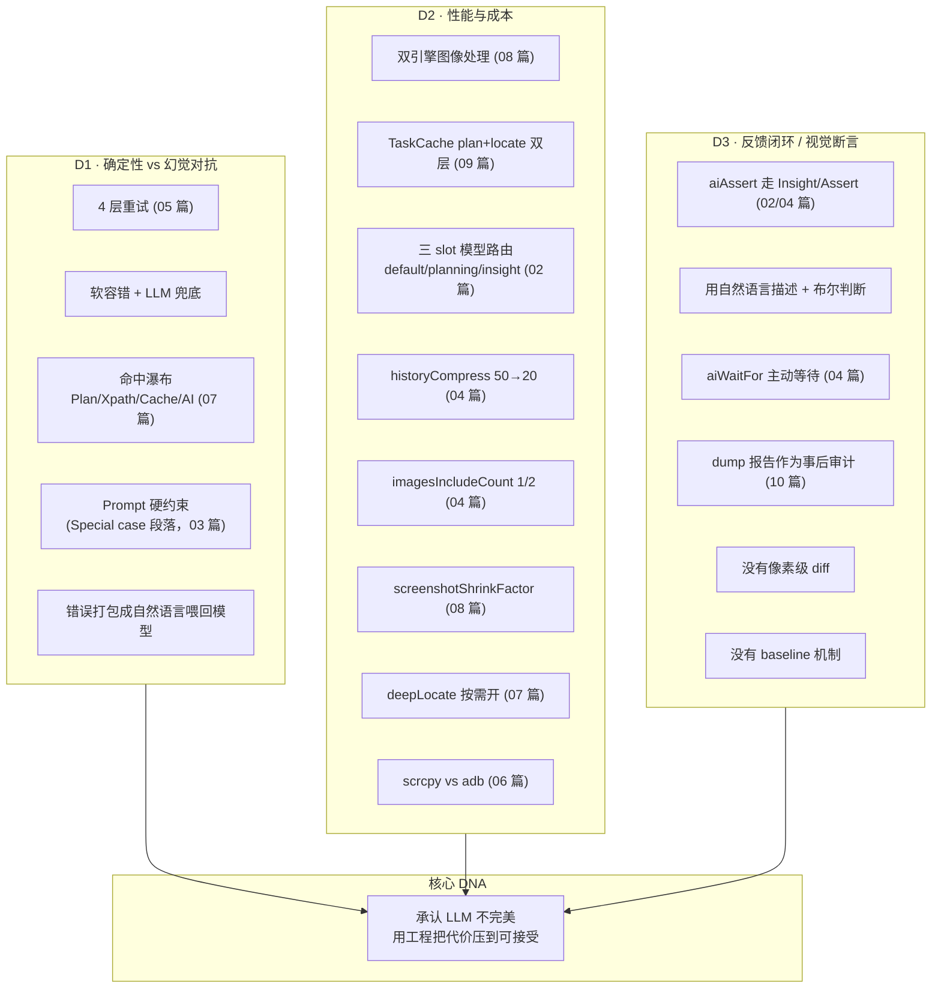
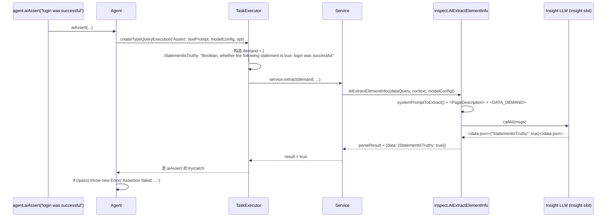

# 11 · 工程取舍专题（Engineering Trade-offs）

> 分析基于 commit `702d5375`（main，v1.8.1）
>
> 这是本系列**第一次全综合讨论**，覆盖三个核心要点：**D1 确定性 vs 幻觉对抗 / D2 性能与成本 / D3 反馈闭环 & 视觉断言**。前 10 篇是"看代码做了什么"，这篇是"看代码为什么这么做"。

---

## 0. TL;DR

- **D1 确定性 vs 幻觉**：Midscene 的"自愈"是把错误翻译成自然语言喂回 LLM 让它换策略（04 篇 L3）。**没有**视觉 diff、没有"重做整轮 plan"、没有"模型对比裁判"——靠 4 层独立重试 + cache 多源命中 + Prompt 硬约束三件套。
- **D2 性能与成本**：四个旋钮 + 一个赌注。**旋钮**：screenshot shrink、缓存策略、双模型 slot 路由（planning/insight/default）、deepLocate 区域裁切。**赌注**：相信"视觉 + 自然语言"的成本会持续下降，所以不做激进的 token 优化（如 SOM 标注 / DOM 替代）。
- **D3 反馈闭环 / 视觉断言**：`aiAssert` 不是"截图前后 diff"——它是**模型用自然语言描述当前状态再判断断言是否为真**（走 `Insight/Assert` 路径，03 篇 4.5 节）。Midscene 没有像素级视觉对比，没有 baseline 截图机制。
- **三大取舍的共同 DNA**：**"承认 LLM 不完美，但用工程手段把不完美的代价降到可接受"**。每个旋钮都是"成本-鲁棒性"的滑块——不存在"最优解"，只有"针对你的场景的合理配置"。

---

## 1. 它解决了什么问题 / 为什么必须有这一篇

读完前 10 篇你应该有过这种感受：**"为什么不直接 X？看起来更优雅"**。比如：
- 为什么不做视觉 diff 等页面稳？（05 篇）
- 为什么不用 OpenAI Function Calling 强约束？（03 篇）
- 为什么 cache 用字符串精确匹配而不是 hash？（09 篇）
- 为什么 deepLocate 不自动判定该不该开？（07 篇）

这些问题前面散落各处都讲过。**本篇把它们集中起来**，按三个核心矛盾归类：

- **D1**：模型不可靠 vs 测试必须稳定
- **D2**：模型贵 vs 测试要快
- **D3**：模型在变 vs 测试要复现

理解这三个矛盾的应对，你才会知道"什么时候该用 Midscene，什么时候该用传统框架"。

---

## 2. 三大主题的全局图



---

## 3. D1 · 确定性 vs 幻觉对抗

### 3.1 问题：UI 自动化最害怕的"幻觉"是什么？

VLM 在 UI 场景下的幻觉有四种形态：

| 幻觉类型 | 现象 | 危害 |
|---|---|---|
| **视觉幻觉** | 模型说"我看到 Login 按钮在 (300, 500)"——但屏幕上根本没那个按钮 | 点击到空白处 / 错点别的元素 |
| **意图幻觉** | 用户说"填表"，模型自作主张"填完再提交" | 提交了不该提交的数据 |
| **重复幻觉** | 模型每轮都说"我下一步做 X"，但 X 永远做不完 | 死循环 |
| **歧义幻觉** | 页面有 3 个 "Submit" 按钮，模型选错一个 | 触发错误流程 |

Midscene 应对每种幻觉的策略不同——下面逐一展开。

### 3.2 D1 应对一：视觉幻觉 → 多源命中 + 重新定位

**主防御**：07 篇的 **4 种命中来源瀑布**（Plan / Xpath / Cache / AI locate）。

| 命中类型 | 防御什么 |
|---|---|
| **Plan hit** | 模型刚刚说的坐标 = 当前帧识别——最新最准 |
| **Xpath hit** | 用户显式硬编码——绕过模型 |
| **Cache hit** | 历史成功过的视觉特征——只要 DOM 没大改就能复用 |
| **AI locate** | 最后兜底——重新让模型识别 |

**第二防御**：05 篇的 **`describeElementAtPoint` 升级式重试**——前 2 次普通定位，第 3 次起强制 deepLocate。`verifyLocator` 验证"识别的坐标和期望坐标距离 ≤ 20 像素或在矩形内"才算通过。

**第三防御**：04 篇主循环 `errorCountInOnePlanningLoop ≤ 5`——单轮里 action 失败超 5 次直接放弃，避免在错误位置上反复挣扎。

### 3.3 D1 应对二：意图幻觉 → Prompt 硬约束 + 用户旋钮

03 篇 4.1.2 节看过的 Prompt 段落：

```
CRITICAL: The User's Instruction is the Supreme Authority
- "fill out the form" → Do NOT submit the form.
- "click the login button" → Do NOT wait for page load or verify login success.
- "type 'hello'" → Do NOT press Enter or trigger search.
```

**这是工程上最便宜的防御**——一段 prompt 阻止"过度帮助"。

**用户旋钮**：
- `aiActContext`：自定义 system prompt 补充（"你是测试工程师，不要做任何超出步骤的事"）
- 把任务拆细：与其 `aiAct('登录并下单')`，不如 `aiAct('登录')` + `aiAct('下单')`——减少模型自主推理空间

### 3.4 D1 应对三：重复幻觉 → 双计数器 + 错误反馈

04 篇 4.7 节看过的双计数器：

| 计数器 | 上限 | 触发 |
|---|---|---|
| `replanCount` | 20（默认）/ 40（UI-TARS）/ 100（AutoGLM） | plan 循环数 |
| `errorCountInOnePlanningLoop` | 5 | 单 plan 内 action 失败数 |

**错误反馈机制**（`tasks.ts:510-518`）：
```ts
catch (error: any) {
  errorCountInOnePlanningLoop++;
  conversationHistory.pendingFeedbackMessage = `Time: ${timeString}, Error executing running tasks: ${error?.message}`;
}
```

**关键工程哲学**：**错误不是"扔掉重试"，而是"翻译成自然语言喂回模型"**。模型看到 "Error: Element not found: 登录按钮" → 自己决定"我重试 / 我换 prompt / 我滚动后再试 / 我放弃"。

这是 Midscene 区别于传统重试装饰器（`@retry(maxAttempts=3)`）的核心：**重试逻辑外包给 LLM**。

### 3.5 D1 应对四：歧义幻觉 → "multiple elements found" 强制 throw

07 篇 4.7 节看到的：

```ts
// service/index.ts:197-202
if (elements.length > 1) {
  throw new ServiceError(
    `locate: multiple elements found, length = ${elements.length}`,
    dump,
  );
}
```

**不让模型自动选 first/last**——强制用户消歧（改 prompt / 用 deepLocate / 用 xpath）。

**为什么这么严格**：自动选一个等于隐藏 bug——下次跑可能选另一个。强制 throw 让用户在第一次就知道有歧义。

### 3.6 D1 应对五：Service-caller 层的 LLM 调用重试

源码 `service-caller/index.ts:485-563` 的内部重试循环：

```ts
const retryCount = modelConfig.retryCount ?? 1;
const retryInterval = modelConfig.retryInterval ?? 2000;
const maxAttempts = retryCount + 1;

for (let attempt = 1; attempt <= maxAttempts; attempt++) {
  try {
    // ... openai.chat.completions.create(...)
    break;  // 成功跳出
  } catch (error) {
    lastError = error;
    if (options?.abortSignal?.aborted) break;
    if (attempt < maxAttempts) {
      warnCall(`AI call failed (attempt ${attempt}/${maxAttempts}), retrying in ${retryInterval}ms...`);
      await new Promise((resolve) => setTimeout(resolve, retryInterval));
    }
  }
}
```

**这是 05 篇 L1-L4 之外的"第 5 层"重试**——更底层、更通用：
- 默认 1 次重试（共 2 次尝试），间隔 2000ms
- 可通过 `MIDSCENE_MODEL_RETRY_COUNT` / `MIDSCENE_MODEL_RETRY_INTERVAL` 调整
- 对 OpenAI API 临时网络抖动 / 5xx 错误特别有用

**完整 5 层重试体系**：

| 层 | 重试什么 | 上限 | 反馈方式 |
|---|---|---|---|
| L1 | getUiContext 抓截图失败 | 3 (1500ms 间隔) | 静默重试 |
| L2 | XML 解析失败 | 1 | 静默重新调 LLM |
| L3 | action 执行失败 | 5 | **错误打包给 LLM 看** |
| L4 | describeElementAtPoint 验证失败 | 3 | 静默重试 + 升级 deepLocate |
| **L5（本节新增）** | OpenAI HTTP 请求失败 | 1 (2000ms 间隔) | 静默重试 |

### 3.7 D1 应对六：JSON 修复（jsonrepair）

`service-caller/index.ts:893-906`：

```ts
import { jsonrepair } from 'jsonrepair';
// ...
parsed = JSON.parse(jsonrepair(cleanJsonString));
```

**这是对"模型输出 JSON 不严谨"的防御**：
- 多余逗号 (`{"a": 1,}`)
- 单引号 (`{'a': 1}`)
- 注释 (`{"a": 1 // ok}`)
- 截断 (`{"a": 1, "b":` → 自动补 `}`)

依赖 NPM 包 `jsonrepair` (`core/package.json` 里能看到)。这是**降低"模型不严谨"对系统稳定性影响**的具体工程手段。

### 3.8 为什么 Midscene 不做"模型对比裁判"？

LangGraph 等框架推崇"用第二个模型 review 第一个模型的输出"。Midscene 没做，原因：

- **成本翻倍**：每个动作两次 LLM
- **裁判模型一样会幻觉**：A 错 + B 也错 = 一致错误
- **dump 报告是更好的"事后裁判"**：人类看完整时间线判断哪里错

**取舍**：相信"plan + 4 层重试 + Prompt 约束"足以应对，不引入第二个模型的复杂度。

---

## 4. D2 · 性能与成本

### 4.1 问题：VLM 单次调用 1-5 秒，自动化怎么活？

一个简单的 `aiAct('点击 Submit')` 涉及：
- 1 次 planning LLM（~2-5 秒，~1500 tokens）
- 1 次 locate LLM（~1-3 秒，~1000 tokens）
- 1 次截图（~50-500ms）
- 1 次实际点击（~100ms）

**5-9 秒 + ~2500 tokens per action**。一个 20-step 测试用例 = **2-3 分钟 + ~50k tokens**。一天跑 1000 个用例就是 50M tokens——大模型 API 费用爆炸。

Midscene 的应对是"四个旋钮 + 一个赌注"。

### 4.2 旋钮一：缓存（最强效）

**plan cache + locate cache（09 篇）**：
- 第二次跑 = 0 次 LLM + xpath 重定位（~50ms）
- 实际节省：**95%+ 时间 / 100% token**

**适用**：稳定脚本反复跑（CI 回归）。

**不适用**：每次跑 prompt 都不同（如交互式 Playground）——cache 永远 miss。

### 4.3 旋钮二：双（实际三）slot 模型路由

02 篇 4.5 节看过的 `default` / `planning` / `insight` 三个 slot。**实际用法**：

```env
# 通用配置
MIDSCENE_MODEL_NAME=qwen3-vl-plus
MIDSCENE_MODEL_BASE_URL=https://dashscope.aliyuncs.com/compatible-mode/v1

# Planning 用大模型（贵但准）
MIDSCENE_PLANNING_MODEL_NAME=qwen3-vl-max
MIDSCENE_PLANNING_MODEL_API_KEY=...

# Insight 用小模型（便宜，看图回答问题够用）
MIDSCENE_INSIGHT_MODEL_NAME=qwen3-vl-plus
MIDSCENE_INSIGHT_MODEL_API_KEY=...
```

**成本对比**（典型）：

| 模型 | 价格档 | 用途 |
|---|---|---|
| qwen3-vl-max | 高（如 ¥40/M tokens） | Planning |
| qwen3-vl-plus | 中（如 ¥8/M tokens） | Insight + Default |

**省钱效果**：一个测试里 planning 调用占 30-40%，insight 调用占 60-70%——把 insight 切便宜模型能省 50%+ 总成本。

### 4.4 旋钮三：图像压缩 + ROI 裁切

**普通压缩**：`screenshotShrinkFactor: 2` → token 减半（08 篇 4.2.2）

**ROI 裁切**：`deepLocate: true` → 在 400×400 区域内细查（07 篇 4.5）

**两者关系**：
- shrink 是"全局便宜"——所有 task 受益但小元素识别下降
- deepLocate 是"局部精确"——只在该步骤花贵 token（额外 1 次 Section 调用），但局部识别质量碾压
- **正确组合**：`shrink: 2` + 关键步骤 `deepLocate: true`

### 4.5 旋钮四：历史压缩 + 图像数限制

04 篇看过：
- `compressHistory(50, 20)`：超 50 条消息压缩到 20
- `imagesIncludeCount = 1`（默认）/ `2`（deepThink）：历史里只保留 N 张最新图

**省的是什么**：第 20 轮 plan 不需要看到第 5 轮的截图，**只看最近 1-2 张**。

**估算**：一张高清图 ~2000 tokens × 不再发送 N-1 张 = 节省 **巨大**。这是为什么 Midscene 能跑 20+ 轮 plan 不爆 context window。

### 4.6 旋钮五：截图方式优化（端层）

06 篇 4.5 节看过：

| 端 | 优化 | 提速 |
|---|---|---|
| **Android** | scrcpy H.264 流持续解码 | 5-10x（50ms vs 500ms） |
| **iOS** | WDA MJPEG stream（可选） | 4-10x |
| **Computer** | screenshot-desktop native | 已优化 |
| **Web** | CDP `Page.captureScreenshot` | 已优化 |

**这是端层的"暗优化"**——用户不需要关心。

### 4.7 旋钮六：`vl_high_resolution_images` 等模型特定配置

`service-caller/index.ts:337-342`：

```ts
const commonConfig = {
  temperature,
  stream: !!isStreaming,
  max_tokens: maxTokens,
  ...(modelFamily === 'qwen2.5-vl' // qwen vl v2 specific config
    ? {
        vl_high_resolution_images: true,
      }
    : {}),
};

if (isAutoGLM(modelFamily)) {
  (commonConfig as unknown as Record<string, number>).top_p = 0.85;
  (commonConfig as unknown as Record<string, number>).frequency_penalty = 0.2;
}
```

**这些"魔参数"**：
- Qwen2.5-VL：`vl_high_resolution_images: true`——让图像走高分辨率分支（精度↑、token↑）
- AutoGLM：`top_p: 0.85, frequency_penalty: 0.2`——降低重复输出（agent 模型容易陷入循环）
- gpt-5：`temperature` 直接 ignore（line 290-296）——gpt-5 不接受 temperature 参数

**这些参数都是模型厂商最佳实践**——Midscene 把它们硬编码进 service-caller，用户不必关心。

### 4.8 大模型 vs 小模型调度的"非显式"边界

Midscene 没有"先用小模型试 → 失败 fallback 到大模型"的自适应路由。**为什么不做**：

- **不知道何时该 fallback**：模型输出"成功"但语义错——无法自动检测
- **两次调用**：fallback 的成本 = 小 + 大 > 直接用大
- **用户场景一致**：测试脚本里某个 ai 调用要么稳定 work 要么不 work——A/B 模型没意义

**正确路径**：用户根据自己的任务复杂度选 slot 配置——Midscene 不替用户做这个决定。

### 4.9 D2 的"赌注"：为什么不做激进 token 优化？

Midscene **没有**做的事：
- **SOM 截图标注**（Set-of-Mark）：给截图叠加数字标签，模型说"点 #5"——能省 token 但失去坐标精度
- **DOM 截图替代**：直接发 DOM 文本给模型，不发图——纯视觉路线的反命题
- **Function Calling JSON Schema 强约束**：03 篇 5.1 节讨论过为什么不用

**他们的赌注**：
- VLM 价格在 2024-2026 持续下降（事实上确实在降）
- 自然语言 + 视觉的 UX 价值远大于省一点 token
- 工程复杂度（SOM 标注成本、DOM 提取脆弱性）不值得

**这是个商业判断**——不是技术判断。如果你的场景**绝对成本敏感**（如每天百万次自动化），Midscene 可能不是最便宜方案。

### 4.10 端层的"连通性测试"

`connectivity.ts:102` 的 `runConnectivityTest`——构造 Agent 时可选跑一次，验证：
- 模型 API 可达
- 凭据正确
- 模型支持 multimodal

**用途**：CI 启动早期 fail-fast——不要等跑了 10 个 task 才发现 API 挂了。

---

## 5. D3 · 反馈闭环 / 视觉断言

### 5.1 问题：怎么确认"动作做对了"？

这是 UI 自动化的元问题。三种典型方案：

| 方案 | 代表 | 工作方式 |
|---|---|---|
| **assert by selector** | Selenium / Playwright | `expect(page.locator('h1')).toContainText('Welcome')` |
| **assert by visual diff** | percy / chromatic | 当前截图 vs baseline 截图像素对比 |
| **assert by natural language** | Midscene | `aiAssert('login was successful')` ← 模型判断 |

Midscene 选第三条路。**完整路径**：

### 5.2 `aiAssert` 的实际执行链

02 篇 4.4.3 + 04 篇 4.7 看过 `aiAssert`。完整链路：



**关键观察**：
- **使用 `insight` slot 模型**——不是 planning
- **走 `AiExtractElementInfo` 而不是 `AiLocateElement`**——它要"理解整页"不是"找元素"
- **输出格式是 `{StatementIsTruthy: boolean}`**——XML 包 JSON
- **失败时 `thought` 字段**有 reasoning——告诉你为什么模型认为断言失败

### 5.3 没有像素级 visual diff

搜整个仓库**没有 `pixelmatch` / `image-diff` / `compareImages` 之类的依赖或函数**。`box-select.ts` 里的图像合成是给 dump UI 用的，不是断言用的。

**这是有意为之**：

| 视觉 diff 方案 | 问题 |
|---|---|
| **baseline screenshot** | 每次 UI 微调（动画帧、字体渲染差异）都误报 |
| **像素阈值** | 阈值难调，且不知道"这个像素差异是 bug 还是正常迭代" |
| **维护成本** | baseline 要更新、要版本化、要审核 |

**Midscene 的替代**：用 `aiAssert('the login dialog is closed')`——**模型理解语义而非像素**。

**代价**：模型有时会误判（小概率）。**但 Midscene 接受**——和"维护 baseline 集"的运维代价相比，更划算。

### 5.4 `aiWaitFor` 的"轮询断言"

04 篇 4.8 节看过 `aiWaitFor` 的循环。**关键设计**：

```ts
// agent.ts:1287-1297
async aiWaitFor(assertion: TUserPrompt, opt?: AgentWaitForOpt) {
  const modelConfig = this.modelConfigManager.getModelConfig('insight');
  await this.taskExecutor.waitFor(
    assertion,
    {
      ...opt,
      timeoutMs: opt?.timeoutMs || 15 * 1000,
      checkIntervalMs: opt?.checkIntervalMs || 3 * 1000,
    },
    modelConfig,
  );
}
```

**默认 15 秒超时，每 3 秒查一次**——共调 5 次 insight LLM。

**这是个**有意识的**"贵但稳"设计**：不像传统 framework 的 `waitForSelector` 几乎免费（每 100ms 查 DOM），`aiWaitFor` 是"语义化但费 token"。

**用户该谨慎用**：
- 不要 `aiWaitFor('page loaded')` 当通用等待——用 `await page.waitForLoadState()` 几乎免费
- 用 `aiWaitFor` 等待**只能语义化判断的状态**——如"购物车显示空状态"

### 5.5 多步操作中第 N 步失败的回溯定位

dump 报告就是这套机制。**怎么用**：

1. 跑测试失败 → 报告 HTML 生成
2. 打开报告，找 status='failed' 的 task
3. 看 `error` / `errorMessage` / `thought` 字段
4. 上溯到前一个 task 的 `output` 看上一步状态
5. 看 `recorder[]` 里的 before/after 截图对比

**和传统框架对比**：
- Selenium 失败 → 看 stack trace（往往没用，定位是脆弱选择器导致的）
- Playwright 失败 → 看 trace viewer（强大但格式重）
- Midscene 失败 → 看 dump 报告（每个 task 含 thought = 模型的实时推理）

**dump 报告的 `thought` 字段是 Midscene 的杀手锏**——你能看到模型每一步在想什么，**而不是只看到崩了**。

### 5.6 视觉断言的"无 baseline"哲学

传统视觉回归：维护一份 baseline 截图集，每次 PR 比较新截图 vs baseline。**Midscene 没这套**。

**替代方案**：用 `aiAssert` 描述"页面应该长什么样"：
```ts
await agent.aiAssert('the homepage has a hero section with a "Get Started" button');
await agent.aiAssert('the user avatar appears in the top right corner');
await agent.aiAssert('there are exactly 4 product cards visible');
```

**优势**：
- UI 微调不破断言（按钮颜色变了无所谓——只要还能识别）
- 跨设备适用（不同分辨率 / 主题）
- 自然语言文档化测试意图（看断言就知道页面长啥样）

**劣势**：
- 模型成本（每次断言一次 LLM）
- 严格视觉精度场景不适用（如设计审稿）

### 5.7 D3 设计的"反潮流"特征

视觉断言这套设计**反**了 2020-2024 年 UI 测试的主流趋势：
- 主流：用更精细的选择器 + 更稳定的 baseline → 提高确定性
- Midscene：用自然语言 + LLM 判断 → 提高鲁棒性，放弃像素精度

**这是个清晰的取舍站队**——Midscene 不是 Playwright 的替代品，是不同范式：
- Playwright 适合：知道页面结构、需要严格视觉精度、追求秒级反馈
- Midscene 适合：UI 经常变、跨端复用、追求测试意图可读性

---

## 6. 三大取舍的共同 DNA

### 6.1 设计哲学：承认 LLM 不完美

读完 1-10 篇你会发现 Midscene 不像别的 LLM 框架"用 prompt 工程让模型变靠谱"。**它的核心姿态是**：

> "LLM 不靠谱是事实。**靠工程把不靠谱的代价降到可接受**。"

具体表现：
- **重试不是惩罚，是协议**（错误反馈给 LLM 让它换策略）
- **缓存不是绕过 AI，是承认 AI 不必每次都跑**（同样的 prompt + 同样的 UI = 应该一样的结果）
- **dump 不是日志，是协作工具**（让人能审计 AI 的每一步）
- **Prompt 硬约束不是限制，是契约**（明确告诉模型 do/don't）

### 6.2 反"过度抽象"的工程偏好

- 三条 Planner 路径独立（通用 / UI-TARS / AutoGLM）——不强行统一
- 五个端独立（不抽 `MobileBaseDevice`）——承认差异
- 14 个 ModelFamily 各自分支——参数化生成而非每家一份 Prompt 但又不强求统一

**取舍**：代码量多一点（不是 DRY 极致），但每个模块的"特殊性"被清晰承认——**修一个分支不会破坏其他分支**。

### 6.3 用户旋钮 vs 自动化

Midscene 几乎所有"成本-质量"决策都给用户作为 opt：
- `cache: { strategy: ... }` —— 用户决定
- `deepLocate: true` —— 用户决定
- `screenshotShrinkFactor: 2` —— 用户决定
- `imagesIncludeCount` —— 用户决定（虽然内部默认）
- `MIDSCENE_PLANNING_MODEL_*` —— 用户决定

**为什么不智能自适应**：
- 用户场景差异巨大
- 自适应需要"知道任务的难度" → 鸡生蛋
- 错误的自动决策比让用户选更糟（如自动开 deepLocate 翻倍 token）

**这是个"工具论"立场**：Midscene 提供旋钮，用户调到合适位置。

### 6.4 dump 作为"诚实工具"

dump 报告里你能看到：
- 模型的 raw response（不是"美化过的总结"）
- 失败 task 的完整 stack trace
- 命中来源（Plan vs Cache vs AI）
- 每段时间花了多少
- token 用了多少

**Midscene 不藏丑**——这是它能被工程师信任的基础。**不诚实的报告永远做不出工程师爱用的工具**。

---

## 7. 三大取舍的"反取舍点"（什么时候 Midscene 不适合）

诚实列出 Midscene **不适合**的场景：

| 场景 | 为什么 | 推荐替代 |
|---|---|---|
| **每次都不同 prompt** | cache 永远 miss → 100% LLM 成本 | 用 Playwright + page object |
| **严格视觉回归** | 无 baseline diff 能力 | percy / chromatic |
| **超大规模并发** | LLM API 速率限制 / 单测试 5-30s | 抽样跑 |
| **离线 / 无 API 网络** | 必须连模型 | 传统 selector |
| **超高频率测试**（秒级） | LLM 延迟瓶颈 | Cypress |
| **保密性极强** | 截图发到云端 LLM | 自部署 UI-TARS / 本地 vLLM |

**正向场景**（Midscene 闪光）：
- 跨端测试（同一脚本跑 Web + Android）
- UI 频繁变（电商首页 / 营销活动页）
- 测试意图为主（验证业务流而非像素）
- 探索性测试（让 LLM 自主尝试）
- 周期性回归（cache 命中率高）

---

## 8. 🛠️ 实操章节

### 8.1 评估你的场景该开哪些旋钮

跑一份"baseline"测试，收集：

```ts
const start = Date.now();
const tokensBefore = totalTokens(agent.dump);
await runYourTestSuite(agent);
const duration = Date.now() - start;
const tokens = totalTokens(agent.dump) - tokensBefore;
console.log({ duration, tokens });
```

然后逐项开旋钮，对比：

| 配置 | 期望节省 |
|---|---|
| 加 `cache: { id: 'X', strategy: 'read-write' }` 再跑第二次 | 跑时间 90%+ |
| 加 `screenshotShrinkFactor: 2` | tokens 30%+，但断言准确率可能微跌 |
| 把 `MIDSCENE_INSIGHT_MODEL_*` 切便宜模型 | 成本 50% |
| 跑长任务时加 `deepThink: true` 关键步骤 | 复杂任务成功率 ↑↑ |

### 8.2 评估"我应该用 Midscene 还是 Playwright" 决策树

```
你的 UI 是否每月都改？
├─ 否 → Playwright 更便宜更快
└─ 是
   ↓
   你需要跨端跑同一脚本吗？
   ├─ 是 → Midscene 强项
   └─ 否
      ↓
      测试意图是"业务流验证"还是"像素 / 性能精确"？
      ├─ 像素/性能 → Playwright + visual regression
      └─ 业务流 → Midscene
```

### 8.3 推荐断点

| 文件 | 行 | 观察 |
|---|---|---|
| `service-caller/index.ts:485` | retry 循环 | 看 L5 重试触发 |
| `service-caller/index.ts:893` | jsonrepair 调用 | 看 JSON 修复实际触发 |
| `service-caller/index.ts:337` | model 特定参数 | 看每家魔法参数 |
| `tasks.ts:511` | 错误反馈消息 | 看错误怎么翻译给模型 |
| `connectivity.ts:102` | 连通性测试 | 跑一次 healthcheck |

### 8.4 引导式实验

1. **观察 L5 重试**：故意把 API Key 设成无效，跑一次——看 debug 日志里 "AI call failed (attempt 1/2), retrying in 2000ms..."。

2. **跑 connectivity test**：
   ```ts
   import { runConnectivityTest } from '@midscene/core/ai-model';
   const result = await runConnectivityTest({ ... });
   console.log(result.checks);
   ```
   看输出哪些检查通过 / 失败。

3. **故意写歧义 prompt 看 throw**：
   ```ts
   // 假设页面有 3 个 "Submit" 按钮
   await agent.aiTap('Submit 按钮');  // 应该抛 "multiple elements found"
   ```

4. **对比 with-jsonrepair vs without**：临时改 `safeParseJson` 让它不用 jsonrepair——观察某些"输出有点脏"的模型场景下解析失败率。

5. **A/B 大小模型对比**：同一 query 用 qwen3-vl-plus vs qwen3-vl-max 各跑 10 次——统计成功率 + 平均耗时 + 总成本。

---

## 9. 自检问题

1. Midscene 总共有 5 层独立重试。请按"重试什么 + 上限 + 间隔"画一张完整表格。其中哪一层把错误"翻译成自然语言喂回模型"？这种设计的工程哲学叫什么？
2. `aiAssert('login successful')` 的内部实现走的是哪个 task type 和 subType？为什么不用 planning slot 的模型？
3. Midscene 不做视觉 diff、不维护 baseline 截图集。这套设计的**代价**是什么？**收益**是什么？哪一类项目用 Midscene 反而吃亏？
4. "命中瀑布"在 D1 防御视觉幻觉中起什么作用？4 种来源分别防御什么具体形式的幻觉？
5. 三 slot 模型路由能省多少成本？写一个具体计算：一个 20 步测试，planning 占 7 步、insight 占 13 步，planning 用 ¥40/M、insight 用 ¥8/M（vs 全部用 ¥40/M），节省比例多少？
6. Midscene 的"reverse-DRY"工程偏好（不强行抽象 Planner / Device）背后的取舍是什么？什么场景下你会写一份 `MobileBaseDevice` 父类？
7. 我维护一个 UI 极度稳定但跑得超频繁的回归测试。Midscene 适合吗？为什么？

---

## 10. 延伸阅读

- `packages/core/src/ai-model/service-caller/index.ts:485-563`——L5 重试源码
- `packages/core/src/ai-model/connectivity.ts`——连通性测试
- 同代讨论：[browser-use 的 controller-vs-agent 设计](https://github.com/browser-use/browser-use)
- Anthropic 的 "Building Effective Agents" (2024)：讨论"工程化 LLM 系统"的通用原则
- LangChain LCEL "fallback 机制"：理解为什么 Midscene 不用大小模型自动 fallback

---

写完了。说"下一个"我就开始写 `12_Yaml_CLI_MCP_Bridge.md`（YAML / CLI / MCP / Bridge Mode 四套入口的整合篇——声明式 + 命令行 + 协议 + 远控）。
