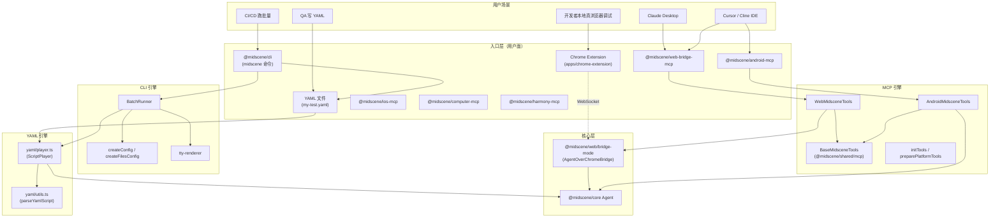
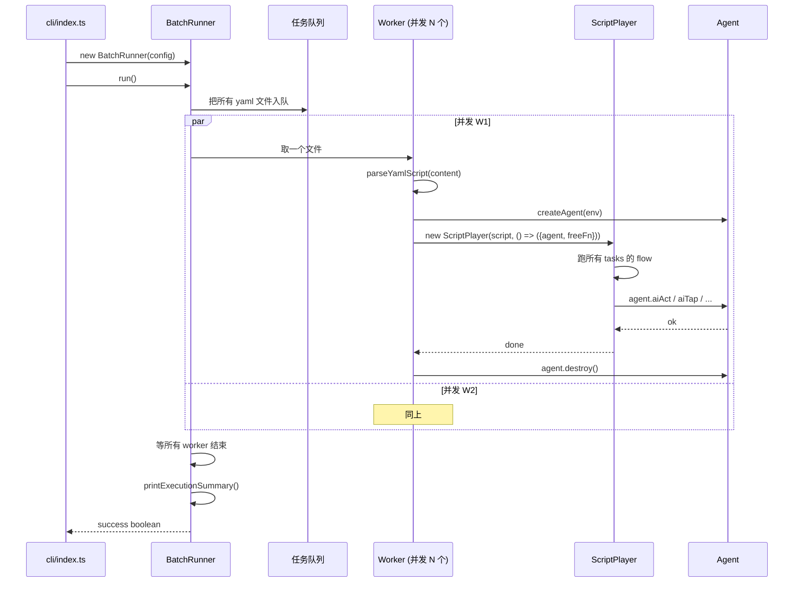

# 12 · YAML / CLI / MCP / Bridge Mode（声明式、命令行、协议、远控）

> 分析基于 commit `702d5375`（main，v1.8.1）
>
> 本篇覆盖四套"非 SDK"入口的集成方式：
> - **YAML**：声明式脚本格式（`@midscene/core/yaml`）
> - **CLI**：YAML 脚本批量运行器（`@midscene/cli`）
> - **MCP**：把 Agent 暴露给上层 AI 的协议服务（`@midscene/web-bridge-mcp`、`@midscene/android-mcp` 等）
> - **Bridge Mode**：从本地真浏览器跑测试（06 篇 4.6 已铺垫，本篇收口）

---

## 0. TL;DR

- **YAML 是 Midscene 的"非 SDK 主入口"**：声明式脚本格式，定义环境（`web` / `android` / `ios` / `computer`）+ `agent` 配置 + 多个 `tasks`，每个 task 含 `flow[]` 动作序列。命令行用户写 YAML 而不是 TS。
- **YAML player（`yaml/player.ts:755`）是"YAML → Agent API 调用"的解释器**：识别 `aiAct` / `aiTap` / `aiInput` / `aiQuery` / `aiAssert` / `aiWaitFor` / `sleep` / `javascript` / `logScreenshot` 九种 flow 项，每种对应一个 Agent 方法。
- **CLI（`@midscene/cli`）是 YAML 的"批量执行器"**：内部用 `BatchRunner` 并发跑多个 YAML 文件（默认 1 并发），含进度 TTY 渲染、`--summary` 输出、`--continue-on-error` 等。**它不是 Agent 的薄包装**——而是给用户写脚本的纯命令行工具。
- **MCP 把 Midscene 的能力暴露成 AI 工具**：MCP（Model Context Protocol）是 Claude / Cursor / Cline 等 AI Agent 调用外部工具的协议。`@midscene/web-bridge-mcp` / `@midscene/android-mcp` / `@midscene/ios-mcp` / `@midscene/computer-mcp` / `@midscene/harmony-mcp` 各端独立 MCP server。`@midscene/mcp` 是**已 deprecated** 的旧包，提示用户迁移到端专属包。
- **Bridge Mode 是"本地真浏览器 + 远端测试 CLI"**：06 篇 4.6 节看过 Socket.io 拓扑。本篇展开它作为 **MCP 的实际后端**——MCP server 通过 Bridge 连接用户已打开的 Chrome tab。
- **四套入口的统一**：都最终落到 `Agent` 类的 `ai*` 方法。CLI 走 `Agent.runYaml`，MCP 走 `BaseMidsceneTools` → `Agent.aiTap/Input/...`，Bridge Mode 给 MCP/YAML 用。**Agent 是底座，其余都是壳**。

---

## 1. 它解决了什么问题

前 11 篇默认你"写 TypeScript 代码用 Midscene"。但实际工程里更多场景是：

| 场景 | 痛点 | 本篇方案 |
|---|---|---|
| QA 工程师不写 TS | "我只想描述步骤" | **YAML** + CLI |
| CI 批量跑 50 个测试用例 | 并发 / 失败容忍 / 报告聚合 | **CLI** 的 `--concurrent` / `--continue-on-error` / `--summary` |
| Claude Desktop 想"操作我的浏览器" | LLM 不会 import Midscene | **MCP** 把 Agent 能力当工具暴露给上层 LLM |
| 想用本地真浏览器（含登录态、cookies）跑测试 | Puppeteer 启动的是空白浏览器 | **Bridge Mode** + Chrome Extension |
| 录制操作回放 | 想"我点一下、生成 YAML" | **Recorder + Code Generator**（生成 YAML/TS） |

读完本篇你会理解 **Midscene 作为"工具基础设施"** 而不仅仅是 SDK 的全貌。

---

## 2. 它在整体架构中的位置



---

## 3. 源码导览

### 3.1 关键包清单

| 包 | 路径 | 行数（核心源） | 角色 |
|---|---|---|---|
| `@midscene/core/yaml` | `packages/core/src/yaml/*` | 755+211+20 | YAML 解析 + ScriptPlayer 解释器 |
| `@midscene/cli` | `packages/cli/src/*` | 2243 | YAML CLI（`midscene` 命令） |
| `@midscene/mcp` | `packages/mcp/src/*` | 259 | **已 deprecated**，提示迁移 |
| `@midscene/web-bridge-mcp` | `packages/web-bridge-mcp/src/*` | ~30 | Web MCP（薄包装 → 用 `web-integration` 的 WebMCPServer） |
| `@midscene/android-mcp` | `packages/android-mcp/src/*` | — | Android MCP |
| `@midscene/ios-mcp` | `packages/ios-mcp/src/*` | — | iOS MCP |
| `@midscene/computer-mcp` | `packages/computer-mcp/src/*` | — | Desktop MCP |
| `@midscene/harmony-mcp` | `packages/harmony-mcp/src/*` | — | 鸿蒙 MCP |
| `@midscene/shared/mcp` | `packages/shared/src/mcp/*` | — | MCP 基础设施（`BaseMidsceneTools`、CLI 参数解析） |
| `@midscene/web/bridge-mode` | `packages/web-integration/src/bridge-mode/*` | 994 | Bridge Server + Client + Proxy |
| `apps/chrome-extension` | `apps/chrome-extension/` | — | Chrome Extension（含 Midscene Studio + Bridge Client） |

### 3.2 YAML 完整数据模型

源码 `packages/core/src/yaml.ts:50-200+`：

```ts
interface MidsceneYamlScript {
  // 三选一（或多端共存）
  web?: MidsceneYamlScriptWebEnv;
  android?: MidsceneYamlScriptAndroidEnv;
  ios?: MidsceneYamlScriptIOSEnv;
  computer?: MidsceneYamlScriptComputerEnv;

  // 通用接口（自定义端）
  interface?: MidsceneYamlScriptEnvGeneralInterface;

  // 可序列化的 Agent 配置（cache / replanningCycleLimit / 等）
  agent?: MidsceneYamlScriptAgentOpt;

  config?: MidsceneYamlScriptConfig;

  tasks: MidsceneYamlTask[];
}

interface MidsceneYamlTask {
  name: string;
  flow: MidsceneYamlFlowItem[];
  continueOnError?: boolean;
}

// 一个 flow item 是下面 9 种之一
type MidsceneYamlFlowItem =
  | MidsceneYamlFlowItemAIAction            // aiAct / aiAction / ai
  | MidsceneYamlFlowItemAIAssert             // aiAssert
  | MidsceneYamlFlowItemAIWaitFor            // aiWaitFor
  | MidsceneYamlFlowItemAIInput              // aiInput
  | MidsceneYamlFlowItemAIKeyboardPress      // aiKeyboardPress
  | MidsceneYamlFlowItemAIScroll             // aiScroll
  | MidsceneYamlFlowItemAITap                // aiTap (+ aiHover/aiRightClick/aiDoubleClick/...)
  | MidsceneYamlFlowItemAIQuery              // aiQuery / aiBoolean / aiNumber / aiString / aiLocate
  | MidsceneYamlFlowItemSleep                // sleep
  | MidsceneYamlFlowItemEvaluateJavaScript   // javascript
  | MidsceneYamlFlowItemLogScreenshot;       // logScreenshot / recordToReport
```

**Web/Android/iOS/Computer 各自的环境配置**继承一个公共基类 + 端特有字段：
- Web：`url`、`viewportWidth/Height`、`waitForNetworkIdle`、`bridgeMode`、`cdpEndpoint`、`chromeArgs`...
- Android：`deviceId`、`launch`、各种 `AndroidDeviceOpt`
- iOS：`wdaPort`、各种 `IOSDeviceOpt`
- Computer：`displayId`、`headless`、`xvfbResolution`...

### 3.3 关键文件锚点

| 文件 | 行 | 角色 |
|---|---|---|
| `packages/core/src/yaml/player.ts` | `ScriptPlayer` 类 / `parseYamlScript` | YAML 解释器 |
| `packages/core/src/yaml/utils.ts:96` | `buildDetailedLocateParam` | (07 篇 4.1 看过) |
| `packages/core/src/yaml/builder.ts` | `buildYamlScript` | 反向构造 yaml（给 recorder 用） |
| `packages/cli/src/index.ts` | 整 `midscene` CLI 入口 | 122 行 |
| `packages/cli/src/batch-runner.ts` | `BatchRunner` | 684 行，并发调度核心 |
| `packages/cli/src/config-factory.ts` | `createConfig`、`defaultConfig` | CLI options → 内部 config |
| `packages/cli/src/tty-renderer.ts` | TTY 进度渲染 | 205 行 |
| `packages/web-integration/src/bridge-mode/agent-cli-side.ts` | `AgentOverChromeBridge` | Bridge mode 用户面 |
| `packages/web-integration/src/bridge-mode/io-server.ts` | `BridgeServer` | Socket.io server |
| `packages/web-integration/src/mcp-tools.ts` | `WebMidsceneTools` | Web MCP 实现 |
| `packages/shared/src/mcp/base-tools.ts` | `BaseMidsceneTools` | 跨端 MCP 通用基类 |

---

## 4. 核心机制深度解析

### 4.1 YAML 完整示例

最小示例（02 篇见过）：

```yaml
web:
  url: https://www.bing.com
  viewportWidth: 1280
  viewportHeight: 800

agent:
  cache:
    id: bing-search
    strategy: read-write
  replanningCycleLimit: 30

tasks:
  - name: search Midscene
    continueOnError: false
    flow:
      - aiAct: type 'Midscene.js' into search box and press Enter
      - sleep: 2000
      - aiWaitFor: search results are visible
      - aiAssert: at least one result is from github.com
      - aiQuery: >
          {title: string, url: string}[], top 3 search results
        name: top_results
```

**关键观察**：
- **`web` / `android` / `ios` / `computer` 是端选择**——可以多个共存（同一 yaml 可以跑同一逻辑在不同端）
- **`agent` 字段是 02 篇 `AgentOpt` 的子集**（仅可序列化字段）
- **`flow` 里的 key 决定动作类型**：`aiAct` 就是 `agent.aiAct(...)`，`sleep` 是 setTimeout
- **`name` 在 aiQuery 上**：把结果存到 `player.result.{name}`——可被后续 task 引用

### 4.2 YAML player：从 yaml 到 ai* 调用

源码 `yaml/player.ts:300-505`。简化分发逻辑：

```ts
for (const flowItem of task.flow) {
  if ('aiAct' in flowItem || 'aiAction' in flowItem || 'ai' in flowItem) {
    const { aiAct, aiAction, ai, ...opt } = flowItem;
    await agent.aiAct(aiAct || aiAction || ai, opt);

  } else if ('aiAssert' in flowItem) {
    await agent.aiAssert(flowItem.aiAssert, flowItem.errorMessage, flowItem);

  } else if ('aiWaitFor' in flowItem) {
    await agent.aiWaitFor(flowItem.aiWaitFor, flowItem);

  } else if ('sleep' in flowItem) {
    await new Promise(r => setTimeout(r, flowItem.sleep));

  } else if ('javascript' in flowItem) {
    const result = await agent.evaluateJavaScript(flowItem.javascript);
    if (flowItem.name) player.result[flowItem.name] = result;

  } else if ('logScreenshot' in flowItem || 'recordToReport' in flowItem) {
    await agent.recordToReport(flowItem.title, { content: flowItem.content });

  } else if ('aiInput' in flowItem) {
    await agent.aiInput(/* 多种格式兼容，见 player.ts:389-470 */);

  } else if ('aiTap' in flowItem) {
    await agent.aiTap(/* 多种格式兼容，见 player.ts:471-505 */);
  }
  // ... 其他动作类似
}
```

**多格式兼容**是这里最大的工程负担。例如 `aiTap` 在 yaml 里支持 5 种写法（`player.ts:476-499`）：

```yaml
# 写法 1: 字符串简写
- aiTap: 搜索按钮

# 写法 2: 对象内嵌 prompt
- aiTap:
    prompt: 搜索按钮

# 写法 3: locate 作为 sibling key
- aiTap: ''
  locate: { prompt: 搜索按钮, deepLocate: true }

# 写法 4: locate 嵌在 aiTap 内
- aiTap:
    locate: { prompt: 搜索按钮 }

# 写法 5: prompt 作为 sibling key（兼容老格式）
- aiTap: ''
  prompt: 搜索按钮
```

**为什么这么多兼容**：早期 yaml 格式变了几次，老脚本仍然要能跑。注释里大量 "Old format / New format - 1 / New format - 2"。

### 4.3 ScriptPlayer 的两个能力

`yaml/player.ts` 的 `ScriptPlayer` 类除了"按顺序跑 flow"还做：

1. **结果累积**：`aiQuery({...}, { name: 'top_results' })` 的结果存进 `player.result.top_results`——可以在后续 flow 通过 `${top_results.0.title}` 模板引用（待源码确认变量插值语法）
2. **错误聚合**：每个 task 独立 try/catch，状态 = `pending` / `running` / `succeed` / `error` / `cancel`，最后 player.status 综合
3. **`config.output` 写盘**：跑完后把 `player.result` 写到指定 JSON 文件——给 CI 后续步骤消费
4. **`unstableLogContent`**：写一份"实时日志"

### 4.4 CLI 的命令行选项全集

源码 `cli/src/cli-utils.ts:30-130`（基于 yargs）。提取关键选项：

| 选项 | 默认 | 作用 |
|---|---|---|
| `--config <file>` | — | 跑 config yaml（含多个 yaml 文件清单 + 全局配置） |
| `--files <a.yaml> <b.yaml>` | — | 多个 yaml 文件 |
| `<path>` 位置参数 | — | yaml 文件或含 yaml 的目录（glob 自动匹配） |
| `--concurrent <n>` | 1 | 并发 yaml 文件数 |
| `--continue-on-error` | false | 单 yaml 失败不影响其他 |
| `--headed` | false | 浏览器有头模式 |
| `--keep-window` | false | 跑完不关浏览器（隐含 --headed） |
| `--share-browser-context` | false | 多 yaml 共享同一浏览器 context |
| `--summary <path>` | — | 输出 JSON 总结到指定文件 |
| `--dotenv-override` | false | .env 是否覆盖现有 env |
| `--dotenv-debug` | false | dotenv 详细日志 |
| `--web.X` / `--android.X` / `--ios.X` | — | dot notation 嵌套字段（覆盖 yaml 内 env 配置） |

**典型用法**：

```bash
# 单文件
npx midscene tests/login.yaml

# glob 模式
npx midscene "tests/**/*.yaml"

# 多文件 + 并发
npx midscene --files a.yaml b.yaml c.yaml --concurrent 3

# config 文件统一管理
npx midscene --config midscene.config.yaml

# CI 友好
npx midscene tests/ --continue-on-error --summary ./report-summary.json
```

### 4.5 `BatchRunner`：并发调度引擎

`cli/src/batch-runner.ts`（684 行）。核心逻辑：



**几个工程细节**：
- **`share-browser-context`**：所有 worker 共享同一 Puppeteer browser 实例——省启动时间，但隔离性差
- **TTY 进度条**：`tty-renderer.ts` 用 ANSI escape codes 实时刷新进度——不刷屏
- **失败聚合**：单文件失败不抛错（如果开了 `--continue-on-error`），最后统一报告

### 4.6 MCP 协议简介 + Midscene MCP 体系

**MCP（Model Context Protocol）** 是 Anthropic 推出的协议，让上层 AI Agent（Claude Desktop / Cursor / Cline / VS Code 等）调用外部工具。**核心抽象**：
- **MCP Server**：进程，暴露一组 tools
- **MCP Client**：上层 AI（Claude 等）通过 stdio / HTTP / WebSocket 调 server

**Midscene 的 MCP 体系**（v1.8.1 状态）：

| 包 | 端 | 状态 | 用途 |
|---|---|---|---|
| `@midscene/mcp` | 通用 | **已 deprecated** | 提示迁移到端专属包 |
| `@midscene/web-bridge-mcp` | Web | ✅ 推荐 | 上层 LLM 操作浏览器 |
| `@midscene/android-mcp` | Android | ✅ 推荐 | 操作 adb 设备 |
| `@midscene/ios-mcp` | iOS | ✅ 推荐 | 操作 WDA 设备 |
| `@midscene/computer-mcp` | Desktop | ✅ 推荐 | 操作本机桌面 |
| `@midscene/harmony-mcp` | 鸿蒙 | ✅ 推荐 | 操作 hdc 设备 |

**为什么 `@midscene/mcp` deprecated**：早期是"通用 server 内部根据参数切端"——耦合太多。**重构后每端独立 server**——每个 MCP server 只懂自己的端。

### 4.7 `BaseMidsceneTools` 类层次

`packages/shared/src/mcp/base-tools.ts`（未读完整源码，但从用法反推）：

```ts
abstract class BaseMidsceneTools<TAgent> {
  protected agent?: TAgent;

  abstract getCliReportSessionName(): string;
  abstract createTemporaryDevice(): AbstractInterface;
  abstract ensureAgent(...): Promise<TAgent>;
  abstract preparePlatformTools(): ToolDefinition[];

  // 通用 tools（所有端共享）：
  //   midscene_tap、midscene_input、midscene_assert、midscene_query、...
  //   每个 tool 内部调 agent.aiTap / aiInput / aiAssert / ...

  // 端特有 tools 由 preparePlatformTools() 提供：
  //   Web: web_connect、web_navigate
  //   Android: android_launch、android_back、android_home
  //   ...
}
```

`WebMidsceneTools extends BaseMidsceneTools<AgentOverChromeBridge>`（`web-integration/src/mcp-tools.ts:11`）。**`AgentOverChromeBridge` 是 Bridge Mode 的 Agent**——这就是为什么"Web MCP"实际上跑在用户已打开的浏览器里：

```ts
// mcp-tools.ts:48-64
private async initBridgeModeAgent(url?: string): Promise<AgentOverChromeBridge> {
  const agent = new AgentOverChromeBridge({ closeConflictServer: true, ... });
  if (!url) {
    await agent.connectCurrentTab();    // ← 连接 Chrome Extension 中已激活的 tab
  } else {
    await agent.connectNewTabWithUrl(url);
  }
  return agent;
}
```

**关键设计**：Web MCP **强制走 Bridge Mode**——而不是 Puppeteer 启动新浏览器。理由：
- LLM 用户的浏览器已经登录了 GitHub / Gmail / 银行——Puppeteer 启动的"白盒浏览器"啥都没有
- 用户的扩展、cookies、历史都在那个浏览器
- Bridge Mode + Chrome Extension 让 LLM 直接控制"用户每天在用的浏览器"

### 4.8 MCP 启动模式：stdio vs HTTP

`packages/mcp/src/index.ts:11-20`（已 deprecated 但模式通用）：

```ts
if (args.mode === 'http') {
  server.launchHttp({ port: ..., host: ... });
} else {
  server.launch();   // stdio mode（默认）
}
```

**stdio 模式**：Claude Desktop / Cursor 等通过子进程 + stdio 通信——MCP server 不监听端口。

**HTTP 模式**：监听端口，远程客户端通过 HTTP 调用。**用于**：
- 多客户端共享一个 server
- 远程调试
- CI 自动化里给 LLM 调用

### 4.9 Bridge Mode 作为 MCP 的"实际后端"

06 篇 4.6 节讲过 Bridge Mode 拓扑——Socket.io server 在 Node 进程，Chrome Extension 是 client。**本节补充它和 MCP 的关系**：

```mermaid
flowchart LR
    subgraph LLM_HOST["LLM 主进程 (Claude Desktop)"]
        CLAUDE["Claude"]
        MC["MCP Client"]
    end

    subgraph MCP_PROC["MCP Server 进程 (npx @midscene/web-bridge-mcp)"]
        WT["WebMidsceneTools"]
        AGENT["AgentOverChromeBridge"]
        BS["BridgeServer (Socket.io @ 3766)"]
    end

    subgraph BROWSER["用户的 Chrome 浏览器"]
        EXT["Midscene Chrome Extension"]
        TAB["用户在用的 Tab<br/>(github.com / gmail)"]
    end

    CLAUDE -->|"我要登录 GitHub 然后..."| MC
    MC -->|"web_connect / midscene_tap"| WT
    WT --> AGENT
    AGENT -->|"page.mouse.click(x, y)"| BS
    BS -->|"WebSocket"| EXT
    EXT -->|"chrome.debugger CDP"| TAB
```



**完整调用链**：用户给 Claude 一个指令 → Claude 调 MCP tool → MCP server 通过 Bridge Mode → Chrome Extension → Chrome DevTools Protocol → 用户实际的浏览器 tab。

### 4.10 Chrome Extension：Bridge Client + Studio 二合一

`apps/chrome-extension/` 是一个"Bridge Mode 客户端 + 视觉调试器 Studio" 的组合。**两个独立 UI**：

1. **Bridge 连接面板**：点 "Connect" 让本地 server 接管当前 tab
2. **Midscene Studio**：扩展内置的 Playground（输入 prompt → 立即看效果）——本质是 `ChromeExtensionProxyPage`（06 篇 4.7 节）

**用户视角的两种工作流**：
- **MCP 接管**：Claude Desktop 启动 MCP server → 用户在扩展点 Connect → Claude 操作浏览器
- **Studio 独立用**：直接在扩展里输入 prompt 试效果，**不需要任何 server**

### 4.11 Recorder：录制 → 生成代码

`packages/recorder/` + `apps/recorder-form/` 是"录制器"。**用法**：

1. 打开 recorder 应用
2. 在浏览器里手动操作（点击 / 输入 / 滚动）
3. 每个动作被记录成 `{action, target, ...}` 数据
4. 调 `generatePlaywrightTest` / `generateYamlTest`（03 篇看过的 `prompt/playwright-generator.ts` / `prompt/yaml-generator.ts`）让 LLM 根据录制数据生成可读测试代码

**关键技巧**：generator Prompt（`prompt/playwright-generator.ts` 229 行 / `yaml-generator.ts` 445 行）让 LLM **合并连续动作 + 用语义化 prompt 替代低层坐标**：
- 用户录的"点 (345, 442)"
- LLM 生成"`aiTap('登录按钮')`"

**这是 Midscene 的"反向能力"**——把人类操作翻译成自然语言。

### 4.12 YAML config 文件（CLI 高级用法）

`createConfig`（`config-factory.ts`）支持一个**meta yaml**：

```yaml
# midscene.config.yaml
concurrent: 4
continueOnError: true
shareBrowserContext: true
headed: false
summary: ./test-summary.json

files:
  - tests/login.yaml
  - tests/checkout.yaml
  - tests/profile.yaml

web:
  viewportWidth: 1920
  viewportHeight: 1080
```

跑：
```bash
npx midscene --config midscene.config.yaml
```

**用途**：把所有 CLI 选项 + 跑批清单写进版本控制的 yaml——CI 配置变成"改一个文件就改完"。

---

## 5. 设计取舍与工程权衡

### 5.1 为什么 YAML 不是 JSON？

YAML 优势：
- **多行字符串**（`aiQuery: |` block scalar）支持长 prompt
- **注释**支持
- **可读性强**——QA 工程师不需要懂 JSON 转义
- **类似 GitHub Actions / Kubernetes** 的熟悉感

JSON 劣势：
- prompt 里换行要 `\n`，密集 prompt 难读
- 没注释

**代价**：YAML 解析比 JSON 慢、有歧义（`true`/`yes` 都是 boolean 等坑）。但 Midscene 用 `js-yaml`，问题不大。

### 5.2 为什么 YAML 支持多种动作格式（`aiTap` 有 5 种写法）？

`player.ts:476-499` 那段 5 路 if 看起来很丑——是早期格式遗留。**为什么不强制 break compat**：
- YAML 是 QA 用户写的——脚本数量大、迁移成本高
- 5 种格式不会冲突（player 用 type check 区分）
- 维护成本可控（一个文件 100 行）

**这是个明确的"用户体验 > 代码洁癖"取舍**。

### 5.3 CLI 默认并发 = 1

为什么不默认 4 或 8？

- **单浏览器 + 单 cache 文件**最稳——并发会导致 cache 文件竞争
- **LLM API 速率限制**——并发越多越容易撞限流
- **CI 资源**：用户不知道自己机器能跑几个浏览器
- **显式 opt-in**：`--concurrent 4` 是用户决定

### 5.4 Web MCP 强制 Bridge Mode

可选方案：Web MCP 自己启动 Puppeteer。**他们没做**：
- Puppeteer 启动的浏览器没有用户的登录态
- 用户场景里"LLM 帮我处理邮件" → 必须连用户邮箱
- 启动一个新浏览器并要求用户重新登录 → UX 差

**代价**：用户必须装 Chrome Extension。

### 5.5 `@midscene/mcp` deprecated 而不是删除

`packages/mcp/src/server.ts:13-26` 直接 hardcode 提示：

```ts
description: 'Deprecated - Use @midscene/web-bridge-mcp, @midscene/android-mcp, or @midscene/ios-mcp',
```

**为什么不直接删**：老用户的 MCP 配置文件可能还引用这个包。保留 + 提示迁移 = **平滑过渡**。

### 5.6 Recorder 用 LLM 生成代码而不是模板转换

可选方案：录制动作 → 模板字符串拼接（`agent.click(${selector})`）。**他们用 LLM**：
- 模板生成的代码**坐标硬编码**，UI 变就失效
- LLM 能合并连续动作（5 次输入字符 → 一次 `aiInput('hello')`）
- LLM 能用语义化 prompt 替代低层 selector
- 生成的代码**直接可读 + 可维护**

**代价**：generator 需要调一次 LLM（贵 + 慢）。但只在"录制完成时"调一次——可接受。

---

## 6. 与其他模块的协作

- **上游**：用户 / Claude / 第三方 LLM Agent / CI
- **下游**：
  - 02 篇 `Agent` 类是所有路径的终点
  - 06 篇端的 `AbstractInterface`
  - 03 篇 `prompt/playwright-generator.ts` / `yaml-generator.ts` 给 Recorder 用
- **横向**：
  - 09 篇 cache：CLI yaml 跑批时多个 yaml 可共享 cache（通过 `cache.id` 一致）
  - 10 篇 dump：CLI / MCP 都生成 dump 报告
  - 14 篇专题：Bridge Mode + 自部署 UI-TARS = 完全离线方案

---

## 7. 常见陷阱 & 调试经验

### 7.1 YAML aiTap 写法混乱

**症状**：换个写法报错 "missing prompt for aiTap"。
**解决**：参考 4.2 节的 5 种写法，确认你用的是哪种。**最稳的是"对象内嵌 prompt"**：
```yaml
- aiTap:
    prompt: 登录按钮
```

### 7.2 CLI glob 匹配出错

**症状**：`npx midscene 'tests/*.yaml'` 找不到文件。
**根因**：shell 已经展开 glob，传给 Midscene 的是单个文件名。
**解决**：加引号或者用 `--files`：
```bash
npx midscene --files tests/*.yaml
```

### 7.3 并发跑导致 cache 冲突

**症状**：`--concurrent 4`，cache 文件随机损坏。
**根因**：09 篇 cache 实时刷盘，无锁。
**解决**：
- 给每个 yaml 用不同 `cache.id`
- 或 `--concurrent 1`
- 或 `strategy: 'read-only'` 让并发只读

### 7.4 MCP server 启动后 Claude 看不到 tools

**症状**：Claude 提示"未找到工具"。
**根因**：
- MCP 配置文件 (`claude_desktop_config.json`) 没指对路径
- 启动失败但没报错（stdio 静默）

**调试**：
- 单独跑 `npx @midscene/web-bridge-mcp` 看是否报错
- 在 Claude Desktop 日志里搜 "midscene"

### 7.5 Bridge Mode 不能连接

**症状**：`AgentOverChromeBridge` 30 秒超时。
**根因 + 解决**：见 06 篇 7.5 节。

### 7.6 YAML 里 cache.id 不生效

**症状**：每次跑都全程走 LLM。
**根因**：cache.id 写在错的层级（写在 `web` 而不是 `agent` 里）。
**正确写法**：
```yaml
agent:
  cache:
    id: my-cache
    strategy: read-write
```

### 7.7 `--continue-on-error` 后失败 task 仍出现在 summary

**症状**：summary 里看到失败 task，以为整个跑失败。
**根因**：`--continue-on-error` 让进程 exit 0，但 dump 里仍记录失败。
**解决**：看 summary JSON 里的 `success` 字段判断整体结果。

---

## 8. 🛠️ 实操章节

### 8.1 实操 A：写一个最小 YAML 跑通

```yaml
# my-search.yaml
web:
  url: https://www.bing.com

agent:
  cache:
    id: bing-search-test
    strategy: read-write

tasks:
  - name: search and verify
    flow:
      - aiInput: Midscene.js
        locate:
          prompt: 搜索输入框
      - aiKeyboardPress: Enter
      - aiWaitFor: search results are visible
      - aiAssert: at least one result is from github.com
      - aiQuery: >
          {title: string, url: string}[], top 3 visible search results
        name: top3
```

跑：
```bash
npx midscene my-search.yaml
```

跑完看 `midscene_run/report/*.html` 报告。

### 8.2 实操 B：CLI 批量跑 + summary 输出

```bash
# 准备 3 个 yaml
ls tests/
# login.yaml  checkout.yaml  profile.yaml

# 并发 2 跑，失败容忍，输出 summary
npx midscene tests/ \
  --concurrent 2 \
  --continue-on-error \
  --summary ./test-summary.json
```

`test-summary.json` 包含：
```json
{
  "totalCount": 3,
  "successCount": 2,
  "failureCount": 1,
  "items": [
    { "file": "login.yaml", "status": "success", "durationMs": 8234 },
    { "file": "checkout.yaml", "status": "failed", "error": "..." },
    { "file": "profile.yaml", "status": "success", "durationMs": 12451 }
  ]
}
```

### 8.3 实操 C：跑 web-bridge MCP + Claude Desktop

**第一步**：装 Chrome Extension（06 篇 8.3）

**第二步**：编辑 `claude_desktop_config.json`（Mac: `~/Library/Application Support/Claude/claude_desktop_config.json`）：

```json
{
  "mcpServers": {
    "midscene-web": {
      "command": "npx",
      "args": ["-y", "@midscene/web-bridge-mcp"],
      "env": {
        "MIDSCENE_MODEL_NAME": "qwen3-vl-plus",
        "MIDSCENE_MODEL_API_KEY": "sk-xxx",
        "MIDSCENE_MODEL_BASE_URL": "https://dashscope.aliyuncs.com/compatible-mode/v1"
      }
    }
  }
}
```

**第三步**：重启 Claude Desktop，在扩展里点 Connect 关联当前 tab。

**第四步**：和 Claude 对话：
> "帮我看下 GitHub 通知页面有几个 unread 通知"

Claude 会调用 `web_connect` → `midscene_query` → 给你答案。

### 8.4 实操 D：YAML 里跨 task 引用结果

```yaml
tasks:
  - name: 获取订单 ID
    flow:
      - aiQuery: string, the latest order ID visible on this page
        name: orderId
  - name: 用订单 ID 搜索详情
    flow:
      - aiAct: search for order ${orderId} in the search box and click search
      # 注：变量插值语法需要源码确认 - 见自检题
```

> **注**：变量插值的具体语法 / 是否支持嵌套字段 / 转义规则，本篇没有读到完整实现细节。建议你跑实验或读 `yaml/player.ts` 中 `result` 引用相关代码段确认。

### 8.5 推荐断点

| 文件 | 行 | 观察 |
|---|---|---|
| `cli/src/index.ts:33` | parseProcessArgs 入口 | 看 yargs 解析后的 options |
| `cli/src/batch-runner.ts` 入口 | run() | 看并发调度 |
| `yaml/player.ts:300` 起的 if 链 | flow item 分发 | 看每种 yaml key 怎么分到 ai* |
| `yaml/utils.ts:96` | buildDetailedLocateParam | 07 篇看过 |
| `web-integration/src/mcp-tools.ts:48` | initBridgeModeAgent | 看 MCP 怎么连 Bridge |
| `web-integration/src/bridge-mode/agent-cli-side.ts:55` | Proxy get 拦截 | 看每个方法转发 |

### 8.6 引导式实验

1. **写 yaml 而非 TS 跑同一逻辑**：把 02 篇 8.1 节的 Puppeteer TS demo 翻译成 yaml——感受两种格式的差异。

2. **观察并发**：写 5 个简单 yaml，分别 `--concurrent 1`、`--concurrent 5` 跑——看时间差异 + cache 文件状态。

3. **MCP 不装 Claude 也能调试**：用 [MCP Inspector](https://modelcontextprotocol.io/docs/tools/inspector) 直接连 web-bridge-mcp，看暴露的 tools 清单。

4. **Recorder 体验**：跑 `apps/recorder-form` 录一段操作，看生成的 yaml/ts 代码——理解"录制 → 语义化代码"的转换。

5. **YAML config 文件**：把 8.2 节的 CLI 选项写进 `midscene.config.yaml`，对比命令行参数 vs 配置文件的可维护性。

---

## 9. 自检问题

1. YAML 里 `aiTap` 支持至少 4 种写法。请列出其中 3 种 + 各自的工程动机（为什么不强制只用一种）。
2. CLI 的 `BatchRunner` 默认并发是几？为什么不默认 4 或 8？这背后有 3 条具体工程理由。
3. `@midscene/mcp` 已 deprecated。源码里它和新的端专属 MCP 包（如 `@midscene/web-bridge-mcp`）的关系是什么？为什么不直接删？
4. Web MCP（`WebMidsceneTools`）的 `ensureAgent` 创建的是 `AgentOverChromeBridge` 而不是 `PuppeteerAgent`。这个设计选择背后涉及一个具体的用户体验问题——是什么？
5. Recorder 用 LLM 生成 yaml/ts 代码（而不是模板字符串拼接）。给出至少 2 条具体好处 + 1 条代价。
6. CLI 配置可以用 `--config midscene.config.yaml` 一次性管理多 yaml + 全局选项。这个 config yaml 和测试 yaml 是同一种 schema 吗？源码哪里区分？
7. YAML player 怎么从 yaml 的 `flow` 项分发到具体 Agent 方法？给出关键判断逻辑的伪代码。

---

## 10. 延伸阅读

- 官方文档 - YAML：https://midscenejs.com/automate-with-scripts-in-yaml
- 官方文档 - MCP：https://midscenejs.com/mcp
- 官方文档 - Bridge Mode：https://midscenejs.com/bridge-mode
- MCP 协议规范：https://modelcontextprotocol.io
- `packages/cli/tests/multi_yaml_ios_scripts/`——完整 yaml 示例 4 份
- `packages/cli/src/batch-runner.ts` 684 行——并发调度参考实现

---

写完了。说"下一个"我就开始写 `13_Evaluation_Benchmark.md`（基准测试数据集 / 模型评测 / E3 的部分）。
