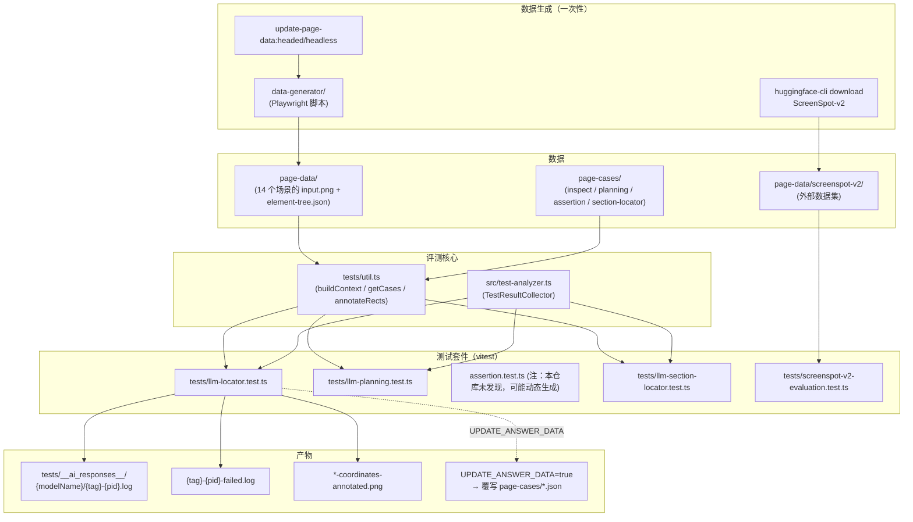

# 13 · Evaluation 与 Benchmark（评测体系）

> 分析基于 commit `702d5375`(main, v1.8.1)
>
> 本篇覆盖 **E3 的一部分（模型漂移评估 / 基准集）**。E3 的"VLM 微调导致坐标分布偏移"是 14 篇的话题；本篇聚焦"Midscene 实际有什么评测设施"。

---

## 0. TL;DR

- **`@midscene/evaluation` 是 internal 包**（`private: true`，`package.json` 第 3 行）——不发到 npm，只服务于 Midscene 自己的开发者验证模型选型 / Prompt 改动 / 升级前后回归。
- **四个独立评测套件**：`locator`（视觉定位）、`planning`（多步规划）、`assertion`（自然语言断言）、`section-locator`（区域定位）。每个套件对应一个 `tests/*.test.ts`。
- **数据集分两类**：
  - **自家"page-cases"** —— 14 个真实场景截图（antd / 抖音 / 淘宝 / TODO / GitHub / Visual Studio / 在线点餐...），每个含 `input.png` + `element-tree.json` + 一份 `*.json` 期望答案
  - **外部 ScreenSpot-v2** —— ByteDance/HuggingFace 开源数据集，由 `huggingface-cli` 下载
- **核心指标**：`passRate`（成功率）+ `averageCost`（平均耗时 ms）+ `totalTimeCost`——`TestResultCollector` 按 caseGroup 分组汇总。
- **没有 token 成本指标**：评测只看准确率和时延，**不评估 token 消耗**。token 评估留给用户自己跑（11 篇 8.1 节）。
- **"answer data" 自动更新机制**：`UPDATE_ANSWER_DATA=true` 跑测试会**把模型输出当作新 baseline 写回 case json**——升级模型后重新刷答案的关键工具。
- **没有跨模型基准对照**：每次跑只用一个模型，不内置"Qwen3 vs Doubao vs UI-TARS"对比。**用户得自己换 env vars 跑两次再对比 log**。

---

## 1. 它解决了什么问题

读完 03 / 07 / 08 篇后你应该理解：**Midscene 重度依赖模型选型**。但选型怎么定？团队怎么知道：
- 升级 prompt 之后所有测试还过吗？
- 新出的 doubao-1.6 比 qwen3-vl-plus 准吗？
- UI-TARS 1.5 vs 1.0 在 ScreenSpot 上提升多少？
- 我自己 fine-tune 的模型在 Midscene 用得怎么样？

`@midscene/evaluation` 就是回答这些问题的内部基础设施。它**不是公共 API**——但作为读源码的你，理解它能让你：
- 自己评测候选模型
- 理解 Midscene 团队怎么验证发布前回归
- 复用相同的测试集 + 评估器评测自己的修改

---

## 2. 它在整体架构中的位置



---

## 3. 源码导览

### 3.1 包结构（亲自 `ls`）

```
packages/evaluation/
├── package.json                # private: true，含 npm scripts
├── README.md                   # 仅说明 ScreenSpot-v2 下载
├── playwright.config.ts        # 给 data-generator 用
├── vitest.config.ts            # 测试 runner
├── data-generator/             # 一次性数据生成脚本（Playwright）
├── page-cases/                 # 期望答案（手工标注 + UPDATE_ANSWER_DATA 自动覆写）
│   ├── inspect/                # 定位用例
│   ├── planning/               # 规划用例
│   ├── assertion/              # 断言用例
│   └── section-locator/        # 区域定位用例
├── page-data/                  # 输入截图 + DOM tree
│   ├── antd-carousel/          # 14 个场景之一
│   │   ├── input.png
│   │   └── element-tree.json
│   ├── antd-form/
│   ├── antd-pagination/
│   ├── antd-tooltip/
│   ├── aweme-login/            # 抖音登录页
│   ├── aweme-play/             # 抖音播放页
│   ├── githubstatus/
│   ├── image-only/             # 纯图无 DOM
│   ├── online_order/
│   ├── online_order_list/
│   ├── taobao/
│   ├── todo/
│   ├── todo-input-with-value/
│   ├── visualstudio/
│   └── screenspot-v2/          # 外部数据集（不入 git）
├── src/
│   └── test-analyzer.ts        # TestResultCollector
└── tests/
    ├── util.ts                 # 共享工具
    ├── llm-locator.test.ts     # 144 行
    ├── llm-planning.test.ts
    ├── llm-section-locator.test.ts
    └── screenspot-v2-evaluation.test.ts
```

### 3.2 npm scripts 全集（`package.json`）

```jsonc
"scripts": {
  // 一、数据生成（用 Playwright 模拟 + 截图）
  "update-page-data:headless": "playwright test ./data-generator/generator-headless.spec.ts",
  "update-page-data:headed": "playwright test ./data-generator/generator-headed.spec.ts --headed",
  "download-screenspot-v2": "huggingface-cli download Voxel51/ScreenSpot-v2 --repo-type dataset --local-dir ./page-data/screenspot-v2",

  // 二、跑评测套件
  "evaluate:locator": "npx vitest --run tests/llm-locator.test.ts",
  "evaluate:locator:screenspot-v2": "SCREENSPOT_V2=true npx vitest --run tests/screenspot-v2-evaluation.test.ts",
  "evaluate:planning": "npx vitest --run tests/llm-planning.test.ts",
  "evaluate:assertion": "npx vitest --run tests/assertion.test.ts",
  "evaluate:section-locator": "npx vitest --run tests/llm-section-locator.test.ts",

  // 三、刷新 baseline 答案
  "update-answer-data:locator:coord": "UPDATE_ANSWER_DATA=true MIDSCENE_EVALUATION_EXPECT_VL=1 npm run evaluate:locator",
  "update-answer-data:planning:coord": "UPDATE_ANSWER_DATA=true MIDSCENE_EVALUATION_EXPECT_VL=1 npm run evaluate:planning",
  "update-answer-data:assertion": "UPDATE_ANSWER_DATA=true npm run evaluate:assertion",
  "update-answer-data:section-locator": "UPDATE_ANSWER_DATA=true npm run evaluate:section-locator"
}
```

**三大功能**：
- **生成数据**：模拟一遍真实页面（用 Playwright 跑 14 个 web 页面），截图 + 抓 DOM tree，存到 `page-data/`
- **跑评测**：让当前模型跑这些数据，对比 `page-cases/*.json` 里的期望答案
- **更新答案**：手动确认模型新结果正确后，把它们刷成新的 baseline

---

## 4. 核心机制深度解析

### 4.1 评测的核心数据结构：`TestCase`

`tests/util.ts:15-25`：

```ts
export type TestCase = {
  prompt: string;                      // 用户问什么
  deepLocate?: boolean;                // 是否开两步式定位
  log?: string;                        // 备注（人类写的）
  response_element?: {                  // 期望的元素（DOM 模式）
    id: string;
    indexId?: number;
  };
  response_rect?: Rect;                 // 期望的矩形（视觉模式）
  response_planning?: PlanningAIResponse; // 期望的 plan 输出（planning 套件）
  expected?: boolean;                    // 期望的断言结果（assertion 套件）
  annotation_index_id?: number;         // 标注图里的序号
  action_context?: string;              // aiActContext（给 planning 用）
};
```

**几个观察**：
- **同一份 TestCase** 兼容 4 个套件（locator / planning / assertion / section-locator）——靠不同字段填充
- **`response_rect` vs `response_element`** 是历史遗留：早期支持 DOM-based 定位（用 `id` 引用 element-tree），现在主要用 `response_rect`（纯视觉）
- **`response_planning`**：planning 套件的期望——一串 actions

### 4.2 `buildContext`：从磁盘数据构造 `UIContext`

`tests/util.ts:199-223`：

```ts
export async function buildContext(pageName: string) {
  const targetDir = path.join(__dirname, '../page-data/', pageName);
  const screenshotBase64Path = path.join(targetDir, 'input.png');
  const screenshotBase64 = localImg2Base64(screenshotBase64Path);
  const size = await imageInfoOfBase64(screenshotBase64);

  const fakePage = {
    screenshotBase64: async () => screenshotBase64,
    getElementsNodeTree: async () => JSON.parse(readFileSync(`${targetDir}/element-tree.json`, 'utf-8')),
    url: () => 'https://unknown-url',
    size: () => size,
  };

  const context = await commonContextParser(fakePage as any, {});
  return context;
}
```

**这是个精妙的"假端"**——只实现 4 个 `AbstractInterface` 方法，全部从磁盘读静态数据。然后丢给 08 篇看过的 `commonContextParser`——**和真实跑 agent 完全相同的代码路径**走到底。

**工程价值**：评测不依赖网络 / 真浏览器 / 真设备——**完全离线 + 可重现**。

### 4.3 `llm-locator.test.ts` 完整流程

源码 `tests/llm-locator.test.ts`：

```ts
const testSources = [
  'antd-carousel', 'todo', 'online_order', 'online_order_list',
  'taobao', 'aweme-login', 'aweme-play',
];

testSources.forEach((source) => {
  test(`${source}: locate element`, async () => {
    const { path: aiDataPath, content: cases } = await getCases(source, 'inspect');

    for (const [index, testCase] of cases.testCases.entries()) {
      const context = await buildContext(source);   // 假端 + 静态数据
      const service = new Service(context);

      const modelConfig = globalModelConfigManager.getModelConfig('default');
      let result = await service.locate({ prompt: testCase.prompt, deepLocate: testCase.deepLocate }, {}, modelConfig);

      // 拿到 rect
      const { element, rect } = result;

      // UPDATE_ANSWER_DATA 模式：把当前结果当 baseline 写回
      if (process.env.UPDATE_ANSWER_DATA) {
        testCase.response_rect = rect;
        writeFileSync(aiDataPath, JSON.stringify(cases, null, 2));
      }

      // 生成标注图
      if (rect) {
        const markedImage = await annotateRects(context.screenshot.base64, [rect]);
        await saveBase64Image({ base64Data: markedImage, outputPath: '...' });
      }

      resultCollector.addResult(source, testCase, result, Date.now() - startTime);
    }

    await resultCollector.analyze(source, failCaseThreshold);
  }, 360 * 1000);
});
```

**关键观察**：
- **7 个 source**（不是全部 14 个 page-data）——每个套件挑特定子集
- **测试超时 360 秒**——大模型慢，给宽裕预算
- **`failCaseThreshold = 2`**——单个 source 失败超过 2 个 case 整个测试 fail
- **doubao-vision 不开 deepLocate**：line 78-80 显式排除——这是 07 篇 4.5.1 节 "AutoGLM 不支持 deepLocate" 的姐妹规则。**但本仓库代码里 doubao-vision 也被排除**——这是个 v1.8.1 的特殊处理（推测：早期 doubao-vision 也有 deepLocate 问题）

### 4.4 `TestResultCollector`：评测结果聚合器

`src/test-analyzer.ts:26-120+`：

```ts
export class TestResultCollector {
  private testLogs: TestLog[] = [];
  private testName: string;
  private modelName: string;

  constructor(testName: string, modelName: string) {
    // 日志路径：tests/__ai_responses__/{modelName}/{testName}-{pid}.log
    // 失败日志：tests/__ai_responses__/{modelName}/{testName}-{pid}-failed.log
  }

  addResult(caseGroup, testCase, actualResult, cost) {
    const sameResult = this.compareResult(testCase, actualResult);
    // 写两份日志：全部 vs 仅失败
    appendFileSync(this.logFilePath, fullLog);
    if (!sameResult) appendFileSync(this.failedCaseLogPath, fullLog);
  }

  printSummary() {
    // 按 caseGroup 分组聚合
    // 输出：cases / success / fail / passRate / averageCost / totalTimeCost
  }
}
```

**`compareResult` 的判定逻辑**（未读完整源码，推测）：
- locator 套件：实际 rect 中心点 vs 期望 rect 中心点的距离 < 阈值
- planning 套件：实际 actions 序列 vs 期望 actions 的结构相等（type + 关键参数）
- assertion 套件：实际布尔值 == 期望布尔值

> **待源码确认**：`compareResult` 的精确判定逻辑见 `src/test-analyzer.ts`，本篇未深读全部代码。

### 4.5 日志文件结构（核心产物）

跑完 `npm run evaluate:locator` 会在 `tests/__ai_responses__/` 下生成：

```
__ai_responses__/
└── qwen3-vl-plus/                  ← 按模型名分目录
    ├── by_coordinates-12345.log    ← 全部 case 日志（PID 后缀避免并发覆盖）
    └── by_coordinates-12345-failed.log  ← 仅失败 case
```

每条 log entry 格式（`test-analyzer.ts:76-85`）：

```
success: 
antd-carousel - 点击向右箭头
ActualResponse:
{ "element": { "center": [950, 300] }, "rect": {...} }
ExpectedResponse:
(skipped)        # 成功时跳过
--------------------------------

failed: 
todo - 删除第二条 todo
ActualResponse:
{ ... }
ExpectedResponse:
{ ... }
Error: rect center distance too large
--------------------------------
```

**这两个日志文件是评测的"原始产出"**——人类审查 / 大模型分析失败原因都看这两份。

### 4.6 标注图生成：`annotateRects`

`tests/util.ts:11`（re-export 自 `@midscene/shared/img`，08 篇 4.11 节）。每个评测 case 跑完会生成 `{source}.json-coordinates-annotated.png`——把模型识别的 rect 画在原图上。

**用途**：人类直观审查"模型框对了吗"。看 `page-cases/inspect/` 目录里的 `.png` 文件——这些都是历史评测留下的标注图。

### 4.7 `UPDATE_ANSWER_DATA` 工作流：自动刷答案

升级 Midscene 后，旧的 `response_rect` 期望可能过时（如新模型坐标稍微不同但其实更准）。这时跑：

```bash
UPDATE_ANSWER_DATA=true MIDSCENE_EVALUATION_EXPECT_VL=1 npm run evaluate:locator
```

**做了什么**：
1. 跑评测——但不比对，**直接把当前模型输出当 baseline 写回** `page-cases/inspect/*.json`
2. 同时生成 `-coordinates-annotated.png` 让人类审查

**人类审查**：开 git diff 看 `*.json` 改了什么 + 看 `.png` 确认框对——OK 就 commit。

**这是个"半自动 baseline 管理"流程**：模型升级时不用手工 hand-pick 坐标，但仍由人类把关质量。

### 4.8 ScreenSpot-v2：外部对照基准

`tests/screenspot-v2-evaluation.test.ts` 是独立套件，跑 ByteDance/HuggingFace 开源的 [ScreenSpot-v2](https://huggingface.co/datasets/Voxel51/ScreenSpot-v2) 数据集。

**数据集特点**：
- **数千张 GUI 截图**（Web / Mobile / Desktop 混合）
- 每张图配一条**自然语言指令** + 期望的 **bounding box**
- 行业标准评测集——很多 GUI agent 论文（含 UI-TARS）报指标都用它

**测试代码关键**（`screenspot-v2-evaluation.test.ts`）：

```ts
const CONCURRENCY = process.env.SCREENSPOT_CONCURRENCY ?? 5;   // 默认并发 5

// 读 samples.json，每条含 filepath + instruction + bounding_box
for (const sample of samples) {
  const { imageBase64, size } = await loadAndProcessImage(sample.filepath);
  // 构造假端
  // 跑 service.locate
  // 比较预测 rect vs sample.action_detection.bounding_box
  // 写到 success/failed/error 三个子目录
}
```

**关键指标**：
- `correctCount` / `failCount` / `totalProcessed`
- 通常论文里 ScreenSpot 准确率（如 UI-TARS-7B：约 85-90%；通用 VLM：约 60-75%）

**为什么 Midscene 跑 ScreenSpot**：
- 比对自家数据集 + 外部公开集——避免"对自家数据 overfit"
- 给用户一个能比 baseline 跑分的方式（你接入 ScreenSpot 跑自己 fine-tune 的模型）

### 4.9 数据生成：用 Playwright 自动化抓取

`data-generator/` 目录（未深读，从 `package.json` 推断）：

```bash
npm run update-page-data:headless   # Playwright 跑 14 个真实网站，自动截图 + 抓 DOM tree
```

**做了什么**：
- 用 Playwright 打开真实 URL（如 https://www.taobao.com）
- 等页面稳定
- 截图存 `page-data/taobao/input.png`
- 提取页面元素树存 `page-data/taobao/element-tree.json`

**为什么需要**：被测网站的 UI 会变。需要定期"重新拍照"——所以 data-generator 是个一次性 Playwright spec，按需跑。

**风险**：每次重新生成可能让 `page-cases/*.json` 里的 `response_rect` 失效（坐标对不上新截图）——所以通常和 `update-answer-data:*` 配套跑。

### 4.10 没有的几个评测维度（诚实交代）

读完 evaluation 包**没看到**的几个能力：

| 维度 | 是否实现 | 备注 |
|---|---|---|
| token 成本对比 | ❌ | 用户自己跑 dump 统计 |
| 跨模型自动对比表格 | ❌ | 用户手动改 env vars 跑两遍 |
| 失败原因自动分类（视觉幻觉 / 意图错误 / 坐标偏移） | ❌ | 看 `failed.log` 人类判断 |
| 时序性能 profiling（哪段慢） | ❌ | 看 dump 报告 timing 字段 |
| 模型漂移检测（同一模型不同时间表现） | ❌ | 用户自己 archive 历史 log |
| A/B prompt 对比 | ❌ | 改 prompt 后跑一次评测看 passRate 变化 |
| 多语言评测 | ⚠️ 部分 | 测试集主要中英文，没看到日韩等 |
| 移动端评测 | ⚠️ 部分 | ScreenSpot-v2 含 mobile，但 page-data 都是 web |

**这些缺失说明什么**：evaluation 是个**最小可用工具**，专注"开发期回归"——不是完整的 model A/B 平台。Midscene 团队明显**手工跑 + 看 log + 经验判断**——而不是数据驱动。

---

## 5. 设计取舍与工程权衡

### 5.1 为什么 `@midscene/evaluation` 是 private 的？

可选方案：发到 npm 让用户也能跑评测。**他们没发**：

- **数据集涉及版权**：14 个 page-data 都是真实网站截图——发布可能侵权
- **评测代码迭代快**：内部用，没有公开 API 稳定承诺
- **场景受限**：14 个 web 页面 + 一份 ScreenSpot——不能代表用户的实际场景

**用户怎么用**：如果你想跑 Midscene 评测，**clone 仓库本地跑**——这是默认路径。

### 5.2 为什么用 vitest 而不是 Playwright test？

evaluation 内部 `vitest` 跑 locator/planning/assertion 测试；`playwright` 只用于 data-generator。**为什么不全用 playwright**：

- **测试是单元式的**——一个 case 调一次 `service.locate`，不需要浏览器
- vitest 启动快、并发好
- 已有 vitest 配置可复用

Playwright 用在 data-generator 是因为**那一步真的需要浏览器**（截图 + DOM 抓取）。**工具按需选择**——典型的"反过度统一"。

### 5.3 为什么 fakePage 不实现所有 `AbstractInterface` 方法？

`buildContext` 里的 `fakePage` 只实现 4 个方法（`screenshotBase64` / `getElementsNodeTree` / `url` / `size`）。**为什么够**：

- 评测只跑 `service.locate` / `plan()` / `AiExtractElementInfo`——这些方法只读 `UIContext`
- 不调动作（没有 tap / input）——不需要 inputPrimitives
- 不写 cache（评测不依赖 cache）——不需要 `cacheFeatureForPoint`

**这是个清晰的"评测只覆盖读路径"边界**。如果你要评测"完整 agent 流程"（含 cache hit + 重定位），需要更大的 fake——但 Midscene 没做。

### 5.4 为什么 baseline 用 `response_rect` 而非 hash 或 diff？

`response_rect` 是**人类可读的具体坐标**——能直接看 json 知道期望什么。可选方案：
- **hash**：跑测试时算图像 hash 比对——但模型坐标稍微不同（如 ±10 像素）就 hash 完全不同
- **diff**：dump 报告 vs baseline dump——格式重、难审查

**用矩形 + 距离阈值**最自然：
- 矩形可读
- 中心点距离 <= 阈值算通过——允许模型在合理范围内浮动
- json 文件 git diff 友好——baseline 更新看得清

### 5.5 为什么没有跨模型对比表？

理论上跑 `evaluation` 应该能产出：

```
Model           Locator   Planning   Assertion   ScreenSpot
qwen3-vl-plus   92.5%     85.3%      94.1%       73.2%
doubao-vision   89.7%     88.2%      92.5%       70.8%
ui-tars-7b      96.1%     n/a        n/a         87.5%
```

**Midscene 没自动生成这种表**。原因：

- **跑一次评测要 10+ 分钟 × N 个套件 × M 个模型**——半小时起步
- **不同模型用不同 .env**——并发跑会撞限流
- **手动跑 + 看 log** 对内部足够——不需要全自动

**这是个"工具不必完美"的工程姿态**——团队跑两次手工对比 log 也能决策，不必为偶尔的事情写复杂自动化。

### 5.6 ScreenSpot-v2 选 Voxel51 fork 而不是官方版

仓库 ID 是 `Voxel51/ScreenSpot-v2`——Voxel51 是个 ML 数据公司的 fork。**为什么不用原版**：

- Voxel51 fork 通常包装得更易用（标准化 schema、samples.json 索引）
- 原版可能数据格式不规范

这是个无关紧要的工具链选择，但反映出 **Midscene 团队偏好"使用 ready-to-use 的标准化资源"** 而不是从源头造轮子。

---

## 6. 与其他模块的协作

- **上游**：开发者命令行触发（`npm run evaluate:*`）
- **下游**：
  - `Service`（07 篇）：评测的真正被测对象
  - `commonContextParser`（08 篇）：通过 fakePage 调用同一路径
  - 模型 API（OpenAI 兼容）：评测时实际调用 LLM
- **横向**：
  - 03 篇 Prompt：评测的"幕后变量"——改 prompt 后跑评测看 passRate 变化
  - 10 篇 dump：评测时也会生成 dump（但通常不看，看 log 更快）

---

## 7. 常见陷阱 & 调试经验

### 7.1 跑评测前没设 `.env`

**症状**：`evaluate:locator` 第一个 case 就抛 "Invalid MIDSCENE_MODEL_FAMILY"。
**解决**：包根目录建 `.env`（参考 01 篇 8.2 节）。**注意 evaluation 包用 `dotenv.config({ override: true })`**——会覆盖现有 env vars。

### 7.2 跑 ScreenSpot 报"samples.json not found"

**症状**：先跑 `evaluate:locator:screenspot-v2` 找不到 samples.json。
**根因**：没下载数据集。
**解决**：
```bash
pip install huggingface_hub
cd packages/evaluation && npm run download-screenspot-v2
```

### 7.3 `UPDATE_ANSWER_DATA=true` 跑完所有测试都"通过"

**症状**：明明改了 prompt，跑 update 模式还是过——以为 prompt 没影响。
**根因**：update 模式**永远 pass**——它把当前结果写为 baseline，自己和自己当然一样。
**正确用法**：先**不带** UPDATE 跑（看是否回归），再带 UPDATE 重新刷答案（如果回归是预期的）。

### 7.4 不同模型跑出的 baseline 差异巨大

**症状**：用 qwen3-vl 刷的 baseline，换 doubao 跑全部 fail。
**根因**：baseline 是按某个模型刷的——模型变了坐标自然不同。
**解决**：要么放宽距离阈值，要么每个模型维护一份 baseline（如 page-cases-qwen / page-cases-doubao——但 Midscene 没这么做）。

### 7.5 `__ai_responses__/` 占用大量磁盘

**症状**：跑了 10+ 次评测，目录占用 GB 级。
**根因**：每次跑都按 `{modelName}-{pid}` 写新日志，从不清理。
**解决**：手动 `rm -rf` 或加 `.gitignore` 排除。

### 7.6 评测里出现 LLM API 限流

**症状**：跑到一半连续报 429 错误。
**根因**：评测套件**没有限流控制**，并发调用模型。
**解决**：
- ScreenSpot 测试可调 `SCREENSPOT_CONCURRENCY=1`
- 其他套件没有显式并发控制（vitest 默认串行）——如果还是限流，看是不是模型 RPM 限制

### 7.7 标注图里框画错了位置

**症状**：跑出 `*-coordinates-annotated.png`，框明显歪。
**根因**：08 篇坐标变换 bug（不太可能）或者 baseline 本身就错（更可能）。
**调试**：开 dump 报告对比模型实际输出 vs baseline。

---

## 8. 🛠️ 实操章节

### 8.1 实操 A：跑一次完整评测

```bash
# 1. 准备 .env（同 01 篇 8.2）
cd packages/evaluation
# 确保根目录 .env 存在

# 2. 跑 locator 套件（最快、最直观）
npm run evaluate:locator
```

预期输出：
```
Processing antd-carousel 1 of N
Processing antd-carousel 2 of N
...
Summary:
┌────────────────────┬────────┬─────────┬───────┬───────────┬─────────────┐
│ caseGroup          │ cases  │ success │ fail  │ passRate  │ avgCost     │
├────────────────────┼────────┼─────────┼───────┼───────────┼─────────────┤
│ antd-carousel      │ 5      │ 5       │ 0     │ 100.00%   │ 1834.20ms   │
│ todo               │ 3      │ 3       │ 0     │ 100.00%   │ 2103.67ms   │
│ ...                │ ...    │ ...     │ ...   │ ...       │ ...         │
└────────────────────┴────────┴─────────┴───────┴───────────┴─────────────┘
```

### 8.2 实操 B：跑 ScreenSpot 跨模型对比（手动）

```bash
# Run 1: qwen3-vl-plus
MIDSCENE_MODEL_NAME=qwen3-vl-plus \
MIDSCENE_MODEL_API_KEY=... \
SCREENSPOT_CONCURRENCY=2 \
npm run evaluate:locator:screenspot-v2

# 记下结果：correctCount / failCount

# Run 2: doubao-1.6-vision-pro
MIDSCENE_MODEL_NAME=doubao-1-6-vision-pro \
MIDSCENE_MODEL_API_KEY=... \
MIDSCENE_MODEL_BASE_URL=https://ark.cn-beijing.volces.com/api/v3 \
MIDSCENE_MODEL_FAMILY=doubao-vision \
SCREENSPOT_CONCURRENCY=2 \
npm run evaluate:locator:screenspot-v2

# 手动对比
```

### 8.3 实操 C：评测自己 fine-tune 的模型

假设你 fine-tune 了一个 Qwen-VL：

```env
# .env
MIDSCENE_MODEL_NAME=my-finetuned-qwen-vl
MIDSCENE_MODEL_API_KEY=EMPTY
MIDSCENE_MODEL_BASE_URL=http://localhost:8000/v1
MIDSCENE_MODEL_FAMILY=qwen3-vl  # 用最接近的 family
```

跑 `npm run evaluate:locator` —— **就能拿到 fine-tune 模型在 Midscene 7 个真实场景上的得分**。

### 8.4 实操 D：用 `UPDATE_ANSWER_DATA` 刷新 baseline

假设你改了 03 篇里的某个 prompt 模板：

```bash
# Step 1: 跑评测，看哪些 case 因为 prompt 变化而 fail
npm run evaluate:locator
# 假设 antd-carousel 失败 1 个，其他全过

# Step 2: 看 failed.log + annotated.png 判断"新结果是不是合理"
cat tests/__ai_responses__/qwen3-vl-plus/by_coordinates-*-failed.log

# Step 3: 如果新结果是更优的（不是 regression），刷答案
UPDATE_ANSWER_DATA=true npm run evaluate:locator

# Step 4: git diff 看 page-cases/inspect/*.json 改了什么
git diff packages/evaluation/page-cases/inspect/

# Step 5: 人类审查 annotated.png 确认新框对——commit
```

### 8.5 推荐断点

| 文件 | 行 | 观察 |
|---|---|---|
| `tests/util.ts:199` | `buildContext` | 看 fakePage 怎么构造 |
| `tests/llm-locator.test.ts:74` | `service.locate(...)` | 看实际调用 |
| `src/test-analyzer.ts:64` | `compareResult` | 看判定逻辑 |
| `src/test-analyzer.ts:103` | `printSummary` 聚合 | 看汇总计算 |

### 8.6 引导式实验

1. **改一行 prompt 看 passRate 变化**：
   把 `prompt/llm-locator.ts:24` 的 `bbox is the bounding box of the element` 改成 `bbox is the bounding box of the element TEXT region`，重 build core，跑 `evaluate:locator`——看 passRate 是否变化。

2. **故意写错答案**：
   手动改 `page-cases/inspect/todo.json` 把某个 `response_rect` 改成错的——跑评测应该看到该 case 失败。

3. **跑 ScreenSpot 选小样本**：
   完整 ScreenSpot 几千张图，跑完要小时级。临时改 `samples` 切片到前 50 条快速验证：
   ```ts
   const samples = JSON.parse(...).samples.slice(0, 50);
   ```

4. **自己写一个 case**：
   - 加一张你的真实截图 + DOM tree 到 `page-data/my-page/`
   - 加 `page-cases/inspect/my-page.json` 含 1-2 个 TestCase
   - 在 `testSources` 里加 'my-page'
   - 跑 `evaluate:locator`——看自己页面上模型表现

---

## 9. 自检问题

1. `@midscene/evaluation` 是 `private: true`。给出 2 条这个包不发到 npm 的具体工程理由。
2. `buildContext` 用了"fakePage"只实现 4 个 `AbstractInterface` 方法。这反映了评测只覆盖什么路径？哪些路径**没**评测？
3. `UPDATE_ANSWER_DATA=true` 模式的工程价值是什么？为什么不直接手写 baseline？
4. ScreenSpot-v2 测试和自家 page-cases 测试是两个独立套件。为什么需要外部数据集？仅靠 page-cases 不够吗？
5. evaluation 包**没有**跨模型对比表生成。Midscene 团队怎么决定"升级到新模型"是好事？给出 3 种可能的工作流。
6. `TestResultCollector` 的指标是 `passRate + averageCost`，缺了"token 成本"指标。这个缺失对 Midscene 用户实际有什么影响？

---

## 10. 延伸阅读

- `packages/evaluation/tests/util.ts`——评测工具完整源码
- `packages/evaluation/src/test-analyzer.ts`——`TestResultCollector` 完整实现
- ScreenSpot-v2 数据集：https://huggingface.co/datasets/Voxel51/ScreenSpot-v2
- UI-TARS 论文：含 ScreenSpot 评测细节
- WebVoyager / Mind2Web 等开源 GUI agent benchmark——和 ScreenSpot 互补

---

写完了。说"下一个"我就开始写 `14_Advanced_Topics.md`（**系列最终篇**——E1 PII 脱敏 / E2 连续型手势 / E3 模型漂移 / E4 SOM vs 纯视觉 / E5 异步死锁 综合讨论 + 系列收尾）。
