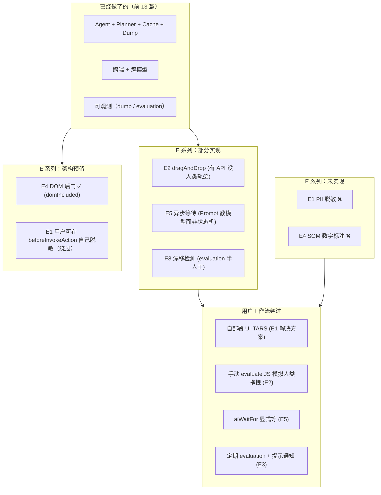

# 14 · 高级专题综合（Advanced Topics）

> 分析基于 commit `702d5375`(main, v1.8.1)
>
> **系列终篇**——覆盖核心要点 E 全集：**E1 数据隐私 / PII 脱敏 / E2 连续型微操与复杂手势 / E3 模型漂移 / E4 纯视觉 vs SOM / E5 异步状态管理与"死锁"**。这一篇大量是"诚实交代未实现"+ "讨论该走哪条路"。

---

## 0. TL;DR

- **E1 PII 脱敏 — 完全未实现**。`grep` 整仓 `PII`/`redact`/`privacy`/`mask`/`dlp` 等关键词：核心源里**只有"日志层 sanitize proxy url（去 credentials）"和"MCP arg sanitize（清非法字符）"**——没有任何"截图发送给云端 LLM 前去敏感字段"的机制。这是 Midscene 当前一个**重大公开缺口**。
- **E2 连续型手势 — 部分实现**：`pointer.dragAndDrop` 在 4 个端实现（Web Puppeteer/Playwright/Android/iOS/Computer），但**没有"人类轨迹模拟"（贝塞尔曲线/抖动）**——Web 端是 30 步线性插值（`base-page.ts:923-931`），Computer 端 `smoothMoveMouse` 是固定步数线性（8 / 10）。**滑动验证码场景需要用户自己绕**。
- **E3 模型漂移 — 半工程化**：13 篇看到的 `@midscene/evaluation` 是回归检测的工具，但没有"持续监控 / 自动对比历史"功能。**模型漂移要靠人**：开发者跑评测看 passRate 变化。
- **E4 SOM 混合模态 — 架构预留但未启用**：DOM 提取器 `web-extractor.ts` 仍在仓库里，`aiQuery({domIncluded: true})` 是唯一暴露的"DOM 后门"（07 篇 4.8）。**没有 SOM 数字标注模式**——`box-select.ts` 的 `annotateRects` 只用于 dump 报告 viewer，不喂给推理模型。
- **E5 异步状态管理 — 用 "Prompt + 重试" 而非真正解决**：05 篇看过的 `waitForNavigation` + `waitForNetworkIdle` + 4 层重试 + Prompt 教模型滚动——**没有"loading 转 10 秒到底等不等" 的精确判定**。当前路线是把这个判断让给 VLM。
- **共同主题**：这五个高级问题里，Midscene **没有一个用复杂的算法/状态机解决**——全部是 **"工程取舍 + 用户旋钮 + 留给社区扩展"**。这和 11 篇的"承认 LLM 不完美"哲学一致——**不解决终极问题，解决 80% 实用场景**。

---

## 1. 它解决了什么问题 / 为什么写这一篇

读完 0–13 篇你应该能用 Midscene 的所有"已实现"能力。但**真实生产场景**会问几个 Midscene **没回答好的**问题：

- "我跑测试的截图会发到云端 LLM。里面有用户邮箱、订单号、订单地址——合规怎么过？"
- "我要测一个滑块验证码，需要模拟带阻尼的人类拖拽。Midscene 能做吗？"
- "我用 qwen3-vl-plus 跑了 3 个月，最近通过率从 92% 降到 85% 了——是页面变了还是模型变了？"
- "Midscene 是不是其实有 SOM 模式但藏着没让我用？"
- "我的 SPA 一直在做 client-side rendering，networkIdle 永远不空——怎么办？"

本篇逐个回答。**有些是"实现了但不完美"，有些是"完全没实现"**——我会诚实标注。读完你会知道：
- Midscene 在哪些极端场景**不适用**
- 哪些缺口你可以**自己补**
- 哪些问题**靠 Prompt 工程 + 用户耐心**就能绕过

---

## 2. 它在整体架构中的位置



---

## 3. E1 · 数据隐私与 PII 脱敏

### 3.1 当前状态：未实现

源码层面**完全没有 PII 脱敏机制**。`grep` 全仓 `PII` / `redact` / `mask\b` / `privacy` / `dlp`：

| 找到的内容 | 含义 |
|---|---|
| `sanitizeProxyUrl` (`service-caller/index.ts:78`) | 日志层去掉 proxy URL 里的 user:pass——**和数据脱敏无关**，仅防止日志泄漏代理凭据 |
| `sanitizeNamespacedArgs` (`shared/src/mcp/init-arg-utils.ts:68`) | MCP 工具参数名校验——非法字符替换 |
| `sanitizeSessionName` / `sanitizeFileSegment` (`shared/src/mcp/cli-report-session.ts`) | 文件名安全 |
| `sanitizeArgs` (`shared/src/mcp/tool-generator.ts:485`) | 同上 |
| **没有** 任何函数 | 把截图发出去前去敏感字段、抹文字 |

**这意味着什么**：

如果你跑 `agent.aiAct('check my GitHub notifications')`：
- 浏览器截图 → 你的邮箱、聊天内容、订单地址等**全部以 base64 PNG** 发到云端 LLM API（如 `https://dashscope.aliyuncs.com/...`）
- LLM 提供商的隐私政策决定数据如何被存储/训练
- **Midscene 不为你做任何屏蔽**

### 3.2 为什么没做？(推测)

- **技术复杂**：要识别截图里"哪个区域是敏感"——本身就需要 ML
- **场景多样**：邮箱地址 vs 订单号 vs 信用卡号——脱敏策略不同
- **成本高**：本地预处理截图 = 增加每个 ai 调用的延迟
- **Midscene 团队判断**：大多数用户用于内部测试环境（脱敏不必）；少数用户用于真实业务流——他们应该选自部署模型

### 3.3 用户该怎么应对？

**路线 1：自部署 VL 模型（推荐）**

```env
# 用 vLLM / SGLang 自部署 UI-TARS（开源）
MIDSCENE_MODEL_NAME=ui-tars-7b
MIDSCENE_MODEL_BASE_URL=http://internal-gpu-cluster:8000/v1
MIDSCENE_MODEL_API_KEY=EMPTY
MIDSCENE_MODEL_FAMILY=vlm-ui-tars-doubao-1.5
```

数据**完全不出公司**。代价：维护 GPU 集群（24G VRAM 起步），UI-TARS 准确率 < qwen-vl-max。

**路线 2：beforeInvokeAction 手动脱敏（黑科技）**

Midscene 没暴露"截图脱敏"hook，但你可以在 **后置钩子** 里**修改页面 DOM** 把敏感字段遮掉，下一帧截图就干净：

```ts
const agent = new PuppeteerAgent(page, {
  beforeInvokeAction: async () => {
    // 给所有 email 字段加遮罩
    await page.evaluate(() => {
      document.querySelectorAll('input[type="email"]').forEach(el => {
        (el as HTMLInputElement).type = 'password';
      });
      document.querySelectorAll('[data-sensitive]').forEach(el => {
        (el as HTMLElement).style.filter = 'blur(8px)';
      });
    });
  },
});
```

**代价**：模型也看不到这些字段——如果你的测试要验证邮箱内容，就 fail 了。**只适合"敏感字段不影响 UI 流程"的场景**。

**路线 3：用 chrome-extension 模式**

Bridge Mode + Chrome Extension 时，**截图先到本地扩展进程再发给 LLM**——你可以 fork 扩展插入脱敏逻辑。比修改 Midscene 核心轻量。

### 3.4 这是个值得贡献的方向

如果你需要 PII 脱敏，**给 Midscene 提个 PR**——加一个 `agent.opts.screenshotPreprocessor: (base64) => Promise<base64>` hook，在 `commonContextParser` 截完图之后 + 喂给模型之前调用。这是一个干净的扩展点。

---

## 4. E2 · 连续型微操与复杂手势

### 4.1 实现现状：基础手势全有，人类轨迹缺失

读 06 篇 4.1 节的"`inputPrimitives` 跨端对照表"——**`pointer.dragAndDrop` 在 5 个端都有实现**：

| 端 | 实现 | 是否模拟人类轨迹 |
|---|---|---|
| Puppeteer / Playwright | `mouse.down + 30 步线性插值 move + mouse.up`（`base-page.ts:923-931`） | ❌ 直线 |
| Android | `adb shell input swipe x y x y duration` | ❌ 直线（adb 限制） |
| iOS | WDA `dragfromtoforduration` 端点 | ❌ 直线 |
| Computer | `libnut moveMouse + smoothMoveMouse` 分 8-10 步线性 | ❌ 直线 |
| Harmony | hdc drag | ❌ 直线 |

**没有的能力**：
- 贝塞尔曲线轨迹
- 速度抖动（人类拖拽不匀速）
- 起手/停手的加减速
- 中途抖动（应对带反作弊的滑块验证码）

### 4.2 用源码原文证明 — Computer 端 `smoothMoveMouse`

`computer/device.ts:52-53`:
```ts
const SMOOTH_MOVE_STEPS_TAP = 8;
const SMOOTH_MOVE_STEPS_MOUSE_MOVE = 10;
```

"smooth" 在这里只是"分多步"——**不是"贝塞尔曲线" 也不是"加减速"**。它的作用是：
- 避免 `libnut.moveMouse(x, y)` 直接 teleport 让操作系统的鼠标移动事件来不及触发
- 给"hover" / "click" 之间留出微小时间间隔

### 4.3 复杂手势的实际能力盘点

| 手势 | 是否能做 | 怎么做 |
|---|---|---|
| 单击 | ✅ | `aiTap` |
| 双击 | ✅ | `aiDoubleClick` |
| 右键 | ✅ | `aiRightClick`（仅 Web/Computer） |
| 长按 | ✅ | `aiLongPress` |
| 悬停 | ✅ | `aiHover`（仅 Web/Computer） |
| 直线拖拽 | ✅ | `aiDragAndDrop` / planner 自动生成 |
| 滑动手势 | ✅ | `touch.swipe` / `aiAct('swipe left')` |
| 捏合缩放 | ✅ | Android/iOS（`aiPinch`） |
| 滚动 | ✅ | `aiScroll` |
| **滑块验证码** | ❌ | 没专用 API |
| **人类轨迹拖拽** | ❌ | 没专用 API |
| **多指触控（3 指及以上）** | ❌ | 没 API |
| **指尖压力变化** | ❌ | 没 API |

### 4.4 滑动验证码场景该怎么办？

**反爬带"轨迹检测"的滑块验证码** 是 Midscene 最难处理的场景之一。**实际工程方案**：

**方案 A：用 evaluateJavaScript 自己写贝塞尔轨迹**

```ts
await agent.evaluateJavaScript(`
  const slider = document.querySelector('.captcha-slider');
  const rect = slider.getBoundingClientRect();
  const startX = rect.left + rect.width / 2;
  const startY = rect.top + rect.height / 2;
  const endX = startX + 200;  // 目标距离
  // 生成带抖动的轨迹
  const points = [];
  for (let t = 0; t <= 1; t += 0.02) {
    const x = startX + (endX - startX) * t + (Math.random() - 0.5) * 4;
    const y = startY + Math.sin(t * Math.PI) * 8;  // 上下波动
    points.push({ x, y });
  }
  // 派发 mouse 事件序列
  for (const p of points) {
    slider.dispatchEvent(new MouseEvent('mousemove', { clientX: p.x, clientY: p.y, bubbles: true }));
    await new Promise(r => setTimeout(r, 20 + Math.random() * 30));
  }
`);
```

这绕过 Midscene 的 `dragAndDrop`，**直接在浏览器里派发原生事件**。

**方案 B：用 Puppeteer 原生 API**

```ts
const page = agent.interface.underlyingPage;
await page.mouse.move(startX, startY);
await page.mouse.down();
for (const p of generateBezierPath(start, end)) {
  await page.mouse.move(p.x, p.y);
  await sleep(20 + Math.random() * 30);
}
await page.mouse.up();
```

直接拿到底层 page 对象。**这是 Midscene 的"逃生口"——任何端的底层 API 都暴露给用户**。

### 4.5 为什么 Midscene 不内建人类轨迹？

- **场景特化**：验证码逻辑因网站而异，没有"通用人类轨迹"
- **反爬军备竞赛**：内建轨迹 → 反爬厂商训练识别它 → 失效
- **法律风险**：自动化绕过验证码是灰色地带

**取舍**：留给用户用 `evaluateJavaScript` 解决。Midscene 不在源码里提供绕反爬的"武器"。

---

## 5. E3 · 模型漂移（Model Drift）

### 5.1 问题：同一模型不同时间表现不同

VLM 厂商会**悄悄更新模型 weights**：
- `qwen3-vl-plus` 这个名字两个月前和今天可能是不同的模型
- 厂商微调后，bbox 坐标分布可能微偏（08 篇 4.5 看过 Qwen2.5-VL 的 28-block padding 就是模型架构特性）
- 你的 Midscene 测试昨天通过率 92%，今天 85%——可能你没动任何代码

### 5.2 Midscene 的应对：evaluation 包 + 没有持续监控

13 篇看到 `@midscene/evaluation` 的 14 个 page-cases 是回归基准。**手动跑 + 看 passRate 变化** 是检测漂移的方式。

**但没有的能力**：
- 持续运行（cron 每日跑评测）
- 历史 passRate 趋势图
- 自动通知（passRate 跌 > 5% 发邮件）
- A/B "今天的模型 vs 上周缓存的模型 weights"

**为什么没做**：
- 持续监控需要：CI 资源 + 数据库 + 通知系统——超出 Midscene 框架边界
- Midscene 团队希望用户**自己接 LangSmith / LangFuse**——10 篇 `persistExecutionDump` 的 JSON 输出就是给这些工具用的

### 5.3 实操：自己搭模型漂移监控

最小可行方案：

```bash
# CI 每日跑（GitHub Actions / Cron）
cd packages/evaluation
npm run evaluate:locator > today.log

# 提取 passRate 数字
grep "passRate" today.log | awk '{print $X}' > today-passrate.txt

# 和历史对比
diff today-passrate.txt history/yesterday-passrate.txt
# 触发告警
```

更专业方案：
- 跑评测 → 写入 InfluxDB / Prometheus
- Grafana 画趋势图
- AlertManager 阈值告警

**这套基础设施 Midscene 不内建**——但 evaluation 包给你了**最关键的原始数据**。

### 5.4 漂移的几种来源

| 来源 | 检测方式 | 应对 |
|---|---|---|
| **模型 weights 更新** | 历史 passRate 跌 | 重新跑 `UPDATE_ANSWER_DATA` 刷 baseline |
| **被测网站 UI 改版** | 同模型 + 同 prompt 失败率上升 | 改 prompt 或更新 data-generator 重抓 page-data |
| **Prompt 工程改动** | git blame `prompt/*.ts` | 看 diff，跑评测验证 |
| **Midscene 自身改动** | git blame `inspect.ts` / `service.locate` | CI 跑评测确保无回归 |

**Midscene 团队自己跑 CI 验证 Midscene 改动不带来 regression**——但**用户级"模型漂移监控"是用户自己的事**。

---

## 6. E4 · 纯视觉 vs 混合模态（SOM, Set-of-Mark）

### 6.1 SOM 是什么

**Set-of-Mark**（[arxiv:2310.11441](https://arxiv.org/abs/2310.11441)）是 GUI agent 流行技术：
1. 用 OCR / DOM / 视觉分割提取所有可点击元素
2. 在每个元素上叠加一个数字标签（1, 2, 3...）
3. 让模型说"点击 #5"而不是"点击坐标 (300, 500)"

**优势**：
- 模型不必输出精确坐标——只输出数字
- 数字 token 极少（一个 token），节省成本
- 准确率高（特别是小模型）

**代价**：
- 需要预处理（提取所有元素 + 渲染数字）
- 失去精确坐标能力（只能点已标号的元素）
- DOM 提取在非 Web 端难做

### 6.2 Midscene 的立场：纯视觉路线 + DOM 后门

00 篇 5.1 节看过 README 原文："The DOM extraction mode is removed."——**actions 走纯视觉，不用 SOM**。

但 07 篇 4.8 节看到的**`aiQuery({domIncluded: true})` 是个例外**：
- DOM 提取器 `web-extractor.ts` 仍然在仓库里
- `aiQuery` 允许 opt-in 把 DOM tree 文本附在 prompt 后
- **但这不是 SOM**——没有数字标号，只是把 DOM 文本提供给模型作为辅助上下文

### 6.3 `box-select.ts` 不是 SOM

`packages/shared/src/img/box-select.ts`（588 行）的 `annotateRects` 在截图上画框 + 数字标签——**看起来像 SOM**。但用法：
- **只用于 dump 报告 viewer**（10 篇 4.11）
- **不喂给推理模型**——它的输入是已经定位完的 rect，输出是给人看的图

**所以仓库里有 SOM 的"半成品"——但没有"决策时用 SOM"的代码路径**。

### 6.4 为什么 Midscene 不用 SOM？

- **跨端难做**：Web 有 DOM 提取元素，Android/iOS/Desktop **没有等价物**——不能跨端统一
- **失去精确坐标**：纯视觉路线允许模型说"点击图标的右上角小箭头"——SOM 标号只能整体选
- **VLM 演进**：2024-2025 的 VLM（qwen3-vl / doubao-1.6 / gemini-3）的坐标精度已经能直接用——SOM 优势变小
- **多步规划兼容**：UI-TARS 是直接输出坐标的 agent 模型，SOM 反而绕路

### 6.5 如果你需要 SOM 怎么办？

**自己 fork Midscene + 扩展**：
1. 改 `commonContextParser` 在截图后调你的 SOM 标注器（用 OCR / 分割模型）
2. 改 Prompt 模板让模型输出 `#5` 而不是 bbox
3. 改 `adaptBboxToRect` 把 `#5` 映射回坐标

**或者用其他框架**：browser-use / OpenAdapt 等明确支持 SOM。Midscene 不是这条路。

---

## 7. E5 · 异步状态管理 & "死锁"

### 7.1 问题：loading 转 10 秒到底等不等？

经典场景：点击 Submit → 出现 spinner → 5 秒 / 10 秒 / 60 秒后才完成。Midscene 怎么知道**等到何时**？

### 7.2 Midscene 的应对：三明治结构 + Prompt 教模型

05 篇 4.1-4.2 节看过的"三明治"：
1. **`delayBeforeRunner` 200ms** + **`delayAfterRunner` 300ms** ← 固定 sleep
2. **`waitForNavigation` 5s** + **`waitForNetworkIdle` 2s（仅 Puppeteer）** ← Web 端兜底
3. **plan 循环 + Prompt 教模型** ← 状态判断的"智能层"

**Prompt 规则**（03 篇 4.1 节看过）：
```
- If the page is still loading (e.g., you see a loading spinner, skeleton screen, or progress bar),
  do NOT assert yet. Wait for the page to finish loading before evaluating the assertion.
```

**模型决策**：每轮 plan 看到 spinner 就输出"再等一下"动作（如 `<action-type>Sleep</action-type>` 或继续循环不操作）。

### 7.3 没有"专门的异步状态管理器"

源码里**没有**：
- "等到 spinner 消失"的内置检测
- "页面变稳几秒才继续"的视觉 diff
- "如果 X 元素出现就等待"的 declarative API

**`aiWaitFor` 是最接近的**（04 篇 4.8 节）：
```ts
await agent.aiWaitFor('the loading spinner has disappeared', { timeoutMs: 30000 });
```
但它**每 3 秒调一次 insight LLM** 判断断言——**贵且慢**。

### 7.4 networkIdle "永不空" 怎么办？

SPA 应用（如有长轮询 / WebSocket / SSE）的 `networkIdle` 永远进不去——05 篇 4.2.2 节看过。

**实际工作流**：
- **路线 1**：把 `waitForNetworkIdleTimeout` 设小（如 500ms）——快速放弃
- **路线 2**：完全关闭（设为 0）——只靠 `waitForNavigation`
- **路线 3**：自定义 `afterInvokeAction` hook，等自己的明确信号（如某个元素出现）

```ts
const agent = new PuppeteerAgent(page, {
  waitForNetworkIdleTimeout: 0,                  // 关掉 idle 等待
  afterInvokeAction: async () => {
    // 等"加载状态"消失
    await page.waitForFunction(
      () => !document.querySelector('.loading-spinner'),
      { timeout: 10000 }
    );
  },
});
```

### 7.5 "死锁"场景：模型一直说"再等等"

**实际死锁** = plan 循环每轮都决定 "wait"，跑满 20 轮还在等。`replanCount > limit` 触发 `appendErrorPlan('Replanned 20 times, exceeding the limit')`——**用 replanningCycleLimit 兜底，不真的死循环**。

**用户应对**：
- 调大 `replanningCycleLimit`（50/100）给长任务
- 拆分任务（"提交并等待结果" → 先 "提交" 再 `aiWaitFor` + 第二个 `aiAct`）

### 7.6 为什么 Midscene 不做完整状态机？

**理论上可以做**：
- 检测 spinner / skeleton / progress bar 的视觉模型
- 状态机：`idle → loading → done`
- 自适应等待

**为什么没做**：
- 加复杂度大、增加单次 LLM 调用
- VLM 自己能在 thought 里判断（"我看到 spinner"）
- Midscene 哲学是 11 篇 6.1 节的"承认 LLM 不完美"——**用工程把不完美的代价降到可接受，而不是用复杂状态机替代 LLM 判断**

---

## 8. 系列收尾：五个高级问题的共同 DNA

读完 E1-E5 五个问题，会发现一个共同模式：

| 维度 | Midscene 的应对 |
|---|---|
| **极端场景** | 不在源码里解决 |
| **解决方式** | 给用户"逃生口"（`evaluateJavaScript` / `beforeInvokeAction` / 自部署模型） |
| **责任划分** | 框架解决 80% 通用场景；剩 20% 极端场景留给用户 |
| **核心理由** | 极端场景因业务而异，**通用解决方案反而成为限制** |

这呼应了系列前面的几个观察：
- 00 篇 5.1：纯视觉路线是个"赌注"——不试图通用化"何时该用 DOM 何时该用图"
- 06 篇 5.6："能让模型自己解决的，不写代码"
- 11 篇 5.6："严格视觉精度场景不适用——这是反潮流取舍站队"
- 13 篇 5.5："不需要为偶尔的事情写复杂自动化"

**Midscene 是一个"中间层"工具**——足够强大让 80% 的 UI 自动化变简单，但**故意不试图覆盖 100%**。这个克制是它工程上能做得简洁的根本原因。

---

## 9. 系列完结：你现在拥有什么？

读完 0-14 篇你应该能：

### 9.1 用 Midscene 做事
- ✅ 写 TS / YAML 两种入口的脚本
- ✅ 选择合适的端（Web/Android/iOS/Computer/Harmony/Bridge）
- ✅ 配置合适的模型 slot（default/planning/insight）
- ✅ 决定开/关 cache / deepLocate / screenshotShrinkFactor 等旋钮
- ✅ 跑评测验证 prompt / 模型改动
- ✅ 通过 MCP 让 LLM 调用 Midscene

### 9.2 读 / 改 Midscene 源码
- ✅ 找到任意 `aiX` 方法的实现链路（02 篇 4.3 节的分类表）
- ✅ 在主循环 / Prompt / 服务调用 / 截图处理 加 debug log
- ✅ 在 dump 报告里找到任何 task 对应的源码位置
- ✅ 实现自定义 device（06 篇 8.4）
- ✅ 修改 Prompt 模板看效果（03 篇 8.3）
- ✅ 自己加 PII 脱敏 hook（本篇 3.3）

### 9.3 决策"该不该用 Midscene"
- ✅ 11 篇 7 节的决策树
- ✅ 知道极端场景 Midscene 不适用（本篇 E1-E5）
- ✅ 知道哪些场景该用 Playwright / Cypress / Selenium

### 9.4 未覆盖的话题
本系列**没有**展开：
- visualizer / Studio 应用的 React 代码（10 篇 10 节延伸阅读）
- 各端 `cli.ts` / `mcp-server.ts` 的具体实现（12 篇有提及）
- 各种特殊场景的 web-element extraction 算法（07 篇有提及）
- 完整的回归测试套件（13 篇有评测但没覆盖单元测试）

如果你要深入这些，从对应篇章末尾的"延伸阅读"出发。

---

## 10. 系列学习收尾

**0-14 篇覆盖的 17 个核心要点**（按本系列编号）：
- A1-A4 Prompt 设计 → 03 篇
- B1-B5 Action 循环 / 重试 / 缓存 → 04/05/09 篇
- C1-C4 图像与坐标 → 08 篇
- D1-D5 工程取舍 → 11 篇 + 06 篇 4.8
- E1-E5 高级专题 → 本篇

**核心 DNA 重温**（系列共同主线）：
1. **承认 LLM 不完美**——靠工程把代价降到可接受
2. **反"过度抽象"**——三条 Planner / 五个端 / 14 个 modelFamily 各自分支
3. **用户旋钮 > 自动决策**——让用户控制成本-质量
4. **dump 是诚实工具**——不藏丑，工程师才信任

---

## 11. 自检问题（综合版）

最后一组自检问题——**横跨多篇**，验证你是否真的"理解了 Midscene 整体"。

1. 用户传了一张含有银行卡号的截图给 `aiAct`。这张截图从你的代码到云端 LLM API 之间会经过哪些函数 / 模块？哪些地方是你**可以**插脱敏逻辑的扩展点？
2. 模型说"点击 (1200, 800)"。这个坐标从模型 raw response 到 `page.mouse.click(x, y)` 的具体数值之间，经过了 **几次坐标变换**？写出每一次变换涉及的源码位置（精确到文件:行号）。
3. CI 跑测试连续 3 天失败率上升 20%。你怎么定位是 (a) 模型漂移 (b) 被测网站 UI 改了 (c) Midscene 升级回归 (d) prompt 改动？给出 4 条具体调查路径。
4. 我想在 `aiAct` 里**完全不让模型看到截图**——只让它根据 `pendingFeedbackMessage` 的文本盲规划。从源码上看，最少要改哪几个文件？
5. Midscene 五个端（Web/Android/iOS/Computer/Harmony）里，**locate cache 在哪几个端起作用，哪几个不起作用**？为什么？
6. 用户在 dump 报告里看到一个 task 的 `hitBy: { from: 'Cache' }`。同时这个 task 的 `usage.prompt_tokens = 1500`。这是矛盾的吗？为什么？
7. 我的 `aiQuery` 总是返回 "I cannot see the order ID"。但截图里 order ID 明明在右上角小字。给出 5 种可能的根因 + 排查路径（按可能性排序）。

---

## 12. 延伸阅读

- 0-13 篇所有"延伸阅读"汇总——回头扫一遍能补遗漏
- Anthropic [Building Effective Agents](https://www.anthropic.com/research/building-effective-agents)（2024）——讨论"工程化 LLM 系统"的通用原则
- [Set-of-Mark Prompting (arxiv:2310.11441)](https://arxiv.org/abs/2310.11441)——SOM 论文
- [UI-TARS Paper (arxiv:2501.12326)](https://arxiv.org/abs/2501.12326)——纯坐标 agent 模型路线
- Midscene 官方网站：https://midscenejs.com
- Midscene GitHub：https://github.com/web-infra-dev/midscene
- Midscene Discord：https://discord.gg/2JyBHxszE4

---

## 13. 系列结语

本系列 15 篇 MD 是**对 v1.8.1 commit `702d5375` 的一份完整源码导览**。Midscene 是活的——**源码会继续变**：
- 新的 modelFamily 会被加入
- Bridge Mode 协议会演进
- 可能未来加上 PII 脱敏 / SOM 模式
- evaluation 可能内建跨模型对比

**这份文档的价值不在"永远准确"，而在"教你怎么读 Midscene"**——读懂 02 篇你就知道下一个新 `ai*` 方法怎么挂；读懂 04 篇你就知道新的执行机制怎么加；读懂 11 篇你就知道工程取舍的判断框架。

**Midscene 教会你的不是一个工具**——是 **"承认 LLM 不完美，用工程把代价降到可接受"** 这种立场。这个立场在所有 LLM 系统的工程里都适用。

读完了。希望你跑通了至少一个 demo——看到 dump 报告里那一行行 task 的 thought，理解了为什么"用自然语言操作 UI"突然变得可行。

—— 完 ——
